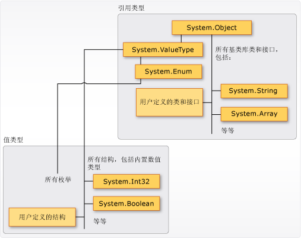

# 类型（C# 编程指南）
## 类型、变量和值  
 C\# 是一种强类型语言。  每个变量和常量都有一个类型，每个计算为值的表达式也是如此。  每个方法签名为每个输入参数和返回值指定一个类型。  .NET Framework 类库定义了一组内置数值类型以及表示各种逻辑构造的更复杂的类型，例如文件系统、网络连接、对象的集合和数组及日期。  典型 C\# 程序使用类库中的类型，还使用为特定于该程序问题域的概念建模的用户定义类型。  
  
 类型中存储的信息可以包括：  
  
-   该类型的变量所需的存储空间。  
  
-   该类型可以表示的最大值和最小值。  
  
-   该类型包含的成员（方法、字段、事件等）。  
  
-   该类型所继承的基类型。  
  
-   将在运行时为其分配变量内存的位置。  
  
-   允许的运算种类。  
  
 编译器使用类型信息确保代码中执行的所有运算都是类型安全的。  例如，如果声明了一个 [int](../../../csharp/language-reference/keywords/int.md) 类型的变量，则编译器允许您在加法和减法运算中使用此变量。  如果尝试在一个 [bool](../../../csharp/language-reference/keywords/bool.md) 类型的变量上执行相同的运算，则编译器会产生错误，如下面的示例所示：  
  
 [!code-cs[csProgGuideTypes#42](../../../csharp/programming-guide/nullable-types/codesnippet/csharp/index_1.cs)]  
  
> [!NOTE]
>  请 C 和 C\+\+ 开发人员注意，在 C\# 中，[bool](../../../csharp/language-reference/keywords/bool.md) 不能转换为 [int](../../../csharp/language-reference/keywords/int.md)。  
  
 编译器将类型信息作为元数据嵌入到可执行文件中。  公共语言运行时 \(CLR\) 会在运行时使用该元数据，以进一步确保它在分配和回收内存时类型安全。  
  
### 在变量声明中指定类型  
 在程序中声明变量或常量时，必须指定其类型或者使用关键字 [var](../../../csharp/language-reference/keywords/var.md) 让编译器可以推断其类型。  下面的示例演示了一些使用内置数值类型和复杂的用户定义类型的变量声明：  
  
 [!code-cs[csProgGuideTypes#36](../../../csharp/programming-guide/nullable-types/codesnippet/csharp/index_2.cs)]  
  
 在方法签名中指定方法参数和返回值的类型。  下面的签名中演示的方法需要用 [int](../../../csharp/language-reference/keywords/int.md) 作为输入参数并返回一个字符串：  
  
 [!code-cs[csProgGuideTypes#35](../../../csharp/programming-guide/nullable-types/codesnippet/csharp/index_3.cs)]  
  
 声明了一个变量后，不能使用新类型重新对它进行声明，也不能向它赋与它的声明类型不兼容的值。  例如，不能声明 [int](../../../csharp/language-reference/keywords/int.md)，然后向它赋予布尔值 [true](../../../csharp/language-reference/keywords/true-literal.md)。  但是，值可以转换为其他类型，例如将值赋给新变量或者作为方法参数传递时。  编译器会自动执行不会导致数据丢失的类型转换。  可能导致数据丢失的转换需要源代码内有强制转换。  
  
 有关详细信息，请参阅 [强制转换和类型转换](../../../csharp/programming-guide/types/casting-and-type-conversions.md)。  
  
## 内置类型  
 C\# 提供了一组标准的内置数值类型，用来表示整数、浮点值、布尔表达式、文本字符、十进制值和其他数据类型。  还有内置的 `string` 和 `object` 类型。  您可以在任何 C\# 程序中使用这些类型。  有关内置类型的更多信息，请参见[类型参考表](../../../csharp/language-reference/keywords/reference-tables-for-types.md)。  
  
## 自定义类型  
 您可以使用 [struct](../../../csharp/language-reference/keywords/struct.md)、[class](../../../csharp/language-reference/keywords/class.md)、[interface](../../../csharp/language-reference/keywords/interface.md) 和 [enum](../../../csharp/language-reference/keywords/enum.md) 结构创建自己的自定义类型。  .NET Framework 类库本身是 Microsoft 提供的自定义类型的集合，您可以在自己的应用程序中使用它们。  默认情况下，类库中最常用的类型在所有 C\# 程序中均可用。  而对于其他类型，则仅当您显式添加定义这些类型的程序集的项目引用后它们才可用。  编译器拥有对该程序集的引用后，才可以在源代码中声明在该程序集中声明的类型的变量（和常量）。  有关更多信息，请参见 [.NET Framework Class Library](http://go.microsoft.com/fwlink/?LinkID=217856)（.NET Framework 类库）。  
  
## 通用类型系统  
 请务必了解有关 [!INCLUDE[dnprdnshort](../../../csharp/getting-started/includes/dnprdnshort-md.md)] 中的类型系统的以下两个基本点：  
  
-   它支持继承原则。  类型可从称为基类型的其他类型派生。  派生类型继承基类型的方法、属性和其他成员（存在一些限制）。  之后，基类型可从某些其他类型派生，这种情况下，派生类型继承其层次结构中这两个基类型的成员。  包括如 <xref:System.Int32?displayProperty=fullName>（C\# 关键字：[int](../../../csharp/language-reference/keywords/int.md)）等内置数值类型在内的所有类型，最终都是从一个基类派生得到的，该基类即 <xref:System.Object?displayProperty=fullName> （C\# 关键字：[object](../../../csharp/language-reference/keywords/object.md)）。  这种统一的类型层次结构称为[常规类型系统](../../../standard/base-types/common-type-system.md) \(CTS\)。  有关 C\# 中的继承的更多信息，请参见[继承](../../../csharp/programming-guide/classes-and-structs/inheritance.md)。  
  
-   CTS 中的每一个类型都被定义成了值类型或引用类型。  这包括 .NET Framework 类库中的所有自定义类型以及您自己的用户定义类型。  使用关键字 [struct](../../../csharp/language-reference/keywords/struct.md) 定义的类型是值类型；所有内置数值类型都是 `structs`。  使用关键字 [class](../../../csharp/language-reference/keywords/class.md) 定义的类型是引用类型。  引用类型和值类型有不同的编译时规则和不同的运行时行为。  
  
 下图演示了 CTS 中的值类型和引用类型之间的关系。  
  
   
CTS 中的值类型和引用类型  
  
> [!NOTE]
>  可以看到，最常用的类型都组织到了 <xref:System> 命名空间。  但是，类型所在的命名空间与类型是值类型还是引用类型没有关系。  
  
### 值类型  
 值类型是从派生自 <xref:System.Object?displayProperty=fullName> 的 <xref:System.ValueType?displayProperty=fullName> 派生的。  派生自 <xref:System.ValueType?displayProperty=fullName> 的类型在 CLR 中有特殊行为。  值类型变量直接包含它们的值，这意味着内存在声明变量的任意上下文中都是以内联方式分配的。  值类型变量没有单独的堆分配或垃圾回收开销。  
  
 值类型分为两个类别：[struct](../../../csharp/language-reference/keywords/struct.md) 和 [enum](../../../csharp/language-reference/keywords/enum.md)。  
  
 内置数值类型是结构，它们具有可以访问的属性和方法。  
  
```c#  
// Static method on type Byte.  
byte b = Byte.MaxValue;  
```  
  
 但是，您可以声明它们并向它们赋值，就如同它们是简单的非聚合类型一样：  
  
```c#  
byte num = 0xA;  
int i = 5;  
char c = 'Z';  
```  
  
 例如，值类型是密封的，这意味着您不能从 <xref:System.Int32?displayProperty=fullName> 派生类型，并且不能定义一个结构以便从任何用户定义的类或结构继承，因为结构只能从 <xref:System.ValueType?displayProperty=fullName> 继承。  但是，一个结构可以实现一个或更多个接口。  可以将结构类型强制转换为接口类型；但这会使装箱操作在托管堆上的一个引用类型对象内包装该结构。  在将值类型传递给将 <xref:System.Object?displayProperty=fullName> 作为输入参数的方法时会发生装箱操作。  有关详细信息，请参阅 [装箱和取消装箱](../../../csharp/programming-guide/types/boxing-and-unboxing.md)。  
  
 可以使用 [struct](../../../csharp/language-reference/keywords/struct.md) 关键字创建自己的自定义值类型。  通常，结构可作为一小组相关变量的容器，如下面的示例所示：  
  
 [!code-cs[csProgGuideObjects#1](../../../csharp/programming-guide/classes-and-structs/codesnippet/csharp/index_4.cs)]  
  
 有关结构的更多信息，请参见[Struct](../../../csharp/programming-guide/classes-and-structs/structs.md)。  有关 [!INCLUDE[dnprdnshort](../../../csharp/getting-started/includes/dnprdnshort-md.md)] 中的值类型的更多信息，请参见[常规类型系统](../../../standard/base-types/common-type-system.md)。  
  
 另一类值类型是 [enum](../../../csharp/language-reference/keywords/enum.md)。  枚举定义一组已命名的整数常量。  例如，.NET Framework 类库中的 <xref:System.IO.FileMode?displayProperty=fullName> 枚举包含一组已命名的整数常量，用来指定应如何打开文件。  其定义方式如下面的示例所示：  
  
 [!code-cs[csProgGuideTypes#44](../../../csharp/programming-guide/nullable-types/codesnippet/csharp/index_5.cs)]  
  
 `System.IO.FileMode.Create` 常数的值为 2。  但是，在阅读源代码时，名称可为人们提供更多信息，因此最好使用枚举而不使用常量文本数字。  有关详细信息，请参阅 <xref:System.IO.FileMode?displayProperty=fullName>。  
  
 所有枚举均是从继承自 <xref:System.ValueType?displayProperty=fullName> 的 <xref:System.Enum?displayProperty=fullName> 继承的。  所有适用于结构的规则同样也适用于枚举。  有关枚举的更多信息，请参见[枚举类型](../../../csharp/programming-guide/enumeration-types.md)。  
  
### 引用类型  
 定义为[类](../../../csharp/language-reference/keywords/class.md)、[委托](../../../csharp/language-reference/keywords/delegate.md)、数组或[接口](../../../csharp/language-reference/keywords/interface.md)的类型是引用类型。  在运行时，当您声明引用类型的变量时，该变量会一直包含值 [null](../../../csharp/language-reference/keywords/null.md)，直至您使用 [new](../../../csharp/language-reference/keywords/new.md) 运算符显式创建对象的实例，或者为该变量分配已经使用 `new, as shown in the following example:` 在其他位置创建的对象  
  
```c#  
MyClass mc = new MyClass();  
MyClass mc2 = mc;  
```  
  
 接口必须与实现它的类对象一起初始化。  如果 `MyClass` 实现 `IMyInterface`，则您创建了 `IMyInterface` 的实例，如下面的示例所示：  
  
```c#  
IMyInterface iface = new MyClass();  
```  
  
 创建对象时，将在托管堆上分配内存，变量只保存对对象位置的引用。  对于托管堆上的类型，在 CLR 的自动内存管理功能（称为“垃圾回收”）对它们进行分配和回收时都需要系统开销。  但是，也对垃圾回收进行了高度优化，在大多数情况下它不会引起性能问题。  有关垃圾回收的更多信息，请参见[自动内存管理](../Topic/Automatic%20Memory%20Management.md)。  
  
 所有数组都是引用类型，即使其元素是值类型也不例外。  数组是从 <xref:System.Array?displayProperty=fullName> 类隐式派生的，但可以通过 C\# 提供的简化语法来声明和使用它们，如下面的示例所示：  
  
 [!code-cs[csProgGuideTypes#45](../../../csharp/programming-guide/nullable-types/codesnippet/csharp/index_6.cs)]  
  
 引用类型完全支持继承。  创建类时，可以从没有定义为 [sealed](../../../csharp/language-reference/keywords/sealed.md) 的任何其他接口或类继承，而其他类则可以从您创建的类继承并重写虚方法。  有关如何创建自己的类的更多信息，请参见[类和结构](../../../csharp/programming-guide/classes-and-structs/index.md)。  有关继承和虚方法的更多信息，请参见[继承](../../../csharp/programming-guide/classes-and-structs/inheritance.md)。  
  
## 文本值类型  
 在 C\# 中，文本值从编译器接收类型。  您可以通过在数字末尾追加一个字母来指定应如何类型化该数字文本。  例如，若要指定应按浮点数来处理值 4.56，则在该数字后追加一个“f”或“F”：`4.56f`。  如果没有追加字母，则编译器将为该文本推断一个类型。  有关可以使用字母后缀指定的类型的更多信息，请参见[值类型](../../../csharp/language-reference/keywords/value-types.md)中各个类型的参考页。  
  
 由于文本已类型化，且所有类型最终都是从 <xref:System.Object?displayProperty=fullName> 派生，因此您可以编写和编译如下所示的代码：  
  
 [!code-cs[csProgGuideTypes#37](../../../csharp/programming-guide/nullable-types/codesnippet/csharp/index_7.cs)]  
  
## 泛型类型  
 一个类型可以通过一个或多个类型参数声明，而这些类型参数作为客户端代码在创建该类型的实例时提供的实际类型（具体类型）的占位符。  这种类型称为“泛型类型”。  例如，.NET Framework 类型 <xref:System.Collections.Generic.List%601?displayProperty=fullName> 有一个类型参数，按照约定该类型参数的名称为 T。  在创建该类型的实例时，会指定列表将包含的对象的类型，例如字符串：  
  
<CodeContentPlaceHolder>4</CodeContentPlaceHolder>  
 使用类型参数便可以重复使用相同的类存放任意类型的元素，而不必将每个元素都转换为[对象](../../../csharp/language-reference/keywords/object.md)。  泛型集合类称为“强类型集合”，因为编译器知道集合中元素的特定类型，举例来说，如果尝试向上面示例中的 `strings` 对象添加整数，编译器会在编译时引发错误。  有关详细信息，请参阅 [泛型](../../../csharp/programming-guide/generics/index.md)。  
  
## 隐式类型、匿名类型和可以为 null 的类型  
 如前面所述，您可以使用关键字 [var](../../../csharp/language-reference/keywords/var.md) 隐式类型化一个局部变量（非类成员）。  该变量在编译时仍然会接收一个类型，但该类型是由编译器提供的。  有关详细信息，请参阅 [隐式类型的局部变量](../../../csharp/programming-guide/classes-and-structs/implicitly-typed-local-variables.md)。  
  
 某些情况下为相关值的简单集合创建命名类型是不方便的，因为这些相关值不准备在方法边界外存储或传递。  可以创建匿名类型来实现此目的。  有关更多信息，请参见[匿名类型](../../../csharp/programming-guide/classes-and-structs/anonymous-types.md)。  
  
 普通的值类型不能有 [null](../../../csharp/language-reference/keywords/null.md) 值。  但是，可以通过在类型后面附加 `?` 来创建可以为 null 值的类型。  例如，`int?` 是一个也可以具有 [null](../../../csharp/language-reference/keywords/null.md) 值的 `int` 类型。  在 CTS 中，可以为 null 的类型是泛型结构类型 <xref:System.Nullable%601?displayProperty=fullName> 的实例。  在向其数值可能为 null 的数据库传入数据和从中传出数据时，可以为 null 的类型尤其有用。  有关详细信息，请参阅 [可以为 null 的类型](../../../csharp/programming-guide/nullable-types/index.md)。  
  
## 相关章节  
 有关详细信息，请参阅下列主题：  
  
-   [强制转换和类型转换](../../../csharp/programming-guide/types/casting-and-type-conversions.md)  
  
-   [装箱和取消装箱](../../../csharp/programming-guide/types/boxing-and-unboxing.md)  
  
-   [使用类型 dynamic](../../../csharp/programming-guide/types/using-type-dynamic.md)  
  
-   [值类型](../../../csharp/language-reference/keywords/value-types.md)  
  
-   [引用类型](../../../csharp/language-reference/keywords/reference-types.md)  
  
-   [类和结构](../../../csharp/programming-guide/classes-and-structs/index.md)  
  
-   [匿名类型](../../../csharp/programming-guide/classes-and-structs/anonymous-types.md)  
  
-   [泛型](../../../csharp/programming-guide/generics/index.md)  
  
-   [Visual C\# 2010 入门](http://go.microsoft.com/fwlink/?LinkId=221214) 中的[变量与表达式](http://go.microsoft.com/fwlink/?LinkId=221228)  
  
## C\# 语言规范  
 [!INCLUDE[CSharplangspec](../../../csharp/language-reference/keywords/includes/csharplangspec-md.md)]  
  
## 请参阅  
 [C\# 参考](../../../csharp/language-reference/index.md)   
 [C\# 编程指南](../../../csharp/programming-guide/index.md)   
 [XML 数据类型的转换](../Topic/Conversion%20of%20XML%20Data%20Types.md)   
 [整型表](../../../csharp/language-reference/keywords/integral-types-table.md)