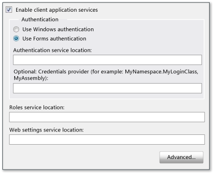
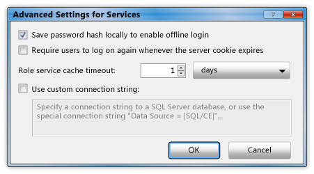

# 如何：配置客户端应用程序服务
本主题介绍如何使用 [!INCLUDE[vsprvs](../../../includes/vsprvs-md.md)]“项目设计器”启用并配置客户端应用程序服务。  你可以使用客户端应用程序服务来验证用户，并从现有 [!INCLUDE[ajax_current_short](../../../includes/ajax-current-short-md.md)] 应用程序服务检索用户角色和设置。  完成配置后，你可以访问应用程序代码中启用的服务，如[客户端应用程序服务概述](../../../docs/framework/common-client-technologies/client-application-services-overview.md)所述。  有关 [!INCLUDE[ajax_current_short](../../../includes/ajax-current-short-md.md)] 应用程序服务的详细信息，请参阅 [ASP.NET Application Services Overview](../Topic/ASP.NET%20Application%20Services%20Overview.md)。  
  
 可以在“项目设计器”的“服务”页面上启用并配置客户端应用程序服务。  “服务”页面会更新项目的 App.config 文件中的值。  若要访问“项目设计器”，请使用“项目”菜单上的“属性”命令。  有关**“服务”**页面的详细信息，请参阅[“项目设计器”\-\>“服务”页](../Topic/Services%20Page,%20Project%20Designer.md)。  
  
 下面的过程介绍如何为客户端应用程序服务执行基本配置。  后面的部分中将介绍高级配置选项。  
  
### 配置客户端应用程序服务  
  
1.  在“解决方案资源管理器”中，选择项目节点，然后在“项目”菜单中单击“属性”。  
  
     将显示**“项目设计器”**。  
  
2.  单击“服务”选项卡。  将显示“服务”页面，如下图所示。  
  
       
  
3.  在“服务”页面上，选择“启用客户端应用程序服务”。  
  
    > [!NOTE]
    >  客户端应用程序服务要求完整版的 .NET Framework，在 .NET Framework Client Profile 中不受支持。  如果“启用客户端应用程序服务”复选框处于禁用状态，请验证“目标框架”是否设置为 .NET Framework 3.5 或更高版本。  若要查看 C\# 中的“目标框架”设置，请打开项目设计器，然后单击“应用程序”页面。  若要查看 Visual Basic 中的“目标框架”设置，请打开项目设计器，单击“编译”页面，然后单击“高级编译选项”。  
  
4.  如果你计划提供自己的登录控件或对话框，请选择“使用 Forms 身份验证”，或者选择“使用 Windows 身份验证”，使用操作系统提供的标识。  有关详细信息，请参阅[客户端应用程序服务概述](../../../docs/framework/common-client-technologies/client-application-services-overview.md)。  
  
    > [!NOTE]
    >  如果选择“使用 Windows 身份验证”，则客户端应用程序服务将自动配置为使用 SQL Server Compact 数据库。  “服务的高级设置”对话框中对此进行了说明，下一节将介绍相关内容。  如果接下来选择“使用 Forms 身份验证”，则不会自动清除“使用自定义连接字符串”设置。  如果已经生成了 [!INCLUDE[ssEW](../../../includes/ssew-md.md)] 数据库供 Windows 身份验证使用，则这可能导致错误。  若要修复这些错误，请清除“服务的高级设置”对话框中的“使用自定义连接字符串”设置。  
  
5.  如果选择了“使用 Forms 身份验证”，则在“身份验证服务位置”框中指定服务主机的 URL，不包括文件名。  设计器在向配置文件中写入值时会自动追加标准文件名 \(Authentication\_JSON\_AppService.axd\)。  
  
6.  或者，如果选择了“使用 Forms 身份验证”，则可以在“凭据提供程序”框中指定一个值。  凭据提供程序必须实现 <xref:System.Web.ClientServices.Providers.IClientFormsAuthenticationCredentialsProvider> 接口。  通过使用凭据提供程序，你可以将你的登录用户界面与其他应用程序代码分开。  这使你能够创建在多个应用程序中使用的单点登录对话框。  有关详细信息，请参阅 [如何：使用客户端应用程序服务来实现用户登录](../../../docs/framework/common-client-technologies/how-to-implement-user-login-with-client-application-services.md)。  
  
     如果指定凭据提供程序，则必须将它指定为程序集限定类型名称。  有关详细信息，请参阅 <xref:System.Type.AssemblyQualifiedName%2A?displayProperty=fullName> 和[程序集名称](../../../docs/framework/app-domains/assembly-names.md)。  程序集限定类型名称最简单的形式类似于下面的示例：  
  
    ```  
    MyNamespace.MyLoginClass, MyAssembly  
    ```  
  
7.  在“角色服务位置”和“Web 设置服务位置”文本框中，指定每一项服务的服务位置，不包括文件名。  设计器在向配置文件中写入值时会自动追加标准文件名（Role\_JSON\_AppService.axd 和 Profile\_JSON\_AppService.axd）。  
  
8.  或者，单击“高级”修改高级设置，例如本地缓存行为。  有关详细信息，请参阅下一个过程。  
  
## 高级配置  
 下面的过程介绍如何为较少见的方案配置客户端应用程序服务。  例如，你可以使用这些针对在公共位置部署的应用程序的配置选项，或使用加密的 SQL Server Compact 数据库作为本地数据缓存。  
  
#### 为客户端应用程序服务配置高级设置  
  
1.  在“项目设计器”的“服务”页面，单击“高级”。  
  
     将显示“服务的高级设置”对话框，如下图所示。  有关此对话框的详细信息，请参阅[“高级服务设置”对话框](../Topic/Advanced%20Settings%20for%20Services%20Dialog%20Box.md)。  
  
       
  
2.  选中或清除“本地保存密码哈希以启用脱机登录”。  选择此选项时，将以加密形式在本地缓存用户的密码。  这对实现应用程序的脱机模式非常有用。  选择此选项时，即使是在<xref:System.Web.ClientServices.ConnectivityStatus.IsOffline%2A>属性设置为 `true` 时也可以对用户进行验证。  
  
3.  选中或清除“每当服务器 Cookie 过期时都要求用户重新登录”。  已在远程服务上配置了身份验证 Cookie，并指示用户的登录将保持活动状态的时间。  有关如何配置 cookie 的详细信息，请参阅[authentication 的 forms 元素（ASP.NET 设置架构）](http://msdn.microsoft.com/zh-cn/8163b8b5-ea6c-46c8-b5a9-c4c3de31c0b3)中的 `timeout` 属性。  
  
     如果选择此选项，则在身份验证 Cookie 过期后尝试访问远程角色或 Web 设置服务将引发 <xref:System.Net.WebException>。  你可以处理此异常，并显示登录对话框来重新验证用户。  有关此行为的示例，请参阅[演练：使用客户端应用程序服务](../../../docs/framework/common-client-technologies/walkthrough-using-client-application-services.md)。  此选项可用于公共位置中部署的应用程序，可确保让应用程序在使用后保持运行状态的用户不会无限期地保持通过身份验证的状态。  
  
     如果清除此选项并在身份验证 Cookie 过期后尝试访问远程服务，则将自动重新验证用户。  
  
4.  指定“角色服务缓存超时”的值。  频繁更新角色时，将此时间间隔设置为较小的值，而在不常更新角色时，将此时间间隔设置为较大的值。  如果实现脱机模式，则将该时间间隔设置为较大的值，以防止角色信息在应用程序处于脱机状态时过期。  
  
     调用 <xref:System.Web.Security.RolePrincipal.IsInRole%2A> 方法时，角色提供程序将访问缓存的角色值或角色服务。  若要以编程方式重置缓存并强制此方法访问远程服务，请调用 <xref:System.Web.ClientServices.Providers.ClientRoleProvider.ResetCache%2A> 方法。  
  
5.  选中或清除“使用自定义连接字符串”。  有关详细信息，请参阅下一个过程。  
  
#### 将客户端应用程序服务配置为使用本地缓存的数据库  
  
1.  在“项目设计器”的“服务”页面，单击“高级”。  
  
     将显示“服务的高级设置”对话框。  
  
2.  选择“使用自定义连接字符串”。  
  
     文本框中将显示 `Data Source = |SQL/CE|` 的默认值。  
  
3.  生成并使用 SQL Server Compact 数据库，保留默认的连接字符串值。[!INCLUDE[vsprvs](../../../includes/vsprvs-md.md)] 将生成一个数据库文件并将该文件放在 <xref:System.Windows.Forms.Application.UserAppDataPath%2A?displayProperty=fullName> 属性指示的目录中。  
  
4.  若要生成并使用加密的 [!INCLUDE[ssEW](../../../includes/ssew-md.md)] 数据库，请将 `password` 和 `encrypt database` 值添加到连接字符串中，如下面的示例所示。  
  
    > [!NOTE]
    >  请确保指定一个强密码。  生成数据库后，不能更改密码。  
  
    ```  
    Data Source = |SQL/CE|;password=<password>;encrypt database=true  
    ```  
  
5.  若要使用你自己的 [!INCLUDE[ssNoVersion](../../../includes/ssnoversion-md.md)] 数据库，请使用你自己的连接字符串。  有关有效的连接字符串格式的信息，请参阅 [!INCLUDE[ssNoVersion](../../../includes/ssnoversion-md.md)] 文档。  此数据库不是自动生成的。  连接字符串必须引用现有的数据库，你可以使用以下 SQL 语句创建该数据库。  
  
    ```  
    CREATE TABLE ApplicationProperties (PropertyName nvarchar(256),  
        PropertyValue nvarchar(256))  
    CREATE TABLE UserProperties (PropertyName nvarchar(256),  
        PropertyValue nvarchar(256))  
    CREATE TABLE Roles (UserName nvarchar(256),   
        RoleName nvarchar(256))  
    CREATE TABLE Settings (PropertyName nvarchar(256),   
        PropertyStoredAs nvarchar(1), PropertyValue nvarchar(2048))  
    ```  
  
## 使用自定义提供程序  
 默认情况下，客户端应用程序服务功能使用 <xref:System.Web.ClientServices.Providers?displayProperty=fullName> 命名空间中的提供程序。  使用“项目设计器”中的“服务”页面配置应用程序时，对这些提供程序的引用将添加到你的 App.config 文件中。  这些默认的提供程序访问服务器上相应的提供程序。  Web 服务通常配置为通过提供程序（如 <xref:System.Web.Security.SqlMembershipProvider> 和 <xref:System.Web.Security.SqlRoleProvider>）访问用户数据。  
  
 如果想要使用自定义服务提供程序，则通常将在服务器端更改提供程序，以便这些提供程序对访问服务器的所有客户端应用程序产生影响。  但是，你可以选择在客户端使用非默认提供程序。  你可以在项目的 App.config 文件中指定自定义身份验证或角色提供程序，如下面的步骤所示。  有关如何创建自定义身份验证和角色提供程序的信息，请参阅[Implementing a Membership Provider](../Topic/Implementing%20a%20Membership%20Provider.md)和[Implementing a Role Provider](../Topic/Implementing%20a%20Role%20Provider.md)。  你还可通过修改项目的`Settings`类（在 C\# 中作为 `Properties.Settings.Default` 访问，在 `My.Settings` 中作为 [!INCLUDE[vbprvb](../../../includes/vbprvb-md.md)] 访问）来使用自定义设置提供程序。  有关详细信息，请参阅 [应用程序设置体系结构](../../../docs/framework/winforms/advanced/application-settings-architecture.md)。  
  
#### 将客户端应用程序服务配置为使用非默认提供程序  
  
1.  若要使用非默认身份验证或角色服务提供程序，请首先通过使用“服务”页面完成所有其他配置设置。  
  
2.  关闭“项目设计器”。  即使你不修改任何设置，“服务”页面也将自动更新你的 App.config 文件，因此这项操作是必需的。  如果你按照此步骤手动修改了你的 App.config 文件，然后返回到“服务”页面，则将自动重置您的修改。  
  
3.  在“解决方案资源管理器”中，双击 App.config。  
  
     应用程序配置文件将在文本编辑器中打开。  
  
4.  找到 `<providers>` 或 `<membership>` 元素中的 `<roleManager>` 元素。  这些元素是 `<system.web>` 元素的子元素。  `<membership>` 元素用于指定身份验证提供程序，`<roleManager>` 元素用于指定角色提供程序。  
  
5.  将 `<add>` 元素添加为 `<providers>` 元素的子元素。  你必须指定 `name` 和 `type` 特性，如下面的示例所示。  `type` 特性的值必须是程序集限定类型名称。  有关详细信息，请参阅 <xref:System.Type.AssemblyQualifiedName%2A?displayProperty=fullName> 和[程序集名称](../../../docs/framework/app-domains/assembly-names.md)。  
  
    ```  
    <add name="MyCustomRoleProvider" type="MyNamespace.MyRoleProvider, MyAssembly" />  
    ```  
  
6.  修改 `defaultProvider` 或 `<membership>` 元素的 `<roleManager>` 特性，以指定来自上一步添加的 `<add>` 元素的名称值。  
  
    ```  
    <roleManager enabled="true" defaultProvider="MyCustomRoleProvider">  
    ```  
  
## 请参阅  
 [客户端应用程序服务](../../../docs/framework/common-client-technologies/client-application-services.md)   
 [客户端应用程序服务概述](../../../docs/framework/common-client-technologies/client-application-services-overview.md)   
 [“项目设计器”\-\>“服务”页](../Topic/Services%20Page,%20Project%20Designer.md)   
 [“高级服务设置”对话框](../Topic/Advanced%20Settings%20for%20Services%20Dialog%20Box.md)   
 [如何：使用客户端应用程序服务来实现用户登录](../../../docs/framework/common-client-technologies/how-to-implement-user-login-with-client-application-services.md)   
 [演练：使用客户端应用程序服务](../../../docs/framework/common-client-technologies/walkthrough-using-client-application-services.md)   
 [Implementing a Membership Provider](../Topic/Implementing%20a%20Membership%20Provider.md)   
 [Implementing a Role Provider](../Topic/Implementing%20a%20Role%20Provider.md)   
 [应用程序设置体系结构](../../../docs/framework/winforms/advanced/application-settings-architecture.md)   
 [Creating and Configuring the Application Services Database for SQL Server](../Topic/Creating%20and%20Configuring%20the%20Application%20Services%20Database%20for%20SQL%20Server.md)