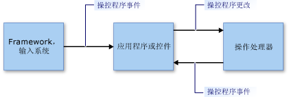

# 操作和惯性概述
操作使用户可借助操控器移动、旋转用户界面 (UI) 元素以及调整它的大小。 操控器是指鼠标或（在可触摸情况下）触笔或手指。  
  
 通过模拟元素上的摩擦力，惯性模拟真实世界中 UI 元素的移动行为。 这使元素逐渐放慢移动速度（线性速度和角速度）至最终停止。 本文将介绍 .NET Framework 的操作和惯性。  
  
## 操作  
 操作将操控器的集合视为复合对象。 应用程序可跟踪复合对象（而非单个组件）的更改。  
  
 请注意下图中的图像。 用户可使用两个操控器移动、旋转和缩放图像。 每个操控器的更改均由其他操控器统一解释。  
  
 例如，如果图像上有两个操控器（1 和 2），且操控器 1 沿 +Y 方向（向下）移动，则图像的更改取决于操控器 2 执行的操作。 如果操控器 2 也沿 +Y 方向（向下）移动，则图像只沿 +Y 方向移动。 但是如果操控器 2 未做任何更改，或沿 -Y 方向（向上）移动，则图像变小或旋转。  
  
   
  
 由两个操控器操作的图像  
  
 操作处理提供一个框架，用于监视操控器子集并将其解释为共同合作，而非独立操作。 可同时创建多个操作处理器对象，每个对象对应一个要在应用程序中操作的 UI 元素。 向操作处理器通知要观察哪个输入设备，并通过 [.NET 事件](http://msdn.microsoft.com/library/17sde2xt.aspx)报告操作。  
  
 操作处理器不具备正在操作的特定元素的相关信息。 应用程序分别将更改应用于应用程序特定的元素。 例如，应用程序对图像应用转换，或者进行重绘以在其新位置或以新大小或方向进行显示。  
  
 操作专用于二维 (2-D) [仿射转换](http://msdn.microsoft.com/library/ms533810\(VS.85\).aspx)。 这些转换包括平移、旋转和缩放。  
  
### 操作的各个部分  
 操作是 <xref:System.Windows.Input.Manipulations.Manipulator2D> 对象的集合。 此聚合操作表示为原点和椭圆。 原点是正在操作元素的所有操控器的平均位置。 椭圆的半径是原点到每个 <xref:System.Windows.Input.Manipulations.Manipulator2D> 对象的平均距离。  
  
   
  
 两个操控器（1 和 2）、一个原点和一个椭圆指定一个操作  
  
 当添加、移动或删除 UI 元素的操控器时，应用程序会调用 <xref:System.Windows.Input.Manipulations.ManipulationProcessor2D.ProcessManipulators%2A> 方法更新 <xref:System.Windows.Input.Manipulations.ManipulationProcessor2D> 对象。 当首次执行操作时，引发<xref:System.Windows.Input.Manipulations.ManipulationProcessor2D.Started> 事件。  
  
> [!NOTE]
>  操作处理在基于框架的更新环境中使用时效率更高。 在 Microsoft XNA 应用程序中使用操作处理时，无需对此担忧，因为 XNA Framework 使用 [Game.Update](http://msdn.microsoft.com/library/microsoft.xna.framework.game.update.aspx) 方法提供了基于框架的更新。 但在其他环境（如 WinForms）中，则可能需要提供自己的基于框架的逻辑以便收集操作和定期将其作为批处理发送到 <xref:System.Windows.Input.Manipulations.ManipulationProcessor2D.ProcessManipulators%2A> 方法。  
  
 操控器的数量或位置发生变化时，引发 <xref:System.Windows.Input.Manipulations.ManipulationProcessor2D.Delta> 事件。 传递至 <xref:System.Windows.Input.Manipulations.ManipulationProcessor2D.Delta> 事件处理程序的 <xref:System.Windows.Input.Manipulations.Manipulation2DDeltaEventArgs> 对象的属性指定自上次事件以来原点、缩放、旋转和平移中的更改。 移动、添加或删除操控器时，将更改操作的原点。 平移值指定操作包含的 X 或 Y 移动数量。  
  
 应用程序可使用新值重绘 UI 元素。  
  
   
  
 操控器 1 移动圆点并使其更改  
  
 删除 <xref:System.Windows.Input.Manipulations.ManipulationProcessor2D> 对象中与操作关联的上个操控器时，引发 <xref:System.Windows.Input.Manipulations.ManipulationProcessor2D.Completed> 事件。  
  
### 操作处理模型  
 操作处理器使用即用模型。 利用此简单模型，应用程序必须将任何输入事件的详细信息传递至操作处理器。 输入事件可能由任何输入基元（如鼠标设备、触笔或手指）引发。 此过程提供了直接筛选机制和简单的使用模型，因此应用程序可在必要时批处理输入事件。  
  
 对于要在操作过程中包含输入基元的应用程序，会从输入基元的详细信息中创建 <xref:System.Windows.Input.Manipulations.Manipulator2D> 结构，并使用 <xref:System.Windows.Input.Manipulations.ManipulationProcessor2D.ProcessManipulators%2A> 方法将此结构传递到操作处理器。 然后，操作处理器会引发应用程序必须处理才能以适当方式更新可视组件的事件。  
  
   
  
 操作处理模型  
  
## 惯性  
 惯性处理器通过模拟真实世界的行为使应用程序能够推测 UI元素的位置、方向和其他属性。  
  
 例如，当用户轻击元素时，它可以继续移动、减速，然后慢慢停止。 惯性处理器实现此行为的方式是：使仿射二维值（原点、缩放、平移和旋转）在指定时间段内以指定的减速速率进行更改。  
  
 与操作处理一样，惯性处理器不具备任何特定 UI 元素的相关信息。 在响应 <xref:System.Windows.Input.Manipulations.InertiaProcessor2D> 对象上引发的事件时，应用程序会将更改分别应用于应用程序特定的元素。  
  
 惯性处理和操作处理通常一同使用。 它们的界面相似，并且引发的事件（在某些情况下）相同。 通常，在完成 UI 元素的操作时开始惯性处理。 实现的方式如下：侦听 <xref:System.Windows.Input.Manipulations.ManipulationProcessor2D.Completed> 事件并从此事件处理程序中启动惯性处理。  
  
## 另请参阅  
 <xref:System.Windows.Input.Manipulations>
