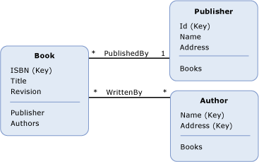

# 实体数据模型关键概念
实体数据模型 \(EDM\) 使用三个关键概念来描述数据结构：“实体类型”、“关联类型”和“属性”。  在任何 EDM 实现中，这些都是描述数据结构的最重要概念。  
  
## 实体类型  
 [实体类型](../../../../docs/framework/data/adonet/entity-type.md)是用于描述实体数据模型中数据结构的基本构造块。  在概念模型中，实体类型都是从[属性](../../../../docs/framework/data/adonet/property.md)构造而来的，描述了顶级概念的结构，如业务应用程序中的客户和订单。  正如计算机程序中的类定义是用于类实例的模板一样，实体类型也是实体的模板。  实体表示一个特定对象（例如特定的客户或订单）。  每个实体都必须在某个[实体集](../../../../docs/framework/data/adonet/entity-set.md)中具有一个唯一的[实体键](../../../../docs/framework/data/adonet/entity-key.md)。  实体集是指特定实体类型的实例集合。  实体集（及[关联集](../../../../docs/framework/data/adonet/association-set.md)）都是按逻辑分组在[实体容器](../../../../docs/framework/data/adonet/entity-container.md)中。  
  
 实体类型支持继承功能：即一个实体类型可以从另一个实体类型中派生。  有关详细信息，请参阅[实体数据模型：继承](../../../../docs/framework/data/adonet/entity-data-model-inheritance.md)。  
  
## 关联类型  
 [关联类型](../../../../docs/framework/data/adonet/association-type.md)（也称为关联）是用于描述实体数据模型中关系的基本构造块。  在概念模型中，关联表示两个实体类型（例如 Customer 和 Order）之间的关系。  每个关联都有两个[关联端](../../../../docs/framework/data/adonet/association-end.md)，用于指定关联中所涉及的实体类型。  每个关联端还会指定[关联端重数](../../../../docs/framework/data/adonet/association-end-multiplicity.md)，用于指示可位于关联端的实体数。  关联端重数的值可以为“一 \(1\)”、“零或一 \(0..1\)”或“多 \(\*\)”。  通过[导航属性](../../../../docs/framework/data/adonet/navigation-property.md)或外键（如果实体类型上有）可以访问关联某一端的实体。  有关详细信息，请参阅[外键属性](../../../../docs/framework/data/adonet/foreign-key-property.md)。  
  
 在应用程序中，关联实例表示特定的关联（例如 Customer 实例与 Order 实例之间的关联）。  关联实例按逻辑分组在[关联集](../../../../docs/framework/data/adonet/association-set.md)中。  关联集（及[实体集](../../../../docs/framework/data/adonet/entity-set.md)）都是按逻辑分组在[实体容器](../../../../docs/framework/data/adonet/entity-container.md)中。  
  
## 属性  
 [实体类型](../../../../docs/framework/data/adonet/entity-type.md)包含用于定义其结构和特征的[属性](../../../../docs/framework/data/adonet/property.md)。  例如，Customer 实体类型可能具有 CustomerId、Name 及 Address 这样的属性。  
  
 概念模型中的属性类似于对计算机程序中的类所定义的属性。  正如类的属性定义类的形状和携带有关对象的信息一样，概念模型中的属性也定义实体类型的形状和携带有关实体类型实例的信息。  
  
 属性可以包含基元数据（例如字符串、整数或布尔值）或结构化数据（例如复杂类型）。  有关详细信息，请参阅[实体数据模型：基元数据类型](../../../../docs/framework/data/adonet/entity-data-model-primitive-data-types.md)。  
  
## 概念模型的表示形式  
 “概念模型”是某些作为实体和关系的数据结构的特定表示形式。  概念模型的一种表示形式是图表。  下图用三个实体类型（`Book`、`Publisher` 和 `Author`）以及两个关联（`PublishedBy` 和 `WrittenBy`）来表示概念模型：  
  
   
  
 然而，如果要传达一些有关模型的详细信息，这种表现形式存在一些不足。  例如，图中没有传达属性类型和实体集信息。  域特定的语言 \(DSL\) 可用于更明确地传达有关概念模型的大量信息。  [ADO.NET 实体框架](../../../../docs/framework/data/adonet/ef/index.md)使用一种称为“概念架构定义语言” \([CSDL](../../../../docs/framework/data/adonet/ef/language-reference/csdl-specification.md)\) 的基于 XML 的 DSL 来定义概念模型。  下面是上图所示的概念模型的 CSDL 定义。  
  
 [!code-xml[EDM_Example_Model#EDMExampleCSDL](../../../../samples/snippets/xml/VS_Snippets_Data/edm_example_model/xml/books.edmx#edmexamplecsdl)]  
  
## 请参阅  
 [实体数据模型](../../../../docs/framework/data/adonet/entity-data-model.md)