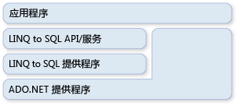

# ADO.NET 和 LINQ to SQL
[!INCLUDE[vbtecdlinq](../../../../../../includes/vbtecdlinq-md.md)] 是的一部分[!INCLUDE[vstecado](../../../../../../includes/vstecado-md.md)]系列技术。 它基于由 [!INCLUDE[vstecado](../../../../../../includes/vstecado-md.md)] 提供程序模型提供的服务。 因此，您可以将 [!INCLUDE[vbtecdlinq](../../../../../../includes/vbtecdlinq-md.md)] 代码与现有的 [!INCLUDE[vstecado](../../../../../../includes/vstecado-md.md)] 应用程序混合在一起，将当前 [!INCLUDE[vstecado](../../../../../../includes/vstecado-md.md)] 解决方案迁移到 [!INCLUDE[vbtecdlinq](../../../../../../includes/vbtecdlinq-md.md)]。 下图高度概括了这种关系。  
  
   
  
## 连接  
 在创建 [!INCLUDE[vstecado](../../../../../../includes/vstecado-md.md)] [!INCLUDE[vbtecdlinq](../../../../../../includes/vbtecdlinq-md.md)] 时，可以提供现有 <xref:System.Data.Linq.DataContext> 连接。 对 <xref:System.Data.Linq.DataContext> 的所有操作（包括查询）都使用所提供的这个连接。 如果此连接已经打开，则在您使用完此连接时，[!INCLUDE[vbtecdlinq](../../../../../../includes/vbtecdlinq-md.md)] 会保持它的打开状态不变。  
  
 [!code-csharp[DLinqCommunicatingWithDatabase#4](../../../../../../samples/snippets/csharp/VS_Snippets_Data/DLinqCommunicatingWithDatabase/cs/Program.cs#4)]
 [!code-vb[DLinqCommunicatingWithDatabase#4](../../../../../../samples/snippets/visualbasic/VS_Snippets_Data/DLinqCommunicatingWithDatabase/vb/Module1.vb#4)]  
  
 您始终可以访问此连接，并可以使用 <xref:System.Data.Linq.DataContext.Connection%2A> 属性自行关闭它，如下面的代码所示：  
  
 [!code-csharp[DLinqAdoNet#1](../../../../../../samples/snippets/csharp/VS_Snippets_Data/DLinqAdoNet/cs/Program.cs#1)]
 [!code-vb[DLinqAdoNet#1](../../../../../../samples/snippets/visualbasic/VS_Snippets_Data/DLinqAdoNet/vb/Module1.vb#1)]  
  
## 事务  
 当您的应用程序已经启动了您自己的数据库事务并且您希望您的 <xref:System.Data.Linq.DataContext> 包含在内时，您可以向您的 <xref:System.Data.Linq.DataContext> 提供此事务。  
  
 通过 [!INCLUDE[dnprdnshort](../../../../../../includes/dnprdnshort-md.md)] 创建事务的首选方法是使用 <xref:System.Transactions.TransactionScope> 对象。 通过使用此方法，你可以创建跨数据库及其他驻留在内存中的资源管理器执行的分布式事务。 事务范围几乎不需要资源就可以启动。 它们仅在事务范围内存在多个连接时才将自身提升为分布式事务。  
  
 [!code-csharp[DLinqAdoNet#2](../../../../../../samples/snippets/csharp/VS_Snippets_Data/DLinqAdoNet/cs/Program.cs#2)]
 [!code-vb[DLinqAdoNet#2](../../../../../../samples/snippets/visualbasic/VS_Snippets_Data/DLinqAdoNet/vb/Module1.vb#2)]  
  
 不能将此方法用于所有数据库。 例如，SqlClient 连接在针对 [!INCLUDE[ss2k](../../../../../../includes/ss2k-md.md)] 服务器使用时无法提升系统事务。 它采取的方法是，只要它发现有使用事务范围的情况，它就会自动向完整的分布式事务登记。  
  
## 直接 SQL 命令  
 有时您可能会遇到这样的情况：<xref:System.Data.Linq.DataContext> 查询或提交更改的能力不足以满足您需要执行的专门任务的需要。 在这些情况下，您可以使用 <xref:System.Data.Linq.DataContext.ExecuteQuery%2A> 方法向数据库发出 SQL 命令，将查询结果转换成对象。  
  
 例如，假定 `Customer` 类的数据分布在两个表（customer1 和 customer2）中。 下面的查询将返回 `Customer` 对象的序列：  
  
 [!code-csharp[DLinqAdoNet#3](../../../../../../samples/snippets/csharp/VS_Snippets_Data/DLinqAdoNet/cs/Program.cs#3)]
 [!code-vb[DLinqAdoNet#3](../../../../../../samples/snippets/visualbasic/VS_Snippets_Data/DLinqAdoNet/vb/Module1.vb#3)]  
  
 只要表格结果中的列名与您的实体类的列属性匹配，[!INCLUDE[vbtecdlinq](../../../../../../includes/vbtecdlinq-md.md)] 就会为您创建不在任何 SQL 查询范围之内的对象。  
  
### 参数  
 <xref:System.Data.Linq.DataContext.ExecuteQuery%2A> 方法接受参数。 下面的代码执行参数化查询：  
  
 [!code-csharp[DlinqAdoNet#4](../../../../../../samples/snippets/csharp/VS_Snippets_Data/DLinqAdoNet/cs/Program.cs#4)]
 [!code-vb[DlinqAdoNet#4](../../../../../../samples/snippets/visualbasic/VS_Snippets_Data/DLinqAdoNet/vb/Module1.vb#4)]  
  
> [!NOTE]
>  在查询文本中使用 `Console.WriteLine()` 和 `String.Format()` 所用的大括号表示法来表示参数。 `String.Format()` 获取您提供的查询字符串，然后将括在大括号内的参数替换为所生成的参数名，如 `@p0`、`@p1` …… `@p(n)`。  
  
## 请参阅  
 [背景信息](../../../../../../docs/framework/data/adonet/sql/linq/background-information.md)  
 [如何：重复使用 ADO.NET 命令和 DataContext 之间的连接](../../../../../../docs/framework/data/adonet/sql/linq/how-to-reuse-a-connection-between-an-ado-net-command-and-a-datacontext.md)
