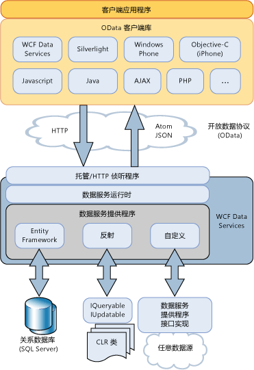

# WCF 数据服务概述
通过 [!INCLUDE[ssAstoria](../../../../includes/ssastoria-md.md)]，可以使用 [!INCLUDE[ssODataFull](../../../../includes/ssodatafull-md.md)] 创建和使用 Web 或 Intranet 的数据服务。  利用 [!INCLUDE[ssODataShort](../../../../includes/ssodatashort-md.md)] 可以将数据公开为可通过 URI 进行寻址的资源。  这允许使用具象状态传输 \(REST\) 来访问和更改数据，具体而言就是标准 HTTP 动词 GET、PUT、POST 和 DELETE。本主题将概要介绍 [!INCLUDE[ssODataShort](../../../../includes/ssodatashort-md.md)] 所定义的模式和实践以及 [!INCLUDE[ssAstoria](../../../../includes/ssastoria-md.md)]提供的功能，以便在基于 .NET Framework 的应用程序中利用 [!INCLUDE[ssODataShort](../../../../includes/ssodatashort-md.md)]。  
  
## 以资源形式对数据进行寻址  
 [!INCLUDE[ssODataShort](../../../../includes/ssodatashort-md.md)] 将数据公开为可通过 URI 寻址的资源。资源路径是基于实体数据模型的实体关系约定构建的。  在此模型中，实体表示应用程序域中数据的操作单元，例如客户、订单、项目和产品。  有关详细信息，请参阅[实体数据模型](../../../../docs/framework/data/adonet/entity-data-model.md)。  
  
 在 [!INCLUDE[ssODataShort](../../../../includes/ssodatashort-md.md)] 中，实体资源地址的形式为包含实体类型实例的实体集。  例如，URI `http://services.odata.org/Northwind/Northwind.svc/Customers('ALFKI')/Orders` 返回 `Northwind` 数据服务中与 `CustomerID` 值为 `ALFKI.` 的客户相关的所有订单。  
  
 利用查询表达式，可以对资源执行传统的查询操作，如筛选、排序和分页。  例如，URI `http://services.odata.org/Northwind/Northwind.svc/Customers('ALFKI')/Orders?$filter=Freight gt 50` 对资源进行筛选，以仅返回运费高于 50 美元的订单。  有关详细信息，请参阅[访问数据服务资源](../../../../docs/framework/data/wcf/accessing-data-service-resources-wcf-data-services.md)。  
  
## 可互操作的数据访问  
 [!INCLUDE[ssODataShort](../../../../includes/ssodatashort-md.md)] 是基于标准 Internet 协议构建的，从而使数据服务能够与不使用 .NET Framework 的应用程序进行互操作。  由于您可以使用标准 URI 对数据进行寻址，因此应用程序可以通过使用具象状态传输 \(REST\) 的语义（尤其是标准 HTTP 谓词 GET、PUT、POST 和 DELETE）来访问和更改数据。  这样您就可以从任何可分析和访问通过标准 HTTP 协议传输的数据的客户端访问这些服务。  
  
 [!INCLUDE[ssODataShort](../../../../includes/ssodatashort-md.md)] 定义了 Atom 发布协议 \(AtomPub\) 的一组扩展。它支持多种数据格式的 HTTP 请求和响应，以适应各种客户端应用程序和平台。  [!INCLUDE[ssODataShort](../../../../includes/ssodatashort-md.md)] 源可以采用 Atom、JavaScript 对象表示法 \(JSON\) 以及纯 XML 格式表示数据。  尽管 Atom 是默认格式，但源的格式会在 HTTP 请求的标头中指定。  有关更多信息，请参见 [OData：Atom 格式](http://go.microsoft.com/fwlink/?LinkID=185794)（可能为英文网页）和 [OData：JSON 格式](http://go.microsoft.com/fwlink/?LinkID=185795)（可能为英文网页）。  
  
 当作为 [!INCLUDE[ssODataShort](../../../../includes/ssodatashort-md.md)] 源发布数据时，[!INCLUDE[ssAstoria](../../../../includes/ssastoria-md.md)]依靠其他现有的 Internet 工具执行诸如缓存和身份验证等操作。  为实现此目的，[!INCLUDE[ssAstoria](../../../../includes/ssastoria-md.md)]与现有的主机应用程序和服务（如 ASP.NET、Windows Communication Foundation \(WCF\) 和 Internet Information Services \(IIS\)）相集成。  
  
## 存储独立性  
 虽然资源基于一个实体关系模型进行寻址，[!INCLUDE[ssAstoria](../../../../includes/ssastoria-md.md)]仍会公开 [!INCLUDE[ssODataShort](../../../../includes/ssodatashort-md.md)] 源而不管基础数据源如何。在 [!INCLUDE[ssAstoria](../../../../includes/ssastoria-md.md)]接受一个对由 URI 标识的资源的 HTTP 请求后，请求将进行反序列化，并且该请求的一个表示形式将传递给一个 [!INCLUDE[ssAstoria](../../../../includes/ssastoria-md.md)]提供程序。  该提供程序将请求转换为数据源特定格式并对基础数据源执行该请求。[!INCLUDE[ssAstoria](../../../../includes/ssastoria-md.md)]通过将对 [!INCLUDE[ssODataShort](../../../../includes/ssodatashort-md.md)] 规定的资源进行寻址的概念模型与基础数据源的具体架构分离，实现存储独立性。  
  
 [!INCLUDE[ssAstoria](../../../../includes/ssastoria-md.md)] 与 ADO.NET 实体框架集成，使您可以创建公开关系数据的数据服务。  可以使用实体数据模型工具创建包含以实体形式存在的可寻址资源的数据模型，同时定义此模型与基础数据库中表之间的映射。  有关详细信息，请参阅[实体框架提供程序](../../../../docs/framework/data/wcf/entity-framework-provider-wcf-data-services.md)。  
  
 通过 [!INCLUDE[ssAstoria](../../../../includes/ssastoria-md.md)]，还可以创建数据服务，这些服务公开所有返回 <xref:System.Linq.IQueryable%601> 接口实现的数据结构。  这样您就可以创建公开 .NET Framework 类型中数据的数据服务。  当您也实现 <xref:System.Data.Services.IUpdatable> 接口时，支持创建、更新和删除操作。  有关详细信息，请参阅[反射提供程序](../../../../docs/framework/data/wcf/reflection-provider-wcf-data-services.md)。  
  
 有关说明 [!INCLUDE[ssAstoria](../../../../includes/ssastoria-md.md)] 如何与这些数据提供程序集成的图示，请参见本主题后面的体系结构关系图。  
  
## 自定义业务逻辑  
 使用 [!INCLUDE[ssAstoria](../../../../includes/ssastoria-md.md)]，可以轻松通过服务操作和侦听器将自定义业务逻辑添加到数据服务。  服务操作是在可通过 URI（采用与数据资源相同的形式）进行寻址的服务器上定义的方法。  服务操作还可以使用查询表达式语法对操作返回的数据进行筛选、排序和分页。例如，URI `http://localhost:12345/Northwind.svc/GetOrdersByCity?city='London'&$orderby=OrderDate&$top=10&$skip=10` 表示对罗斯文数据服务上的名为 `GetOrdersByCity` 的服务操作的调用，此调用将返回来自伦敦的客户的订单，并且会对结果进行分页并按 `OrderDate` 排序。  有关详细信息，请参阅[服务操作](../../../../docs/framework/data/wcf/service-operations-wcf-data-services.md)。  
  
 利用侦听器，可以将自定义应用程序逻辑集成到数据服务对请求或响应消息的处理中。  在指定的实体集上执行查询、插入、更新或删除操作时，将调用相应的侦听器。  然后，侦听器可能会更改数据、执行授权策略或者甚至终止操作。  必须为由数据服务公开的给定实体集显式注册侦听器方法。  有关详细信息，请参阅[侦听器](../../../../docs/framework/data/wcf/interceptors-wcf-data-services.md)。  
  
## 客户端库  
 [!INCLUDE[ssODataShort](../../../../includes/ssodatashort-md.md)] 定义一组统一模式来与数据服务交互。  这为创建基于这些服务的可重用组件（如方便使用数据服务的客户端库）提供了机会。  
  
 [!INCLUDE[ssAstoria](../../../../includes/ssastoria-md.md)] 包括基于 .NET Framework 和基于 Silverlight 的客户端应用程序的客户端库。  通过这些客户端库，可以使用 .NET Framework 对象与数据服务进行交互。  它们还支持基于对象的查询和 LINQ 查询、加载相关对象、更改跟踪和标识解析。有关更多信息，请参见[WCF 数据服务客户端库](../../../../docs/framework/data/wcf/wcf-data-services-client-library.md)。  
  
 除了 .NET Framework 和 Silverlight 附带的 [!INCLUDE[ssODataShort](../../../../includes/ssodatashort-md.md)] 客户端库以外，还可以通过其他客户端库在客户端应用程序中使用 [!INCLUDE[ssODataShort](../../../../includes/ssodatashort-md.md)] 源，例如 PHP、AJAX 和 Java 应用程序。  有关更多信息，请参见 [OData SDK](http://go.microsoft.com/fwlink/?LinkID=185796)。  
  
## 体系结构概述  
 下图演示了 [!INCLUDE[ssAstoria](../../../../includes/ssastoria-md.md)] 体系结构，此体系结构用于公开 [!INCLUDE[ssODataShort](../../../../includes/ssodatashort-md.md)] 源并在支持 [!INCLUDE[ssODataShort](../../../../includes/ssodatashort-md.md)] 的客户端库中使用这些源：  
  
   
  
## 请参阅  
 [WCF 数据服务 4.5](../../../../docs/framework/data/wcf/index.md)   
 [入门](../../../../docs/framework/data/wcf/getting-started-with-wcf-data-services.md)   
 [定义 WCF 数据服务](../../../../docs/framework/data/wcf/defining-wcf-data-services.md)   
 [Accessing a Data Service \(WCF Data Services\)](http://msdn.microsoft.com/zh-cn/1e54a2b9-2ec6-4002-b8f8-c1d8df37c350)   
 [WCF 数据服务客户端库](../../../../docs/framework/data/wcf/wcf-data-services-client-library.md)   
 [具象状态传输 \(REST\) （可能为英文网页）](http://go.microsoft.com/fwlink/?LinkId=113919)