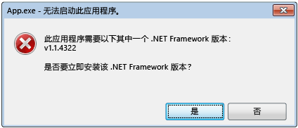

# .NET Framework 初始化错误：管理用户体验
公共语言运行时 \(CLR\) 启动系统确定将用于运行托管应用程序代码 CLR 的版本。  在某些情况下，启动系统可能无法找到可以加载 CLR 的版本。  通常在应用程序需要无效或在给定计算机上安装的 CLR 版本的应用程序时会出现此情况。  如果未发现请求的版本，则 CLR 激活系统从调用的函数或接口返回 HRESULT 错误代码，并且可能会显示一条错误信息给正在运行该应用程序的用户。  本文提供 HRESULT 代码的列表并解释了如何防止显示错误消息。  
  
 CLR 提供记录的基础结构可以帮助调试 CLR 启动问题，如 [如何：调试 CLR 激活问题](../../../docs/framework/deployment/how-to-debug-clr-activation-issues.md) 中所述。  此基础结构不应与[程序集绑定日志](../../../docs/framework/tools/fuslogvw-exe-assembly-binding-log-viewer.md)混淆，它们完全不同。  
  
## CLR 启动 HRESULT 代码  
 CLR 激活 API 返回 HRESULT 代码启动操作的结果移到宿主报告。  CLR 宿主应始终参考这些返回值在继续其他操作之前。  
  
-   CLR\_E\_SHIM\_RUNTIMELOAD  
  
-   CLR\_E\_SHIM\_RUNTIMEEXPORT  
  
-   CLR\_E\_SHIM\_INSTALLROOT  
  
-   CLR\_E\_SHIM\_INSTALLCOMP  
  
-   CLR\_E\_SHIM\_LEGACYRUNTIMEALREADYBOUND  
  
-   CLR\_E\_SHIM\_SHUTDOWNINPROGRESS  
  
## “初始化错误的 UI”  
 如果 CLR 激活系统未能加载应用程序需要的运行时的正确版本，则它向用户显示一条错误消息通知用户没有正确配置其计算机以运行该应用程序，并提供他们一个可以弥补这种情况的机会。  通常在这种情况下显示以下错误消息。  用户可以选择**“是”**转到它们可以下载应用程序的正确 .NET Framework 版本的 Microsoft 网站。  
  
   
针对初始化错误的典型错误消息  
  
## 解析初始化错误  
 作为开发人员，您有控制 .NET Framework 初始化错误消息的各种选项。  例如，可以使用 API 标志防止消息显示，如下一节所述。  但是，仍然必须解决阻止应用程序加载请求的运行时的问题。  否则，您的应用程序可能根本不能运行，或者一些功能可能不可用。  
  
 若要修复根本问题并提供最佳的用户体验（减少错误消息），建议以下操作：  
  
-   对于 .NET Framework 3.5（及更低版本）应用程序：配置应用程序，使之支持 .NET Framework 4 或 4.5（请参见 [说明](../../../docs/framework/migration-guide/how-to-configure-an-app-to-support-net-framework-4-or-4-5.md)）。  
  
-   对于 .NET Framework 4 应用程序：安装 .NET Framework 4 可再发行组件包，作为应用程序设置的一部分。  请参见 [部署指南（针对开发人员）](../../../docs/framework/deployment/deployment-guide-for-developers.md)。  
  
## 控制错误消息  
 显示错误消息通信未找到所请求的 .NET Framework 版本中查看作为对用户的一种很有用的服务或一个小麻烦。  在任一情况下，您可以通过将标志传递给激活 API 来控制此 UI。  
  
 [ICLRMetaHostPolicy::GetRequestedRuntime](../Topic/ICLRMetaHostPolicy::GetRequestedRuntime%20Method.md) 方法接受 [METAHOST\_POLICY\_FLAGS](../../../ocs/framework/unmanaged-api/hosting/metahost-policy-flags-enumeration.md) 枚举成员作为输入。  如果找不到 CLR 的请求的版本，则您可以包括 METAHOST\_POLICY\_SHOW\_ERROR\_DIALOG 标志请求错误消息。  默认情况下，错误消息不会显示。（[ICLRMetaHost::GetRuntime](../Topic/ICLRMetaHost::GetRuntime%20Method.md) 方法不接受此标志，并且不提供任何其他方法来显示信息。）  
  
 Windows 提供的 [SetErrorMode](http://go.microsoft.com/fwlink/p/?LinkID=255242)函数用于申明是否希望错误消息显示在代码运行的进程中。  您可以指定 SEM\_FAILCRITICALERRORS 标志以防止显示该错误消息。  
  
 但是，在某些情况下，重写应用程序进程设置的 SEM\_FAILCRITICALERRORS 设置非常重要。  例如，如果您拥有的本机 COM 组件承载CLR，并由设置了 SEM\_FAILCRITICALERRORS 的进程承载，您可能要根据在该特定应用程序进程中显示的错误消息的影响重写标志。  在这种情况下，可以使用以下标志之一来重写 SEM\_FAILCRITICALERRORS：  
  
-   将 METAHOST\_POLICY\_IGNORE\_ERROR\_MODE 和 [ICLRMetaHostPolicy::GetRequestedRuntime](../Topic/ICLRMetaHostPolicy::GetRequestedRuntime%20Method.md) 方法一起使用。  
  
-   将 RUNTIME\_INFO\_IGNORE\_ERROR\_MODE 和 [GetRequestedRuntimeInfo](../../../ocs/framework/unmanaged-api/hosting/getrequestedruntimeinfo-function.md) 函数一起使用。  
  
## “CLR 提供的宿主的 UI 策略”  
 CLR 提供了各种方案的宿主，并且，这些宿主都显示错误消息，当遇到问题加载运行时要求的版本。  下表提供主机及其错误消息策略列表。  
  
|CLR 主机|描述|错误消息策略|错误消息可以禁用?|  
|------------|--------|------------|---------------|  
|托管的 EXE 宿主|启动托管 EXE。|显示以便缺少 .NET Framework 版本|否|  
|托管的 COM 宿主|将托管 COM 组件加载到进程中。|显示以便缺少 .NET Framework 版本|是，通过设置 SEM\_FAILCRITICALERRORS 标志|  
|ClickOnce 宿主|启动 ClickOnce 应用程序。|显示以便缺少 .NET Framework 版本，以 [!INCLUDE[net_v45](../../../includes/net-v45-md.md)] 开头|否|  
|XBAP 主机|启动 WPF XBAP 应用程序。|显示以便缺少 .NET Framework 版本，以 [!INCLUDE[net_v45](../../../includes/net-v45-md.md)] 开头|否|  
  
## [!INCLUDE[win8](../../../includes/win8-md.md)] 行为和 UI  
 CLR 启动系统提供相同的行为，并在将象在 Windows 操作系统的其他版本执行的 [!INCLUDE[win8](../../../includes/win8-md.md)] 的 UI，只不过，在遇到问题时加载 CLR 2.0。  [!INCLUDE[win8](../../../includes/win8-md.md)] 其中包括使用 CLR 4.5 的[!INCLUDE[net_v45](../../../includes/net-v45-md.md)]。但是，[!INCLUDE[win8](../../../includes/win8-md.md)] 不包含使用 CLR 2.0 的 .NET Framework 2.0、3.0 或 3.5。  因此，默认情况下，依赖于 CLR 2.0 的应用程序在 [!INCLUDE[win8](../../../includes/win8-md.md)] 不会运行。  相反，它们显示以下对话框来使用户可以安装 .NET Framework 3.5。  用户还可以在“控制面板”中启用 .NET Framework 3.5。  两个选项在文章 [Installing the .NET Framework 3.5 on Windows 8 and later versions](../../../docs/framework/install/net-framework-3-5-on-windows-8-plus.md) 中讨论。  
  
   
提示按需安装 .NET Framework 3.5  
  
> [!NOTE]
>  [!INCLUDE[net_v45](../../../includes/net-v45-md.md)] 替换用户计算机上的 .NET Framework 4 \(CLR 4\)。  因此，.NET Framework 4 应用程序无缝运行，而不在 [!INCLUDE[win8](../../../includes/win8-md.md)] 显示此对话框。  
  
 当安装了 .NET Framework 3.5 时，用户可以运行依赖于 .NET Framework 2.0、3.0 或 3.5 的应用程序在其 [!INCLUDE[win8](../../../includes/win8-md.md)] 计算机上。  它们还可以运行 .NET Framework 1.0 和 1.1 应用程序，提供未显式配置的这些应用程序，以仅在 .NET Framework 1.0 或 1.1 上运行。  请参见 [从 .NET Framework 1.1 迁移](../../../docs/framework/migration-guide/migrating-from-the-net-framework-1-1.md)。  
  
 从开始 [!INCLUDE[net_v45](../../../includes/net-v45-md.md)]，CLR 改进启动记录包括在记录的日志项，并初始化错误消息的原因显示。  有关详细信息，请参阅[如何：调试 CLR 激活问题](../../../docs/framework/deployment/how-to-debug-clr-activation-issues.md)。  
  
## 请参阅  
 [部署指南（针对开发人员）](../../../docs/framework/deployment/deployment-guide-for-developers.md)   
 [如何：配置应用程序以支持 .NET Framework 4 或 4.5](../../../docs/framework/migration-guide/how-to-configure-an-app-to-support-net-framework-4-or-4-5.md)   
 [如何：调试 CLR 激活问题](../../../docs/framework/deployment/how-to-debug-clr-activation-issues.md)   
 [Installing the .NET Framework 3.5 on Windows 8 and later versions](../../../docs/framework/install/net-framework-3-5-on-windows-8-plus.md)