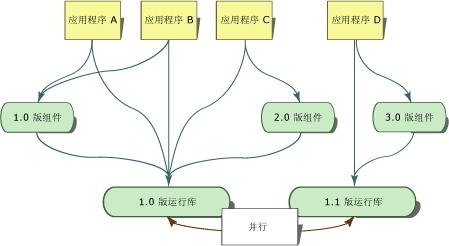
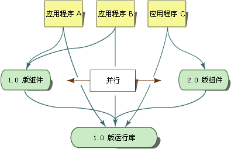

# 在 .NET Framework 中并行执行
并行执行是在同一台计算机上运行应用程序或组件的多个版本的能力。  在同一台计算机上，可以同时安装公共语言运行时的多个版本，还可以同时安装使用运行时的某个版本的应用程序和组件的多个版本。  
  
 下图显示了几个应用程序，这些应用程序使用同一计算机上两个不同的运行时版本。  应用程序 A、B 和 C 使用运行时 1.0 版，而应用程序 D 使用运行时 1.1 版。  
  
   
两个运行时版本的并行执行  
  
 .NET Framework 由公共语言运行时和一组包含 API 类型的程序集组成。  运行时和 .NET Framework 程序集分别采用不同的版本。  例如，运行时的 4.0 版实际上是 4.0.319 版，而 .NET Framework 程序集的 1.0 版实际上是 1.0.3300.0 版。  
  
 下图显示了在同一台计算机上使用一个组件的两种不同版本的几个应用程序。  应用程序 A 和 B 使用组件的 1.0 版，而应用程序 C 使用同一组件的 2.0 版。  
  
   
一个组件的两种版本的并行执行  
  
 利用并行执行，可更好地控制应用程序所绑定的组件的版本，并可更好地控制应用程序所使用的运行时的版本。  
  
## 并行 \(Side\-by\-Side\) 执行的优点  
 在 Windows XP 和 .NET Framework 之前，发生 DLL 冲突的原因是应用程序不能区别同一代码的不同的不兼容版本。  包含在 DLL 中的类型信息仅绑定到文件名。  应用程序无法知道包含在 DLL 中的类型是否同用来生成该应用程序的类型相同。  因此，组件的新版本会覆盖旧版本，并会破坏应用程序。  
  
 为消除 DLL 冲突，并行执行和 .NET Framework 提供了下列功能：  
  
-   具有强名称的程序集。  
  
     并行执行利用具有强名称的程序集将类型信息绑定到程序集的特定版本。  这可防止应用程序或组件绑定到程序集的无效版本。  具有强名称的程序集还允许同一计算机上存在一个文件的多个版本，并且还允许应用程序使用一个文件的多个版本。  有关详细信息，请参阅[具有强名称的程序集](../../../docs/framework/app-domains/strong-named-assemblies.md)。  
  
-   版本识别代码存储。  
  
     .NET Framework 在全局程序集缓存中提供了版本识别代码存储。  全局程序集缓存是全计算机范围的代码缓存，存在于所有安装了 .NET Framework 的计算机上。  它根据版本、区域性和发行者信息存储程序集，并且支持组件和应用程序的多个版本。  有关详细信息，请参阅[全局程序集缓存](../../../docs/framework/app-domains/gac.md)。  
  
-   隔离。  
  
     使用 .NET Framework 可以创建以隔离方式执行的应用程序和组件。  隔离是并行执行的基本组成部分。  隔离时需要了解正在使用的资源以及在应用程序或组件的多个版本间安全地共享的资源。  隔离还包括使用版本特定的方式存储文件。  有关隔离的详细信息，请参阅[并行执行的组件的创建指南](../../../docs/framework/deployment/guidelines-for-creating-components-for-side-by-side-execution.md)。  
  
## 版本兼容性  
 按照设计，.NET Framework 1.0 版和 1.1 版可相互兼容。  使用 .NET Framework 1.0 版生成的应用程序应当能够在 1.1 版上运行，而使用 .NET Framework 1.1 版创建的应用程序也应当能够在 1.0 版上运行。  但是要注意，.NET Framework 1.1 版中添加的 API 功能无法在 .NET Framework 1.0 版中运行。  使用 2.0 版创建的应用程序只能在 2.0 版上运行。  2.0 版应用程序不能在 1.1 版或更早的版本上运行。  
  
 .NET Framework 的版本被视为由运行时及其关联的 .NET Framework 程序集构成的单个单元（这一概念称为程序集统一）。  可以重定向程序集绑定，使其包括 .NET Framework 程序集的其他版本，但是，重写默认的程序集绑定可能会很危险，因此部署前必须进行严格测试。  
  
## 查找运行时版本信息  
 以下两个位置存储在哪个运行时版本编译应用程序或组件以及应用程序需要运行哪个运行时版本的相关信息。  编译应用程序或组件时，用于编译的运行时版本的相关信息存储在托管的可执行文件中。  应用程序或组件所需的运行时版本的相关信息存储在应用程序配置文件中。  
  
### 托管的可执行文件中的运行时版本信息  
 每个托管应用程序和组件的可移植可执行 \(PE\) 文件头均包含生成它的运行时版本的相关信息。  公共语言运行时使用此信息来确定应用程序最可能运行哪个运行时版本。  
  
### 应用程序配置文件中的运行时版本信息  
 除了 PE 文件头中的信息，还可使用提供运行时版本信息的应用程序配置文件部署应用程序。  应用程序配置文件由应用程序开发人员创建，是基于 XML 的文件且与应用程序一同提供。  如果此文件中有 [\<startup\> 部分](../../../docs/framework/configure-apps/file-schema/startup/startup-element.md)的 [\<requiredRuntime\> 元素](../../../docs/framework/configure-apps/file-schema/startup/requiredruntime-element.md)，则指定运行时版本以及应用程序支持的组件版本。  还可在测试中使用此文件测试应用程序是否与不同的运行时版本兼容。  
  
 非托管代码（包括 COM 和 COM\+ 应用程序）可具有运行时用于与托管代码进行交互的应用程序配置文件。  应用程序配置文件会影响任何通过 COM 激活的托管代码。  此文件可指定所支持的运行时版本以及程序集重定向。  默认情况下，调用到托管代码的 COM 互操作应用程序使用计算机上安装的最新版本的运行时。  
  
 有关应用程序配置文件的详细信息，请参阅[配置应用](../../../docs/framework/configure-apps/index.md)。  
  
## 确定要加载的运行时版本  
 公共语言运行时使用以下信息确定要为应用程序加载的运行时版本：  
  
-   可用的运行时版本。  
  
-   应用程序支持的运行时版本。  
  
### 支持的运行时版本  
 运行时使用应用程序配置文件和可移植可执行 \(PE\) 文件头确定应用程序支持的运行时版本。  如果不存在任何应用程序配置文件，则运行时将加载在应用程序的 PE 文件头中指定的运行时版本（若此版本可用）。  
  
 如果应用程序配置文件存在，则运行时根据以下过程的结果确定要加载的适当运行时版本：  
  
1.  运行时检查应用程序配置文件中的 [\<supportedRuntime\> 元素](../../../docs/framework/configure-apps/file-schema/startup/supportedruntime-element.md) 元素。  如果 **\<supportedRuntime\>** 元素中指定了一个或多个支持的运行时版本，则运行时加载第一个 **\<supportedRuntime\>** 元素指定的运行时版本。  如果这一版本不可用，则运行时检查下一个 **\<supportedRuntime\>** 元素，并尝试加载所指定的运行时版本。  如果这一运行时版本仍不可用，则检查后面的 **\<supportedRuntime\>** 元素。  如果受支持的运行时版本均不可用，则运行时无法加载运行时版本，并向用户显示一条消息（请参阅步骤 3）。  
  
2.  运行时读取应用程序可执行文件的 PE 文件头。  如果 PE 文件头指定的运行时版本可用，则运行时加载此版本。  如果指定的运行时版本不可用，运行时将搜索 Microsoft 确定与 PE 文件头中的运行时版本兼容的运行时版本。  如果找不到此版本，则继续执行到步骤 3。  
  
3.  运行时显示一条消息，指出应用程序支持的运行时版本不可用。  未加载运行时。  
  
    > [!NOTE]
    >  通过使用注册表项 HKLM\\Software\\Microsoft\\.NETFramework 下的 NoGuiFromShim 值或使用环境变量 COMPLUS\_NoGuiFromShim，可取消此消息的显示。  例如，可取消显示通常不与用户交互的应用程序的消息（如无人参与的安装或 Windows 服务）。  当取消显示此消息时，运行时将向事件日志写入一条消息。  将注册表值 NoGuiFromShim 设置为 1 可向计算机上的所有应用程序取消此消息的显示。  或者，将 COMPLUS\_NoGuiFromShim 环境变量设置为 1 以针对特定用户上下中运行的应用程序取消此消息的显示。  
  
> [!NOTE]
>  加载运行时版本后，程序集绑定重定向可指定加载不同版本的单独 .NET Framework 程序集。  这些绑定重定向仅会影响被重定向的特定程序集。  
  
## 部分限定的程序集名称和并行执行  
 因为它们是并行问题的潜在根源，部分限定的程序集引用仅可用于绑定到应用程序目录中的程序集。  避免在代码中使用部分限定的程序集引用。  
  
 若要减轻代码中部分限定的程序集引用所带来的不良影响，可以利用应用程序配置文件中的 [\<qualifyAssembly\>](../../../docs/framework/configure-apps/file-schema/runtime/qualifyassembly-element.md) 元素，对代码中出现的部分限定的程序集引用进行完全限定。  应当使用 **\<qualifyAssembly\>** 元素来仅指定未在部分引用中设置的字段。  **fullName** 属性中列出的程序集标识必须包含完全限定程序集名称所需的所有信息：程序集名称、公钥、区域性和版本。  
  
 以下示例演示用于完全限定名为 `myAssembly` 的程序集的应用程序配置文件条目。  
  
```  
<assemblyBinding xmlns="urn:schemas-microsoft-com:asm.v1">   
<qualifyAssembly partialName="myAssembly"   
fullName="myAssembly,  
      version=1.0.0.0,   
publicKeyToken=...,   
      culture=neutral"/>   
</assemblyBinding>   
```  
  
 每当程序集加载语句引用 `myAssembly` 时，这些配置文件设置就会使运行时将部分限定的 `myAssembly` 引用自动转换为完全限定引用。  例如，Assembly.Load\("myAssembly"\) 转换为 Assembly.Load\("myAssembly, version\=1.0.0.0, publicKeyToken\=..., culture\=neutral"\)。  
  
> [!NOTE]
>  可使用 **LoadWithPartialName** 方法绕过禁止从全局程序集缓存加载部分引用程序集的公共语言运行时限制。  此方法应仅用于远程处理方案，因为它很容易造成并行执行出现问题。  
  
## 相关主题  
  
|标题|说明|  
|--------|--------|  
|[如何：启用和禁用自动绑定重定向](../../../docs/framework/configure-apps/how-to-enable-and-disable-automatic-binding-redirection.md)|描述如何将应用程序绑定到程序集的特定版本。|  
|[配置程序集绑定重定向](../../../docs/framework/deployment/configuring-assembly-binding-redirection.md)|说明如何将程序集绑定引用重定向到 .NET Framework 程序集的特定版本。|  
|[进程内并行执行](../../../docs/framework/deployment/in-process-side-by-side-execution.md)|讨论如何可以使用进程内并行运行时主机激活在单个进程中运行多个 CLR 版本。|  
|[公共语言运行时中的程序集](../../../docs/framework/app-domains/assemblies-in-the-common-language-runtime.md)|提供程序集的概念性概述。|  
|[应用程序域](../../../docs/framework/app-domains/application-domains.md)|提供应用程序域的概念性概述。|  
  
## 参考  
 [\<supportedRuntime\> 元素](../../../docs/framework/configure-apps/file-schema/startup/supportedruntime-element.md)