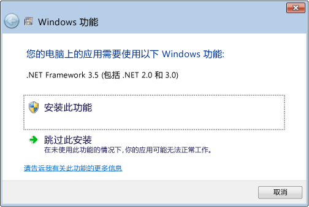

# 在 Windows 8、Windows 8.1 或 Windows 10 上安装 .NET Framework 3.5
.NET Framework 是在 Windows 上运行的多个应用程序不可缺少的一部分，并且对这些应用程序运行发挥着同样的功能。 对开发人员而言，.NET Framework 提供了一个用于构建应用程序的一致的编程模型。 如果你使用的是 Windows 操作系统，则你的计算机上可能已安装 .NET Framework。 具体而言， [!INCLUDE[net_v45](../../../includes/net-v45-md.md)] 包含于 [!INCLUDE[win8](../../../includes/win8-md.md)]， [!INCLUDE[net_v451](../../../includes/net-v451-md.md)] 包含于 [!INCLUDE[win81](../../../includes/win81-md.md)] ，而 [!INCLUDE[net_v46](../../../includes/net-v46-md.md)] 包含于 Windows 10。  
  
 但是，.NET Framework 3.5 不会随 [!INCLUDE[win8](../../../includes/win8-md.md)]、 [!INCLUDE[win81](../../../includes/win81-md.md)] 或 Windows 10 自动安装，而必须单独启用才能运行依赖它的应用程序。 此操作必须通过 Windows 更新进行，它可以使用以下三种方法之一进行调用。 以下所有操作都需要 Internet 连接：  
  
-   [按需安装.NET Framework 3.5](#OnDemand)  
  
-   [在控制面板中启用 .NET Framework 3.5](#ControlPanel)  
  
-   [下载 .NET Framework 3.5 安装程序](http://www.microsoft.com/en-us/download/details.aspx?id=21) （注意：这不会直接下载 .NET Framework；它是调用 Windows Update 的安装程序。）  
  
 安装过程中，你可能会遇到错误 0x800f0906、0x800f0907 或 0x800f081f，此时请参阅 [.NET Framework 3.5 安装错误：0x800f0906、0x800f0907 或 0x800f081f](https://support.microsoft.com/en-us/kb/2734782)。 注意，这些错误可能可以通过安装 [安全更新 3005628](https://support.microsoft.com/kb/3005628)解决。  
  
 如果上述任何方法失败，或如果你没有 Internet 连接，则需要使用 Windows 安装媒体。 有关详细信息，请参阅 [.NET Framework 3.5 安装错误文章](https://support.microsoft.com/en-us/kb/2734782)中错误 0x800f0906 的方法 3。 如果没有安装媒体，请参阅 [为 Windows 8.1 创建安装媒体](http://windows.microsoft.com/en-US/windows-8/create-reset-refresh-media?woldogcb=0)。  
  
 重要说明：  
  
-   一般情况下，请勿卸载计算机上的任何 .NET Framework 版本。 不同的应用程序依赖于不同的 Framework 版本，并且一台计算机上可以同时加载多个版本的 NET Framework。  
  
-   针对版本 2.0 和 3.0 构建的应用程序也可以使用.NET Framework 3.5。  
  
-   在安装 .NET Framework 3.5 之前安装 Windows 语言包可能会导致 .NET Framework 3.5 安装失败。 在安装任何 Windows 语言包之前，请安装 .NET Framework 3.5。  
  
-   Windows CardSpace 不随 [!INCLUDE[win8](../../../includes/win8-md.md)]上的 .NET Framework 3.5 提供。  
  
-   由于安装 .NET Framework 3.5 所必须采用的方法十分复杂，很遗憾不能提供可以独立于 Windows 更新运行的单独的独立安装程序。 再次强调，如果其他所有方法都失败，则如之前所述，必须使用安装媒体。  
  
   
## 按需安装.NET Framework 3.5  
 如果应用程序需要 .NET Framework 3.5，但没有在您的计算机上找到启用的版本，则在安装时或在首次运行该应用程序时，将显示以下消息框。 在消息框中，选择 **“安装此功能”** 可启用 .NET Framework 3.5。 此选项需要 Internet 连接。  
  
   
  
   
## 在控制面板中启用 .NET Framework 3.5  
 你可以通过“控制面板”自行启用 .NET Framework 3.5。 此选项需要 Internet 连接。  
  
1.  按键盘上的 Windows 键 ，键入 Windows 功能，然后按 Enter。 这将显示“打开或关闭 Windows 功能”  对话框。 或者，打开“控制面板”，单击“程序”项，然后单击“程序和功能”下的“启用或禁用 Windows 功能”。  
  
2.  如果弹出提示，选择“.NET Framework 3.5（包括 .NET 2.0 和 3.0）”  复选框，按“确定”，然后重启计算机。  
  
 无需选择 Windows Communication Foundation (WCF) HTTP 激活的子项，除非您是需要 WCF 脚本和处理程序映射功能的开发人员。  
  
 下面的视频演示如何执行此操作。  
  
   
  
## 另请参阅  
 [安装指南](../../../docs/framework/get-started/index.md)
