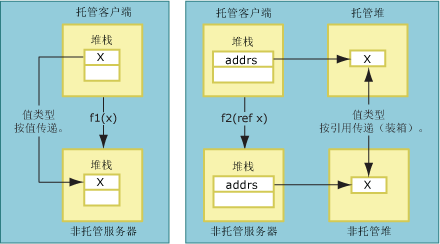

# 复制和锁定
封送数据时，Interop 封送拆收器可以复制或锁定正在封送的数据。  复制数据时将一个内存位置中的数据的副本放置到另一个内存位置中。  下面的插图显示从托管内存向非托管内存复制值类型和复制通过引用传递的类型之间的差异。  
  
   
通过值传递的值类型和通过引用传递的值类型  
  
 通过值传递的方法参数被作为堆栈上的值封送到非托管代码。  复制过程是直接的。  通过引用传递的参数作为堆栈上的指针传递。  引用类型也通过值和通过引用传递。  如下面的插图所示，通过值传递的引用类型被复制或锁定。  
  
   
通过值传递的引用类型和通过引用传递的引用类型  
  
 锁定操作将数据暂时锁定在其当前内存位置中，从而阻止公共语言运行时的垃圾回收器将其重定位。  封送拆收器锁定数据以减小复制的系统开销并提高性能。  数据的类型确定在封送处理过程中它是被复制还是被锁定。  锁定操作在封送诸如 <xref:System.String> 之类的对象的过程中自动执行。然而，您也可以使用 <xref:System.Runtime.InteropServices.GCHandle> 类手动锁定内存。  
  
## 可直接复制到本机结构中的格式化类  
 [可直接复制到本机结构中的](../../../docs/framework/interop/blittable-and-non-blittable-types.md)格式化类具有固定布局（格式化）以及在托管和非托管内存中的公共数据表示形式。  当这些类型需要封送处理时，指向堆中的对象的指针被直接传递给被调用方。  被调用方可以更改该指针所引用的内存位置的内容。  
  
> [!NOTE]
>  如果参数标记为 Out 或 In\/Out，则被调用方可以更改内存内容。  与此相对，当参数被设置为作为 In 参数封送时，被调用方应当避免更改内存内容。需要说明的是，参数作为 In 参数封送是可直接复制到本机结构中的格式化类型的默认设置。  在将同一个类导出到类型库并使用其进行跨单元调用时，修改 In 对象将导致问题。  
  
## 非直接复制到本机结构中的格式化类  
 [非直接复制到本机结构中的](../../../docs/framework/interop/blittable-and-non-blittable-types.md)格式化类具有固定布局（格式化），但数据表示形式在托管和非托管内存中是不同的。  数据在下列条件下可能需要转换：  
  
-   如果按值封送非直接复制到本机结构中的类，则被调用方接收指向该数据结构的副本的指针。  
  
-   如果按引用封送非直接复制到本机结构中的类，则被调用方接收该数据结构的副本的指针的指针。  
  
-   如果设置了 <xref:System.Runtime.InteropServices.InAttribute> 特性，则始终用实例的状态初始化此副本，并在必要时进行封送处理。  
  
-   如果设置了 <xref:System.Runtime.InteropServices.OutAttribute> 特性，则始终在返回时将状态复制回实例，并在必要时进行封送处理。  
  
-   如果同时设置了 **InAttribute** 和 **OutAttribute**，则两个副本都需要。  如果忽略了其中一个特性，则封送拆收器可以通过消除其中一个副本进行优化。  
  
## 引用类型  
 引用类型可以通过值或通过引用传递。  当它们通过值传递时，指向该类型的指针在堆栈上传递。  当通过引用传递时，该类型的指针的指针在堆栈上传递。  
  
 引用类型具有下列有条件的行为：  
  
-   如果引用类型通过值传递且具有非直接复制到本机结构中的类型的成员，则将类型转换两次：  
  
    -   参数传递到非托管端时转换一次。  
  
    -   从调用返回时转换一次。  
  
     为了避免不必要的复制和转换，这些类型被作为 In 参数封送。  若要使调用方能够看见被调用方所做的更改，必须显式地将 **InAttribute** 和 **OutAttribute** 特性应用于参数。  
  
-   如果引用类型通过值传递且只具有可直接复制到本机结构中的类型的成员，则可在封送处理期间将其锁定，而调用方可看见被调用方对类型的成员所做的所有更改。  如果需要该行为，请显式应用 **InAttribute** 和 **OutAttribute**。  如果没有这些方向特性，Interop 封送拆收器就不会将方向信息导出到类型库（默认情况下它作为 In 导出），这在进行 COM 跨单元封送处理时会导致问题。  
  
-   如果引用类型通过引用传递，默认情况下它将作为 In\/Out 封送。  
  
## System.String 和 System.Text.StringBuilder  
 当通过值或通过引用将数据封送到非托管代码时，封送拆收器通常将数据复制到辅助缓冲区（可能在复制期间转换字符集），并将对缓冲区的引用传递给被调用方。  除非引用是用 **SysAllocString** 分配的 **BSTR**，否则将始终用 **CoTaskMemAlloc** 分配该引用。  
  
 作为其中一个字符串类型通过值（如 Unicode 字符串）封送时的优化，封送拆收器将指向内部 Unicode 缓冲区中的托管字符串的直接指针传递给被调用方，而不是将其复制到新缓冲区。  
  
> [!CAUTION]
>  当字符串通过值传递时，被调用方绝不能改变封送拆收器所传递的引用。  这样做可能会损坏托管堆。  
  
 当通过引用传递 <xref:System.String?displayProperty=fullName> 时，封送拆收器在进行调用之前将字符串的内容复制到辅助缓冲区。  然后，在从调用返回时将该缓冲区的内容复制到新字符串中。  这种技术确保不可变的托管字符串保持不变。  
  
 当通过值传递 <xref:System.Text.StringBuilder?displayProperty=fullName> 时，封送拆收器将对 **StringBuilder** 的内部缓冲区的引用直接传递给调用方。  调用方和被调用方必须就缓冲区的大小达成一致。  调用方负责创建具有足够长度的 **StringBuilder**。  被调用方必须采取必要措施确保缓冲区不溢出。  对于在默认情况下将通过值传递的引用类型作为 In 参数传递的规则，**StringBuilder** 是一个例外。  它始终作为 In\/Out 传递。  
  
## 请参阅  
 [默认封送处理行为](../../../docs/framework/interop/default-marshaling-behavior.md)   
 [Memory Management with the Interop Marshaler](http://msdn.microsoft.com/zh-cn/417206ce-ee3e-4619-9529-0c0b686c7bee)   
 [Directional Attributes](http://msdn.microsoft.com/zh-cn/241ac5b5-928e-4969-8f58-1dbc048f9ea2)   
 [互操作封送处理](../../../docs/framework/interop/interop-marshaling.md)