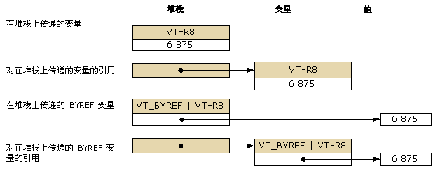

# 对象的默认封送处理
可以将类型化为 <xref:System.Object?displayProperty=fullName> 的参数和字段作为下列类型之一向非托管代码公开：  
  
-   Variant，当对象为参数时。  
  
-   接口，当对象是结构字段时。  
  
 只有 COM 互操作支持对对象类型的封送处理。  默认行为是将对象封送到 COM Variant。  这些规则只适用于 **Object** 类型，而不适用于从 **Object** 类派生的强类型对象。  
  
 本主题提供下列有关封送对象类型的附加信息：  
  
-   [封送处理选项](#cpcondefaultmarshalingforobjectsanchor7)  
  
-   [将对象封送到接口](#cpcondefaultmarshalingforobjectsanchor2)  
  
-   [将对象封送到变量](#cpcondefaultmarshalingforobjectsanchor3)  
  
-   [将变量封送到对象](#cpcondefaultmarshalingforobjectsanchor4)  
  
-   [封送 ByRef 变量](#cpcondefaultmarshalingforobjectsanchor6)  
  
<a name="cpcondefaultmarshalingforobjectsanchor7"></a>   
## 封送处理选项  
 下表显示 **Object** 数据类型的封送处理选项。  <xref:System.Runtime.InteropServices.MarshalAsAttribute> 特性提供了若干个 <xref:System.Runtime.InteropServices.UnmanagedType> 枚举值来封送对象。  
  
|枚举类型|非托管格式的说明|  
|----------|--------------|  
|**UnmanagedType.Struct**<br /><br /> （参数的默认值）|COM 样式变量。|  
|**UnmanagedType.Interface**|如果可能，为 **IDispatch** 接口；否则为 **IUnknown** 接口。|  
|**UnmanagedType.IUnknown**<br /><br /> （字段的默认值）|**IUnknown** 接口。|  
|**UnmanagedType.IDispatch**|一个 **IDispatch** 接口。|  
  
 下面的示例显示 `MarshalObject` 的托管接口定义。  
  
```vb  
Interface MarshalObject  
   Sub SetVariant(o As Object)  
   Sub SetVariantRef(ByRef o As Object)  
   Function GetVariant() As Object  
  
   Sub SetIDispatch( <MarshalAs(UnmanagedType.IDispatch)> o As Object)  
   Sub SetIDispatchRef(ByRef <MarshalAs(UnmanagedType.IDispatch)> o _  
      As Object)  
   Function GetIDispatch() As <MarshalAs(UnmanagedType.IDispatch)> Object  
   Sub SetIUnknown( <MarshalAs(UnmanagedType.IUnknown)> o As Object)  
   Sub SetIUnknownRef(ByRef <MarshalAs(UnmanagedType.IUnknown)> o _  
      As Object)  
   Function GetIUnknown() As <MarshalAs(UnmanagedType.IUnknown)> Object  
End Interface  
  
```  
  
```csharp  
interface MarshalObject {  
   void SetVariant(Object o);  
   void SetVariantRef(ref Object o);  
   Object GetVariant();  
  
   void SetIDispatch ([MarshalAs(UnmanagedType.IDispatch)]Object o);  
   void SetIDispatchRef([MarshalAs(UnmanagedType.IDispatch)]ref Object o);  
   [MarshalAs(UnmanagedType.IDispatch)] Object GetIDispatch();  
   void SetIUnknown ([MarshalAs(UnmanagedType.IUnknown)]Object o);  
   void SetIUnknownRef([MarshalAs(UnmanagedType.IUnknown)]ref Object o);  
   [MarshalAs(UnmanagedType.IUnknown)] Object GetIUnknown();  
}  
```  
  
 下面的代码将 `MarshalObject` 接口导出到类型库。  
  
```  
interface MarshalObject {  
   HRESULT SetVariant([in] VARIANT o);  
   HRESULT SetVariantRef([in,out] VARIANT *o);  
   HRESULT GetVariant([out,retval] VARIANT *o)   
   HRESULT SetIDispatch([in] IDispatch *o);  
   HRESULT SetIDispatchRef([in,out] IDispatch **o);  
   HRESULT GetIDispatch([out,retval] IDispatch **o)   
   HRESULT SetIUnknown([in] IUnknown *o);  
   HRESULT SetIUnknownRef([in,out] IUnknown **o);  
   HRESULT GetIUnknown([out,retval] IUnknown **o)   
}  
```  
  
> [!NOTE]
>  Interop 封送拆收器在调用后自动释放变量内的任何已分配对象。  
  
 下面的示例显示格式化的值类型。  
  
```vb  
Public Structure ObjectHolder  
   Dim o1 As Object  
   <MarshalAs(UnmanagedType.IDispatch)> Public o2 As Object  
End Structure  
  
```  
  
```csharp  
public struct ObjectHolder {  
   Object o1;  
   [MarshalAs(UnmanagedType.IDispatch)]public Object o2;  
}  
```  
  
 下面的代码将格式化的类型导出到类型库。  
  
```  
struct ObjectHolder {  
   VARIANT o1;  
   IDispatch *o2;  
}  
```  
  
<a name="cpcondefaultmarshalingforobjectsanchor2"></a>   
## 将对象封送到接口  
 当对象作为接口向 COM 公开时，该接口是托管类型 <xref:System.Object> 的类接口（即 **\_Object** 接口）。  该接口被类型化为 **IDispatch** \([UnmanagedType.IDispatch](frlrfSystemRuntimeInteropServicesUnmanagedTypeClassTopic)\) 或得到的类型库中的 **IUnknown** \(**UnmanagedType.IUnknown**\)。  通过 **\_Object** 接口，COM 客户端可以动态调用该托管类的成员或由该托管类的派生类实现的任何成员。  客户端还可以调用 **QueryInterface** 以获取由该托管类型显式实现的任何其他接口。  
  
<a name="cpcondefaultmarshalingforobjectsanchor3"></a>   
## 将对象封送到变量  
 将对象封送到变量时，内部变量类型将在运行时根据下列规则确定：  
  
-   如果对象引用为 null（在 Visual Basic 中为 **Nothing**），则将对象封送到 **VT\_EMPTY** 类型的变量。  
  
-   如果对象是下表中列出的任何类型的实例，则得到的变量类型由内置在封送拆收器中的规则确定，并显示在表中。  
  
-   需要显式控制封送处理行为的其他对象可以实现 <xref:System.IConvertible> 接口。  在这种情况下，变量类型由从 <xref:System.IConvertible.GetTypeCode%2A?displayProperty=fullName> 方法返回的类型代码确定。  否则，将对象作为 **VT\_UNKNOWN** 类型的变量封送。  
  
### 将系统类型封送到变量  
 下表显示托管对象类型及其对应的 COM Variant 类型。  只有被调用方法的签名属于 <xref:System.Object?displayProperty=fullName> 类型时才转换这些类型。  
  
|对象类型|COM Variant 类型|  
|----------|--------------------|  
|null 对象引用（在 Visual Basic 中为 **Nothing**）。|**VT\_EMPTY**|  
|<xref:System.DBNull?displayProperty=fullName>|**VT\_NULL**|  
|<xref:System.Runtime.InteropServices.ErrorWrapper?displayProperty=fullName>|**VT\_ERROR**|  
|<xref:System.Reflection.Missing?displayProperty=fullName>|带有 **E\_PARAMNOTFOUND** 的 **VT\_ERROR**|  
|<xref:System.Runtime.InteropServices.DispatchWrapper?displayProperty=fullName>|**VT\_DISPATCH**|  
|<xref:System.Runtime.InteropServices.UnknownWrapper?displayProperty=fullName>|**VT\_UNKNOWN**|  
|<xref:System.Runtime.InteropServices.CurrencyWrapper?displayProperty=fullName>|**VT\_CY**|  
|<xref:System.Boolean?displayProperty=fullName>|**VT\_BOOL**|  
|<xref:System.SByte?displayProperty=fullName>|**VT\_I1**|  
|<xref:System.Byte?displayProperty=fullName>|**VT\_UI1**|  
|<xref:System.Int16?displayProperty=fullName>|**VT\_I2**|  
|<xref:System.UInt16?displayProperty=fullName>|**VT\_UI2**|  
|<xref:System.Int32?displayProperty=fullName>|**VT\_I4**|  
|<xref:System.UInt32?displayProperty=fullName>|**VT\_UI4**|  
|<xref:System.Int64?displayProperty=fullName>|**VT\_I8**|  
|<xref:System.UInt64?displayProperty=fullName>|**VT\_UI8**|  
|<xref:System.Single?displayProperty=fullName>|**VT\_R4**|  
|<xref:System.Double?displayProperty=fullName>|**VT\_R8**|  
|<xref:System.Decimal?displayProperty=fullName>|**VT\_DECIMAL**|  
|<xref:System.DateTime?displayProperty=fullName>|**VT\_DATE**|  
|<xref:System.String?displayProperty=fullName>|**VT\_BSTR**|  
|<xref:System.IntPtr?displayProperty=fullName>|**VT\_INT**|  
|<xref:System.UIntPtr?displayProperty=fullName>|**VT\_UINT**|  
|<xref:System.Array?displayProperty=fullName>|**VT\_ARRAY**|  
  
 使用在前面的示例中定义的 `MarshalObject` 接口，下面的代码示例说明如何将各种类型的变量传递给 COM 服务器。  
  
```vb  
Dim mo As New MarshalObject()  
mo.SetVariant(Nothing)         ' Marshal as variant of type VT_EMPTY.  
mo.SetVariant(System.DBNull.Value) ' Marshal as variant of type VT_NULL.  
mo.SetVariant(CInt(27))        ' Marshal as variant of type VT_I2.  
mo.SetVariant(CLng(27))        ' Marshal as variant of type VT_I4.  
mo.SetVariant(CSng(27.0))      ' Marshal as variant of type VT_R4.  
mo.SetVariant(CDbl(27.0))      ' Marshal as variant of type VT_R8.  
  
```  
  
```csharp  
MarshalObject mo = new MarshalObject();  
mo.SetVariant(null);            // Marshal as variant of type VT_EMPTY.  
mo.SetVariant(System.DBNull.Value); // Marshal as variant of type VT_NULL.  
mo.SetVariant((int)27);          // Marshal as variant of type VT_I2.  
mo.SetVariant((long)27);          // Marshal as variant of type VT_I4.  
mo.SetVariant((single)27.0);   // Marshal as variant of type VT_R4.  
mo.SetVariant((double)27.0);   // Marshal as variant of type VT_R8.  
```  
  
 不具有相应托管类型的 COM 类型可以使用 <xref:System.Runtime.InteropServices.ErrorWrapper>、<xref:System.Runtime.InteropServices.DispatchWrapper>、<xref:System.Runtime.InteropServices.UnknownWrapper> 和 <xref:System.Runtime.InteropServices.CurrencyWrapper> 等包装类进行封送。  下面的代码示例说明如何使用这些包装将各种类型的变量传递给 COM 服务器。  
  
```vb  
Imports System.Runtime.InteropServices  
' Pass inew as a variant of type VT_UNKNOWN interface.  
mo.SetVariant(New UnknownWrapper(inew))  
' Pass inew as a variant of type VT_DISPATCH interface.  
mo.SetVariant(New DispatchWrapper(inew))  
' Pass a value as a variant of type VT_ERROR interface.  
mo.SetVariant(New ErrorWrapper(&H80054002))  
' Pass a value as a variant of type VT_CURRENCY interface.  
mo.SetVariant(New CurrencyWrapper(New Decimal(5.25)))  
  
```  
  
```csharp  
using System.Runtime.InteropServices;  
// Pass inew as a variant of type VT_UNKNOWN interface.  
mo.SetVariant(new UnknownWrapper(inew));  
// Pass inew as a variant of type VT_DISPATCH interface.  
mo.SetVariant(new DispatchWrapper(inew));  
// Pass a value as a variant of type VT_ERROR interface.  
mo.SetVariant(new ErrorWrapper(0x80054002));  
// Pass a value as a variant of type VT_CURRENCY interface.  
mo.SetVariant(new CurrencyWrapper(new Decimal(5.25)));  
```  
  
 包装类是在 <xref:System.Runtime.InteropServices> 命名空间中定义的。  
  
### 将 IConvertible 接口封送到变量  
 对于除了上一节中列出的那些类型以外的其他类型，可以通过实现 <xref:System.IConvertible> 接口来控制封送它们的方式。  如果对象实现 **IConvertible** 接口，则 COM Variant 类型将在运行时由从 <xref:System.IConvertible.GetTypeCode%2A?displayProperty=fullName> 方法返回的 <xref:System.TypeCode> 枚举的值决定。  
  
 下表显示 **TypeCode** 枚举的可能值以及每个值的相应 COM Variant 类型。  
  
|TypeCode|COM Variant 类型|  
|--------------|--------------------|  
|**TypeCode.Empty**|**VT\_EMPTY**|  
|**TypeCode.Object**|**VT\_UNKNOWN**|  
|**TypeCode.DBNull**|**VT\_NULL**|  
|**TypeCode.Boolean**|**VT\_BOOL**|  
|**TypeCode.Char**|**VT\_UI2**|  
|**TypeCode.Sbyte**|**VT\_I1**|  
|**TypeCode.Byte**|**VT\_UI1**|  
|**TypeCode.Int16**|**VT\_I2**|  
|**TypeCode.UInt16**|**VT\_UI2**|  
|**TypeCode.Int32**|**VT\_I4**|  
|**TypeCode.UInt32**|**VT\_UI4**|  
|**TypeCode.Int64**|**VT\_I8**|  
|**TypeCode.UInt64**|**VT\_UI8**|  
|**TypeCode.Single**|**VT\_R4**|  
|**TypeCode.Double**|**VT\_R8**|  
|**TypeCode.Decimal**|**VT\_DECIMAL**|  
|**TypeCode.DateTime**|**VT\_DATE**|  
|**TypeCode.String**|**VT\_BSTR**|  
|不支持。|**VT\_INT**|  
|不支持。|**VT\_UINT**|  
|不支持。|**VT\_ARRAY**|  
|不支持。|**VT\_RECORD**|  
|不支持。|**VT\_CY**|  
|不支持。|**VT\_VARIANT**|  
  
 COM 变量的值通过调用 **IConvertible.To** *Type* 接口来确定，其中 **To** *Type* 是对应于从 **IConvertible.GetTypeCode** 返回的类型的转换例程。  例如，从 **IConvertible.GetTypeCode** 返回 **TypeCode.Double** 的对象被封送为 **VT\_R8** 类型的 COM 变量。  可以通过强制转换为 **IConvertible** 接口并调用 <xref:System.IConvertible.ToDouble%2A> 方法来获取变量的值（它存储在 COM Variant 的 **dblVal** 字段中）。  
  
<a name="cpcondefaultmarshalingforobjectsanchor4"></a>   
## 将变量封送到对象  
 将变量封送到对象时，被封送变量的类型（有时还有值）确定产生的对象的类型。  下表标识每个变量类型以及在将变量从 COM 传递给 .NET Framework 时封送拆收器所创建的相应对象类型。  
  
|COM Variant 类型|对象类型|  
|--------------------|----------|  
|**VT\_EMPTY**|null 对象引用（在 Visual Basic 中为 **Nothing**）。|  
|**VT\_NULL**|<xref:System.DBNull?displayProperty=fullName>|  
|**VT\_DISPATCH**|**System.\_\_ComObject**；如果 \(pdispVal \=\= null\) 则为 null|  
|**VT\_UNKNOWN**|**System.\_\_ComObject**；如果 \(punkVal \=\= null\) 则为 null|  
|**VT\_ERROR**|<xref:System.UInt32?displayProperty=fullName>|  
|**VT\_BOOL**|<xref:System.Boolean?displayProperty=fullName>|  
|**VT\_I1**|<xref:System.SByte?displayProperty=fullName>|  
|**VT\_UI1**|<xref:System.Byte?displayProperty=fullName>|  
|**VT\_I2**|<xref:System.Int16?displayProperty=fullName>|  
|**VT\_UI2**|<xref:System.UInt16?displayProperty=fullName>|  
|**VT\_I4**|<xref:System.Int32?displayProperty=fullName>|  
|**VT\_UI4**|<xref:System.UInt32?displayProperty=fullName>|  
|**VT\_I8**|<xref:System.Int64?displayProperty=fullName>|  
|**VT\_UI8**|<xref:System.UInt64?displayProperty=fullName>|  
|**VT\_R4**|<xref:System.Single?displayProperty=fullName>|  
|**VT\_R8**|<xref:System.Double?displayProperty=fullName>|  
|**VT\_DECIMAL**|<xref:System.Decimal?displayProperty=fullName>|  
|**VT\_DATE**|<xref:System.DateTime?displayProperty=fullName>|  
|**VT\_BSTR**|<xref:System.String?displayProperty=fullName>|  
|**VT\_INT**|<xref:System.Int32?displayProperty=fullName>|  
|**VT\_UINT**|<xref:System.UInt32?displayProperty=fullName>|  
|**VT\_ARRAY** &#124; **VT\_\***|<xref:System.Array?displayProperty=fullName>|  
|**VT\_CY**|<xref:System.Decimal?displayProperty=fullName>|  
|**VT\_RECORD**|相应的装箱值类型。|  
|**VT\_VARIANT**|不支持。|  
  
 从 COM 传递给托管代码，然后再传回到 COM 的变量类型可能无法在调用的持续时间内保持为同样的变量类型。  请考虑将 **VT\_DISPATCH** 类型的变量从 COM 传递到 .NET Framework 时会发生什么。  在封送处理期间，变量转换为 <xref:System.Object?displayProperty=fullName>。  之后，如果将 **Object** 传回到 COM，则它将被封送回到 **VT\_UNKNOWN** 类型的变量。  不能保证将对象从托管代码封送到 COM 时所产生的变量将与最初用于产生该对象的变量为同一类型。  
  
<a name="cpcondefaultmarshalingforobjectsanchor6"></a>   
## 封送 ByRef 变量  
 虽然变量本身可以通过值或引用传递，但是 **VT\_BYREF** 标志也可以与任何变量类型一起使用以指示变量的内容通过引用而不是通过值传递。  按引用封送变量与封送设置了 **VT\_BYREF** 标志的变量之间的差异可能是令人费解的。  下面的插图阐明这些差异。  
  
   
通过值和通过引用传递的变量  
  
 **按值封送对象和变量的默认行为**  
  
-   将对象从托管代码传递给 COM 时，对象的内容将使用在[将对象封送到变量](#cpcondefaultmarshalingforobjectsanchor3)中定义的规则复制到由封送拆收器创建的新变量中。  对非托管端的变量所做的更改将不会在从调用返回时传播回原始对象。  
  
-   将变量从 COM 传递给托管代码时，变量的内容将使用在[将变量封送到对象](#cpcondefaultmarshalingforobjectsanchor4)中定义的规则复制到新创建的对象。  对托管端的对象所做的更改将不会在从调用返回时传播回原始变量。  
  
 **按引用封送对象和变量的默认行为**  
  
 若要将更改传播回调用方，参数必须通过引用传递。  例如，可以使用 C\# 中的 **ref**（或 Visual Basic 托管代码中的 **ByRef**）关键字通过引用传递参数。  在 COM 中，引用参数是使用指针（如 **variant \***）传递的。  
  
-   将对象通过引用传递给 COM 时，封送拆收器创建一个新变量并在进行调用之前将对象引用的内容复制到变量中。  变量被传递给用户可随意更改变量的内容的非托管函数。  从调用返回时，对非托管端的变量所做的任何更改都将传播回原始对象。  如果变量的类型与传递给调用的变量的类型不同，则更改将被传播回另一类型的对象。  也就是说，传递到调用中的对象的类型可以不同于从调用返回的对象的类型。  
  
-   将变量通过引用传递给托管代码时，封送拆收器创建一个新对象，并在进行调用之前将变量的内容复制到对象中。  对该对象的引用被传递给用户可以随意更改该对象的托管函数。  从调用返回时，对被引用的对象所做的任何更改都将传播回原始变量。  如果对象的类型与传入调用中的对象的类型不同，则原始变量的类型将被更改而且值将被传播回变量中。  同样，传入调用中的变量的类型可以不同于从调用返回的变量的类型。  
  
 **封送设置了 VT\_BYREF 标志的变量的默认行为**  
  
-   通过值传递给托管代码的变量可以设置 **VT\_BYREF** 标志以指示该变量包含引用而不是值。  在这种情况下，仍然将变量封送到对象，原因是变量正通过值传递。  封送拆收器自动取消对变量内容的引用，并在进行调用前将其复制到新创建的对象中。  然后，对象将被传递到托管函数中；但是，在从调用返回时，该对象不会被传播回原始变量中。  对托管对象所做的更改将丢失。  
  
    > [!CAUTION]
    >  即使变量设置了 **VT\_BYREF** 标志，也无法更改通过值传递的变量的值。  
  
-   通过引用传递给托管代码的变量也可以设置 **VT\_BYREF** 标志以指示该变量包含另一个引用。  如果它这样做，则会将该变量封送到 **ref** 对象，原因是该变量是通过引用传递的。  封送拆收器自动取消对变量内容的引用，并在进行调用前将其复制到新创建的对象中。  从调用返回时，仅当对象与传入的对象是同一类型时，才将对象的值传播回原始变量中的引用。  也就是说，传播不会更改设置了 **VT\_BYREF** 标志的变量的类型。  如果在调用期间更改了对象的类型，则在从调用返回时将发生 <xref:System.InvalidCastException>。  
  
 下表汇总了变量和对象的传播规则。  
  
|发件人|若要|传播回更改|  
|---------|--------|-----------|  
|**Variant**  *v*|**Object**  *o*|从不|  
|**Object**  *o*|**Variant**  *v*|从不|  
|**Variant**   ***\****  *pv*|**Ref Object**  *o*|始终|  
|**Ref object**  *o*|**Variant**   ***\****  *pv*|始终|  
|**Variant**  *v* **\(VT\_BYREF** *&#124;*  **VT\_\*\)**|**Object**  *o*|从不|  
|**Variant**  *v* **\(VT\_BYREF** *&#124;*  **VT\_\)**|**Ref Object**  *o*|仅当类型尚未更改时。|  
  
## 请参阅  
 [默认封送处理行为](../../../docs/framework/interop/default-marshaling-behavior.md)   
 [可直接复制到本机结构中的类型和非直接复制到本机结构中的类型](../../../docs/framework/interop/blittable-and-non-blittable-types.md)   
 [Directional Attributes](http://msdn.microsoft.com/zh-cn/241ac5b5-928e-4969-8f58-1dbc048f9ea2)   
 [复制和锁定](../../../docs/framework/interop/copying-and-pinning.md)