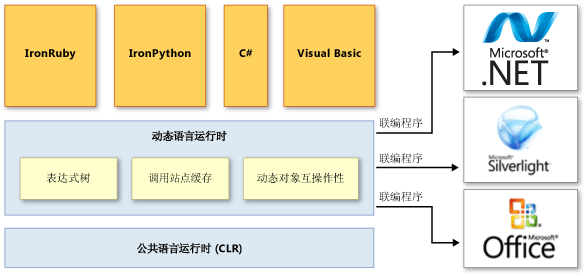

# 动态语言运行时概述
动态语言运行时 \(DLR\) 是一种运行时环境，它将一组适用于动态语言的服务添加到公共语言运行时 \(CLR\)。  借助于 DLR，可以更轻松地开发要在 .NET Framework 上运行的动态语言，而且向静态类型化语言添加动态功能也会更容易。  
  
 动态语言可以在运行时标识对象的类型，而在类似 C\# 和 Visual Basic 的静态类型化语言中（当您使用 `Option Explicit On` 时），您必须在设计时指定对象类型。  动态语言的示例有：Lisp、Smalltalk、JavaScript、PHP、Ruby、Python、ColdFusion、Lua、Cobra 和 Groovy。  
  
 大多数动态语言都会向开发人员提供以下优点：  
  
-   可以使用快速反馈循环（REPL 或读取\-计算\-打印循环）。  这样，您就可以在输入几条语句之后立即执行它们以查看结果。  
  
-   同时支持自上而下的开发和更传统的自下而上的开发。  例如，当您使用自上而下的方法时，可以调用尚未实现的函数，然后在需要时添加基础实现。  
  
-   更易于进行重构和代码修改操作，原因是您不必在代码中四处更改静态类型声明。  
  
 利用动态语言可以生成优秀的脚本语言。  利用新的命令和功能，客户可以轻松地扩展使用动态语言创建的应用程序。  动态语言还经常用于创建网站和测试工具、维护服务器场、开发各种实用工具以及执行数据转换。  
  
 DLR 的目的是允许动态语言系统在 .NET Framework 上运行，并为动态语言提供 .NET 互操作性。  在 Visual Studio 2010 中，DLR 将动态对象引入到 C\# 和 Visual Basic 中，以便这些语言能够支持动态行为，并且可以与动态语言进行互操作。  
  
 DLR 还可帮助您创建支持动态操作的库。  例如，如果您具有一个使用 XML 或 JavaScript 对象表示法 \(JSON\) 对象的库，则对于使用 DLR 的语言，您的对象可以显示为动态对象。  这使库用户能够编写语法更简单且更自然的代码，以便操作对象和访问对象成员。  
  
 例如，在 C\# 中，您可能会使用下面的代码来递增 XML 中的计数器值。  
  
 `Scriptobj.SetProperty("Count", ((int)GetProperty("Count")) + 1);`  
  
 通过使用 DLR，您可以改用下面的代码来执行相同的操作。  
  
 `scriptobj.Count += 1;`  
  
 与 CLR 类似，DLR 是 .NET Framework 的一部分，并随 .NET Framework 和 Visual Studio 安装包一起提供。  DLR 的开放源代码版本还可以从[CodePlex](http://go.microsoft.com/fwlink/?LinkId=141028)网站下载。  
  
> [!NOTE]
>  DLR 的开放源代码版本具有 Visual Studio 和 .NET Framework 中包含的 DLR 的所有功能。  此版本还提供对语言实现的其他支持。  有关更多信息，请参见位于网站的 [CodePlex](http://go.microsoft.com/fwlink/?LinkId=141028) 文档。  
  
 使用 DLR 开发的语言的示例包括：  
  
-   IronPython。  [CodePlex](http://go.microsoft.com/fwlink/?LinkId=141040) 网站的开放源代码软件。  
  
-   IronRuby。  [RubyForge](http://go.microsoft.com/fwlink/?LinkId=141044) 网站的开放源代码软件。  
  
## DLR 的主要优点  
 DLR 具有以下优点。  
  
### 简化动态语言到 .NET Framework 的移植  
 借助于 DLR，语言实施者不必再按传统的方式来创建词法分析器、语法分析器、语义分析器、代码生成器以及其他工具。  若要使用 DLR，语言需要生成表达式树（以树形结构表示语言级代码）、运行时帮助器例程以及用于实现 <xref:System.Dynamic.IDynamicMetaObjectProvider> 接口的可选动态对象。  DLR 和 .NET Framework 可以自动执行许多代码分析和代码生成任务。  这样，语言实施者就可以将精力集中在独有的语言功能上。  
  
### 允许在静态类型化语言中使用动态功能  
 现有的 .NET Framework 语言（如 C\# 和 Visual Basic）可以创建动态对象，并将动态对象与静态类型化对象一起使用。  例如，C\# 和 Visual Basic 可以将动态对象用于 HTML、文档对象模型 \(DOM\) 和 .NET 反射。  
  
### 提供 DLR 和 .NET Framework 的未来好处  
 通过使用 DLR 实现的语言可以从将来的 DLR 和 .NET Framework 改进中获益。  例如，如果 .NET Framework 发布的新版本改进了垃圾回收器或加快了程序集加载时间，则通过使用 DLR 实现的语言会立即获得相同的好处。  如果 DLR 优化了某些方面（如编译功能得到改进），则通过使用 DLR 实现的所有语言的性能也会随之提高。  
  
### 允许共享库和对象  
 使用一种语言实现的对象和库可供其他语言使用。  DLR 还允许在静态类型化语言和动态语言之间进行互操作。  例如，C\# 可以声明一个动态对象，而此对象使用利用动态语言编写的库。  同时，动态语言也可以使用 .NET Framework 中的库。  
  
### 提供快速的动态调度和调用  
 DLR 通过支持高级多态缓存，能够快速执行动态操作。  DLR 首先会创建一些规则以将使用对象的操作绑定到必需的运行时实现，然后缓存这些规则，以避免在对同一类型的对象连续执行相同代码期间，出现将耗尽资源的绑定计算。  
  
## DLR 体系结构  
 下图显示了动态语言运行时的体系结构。  
  
   
DLR 体系结构  
  
 DLR 向 CLR 中添加了一组服务，以便更好地支持动态语言。  这些服务包括：  
  
-   表达式树。  DLR 使用表达式树来表示语言语义。  为此，DLR 对 LINQ 表达式树进行了扩展，以便包括控制流、工作分配以及其他语言建模节点。  有关详细信息，请参阅[表达式树](../Topic/Expression%20Trees%20\(C%23%20and%20Visual%20Basic\).md)。  
  
-   调用站点缓存。  动态调用站点是代码中用于对动态对象执行类似 `a + b` 或 `a.b()` 的操作的位置。  DLR 将缓存 `a` 和 `b` 的特性（通常是这些对象的类型）以及有关操作的信息。  如果之前已执行过此类操作，则 DLR 将从缓存中检索所有必需的信息，以实现快速调度。  
  
-   动态对象互操作性。  DLR 提供一组表示动态对象和操作的类和接口，可供语言实施者和动态库的作者使用。  这些类和接口包括 <xref:System.Dynamic.IDynamicMetaObjectProvider>、<xref:System.Dynamic.DynamicMetaObject>、<xref:System.Dynamic.DynamicObject> 和 <xref:System.Dynamic.ExpandoObject>。  
  
 DLR 通过在调用站点中使用联编程序，不仅可以与 .NET Framework 通信，还可以与其他基础结构和服务（包括 Silverlight 和 COM）通信。  联编程序将封装语言的语义，并指定如何使用表达式树在调用站点中执行操作。  这样，使用 DLR 的动态和静态类型化语言就能够共享库，并获得对 DLR 支持的所有技术的访问权。  
  
## DLR 文档  
 有关如何使用开放源代码版本的 DLR 来向某种语言添加动态行为的更多信息，或者有关如何能够将动态语言与 .NET Framework 一起使用的更多信息，请参见 [CodePlex](http://go.microsoft.com/fwlink/?LinkId=141028)网站上的相关文档。  
  
## 请参阅  
 <xref:System.Dynamic.ExpandoObject>   
 <xref:System.Dynamic.DynamicObject>   
 [公共语言运行时](../../../docs/standard/clr.md)   
 [表达式树](../Topic/Expression%20Trees%20\(C%23%20and%20Visual%20Basic\).md)   
 [演练：创建和使用动态对象](../Topic/Walkthrough:%20Creating%20and%20Using%20Dynamic%20Objects%20\(C%23%20and%20Visual%20Basic\).md)