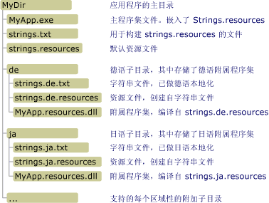

# 创建桌面应用程序的附属程序集
在本地化应用程序中，资源文件扮演一个中心角色。  如果资源是用户自己的语言或区域性的不可用，它们在用户的语言和区域性中使应用程序显示字符串、图像和其他数据来提供替换的数据。  .NET Framework 使用轮辐式模型来定位和巡回本地化资源。  集中式模型是主程序集，它包含不可本地化的可执行代码以及用于单个区域性（称作非特定区域性或默认区域性）的资源。  默认区域性是应用程序的后备区域性；在本地化的资源不可用时，请使用。  您使用 <xref:System.Resources.NeutralResourcesLanguageAttribute>特性指定您的应用程序的默认区域性的区域性。  每一辐条均连接到一个附属程序集，该附属程序集包含单个本地化区域性的资源，但不包含任何代码。  因为附属程序集不是主程序集的一部分，所以您可以轻松地更新或替换与特定区域性对应的资源，而不必替换应用程序的主程序集。  
  
> [!NOTE]
>  应用程序默认区域性的资源在附属程序集中也存储。  为此，将<xref:System.Resources.UltimateResourceFallbackLocation?displayProperty=fullName>的<xref:System.Resources.NeutralResourcesLanguageAttribute>特性值 。  
  
## 附属程序集名称和位置  
 轮辐式模型要求您将资源放置在特定位置，以便可以很容易地定位并使用这些资源。  如果您没有按照预期编译和命名资源，或者如果您没有将资源放置在正确的位置，则公共语言运行时将不能定位它们，反而会使用默认区域性的资源。  .NET Framework 资源管理器，由用于自动访问本地化的资源的<xref:System.Resources.ResourceManager> 对象表示。  资源管理器需要如下：  
  
-   单个附属程序集必须包含特定区域性的任何资源。  换言之，您应编译多个 .txt 或 .resx 文件为一个二进制 .resources 文件中。  
  
-   应用程序目录中为存储该区域性资源的每个本地化区域性必须是单独的子目录。  子目录的名称必须与区域性名称相同。  或者，也可以在全局程序集缓存中存储附属程序集。  在这种情况下，程序集的强名称的区域性信息组件必须指示其区域性。\(参见 [Installing Satellite Assemblies in the Global Assembly Cache](#SN) 本主题后面部分。\)  
  
    > [!NOTE]
    >  如果您的应用程序包括子区域性的资源，请将每一子区域性放置在一个应用程序目录下的单独的子目录。  不要将子区域性放置在其主区域性的目录的子目录中。  
  
-   附属程序集必须与应用程序同名，必须改用 .resources.dll 文件扩展名“”。  例如，如果应用程序名为 Example.exe，每个附属程序集名称应为 Example.resources.dll。  注意附属程序集名称不指示其资源文件的区域性。  但是，附属程序集出现在指定的目录。  
  
-   将程序集中的元数据必须包括有关附属程序集的区域性信息。  使用[Assembly Linker](../../../docs/framework/tools/al-exe-assembly-linker.md)嵌入附属程序集时，要存储的资源在附属程序集中的元数据的名称，可指定 `/culture` 选项。  
  
 下图显示了您未安装在[全局程序集缓存](../../../docs/framework/app-domains/gac.md)中的应用程序的示例目录结构和位置要求。  具有 .txt 和 .resources 扩展名的项将不随最终应用程序一起提供。  这些项是用于创建最终附属资源程序集的中间资源文件。  在此示例中，您可以用 .resx 文件代替 .txt 文件。  有关更多信息，请参见[Packaging and Deploying Resources](../../../docs/framework/resources/packaging-and-deploying-resources-in-desktop-apps.md)。  
  
   
附属程序集目录  
  
## 编译附属程序集  
 使用[Resource File Generator \(Resgen.exe\)](../../../docs/framework/tools/resgen-exe-resource-file-generator.md)编译包含资源为二进制 .resources 文件的文本文件或 XML \(.resx\) 文件。  然后可以使用 [Assembly Linker \(Al.exe\)](../../../docs/framework/tools/al-exe-assembly-linker.md)来编译.resources 文件到附属程序集。  Al.exe 根据您指定的 .resources 文件创建程序集。  附属程序集只能包含资源；它们不能包含任何可执行代码。  
  
 以下 Al.exe 命令根据德国资源文件strings.de.resources为应用程序`Example`创建附属程序集。  
  
```  
al /target:lib /embed:strings.de.resources /culture:de /out:Example.resources.dll  
```  
  
 以下 Al.exe 命令也根据文件strings.de.resources.为应用程序`Example`创建附属程序集。  **\/template**选项使附属程序集继承所有程序集元数据，除从父级程序集 \(Example.dll\) 的区域性信息。  
  
```  
al /target:lib /embed:strings.de.resources /culture:de /out:Example.resources.dll /template:Example.dll  
```  
  
 下表更为详细地描述在这些命令中使用的 Al.exe 选项。  
  
|选项|说明|  
|--------|--------|  
|**\/target:**lib|指定您的附属程序集被编译成库 \(.dll \) 文件。  因为附属程序集不包含可执行代码并且不是应用程序的主程序集，您必须将附属程序集另存为 DLL。|  
|**\/embed:**strings.de.resources|指定在 Al.exe 编译程序集时使用的源文件的名称。  可以在附属程序集中嵌入多份.resources 文件，但是如果您正采用轮辐式模型，则必须为每一区域性编译一个附属程序集。  不过，您可以为字符串和对象创建单独的 .resources 文件。|  
|**\/culture:**de|指定要编译的资源的区域性。  公共语言运行时在搜索指定的区域性的资源时将使用此信息。  如果您省略了这一选项，Al.exe 仍将编译资源，但在用户请求该资源时运行时将不能找到它。|  
|**\/out:**Example.resources.dll|指定输出文件的名称。  名称必须遵守命名标准*baseName*.resources.*extension*，其中 *baseName*是主程序集的名称，而*extension*是有效地文件扩展名（例如 .dll）。  注意运行时无法基于其输出文件名称确定附属程序集的区域性时；必须使用 **\/culture** 选项指定它。|  
|**\/template:**Example.dll|指定附属程序集从其继承所有程序集元数据的程序集，区域性字段除外。  此选项影响附属程序集，才指定安装 [强名称](../../../docs/framework/app-domains/strong-named-assemblies.md)的程序集。|  
  
 有关可用于 Al.exe 的选项的完整列表，请参见[程序集链接器 \(Al.exe\)](../../../docs/framework/tools/al-exe-assembly-linker.md)。  
  
## 附属程序集：一个示例  
 以下是说明包含本地化的问候的消息对话框的一个简单的“Hello World”示例。  示例包括英语 \(美国\) \(法国\)，法语 \(法国\) 和俄语（俄国）区域性的资源，并且，其后备区域性是英语。  若要创建此示例，请执行以下步骤：  
  
1.  创建名为 Greeting.resx 或 Greeting.txt 的资源文件来包含用于默认区域性的资源。  在此文件中存储名为值为“Hello world“的 `HelloString` 的单个字符串。  
  
2.  若要指示English \(en\)为应用程序的默认区域性，则您还必须将以下<xref:System.Resources.NeutralResourcesLanguageAttribute?displayProperty=fullName> 特性添加到应用程序的 AssemblyInfo 文件或某个将编译为应用程序的主程序集的源代码文件。  
  
     [!code-csharp[Conceptual.Resources.Locating#2](../../../samples/snippets/csharp/VS_Snippets_CLR/conceptual.resources.locating/cs/assemblyinfo.cs#2)]
     [!code-vb[Conceptual.Resources.Locating#2](../../../samples/snippets/visualbasic/VS_Snippets_CLR/conceptual.resources.locating/vb/assemblyinfo.vb#2)]  
  
3.  按如下方式支持“en\-US”、“fr\-FR”和“ru\-RU”区域性：  
  
    -   若要支持“en\-US”或“英语\(美国\)”区域性，请创建一个名为 Greeting.en\-US.resx或Greeting.en\-US.tx的资源文件，并在该文件中存储一个其值为"Hi world\!"的名为 `HelloString` 的字符串。  
  
    -   若要支持“fr\-FR”或“法语\(法国\)”区域性，请创建一个名为 Greeting.fr\-FR.resx或Greeting.fr\-FR.txt的资源文件，并在该文件中存储一个其值为“Salut tout le monde\!”的名为 `HelloString` 的字符串。  
  
    -   若要支持“ru\-RU”或“俄语\(俄罗斯\)”区域性，请创建一个名为 Greeting.ru\-RU.resx或Greeting.ru\-RU.txt的资源文件，并在该文件中存储一个其值为"Всем привет\!"的名为 `HelloString` 的字符串。  
  
4.  使用 [Resgen.exe](../../../docs/framework/tools/resgen-exe-resource-file-generator.md) 编译所有文本或 XML 资源文件转换为二进制 .resources 文件。  输出是有着和.resx或.txt文件一样的根文件的文件集合，但是.resources的扩展。  如果使用 Visual Studio 创建示例，请编译进程自动处理。  如果不使用" Visual Studio，请运行以下命令编译 .resx 文件为 .resources 文件：  
  
    ```  
  
    resgen Greeting.resx  
    resgen Greeting.en-us.resx  
    resgen Greeting.fr-FR.resx  
    resgen Greeting.ru-RU.resx  
  
    ```  
  
     如果资源是文本文件而非 XML 文件，用 .txt 替换 .resx 扩展名。  
  
5.  与默认区域性的资源一起编译下面的源代码放入应用程序的主程序集：  
  
    > [!IMPORTANT]
    >  如果您使用命令行而不是 Visual Studio 创建了示例，您应当修改调用像 <xref:System.Resources.ResourceManager> 类构造函数以下面：`ResourceManager rm = new ResourceManager("Greetings",``typeof(Example).Assembly);`  
  
     [!code-csharp[Conceptual.Resources.Locating#1](../../../samples/snippets/csharp/VS_Snippets_CLR/conceptual.resources.locating/cs/program.cs#1)]
     [!code-vb[Conceptual.Resources.Locating#1](../../../samples/snippets/visualbasic/VS_Snippets_CLR/conceptual.resources.locating/vb/module1.vb#1)]  
  
     如果应用程序名为Example，而您从命令行编译，C\# 编译器的命令是：  
  
    ```  
    csc Example.cs /res:Greeting.resources  
    ```  
  
     对应的 Visual Basic 编译器命令是：  
  
    ```  
    vbc Example.vb /res:Greeting.resources  
    ```  
  
6.  为每个被该应用程序支持的本地化区域性在主应用程序目录中创建子目录。  应该创建en\-US、fr\-FR 和ru\-RU子目录。  作为编译过程一部分，Visual Studio 会自动创建以下子目录。  
  
7.  各个区域性特定的 .resources 文件嵌入附属程序集并将其分别保存到相应的目录。  此命令.为每个resources 文件执行的命令：  
  
    ```  
    al /target:lib /embed:Greeting.culture.resources /culture:culture /out:culture\Example.resources.dll  
    ```  
  
     其中 *culture* 是您的资源附属程序集将包含区域性的名称。  Visual Studio 自动处理此过程。  
  
 然后您可以运行此示例。  将随机使某个支持的区域性为当前区域性并显示一句问候语。  
  
<a name="SN"></a>   
## 将附属程序集安装在全局程序集缓存中  
 除了在本地的应用程序子目录安装程序集，可以将其安装在全局程序集缓存中。  这尤其有用，如果您有多个应用程序使用的类库和类库资源程序集。  
  
 安装程序集在全局程序集缓存中需要其具有强名称。  通过有效的公钥\/私钥对签发具有强名称的程序集。  包含版本信息，运行时将使用该信息来确定哪一程序集将用于满足绑定请求。  有关强名称的更多信息，请参见[程序集版本控制](../../../docs/framework/app-domains/assembly-versioning.md)。  有关强名称的更多信息，请参见[具有强名称的程序集](../../../docs/framework/app-domains/strong-named-assemblies.md)。  
  
 在您开发一个应用程序时，您不见得具有对最终公钥\/私钥对的访问权限。  为了将附属程序集安装在全局程序集缓存中并确保它能够按预期要求工作，您可以采用称作延迟签名的技术。  当延迟签发一个程序集时，生成时在文件中留出空间，以用于的强名称签名。  实际签名将被延迟到以后，即最终公钥\/私钥对可用的时候。  有关延迟签名的更多信息，请参见[延迟为程序集签名](../../../docs/framework/app-domains/delay-sign-assembly.md)。  
  
### 获取公钥  
 若要延迟签发一个程序集，您必须具有对公钥的访问权。  您可以从将进行最终签名的公司的组织中获取真实的公钥，或者使用[强名称工具 \(Sn.exe\)](../../../docs/framework/tools/sn-exe-strong-name-tool.md) 创建公钥。  
  
 下面的 Sn.exe 命令创建一个测试公钥\/私钥对。  **–k** 选项指定 Sn.exe 应创建新的密钥对并将它保存在名为 TestKeyPair.snk 的文件。  
  
```  
sn –k TestKeyPair.snk   
```  
  
 您可以从包含测试密钥对的文件中提取公钥。  以下命令从 TestKeyPair.snk 的公钥并将其保存在 PublicKey.snk:  
  
```  
sn –p TestKeyPair.snk PublicKey.snk  
```  
  
### 延迟为程序集签名  
 当您已获取或创建了公钥后，可使用[程序集链接器 \(Al.exe\)](../../../docs/framework/tools/al-exe-assembly-linker.md) 来编译程序集并指定延迟签名。  
  
 以下Al.exe 命令根据strings.ja.resources文件为应用程序StringLibrary 创建具有强名称的附属程序集。  
  
```  
al /target:lib /embed:strings.ja.resources /culture:ja /out:StringLibrary.resources.dll /delay+ /keyfile:PublicKey.snk  
```  
  
 **\/delay\+** 选项指定程序集链接器应延迟签发该程序集。  **\/keyfile:** 选项指定包含用来延迟签发程序集的公钥的密钥文件的名称。  
  
### 重新签发程序集  
 在部署应用程序之前，必须重新签名延迟签发的附属程序集的实际密钥对。  您可以使用 Sn.exe 来执行此类的重新签发。  
  
 下面的 Sn.exe 命令使用存储在 RealKeyPair.snk文件中的实际密钥对签名StringLibrary.resources.dl 。  **–R** 选项指定先前已签名的程序集或延迟签名的程序集重新签名。  
  
```  
sn –R StringLibrary.resources.dll RealKeyPair.snk   
```  
  
### 将附属程序集安装在全局程序集缓存中  
 当运行时在资源回退进程中搜索资源是，它将会首先在[global assembly cache](../../../docs/framework/app-domains/gac.md)搜索。有关更多信息，请参见[打包和部署资源](../../../docs/framework/resources/packaging-and-deploying-resources-in-desktop-apps.md)主题中的“资源回退进程”一节。只要附属程序集是用强名称签名，可以使用 [全局程序集缓存工具 \(Gacutil.exe\)](../../../docs/framework/tools/gacutil-exe-gac-tool.md)，可以安装在全局程序集缓存中。  
  
 以下 Gacutil.exe 命令安装在全局程序集缓存 StringLibrary.resources.dll:  
  
```  
gacutil /i:StringLibrary.resources.dll  
```  
  
 **\/i** 选项指定 Gacutil.exe 应该将指定的程序集安装到全局程序集缓存中。  附属程序集被安装到缓存之后，它包含的资源对所有被设计来使用附属程序集的应用程序可用。  
  
### 全局程序集缓存中的资源：一个示例  
 以下示例在 .NET Framework 类库使用方法从资源文件提取并返回本地化的问候。  在全局程序集缓存中库及其资源被注册。  下面的示例包括英语（美国），法语（法国）和俄语（俄罗斯）和英语区域性的资源。  英语是默认区域性；其资源被存储在主程序集中。  示例使用公钥最初延迟库和附属程序集，然后重新签名其一个公钥\/私钥对。  若要创建此示例，请执行以下步骤：  
  
1.  如果不使用" Visual Studio，请使用以下 [强名称工具 \(Sn.exe\)](../../../docs/framework/tools/sn-exe-strong-name-tool.md) 命令创建公钥\/私钥对名为 ResKey.snk:  
  
    ```  
    sn –k ResKey.snk  
    ```  
  
     如果您使用 Visual Studio 中，使用 **签名** 选项卡 **属性** 项目对话框生成密钥文件。  
  
2.  使用以下 [强名称工具 \(Sn.exe\)](../../../docs/framework/tools/sn-exe-strong-name-tool.md) 命令创建一个名为 PublicKey.snk 的公钥文件：  
  
    ```  
    sn –p ResKey.snk PublicKey.snk  
    ```  
  
3.  创建名为 Strings.resx 的资源文件来包含用于默认区域性的资源。  存储名为值为“`Greeting` 的单个字符串" Hello "?”该文件。  
  
4.  若要指示“en”为应用程序的默认区域性，则您还必须将以下 <xref:System.Resources.NeutralResourcesLanguageAttribute?displayProperty=fullName> 特性添加到应用程序的 AssemblyInfo 文件或某个将编译为应用程序的主程序集的源代码文件。  
  
     [!code-csharp[Conceptual.Resources.Satellites#2](../../../samples/snippets/csharp/VS_Snippets_CLR/conceptual.resources.satellites/cs/stringlibrary.cs#2)]
     [!code-vb[Conceptual.Resources.Satellites#2](../../../samples/snippets/visualbasic/VS_Snippets_CLR/conceptual.resources.satellites/vb/stringlibrary.vb#2)]  
  
5.  可以按如下方式支持额外的区域性\(en\-US, fr\-FR, 和ru\-RU区域性\)：  
  
    -   若要支持“en\-US”或“英语\(美国\)”区域性，请创建一个名为Strings.en\-US.resx或Strings.en\-US.txt的资源文件，并在该文件中存储一个其值为"Hello\!"的名为 `Greeting` 的字符串。  
  
    -   若要支持“fr\-FR”或“法语\(法国\)”区域性，请创建一个名为Strings.fr\-FR.resx 或Strings.fr\-FR.txt的资源文件，并在该文件中存储一个其值为"Bon jour\!"的名为 `Greeting` 的字符串。  
  
    -   若要支持“ru\-RU”或“俄语\(俄罗斯\)”区域性，请创建一个名为 Strings.ru\-RU.resx或Strings.ru\-RU.txt的资源文件，并在该文件中存储一个其值为"Привет\!"的名为 `Greeting` 的字符串。  
  
6.  使用 [Resgen.exe](../../../docs/framework/tools/resgen-exe-resource-file-generator.md) 编译所有文本或 XML 资源文件转换为二进制 .resources 文件。  输出是有着和.resx或.txt文件一样的根文件的文件集合，但是.resources的扩展。  如果使用 Visual Studio 创建示例，请编译进程自动处理。  如果不使用" Visual Studio，请运行以下命令编译 .resx 文件为 .resources 文件：  
  
    ```  
    resgen filename  
    ```  
  
     其中 *filename* 是选项路径，文件名，和resx 或文本文件的扩展名。  
  
7.  与默认区域性的资源一块，编译StringLibrary.vb 或 StringLibrary.cs 的以下源代码到名为 StringLibrary.dll:的延迟签发的库程序集中。  
  
    > [!IMPORTANT]
    >  如果您使用命令行而不是 Visual Studio 创建了示例，您应当修改<xref:System.Resources.ResourceManager>类构造函数的调用为`ResourceManager rm = new ResourceManager("Strings",` `typeof(Example).Assembly);`  
  
     [!code-csharp[Conceptual.Resources.Satellites#1](../../../samples/snippets/csharp/VS_Snippets_CLR/conceptual.resources.satellites/cs/stringlibrary.cs#1)]
     [!code-vb[Conceptual.Resources.Satellites#1](../../../samples/snippets/visualbasic/VS_Snippets_CLR/conceptual.resources.satellites/vb/stringlibrary.vb#1)]  
  
     对于 C\# 编译器，命令是：  
  
    ```  
    csc /t:library /resource:Strings.resources /delaysign+ /keyfile:publickey.snk StringLibrary.cs  
    ```  
  
     对应的 Visual Basic 编译器命令是：  
  
    ```  
    vbc /t:library /resource:Strings.resources /delaysign+ /keyfile:publickey.snk StringLibrary.vb  
    ```  
  
8.  为每个被该应用程序支持的本地化区域性在主应用程序目录中创建子目录。  应该创建en\-US、fr\-FR 和ru\-RU子目录。  作为编译过程一部分，Visual Studio 会自动创建以下子目录。  由于所有附属程序集具有相同文件名，子目录用于存储各个区域性的附属程序集，直至签名一个公钥\/私钥对。  
  
9. 各个区域性特定的 .resources 文件嵌入推迟签名的附属程序集并将其分别保存到相应的目录。  此命令.为每个resources 文件执行的命令：  
  
    ```  
    al /target:lib /embed:Strings.culture.resources /culture:culture /out:culture\StringLibrary.resources.dll /delay+ /keyfile:publickey.snk  
    ```  
  
     其中 *culture* 是区域性的名称。  在本例中，为 en\-U、fr\-FR 和 ru\-RUS的区域性名称。  
  
10. 使用 [强名称工具 \(Sn.exe\)](../../../docs/framework/tools/sn-exe-strong-name-tool.md)重新签名 StringLibrary.dll，如下：  
  
    ```  
    sn –R StringLibrary.dll RealKeyPair.snk  
    ```  
  
11. 重新签名各个附属程序集。  为此，请为每个附属程序集使用 [强名称工具 \(Sn.exe\)](../../../docs/framework/tools/sn-exe-strong-name-tool.md) 如下：  
  
    ```  
    sn –R StringLibrary.resources.dll RealKeyPair.snk  
    ```  
  
12. 通过使用以下命令，在全局程序集缓存中注册StringLibrary.dll和它的附属程序集：  
  
    ```  
    gacutil /i filename  
    ```  
  
     其中 *filename* 是要执行的文件的名称。  
  
13. 如果您使用 Visual Studio 中，创建一个名为 `Example`的 **控制台应用程序** 新项目，添加对 StringLibrary.dll 的引用以及下面的源代码添加到它，并且编译。  
  
     [!code-csharp[Conceptual.Resources.Satellites#3](../../../samples/snippets/csharp/VS_Snippets_CLR/conceptual.resources.satellites/cs/example.cs#3)]
     [!code-vb[Conceptual.Resources.Satellites#3](../../../samples/snippets/visualbasic/VS_Snippets_CLR/conceptual.resources.satellites/vb/example.vb#3)]  
  
     若要从命令行编译对于 C\# 编译器，请使用以下命令：  
  
    ```  
    csc Example.cs /r:StringLibrary.dll   
    ```  
  
     Visual Basic 编译器命令行选项：  
  
    ```  
    vbc Example.vb /r:StringLibrary.dll   
    ```  
  
14. 运行Example.exe  
  
## 请参阅  
 [打包和部署资源](../../../docs/framework/resources/packaging-and-deploying-resources-in-desktop-apps.md)   
 [延迟为程序集签名](../../../docs/framework/app-domains/delay-sign-assembly.md)   
 [Al.exe（程序集链接器）](../../../docs/framework/tools/al-exe-assembly-linker.md)   
 [Sn.exe（强名称工具）](../../../docs/framework/tools/sn-exe-strong-name-tool.md)   
 [Gacutil.exe（全局程序集缓存工具）](../../../docs/framework/tools/gacutil-exe-gac-tool.md)   
 [桌面应用程序中的资源](../../../docs/framework/resources/index.md)