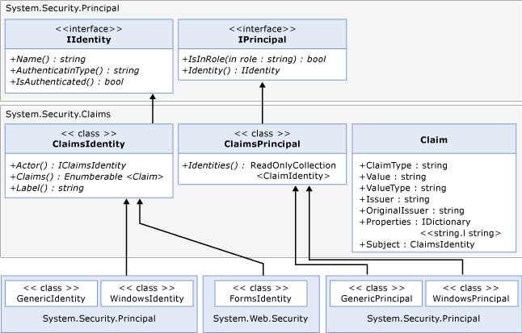

# <a name="wif-claims-programming-model"></a>WIF 声明编程模型
ASP.NET 和 Windows Communication Foundation (WCF) 开发人员通常使用 IIdentity 和 IPrincipal 接口处理用户的标识信息。 .NET 4.5 中集成了 Windows Identity Foundation (WIF)，因此对于任何主体，声明都将始终存在，如下图所示：  
  
   
  
 在 .NET 4.5 中，System.Security.Claims 包含新的 ClaimsPrincipal 和 ClaimsIdentity 类（如上图所示）。 .NET 中的所有主体现在均派生自 ClaimsPrincipal。 所有内置标识类（如 ASP.NET 的 WindowsIdentity 和 FormsIdentity）现在都派生自 ClaimsIdentity。 同样，所有内置主体类（如 GenericPrincipal 和 WindowsPrincipal）都派生自 ClaimsPrincipal。  
  
 声明由 <xref:System.Security.Claims.Claim> 类表示。 此类具有以下重要属性：  
  
-   <xref:System.Security.Claims.Claim.Type%2A> 表示声明的类型，通常是一个 URI。 例如，电子邮件地址声明表示为`http://schemas.microsoft.com/ws/2008/06/identity/claims/email`。  
  
-   <xref:System.Security.Claims.Claim.Value%2A> 包含声明的值，表现形式为字符串。 例如，电子邮件地址可以表示为"someone@contoso.com"。  
  
-   <xref:System.Security.Claims.Claim.ValueType%2A> 表示声明值的类型，通常是一个 URI。 例如，字符串类型表示为 `http://www.w3.org/2001/XMLSchema#string`。 根据 XML 架构，该值类型必须为 QName。 为使 WIF 输出有效的 QName 值，值的格式必须为 `namespace#format`。 如果命名空间不是定义完善的命名空间，生成的 XML 可能无法进行架构验证，因为没有为该命名空间发布的 XSD 文件。 默认值类型为 `http://www.w3.org/2001/XMLSchema#string`。 请参阅[ http://www.w3.org/2001/XMLSchema ](http://go.microsoft.com/fwlink/?LinkId=209155)的已知值类型，你可以安全地使用。  
  
-   <xref:System.Security.Claims.Claim.Issuer%2A> 是颁发声明的安全令牌服务 (STS) 标识符。 这可以表示为 STS 或者代表 STS名称的 URL ，例如 `https://sts1.contoso.com/sts`。  
  
-   无论链中有多少个 STS，<xref:System.Security.Claims.Claim.OriginalIssuer%2A> 是最初颁发声明的 STS 的标识符。 它的表示形式与 <xref:System.Security.Claims.Claim.Issuer%2A> 类似。  
  
-   <xref:System.Security.Claims.Claim.Subject%2A> 是标识正在被检查的使用者。 该方法包含 <xref:System.Security.Claims.ClaimsIdentity>。  
  
-   <xref:System.Security.Claims.Claim.Properties%2A> 是一个字典，开发人员可以使用它来提供应用程序特定的数据，以便与其他属性一起在线传送。此外，它还可用于自定义验证。  
  
## <a name="identity-delegation"></a>标识委托  
 <xref:System.Security.Claims.ClaimsIdentity> 的重要属性之一是 <xref:System.Security.Claims.ClaimsIdentity.Actor%2A>。 使用此属性可在多层系统中进行凭据委派（中间层充当客户端的角色，负责向后端服务提出请求）。  
  
### <a name="accessing-claims-through-threadcurrentprincipal"></a>通过 Thread.CurrentPrincipal 访问声明  
 若要在声明感知应用程序中访问当前用户的声明集，请使用 `Thread.CurrentPrincipal`。  
  
 下面的代码示例说明如何使用此方法获取 System.Security.Claims.ClaimsIdentity：  
  
```  
ClaimsPrincipal claimsPrincipal = Thread.CurrentPrincipal as ClaimsPrincipal;  
```  
  
 有关详细信息，请参阅<xref:System.Security.Claims>。  
  
### <a name="role-claim-type"></a>角色声明类型  
 配置声明感知应用程序的过程中，应确定使用的角色声明类型。 此声明类型由 System.Security.Claims.ClaimsPrincipal.IsInRole (System.String) 使用。 默认声明类型为 `http://schemas.microsoft.com/ws/2008/06/identity/claims/role`。  
  
### <a name="claims-extracted-by-windows-identity-foundation-from-different-token-types"></a>Windows Identity Foundation 从不同令牌类型中提取的声明  
 WIF 支持开箱即用的几种身份验证机制组合。 下表列出了 WIF 从不同令牌类型中提取的声明。  
  
|标记类型|生成的声明|映射到 Windows 访问令牌|  
|-|-|-|  
|SAML 1.1|1.System.IdentityModel.SecurityTokenService.GetOutputClaimsIdentity (System.Security.Claims.ClaimsPrincipal,System.IdentityModel.Protocols.WSTrust.RequestSecurityToken,System.IdentityModel.Scope) 中的所有声明。<br />2.包含确认密钥的 XML 序列化的 `http://schemas.microsoft.com/ws/2008/06/identity/claims/confirmationkey` 声明（如果该令牌包含证明令牌）。<br />3.Issuer 元素中的 `http://schemas.microsoft.com/ws/2008/06/identity/claims/samlissuername` 声明。<br />4.AuthenticationMethod 和 AuthenticationInstant 声明（如果该令牌包含身份验证语句）。|除了“SAML 1.1”中列出的声明（不包括 `http://schemas.xmlsoap.org/ws/2005/05/identity/claims/name` 类型的声明）外，还将添加 Windows 身份验证相关的声明，并由 WindowsClaimsIdentity 表示标识。|  
|SAML 2.0|与“SAML 1.1”相同。|与“映射到 Windows 帐户的 SAML 1.1”相同。|  
|X509|1.具有 X500 可分辨名称、emailName、dnsName、SimpleName、UpnName、UrlName、thumbprint、RsaKey（可以使用 RSACryptoServiceProvider.ExportParameters 方法从 X509Certificate2.PublicKey.Key 属性提取）、DsaKey（可以使用 DSACryptoServiceProvider.ExportParameters 方法从 X509Certificate2.PublicKey.Key 属性提取）和 X509 证书中 SerialNumber 属性的声明。<br />2.值为 `http://schemas.microsoft.com/ws/2008/06/identity/authenticationmethod/x509` 的 AuthenticationMethod 声明。 值为证书验证时间的 AuthenticationInstant 声明，格式为 XmlSchema DateTime。|1.它使用 Windows 帐户完全限定的域名作为 `http://schemas.xmlsoap.org/ws/2005/05/identity/claims/name` 声明值。 .<br />2.X509 证书中未映射到 Windows 的声明，以及通过将证书映射到 Windows 而获得的 Windows 帐户中的声明。|  
|UPN|1.与 Windows 身份验证部分中的声明类似的声明。<br />2.值为 `http://schemas.microsoft.com/ws/2008/06/identity/authenticationmethod/password` 的 AuthenticationMethod 声明。 值为密码验证时间的 AuthenticationInstant 声明，格式为 XmlSchema DateTime。||  
|Windows（Kerberos 或 NTLM）|1.从访问令牌生成的声明，例如：PrimarySID、DenyOnlyPrimarySID、PrimaryGroupSID、DenyOnlyPrimaryGroupSID、GroupSID、DenyOnlySID 和 Name<br />2.值为 `http://schemas.microsoft.com/ws/2008/06/identity/authenticationmethod/windows` 的 AuthenticationMethod。 值为 Windows 访问令牌创建时间的 AuthenticationInstant，格式为 XMLSchema DateTime。||  
|RSA 密钥对|1.值为 RSAKeyValue 的 `http://schemas.xmlsoap.org/ws/2005/05/identity/claims/rsa` 声明。<br />2.值为 `http://schemas.microsoft.com/ws/2008/06/identity/authenticationmethod/signature` 的 AuthenticationMethod 声明。 值为 RSA 密钥验证（即签名验证）时间的 AuthenticationInstant 声明，格式为 XMLSchema DateTime。||  
  
|身份验证类型|“AuthenticationMethod”声明中发出的 URI|  
|-|-|  
|Password|`urn:oasis:names:tc:SAML:1.0:am:password`|  
|Kerberos|`urn:ietf:rfc:1510`|  
|SecureRemotePassword|`urn:ietf:rfc:2945`|  
|TLSClient|`urn:ietf:rfc:2246`|  
|X509|`urn:oasis:names:tc:SAML:1.0:am:X509-PKI`|  
|PGP|`urn:oasis:names:tc:SAML:1.0:am:PGP`|  
|Spki|`urn:oasis:names:tc:SAML:1.0:am:SPKI`|  
|XmlDSig|`urn:ietf:rfc:3075`|  
|未指定|`urn:oasis:names:tc:SAML:1.0:am:unspecified`|
