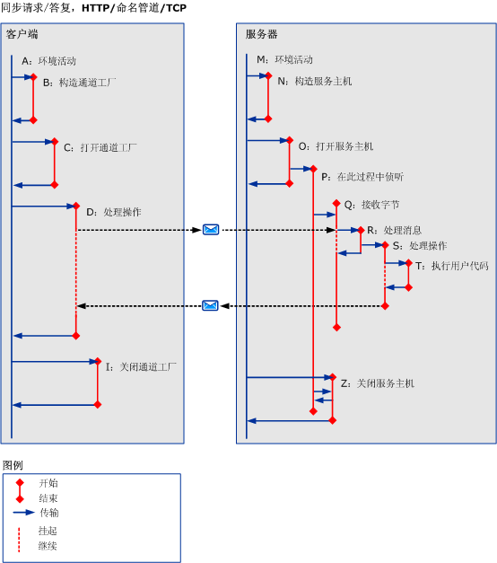

# 使用 HTTP、TCP 或命名管道的同步方案
本主题描述不同的同步请求/答复方案的活动和转换，这些同步方案使用单线程客户端以及 HTTP、TCP 或命名管道。 请参阅[使用 HTTP、 TCP 或命名管道的异步方案](../../../../../docs/framework/wcf/diagnostics/tracing/asynchronous-scenarios-using-http-tcp-or-named-pipe.md)有关多线程请求的详细信息。  
  
## 不返回错误的同步请求/答复  
 本节描述有效的同步请求/答复方案的活动和转换，该方案使用单线程客户端。  
  
### 客户端  
  
#### 与服务终结点建立通信  
 构造并打开了一个客户端。 对于每个这些步骤，环境活动 （A） 传输到"构造客户端"（B） 和"打开的客户端"（C） 活动分别。 对于转换到的每个活动，都将挂起环境活动，直到传回消息为止，即直到执行 ServiceModel 代码为止。  
  
#### 向服务终结点发出请求  
 环境活动传输到"ProcessAction"(D) 活动。 在此活动内，将发送请求消息并接收响应消息。 此活动在控制返回到用户代码时结束。 因为这是一个同步请求，因此环境活动在控制返回前将一直挂起。  
  
#### 关闭与服务终结点的通信  
 客户端的关闭活动 (I) 是从环境活动中创建的。 这与新建和打开活动完全相同。  
  
### 服务器  
  
#### 设置服务主机  
 ServiceHost 的新建和打开活动（N 和 O）是从环境活动 (M) 中创建的。  
  
 侦听器活动 (P) 是从为每个侦听器打开一个 ServiceHost 的活动中创建的。 侦听器活动等待接收和处理数据。  
  
#### 在网络上接收数据  
 当数据到达时在网络上时，如果它尚不存在 (Q) 来处理接收到的数据，则创建"ReceiveBytes"活动。 此活动可针对连接或队列中的多个消息重用。  
  
 如果 ReceiveBytes 具有足够的数据形成一个 SOAP 操作消息，则该活动将启动一个 ProcessMessage 活动 (R)。  
  
 在活动 R 中，将对消息头进行处理，并验证 activityID 标头。 如果此标头存在，则将活动 ID 设置为 ProcessAction 活动；否则创建一个新的 ID。  
  
 处理调用时，将创建 ProcessAction 活动 (S) 并转换到该活动。 此活动在与传入消息有关的所有处理（包括执行用户代码 (T) 和发送响应消息（如果适用））都完成时结束。  
  
#### 关闭服务主机  
 ServiceHost 的关闭活动 (Z) 是从环境活动中创建的。  
  
   
  
 在\<答： 名称 >，`A`是描述在上一个文本和表 3 中的活动的快捷符号。 `Name` 是活动的短名称。  
  
 如果`propagateActivity` = `true`，客户端和服务上的 Process Action 具有相同活动 id。  
  
## 返回错误的同步请求/答复  
 该方案与前一方案的唯一区别是将 SOAP 错误消息作为响应消息返回。 如果`propagateActivity` = `true`，请求消息的活动 ID 添加到 SOAP 错误消息。  
  
## 不返回错误的同步单向方案  
 该方案与第一个方案的唯一区别是不向服务器返回任何消息。 对于基于 HTTP 的协议，仍会将状态（有效或错误）返回到客户端。 这是因为 HTTP 是唯一一个具有属于 [!INCLUDE[indigo2](../../../../../includes/indigo2-md.md)] 协议堆栈的请求-响应语义的协议。 因为 TCP 处理对于 [!INCLUDE[indigo2](../../../../../includes/indigo2-md.md)] 是隐藏的，所以不会将任何确认消息发送到客户端。  
  
## 返回错误的同步单向方案  
 如果在处理消息期间（Q 或后续活动）出现错误，不会将任何通知返回到客户端。 这与“不返回错误的同步单向方案”方案完全相同。 如果希望接收错误消息，则不应使用单向方案。  
  
## 双工  
 与上述方案的区别在于客户端充当服务，并在此服务中创建 ReceiveBytes 和 ProcessMessage 活动，这与异步方案相似。
