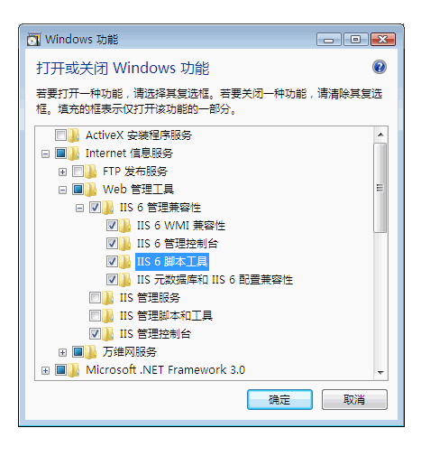

# 为 Windows Communication Foundation 配置 Internet Information Services 7.0
Internet Information Services \(IIS\) 7.0 具有模块化设计，允许有选择地安装需要的组件。此设计基于在 [!INCLUDE[wv](../../../../includes/wv-md.md)] 中引入的新清单驱动的组件化技术。[!INCLUDE[iisver](../../../../includes/iisver-md.md)] 有 40 多个独立功能组件可以独立安装。这使 IT 专业人士能够轻松地按需要自定义安装。本主题讨论如何配置 [!INCLUDE[iisver](../../../../includes/iisver-md.md)] 以便与 [!INCLUDE[indigo1](../../../../includes/indigo1-md.md)] 一起使用，以及如何确定所需的组件。  
  
## 最小安装：安装 WAS  
 整个 [!INCLUDE[iisver](../../../../includes/iisver-md.md)] 软件包的最小安装是安装 Windows Process Activation Service \(WAS\)。WAS 是一种独立的功能，是 [!INCLUDE[iisver](../../../../includes/iisver-md.md)] 中唯一可用于所有 [!INCLUDE[wv](../../../../includes/wv-md.md)] 操作系统（Home Basic、Home Premium、Business 以及 Ultimate 和 Enterprise）的功能。  
  
 在“控制面板”中，单击**“程序”**，然后单击**“程序和功能”**下面列出的**“打开或关闭 Windows 功能”**，WAS 组件便在列表中显示，如下图所示。  
  
   
  
 此功能具有下列子组件：  
  
-   .NET Environment  
  
-   配置 API  
  
-   进程模型  
  
 如果选择 WAS 的根节点，则默认情况下仅选中**“进程模型”**子节点。请注意，使用此安装时，您将只安装 WAS，因为没有用于 Web 服务器的支持功能。  
  
 若要使 [!INCLUDE[indigo2](../../../../includes/indigo2-md.md)] 或任何 [!INCLUDE[vstecasp](../../../../includes/vstecasp-md.md)] 应用程序正常工作，请选中**“.NET Environment”**复选框。这意味着需要所有 WAS 组件才能使 [!INCLUDE[indigo2](../../../../includes/indigo2-md.md)] 和 [!INCLUDE[vstecasp](../../../../includes/vstecasp-md.md)] 正常工作。您安装其中任何组件后，会自动选中这些组件。  
  
## IIS 7.0：默认安装  
 选中**“Internet 信息服务”**功能时，会自动选中一些子节点，如下图所示。  
  
   
  
 这是 [!INCLUDE[iisver](../../../../includes/iisver-md.md)] 的默认安装。使用此安装时，您可以使用 [!INCLUDE[iisver](../../../../includes/iisver-md.md)] 提供静态内容（如 HTML 页面和其他内容）。但是，您不能运行 [!INCLUDE[vstecasp](../../../../includes/vstecasp-md.md)] 或 CGI 应用程序，或承载 [!INCLUDE[indigo2](../../../../includes/indigo2-md.md)] 服务。  
  
## IIS 7.0：带 ASP.NET 支持的安装  
 您必须安装 [!INCLUDE[vstecasp](../../../../includes/vstecasp-md.md)] 才能使 [!INCLUDE[vstecasp](../../../../includes/vstecasp-md.md)] 在 IIS 7.0 上正常工作。选中**“ASP.NET”**后，屏幕画面应与下图类似。  
  
   
  
 这是使 [!INCLUDE[indigo2](../../../../includes/indigo2-md.md)] 和 [!INCLUDE[vstecasp](../../../../includes/vstecasp-md.md)] 应用程序在 [!INCLUDE[iisver](../../../../includes/iisver-md.md)] 中正常工作的最低环境。  
  
## IIS 7.0：带 IIS 6.0 兼容组件的安装  
 在具有 Visual Studio 2005 或某些其他使用 [!INCLUDE[iis601](../../../../includes/iis601-md.md)] 元数据库 API 来配置虚拟应用程序的自动化脚本或工具（如 Adsutil.vbs）的系统上安装 [!INCLUDE[iisver](../../../../includes/iisver-md.md)] 时，请务必选中 [!INCLUDE[iis601](../../../../includes/iis601-md.md)]**“脚本工具”**。这会自动选中 [!INCLUDE[iis601](../../../../includes/iis601-md.md)]**“管理兼容性”**的其他子节点。下面的插图显示此操作完成后的屏幕。  
  
   
  
 使用此安装时，您具备使用 [!INCLUDE[iisver](../../../../includes/iisver-md.md)]、[!INCLUDE[vstecasp](../../../../includes/vstecasp-md.md)] 和 [!INCLUDE[indigo2](../../../../includes/indigo2-md.md)] 功能以及 Web 上可用的所有示例的一切条件。  
  
## 请求限制  
 在带有 IIS 7 的 [!INCLUDE[wv](../../../../includes/wv-md.md)] 上，`maxUri` 和 `maxQueryStringSize` 设置的默认值均已更改。默认情况下，IIS 7.0 中的请求筛选功能允许 URL 的长度为 4096 个字符，查询字符串的长度为 2048 个字符。更改这些默认值，可将以下 XML 添加到 App.config 文件中。  
  
 `<system.webServer>`  
  
 `<security>`  
  
 `<requestFiltering>`  
  
 `<requestLimits maxUrl=”8192” maxQueryString=”8192” />`  
  
 `</requestFiltering>`  
  
 `</security>`  
  
 `</system.webServer>`  
  
## 请参阅  
 [WAS 激活体系结构](../../../../docs/framework/wcf/feature-details/was-activation-architecture.md)   
 [配置 WAS 以用于 WCF](../../../../docs/framework/wcf/feature-details/configuring-the-wpa--service-for-use-with-wcf.md)   
 [如何：安装和配置 WCF 激活组件](../../../../docs/framework/wcf/feature-details/how-to-install-and-configure-wcf-activation-components.md)   
 [Windows Server App Fabric 承载功能](http://go.microsoft.com/fwlink/?LinkId=201276)