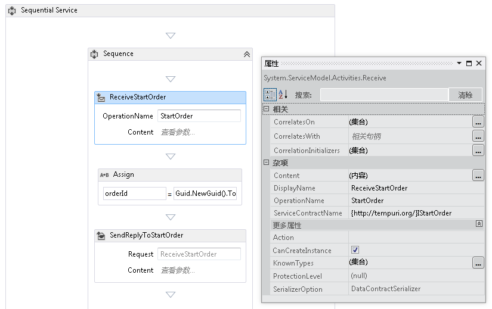
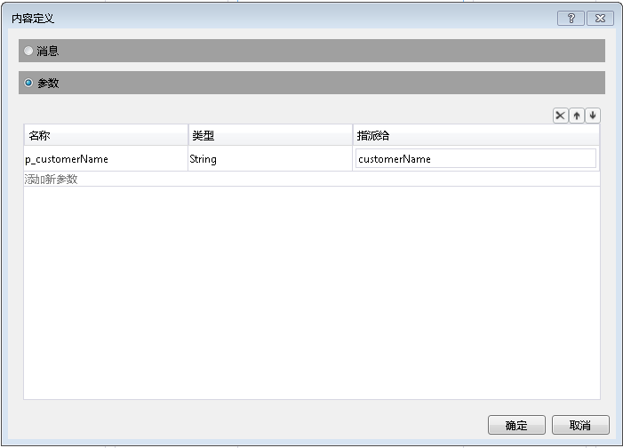
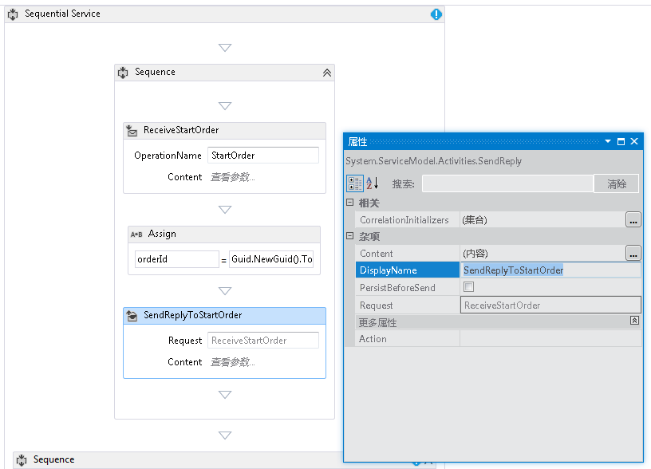
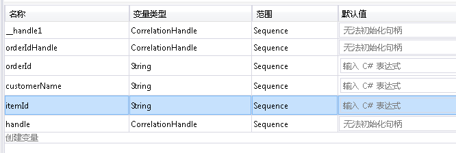
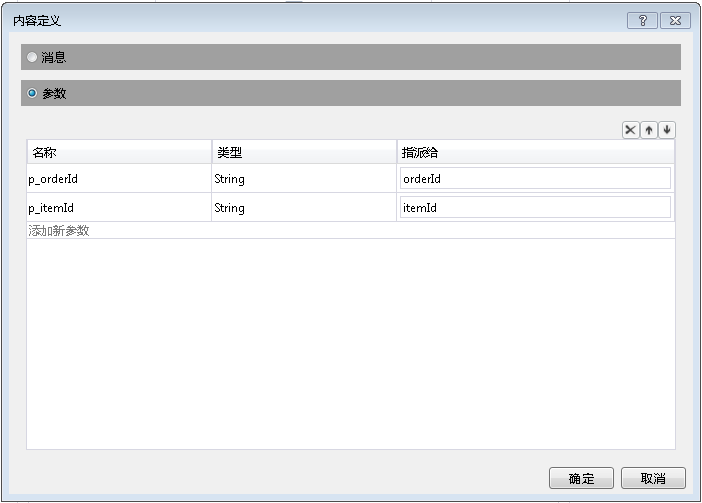
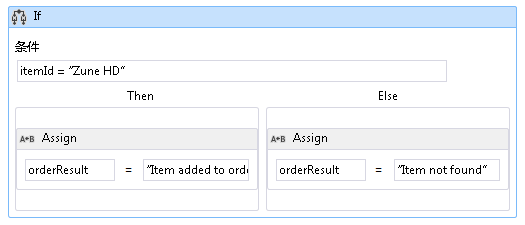

# 创建长时间运行的工作流服务
本主题描述如何创建长时间运行的工作流服务。  长时间运行的工作流服务可能会运行很长一段时间。  在某一时刻，工作流可能会转入空闲状态，等待一些附加信息。  当这种情况发生时，工作流将保存到 SQL 数据库并从内存中删除。  当附加信息变得可用时，工作流实例将重新加载回内存，继续执行。  在此方案中，您将实现一个非常简化的订单系统。  客户端向工作流服务发送初始消息以启动订单。  此服务将订单 ID 返回给客户端。  此时，工作流服务要等待来自客户端的另一条消息，它转入空闲状态并保存到 SQL Server 数据库。  当客户端发送下一条消息订购项目时，工作流服务将重新加载回内存，完成处理此订单。  在代码示例中它将返回一个字符串，指示项目已添加到订单中。  代码示例并不是技术的现实应用，而是作为一个简单的示例来说明长时间运行的工作流服务。本主题假定你知道如何创建 [!INCLUDE[vs_current_long](../../../../includes/vs-current-long-md.md)] 项目和解决方案。  
  
## 系统必备  
 您必须安装了下列软件才能使用本演练：  
  
1.  Microsoft SQL Server 2008  
  
2.  [!INCLUDE[vs_current_long](../../../../includes/vs-current-long-md.md)]  
  
3.  Microsoft [!INCLUDE[netfx_current_long](../../../../includes/netfx-current-long-md.md)]  
  
4.  您熟悉 WCF 和 [!INCLUDE[vs_current_long](../../../../includes/vs-current-long-md.md)] 并且知道如何创建项目\/解决方案。  
  
### 设置 SQL 数据库  
  
1.  为了使工作流服务实例能够持久化，您必须安装 Microsoft SQL Server，并配置一个数据库来存储持久化工作流实例。  通过单击**“开始”**按钮，选择**“所有程序”**、**“Microsoft SQL Server 2008”**和**“SQL Server Management Studio”**，来运行 Microsoft SQL Management Studio。  
  
2.  单击**“连接”**按钮登录到 SQL Server 实例。  
  
3.  右击树视图中的**“数据库”**，并选择**“新建数据库...”**来新建一个名为 `SQLPersistenceStore` 的数据库。  
  
4.  在 SQLPersistenceStore 数据库上运行位于 C:\\Windows\\Microsoft.NET\\Framework\\v4.0\\SQL\\en 目录中的 SqlWorkflowInstanceStoreSchema.sql 脚本文件，以设置所需的数据库架构。  
  
5.  在 SQLPersistenceStore 数据库上运行位于 C:\\Windows\\Microsoft.NET\\Framework\\v4.0\\SQL\\en 目录中的 SqlWorkflowInstanceStoreLogic.sql 脚本文件，以设置所需的数据库逻辑。  
  
### 创建 Web 承载的工作流服务  
  
1.  创建一个空 [!INCLUDE[vs_current_long](../../../../includes/vs-current-long-md.md)] 解决方案并将其命名为 `OrderProcessing`。  
  
2.  向该解决方案中添加一个名为 [!INCLUDE[indigo2](../../../../includes/indigo2-md.md)] 的新 `OrderService` 工作流服务应用程序项目。  
  
3.  在“项目属性”对话框中，选择**“Web”**选项卡。  
  
    1.  在**“启动操作”**下，选择**“特定页”**并指定 `Service1.xamlx`。  
  
           
  
    2.  在**“服务器”**下，选择**“使用本地 IIS Web 服务器”**。  
  
           
  
        > [!WARNING]
        >  您必须在管理员模式下运行 [!INCLUDE[vs_current_long](../../../../includes/vs-current-long-md.md)] 才能进行此设置。  
  
         这两个步骤将工作流服务项目配置为由 IIS 承载。  
  
4.  如果 `Service1.xamlx` 还未打开，则打开它并删除现有的**“ReceiveRequest”**和**“SendResponse”**活动。  
  
5.  选择**“顺序服务”**活动，单击**“变量”**链接，然后添加下图中显示的变量。  通过执行此操作，会添加一些稍后将在工作流服务中使用的变量。  
  
    > [!NOTE]
    >  如果 CorrelationHandle 不在“变量类型”下拉列表中，则从该下拉列表中选择**“浏览类型”**。  在**“类型名称”**框中键入 CorrelationHandle，从列表框中选择 CorrelationHandle 并单击**“确定”**。  
  
       
  
6.  将**“ReceiveAndSendReply”**活动模板拖放到**“顺序服务”**活动中。  这组活动将接收来自客户端的消息，并发送回复。  
  
    1.  选择**“Receive”**活动，并设置下图中突出显示的属性。  
  
           
  
         DisplayName 属性设置在设计器中显示的 Receive 活动的名称。  ServiceContractName 和 OperationName 属性指定 Receive 活动实现的服务协定和操作的名称。  [!INCLUDE[crabout](../../../../includes/crabout-md.md)]如何在工作流服务中使用协定的更多信息，请参见[在工作流中使用协定](../../../../docs/framework/wcf/feature-details/using-contracts-in-workflow.md)。  
  
    2.  单击**“ReceiveStartOrder”**活动中的**“定义...”**链接，并设置下图中显示的属性。  请注意，**“参数”**单选按钮处于选中状态；名为 `p_customerName` 的参数绑定到 `customerName` 变量。  这样会将**“Receive”**活动配置为接收某种数据，并将这类数据绑定到局部变量。  
  
           
  
    3.  选择**“SendReplyToReceive”**活动，并设置下图中突出显示的属性。  
  
           
  
    4.  单击**“SendReplyToStartOrder”**活动中的**“定义...”**链接，并设置下图中显示的属性。  请注意，**“参数”**单选按钮处于选中状态；名为 `p_orderId` 的参数绑定到 `orderId` 变量。  此设置指定 SendReplyToStartOrder 活动将类型字符串的值返回给调用方。  
  
           
  
        > [!NOTE]
    5.  在**“Receive”**和**“SendReply”**活动之间拖放 Assign 活动，并设置下图中显示的属性：  
  
           
  
         这将创建一个新的订单 ID，并将该值放在 orderId 变量中。  
  
    6.  选择**“ReplyToStartOrder”**活动。  在“属性”窗口中，单击**“CorrelationInitializers”**对应的省略号按钮。  选择**“添加初始值设定项”**链接，在“初始值设定项”文本框中输入 `orderIdHandle`，为相关类型选择“查询相关初始值设定项”，并在“XPATH 查询”下拉框中选择 p\_orderId。  这些设置如下图所示。  单击“确定”。  这将初始化客户端与此工作流服务实例之间的相关性。  当接收到包含此订单 ID 的消息时，将该消息路由至此工作流服务实例。  
  
           
  
7.  将另一个**“ReceiveAndSendReply”**活动拖放到工作流的结尾（在包含第一个**“Receive”**和**“SendReply”**活动的**“序列”**之外）。  这将接收客户端发送的第二条消息，并对它做出响应。  
  
    1.  选择包含新添**“Receive”**和**“SendReply”**活动的**“序列”**，并单击**“变量”**按钮。  添加下图中突出显示的变量：  
  
           
  
    2.  选择**“Receive”**活动，并设置下图中显示的属性：  
  
           
  
    3.  单击**“ReceiveAddItem”**活动中的**“定义...”**链接，并添加下图中显示的参数：将接收活动配置为接受两个参数，即订单 ID 和订购项目的 ID。  
  
           
  
    4.  单击**“CorrelateOn”**省略号按钮，并输入 `orderIdHandle`。  在**“XPath 查询”**下，单击下拉箭头并选择 `p_orderId`。  这将对第二个接收活动配置相关性。  [!INCLUDE[crabout](../../../../includes/crabout-md.md)]相关性的更多信息，请参见[相关性](../../../../docs/framework/wcf/feature-details/correlation.md)。  
  
           
  
    5.  将**“If”**活动拖放至紧靠**“ReceiveAddItem”**活动之后的位置。  此活动的行为与 if 语句类似。  
  
        1.  将**“Condition”**属性设置为 `itemId==”Zune HD” (itemId=”Zune HD” for Visual Basic)`。  
  
        2.  将一个**“Assign”**活动拖放到**“Then”**部分，将另一个拖放到**“Else”**部分，并设置**Assign**活动的属性，如下图所示。  
  
               
  
             如果条件为 `true`，则将执行**“Then”**部分。  如果条件为 `false`，则将执行**“Else”**部分。  
  
        3.  选择**“SendReplyToReceive”**活动，并设置下图中显示的**“DisplayName”**属性。  
  
               
  
        4.  单击**“SetReplyToAddItem”**活动中的**“定义...”**链接并进行配置，如下图所示。  这将**“SendReplyToAddItem”**活动配置为在 `orderResult` 变量中返回值。  
  
               
  
8.  打开 web.config 文件，并在 \<behavior\> 部分添加下列元素以启用工作流持久性。  
  
    ```xml  
    <sqlWorkflowInstanceStore connectionString="Data Source=your-machine\SQLExpress;Initial Catalog=SQLPersistenceStore;Integrated Security=True;Asynchronous Processing=True" instanceEncodingOption="None" instanceCompletionAction="DeleteAll" instanceLockedExceptionAction="BasicRetry" hostLockRenewalPeriod="00:00:30" runnableInstancesDetectionPeriod="00:00:02" />  
              <workflowIdle timeToUnload="0"/>  
  
    ```  
  
    > [!WARNING]
    >  确保替换上面代码段中的主机和 SQL Server 实例名称。  
  
9. 生成解决方案。  
  
### 创建客户端应用程序以调用工作流服务  
  
1.  将一个名为 `OrderClient` 的新控制台应用程序项目添加到解决方案中。  
  
2.  向 `OrderClient` 项目中添加对以下程序集的引用：  
  
    1.  System.ServiceModel.dll  
  
    2.  System.ServiceModel.Activities.dll  
  
3.  添加对工作流服务的服务引用，并将 `OrderService` 指定为命名空间。  
  
4.  在客户端项目的 `Main()` 方法中，添加以下代码：  
  
    ```  
    static void Main(string[] args)  
    {  
       // Send initial message to start the workflow service  
       Console.WriteLine("Sending start message");  
       StartOrderClient startProxy = new StartOrderClient();  
       string orderId = startProxy.StartOrder("Kim Abercrombie");  
  
       // The workflow service is now waiting for the second message to be sent  
       Console.WriteLine("Workflow service is idle...");  
       Console.WriteLine("Press [ENTER] to send an add item message to reactivate the workflow service...");  
       Console.ReadLine();  
  
       // Send the second message  
       Console.WriteLine("Sending add item message");  
       AddItemClient addProxy = new AddItemClient();  
       AddItem item = new AddItem();  
       item.p_itemId = "Zune HD";  
       item.p_orderId = orderId;  
  
       string orderResult = addProxy.AddItem(item);  
       Console.WriteLine("Service returned: " + orderResult);  
    }  
  
    ```  
  
5.  生成解决方案，并运行 `OrderClient` 应用程序。  客户端将显示以下文本：  
  
    ```Output  
  
                  发送启动消息  
    工作流服务闲置...  按 [ENTER] 发送并添加项目消息，以重新激活工作流服务...    
    ```  
  
6.  若要验证工作流服务是否已持久化，请转到**“开始”**菜单，选择**“所有程序”**、**“Microsoft SQL Server 2008”**、**“SQL Server Management Studio”**来启动 SQL Server Management Studio。  
  
    1.  在左侧窗格中，依次展开**“数据库”**、**“SQLPersistenceStore”**和**“视图”**，右击**“System.Activities.DurableInstancing.Instances”**并选择**“选择前 1000 行”**。  在**“结果”**窗格中，确认您看到至少列出一个实例。  如果运行时出现异常，则可能存在先前运行的其他实例。  通过右击**“System.Activities.DurableInstancing.Instances”**，选择**“编辑前 200 行”**，按**“执行”**按钮，选择结果窗格中的所有行，然后选择**“删除”**，可删除现有行。  若要验证数据库中显示的实例是否为应用程序创建的实例，请在运行客户端之前验证实例视图是否为空。  客户端开始运行后，重新运行查询（选择前 1000 行），并确认已添加新实例。  
  
7.  按 Enter 将添加项目消息发送至工作流服务。  客户端将显示以下文本：  
  
    ```Output  
  
                  发送添加项目消息  
    返回了服务：项目添加到订单  
    按任意键继续。  。  。    
    ```  
  
## 请参阅  
 [工作流服务](../../../../docs/framework/wcf/feature-details/workflow-services.md)