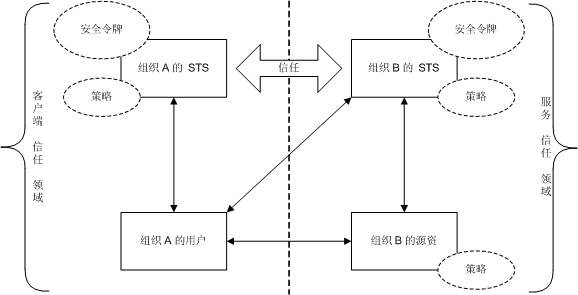
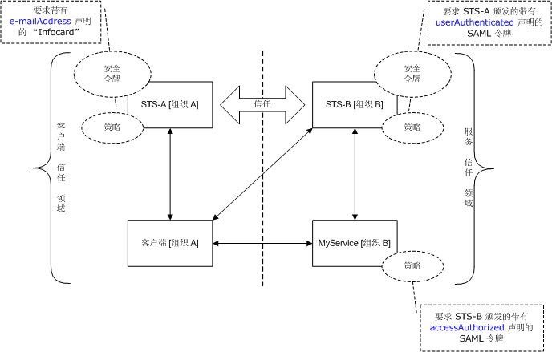
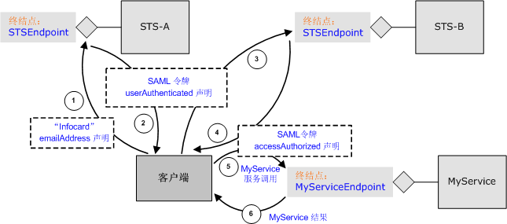

# <a name="federation"></a>联合
本主题概要介绍联合安全概念。 本主题还说明 [!INCLUDE[indigo1](../../../../includes/indigo1-md.md)] 对部署联合安全体系结构的支持。 有关演示联合身份验证的示例应用，请参阅[联合身份验证示例](../../../../docs/framework/wcf/samples/federation-sample.md)。  
  
## <a name="definition-of-federated-security"></a>联合安全的定义  
 联合安全允许客户端访问的服务与关联的身份验证和授权过程完全分离。 联合安全还允许跨不同信任领域内的多个系统、网络和组织进行协作。  
  
 [!INCLUDE[indigo2](../../../../includes/indigo2-md.md)] 为生成和部署使用联合安全的分布式系统提供支持。  
  
### <a name="elements-of-a-federated-security-architecture"></a>联合安全体系结构的元素  
 联合安全体系结构有三个关键元素，如下表所述。  
  
|元素|描述|  
|-------------|-----------------|  
|域/领域|安全管理或信任的单个单位。 典型的域可能包括单个组织。|  
|联合|已建立信任的域的集合。 虽然信任级别可能不同，但通常都包括身份验证并且几乎始终包括授权。 典型联合可能包括已建立信任可共享访问一组资源的若干组织。|  
|安全令牌服务 (STS)|颁发安全令牌的 Web 服务；也就是说，该服务基于它所信任的证据向信任服务的人作出断言。 这为域之间的信任代理奠定了基础。|  
  
### <a name="example-scenario"></a>示例方案  
 下图显示了联合安全的示例。  
  
   
  
 此方案包括两个组织：A 和 B。组织 B 拥有组织 A 中某些用户认为有价值的 Web 资源（Web 服务）。  
  
> [!NOTE]
>  本部分使用的词汇*资源*，*服务*，和*Web 服务*互换。  
  
 通常，组织 B 要求组织 A 中的用户在访问服务之前提供某种有效的身份验证形式。 另外，该组织还可能要求用户获得授权才能访问所说的特定资源。 可解决此问题并使组织 A 中的用户能够访问组织 B 中的资源的一种方法如下所述：  
  
-   组织 A 中的用户向组织 B 注册他们的凭据（用户名和密码）。  
  
-   在访问资源的过程中，组织 A 中的用户在访问资源之前，向组织 B 提供其凭据并进行身份验证。  
  
 此方法有三个明显的缺点：  
  
-   组织 B 除了管理其本地用户的凭据外，还必须管理组织 A 中用户的凭据。  
  
-   组织 A 中的用户除了保留他们通常用于访问组织 A 中资源的凭据外，还需要保留一组附加凭据（即记住附加用户名和密码）。因此通常鼓励在多个服务站点使用相同的用户名和密码，但这不是一种有效的安全措施。  
  
-   随着认为组织 B 的资源有价值的组织越来越多，体系结构不会随之进行调整。  
  
 可以解决上述缺点的另一种替代方法是使用联合安全。 在此方法中，组织 A 和组织 B 建立一种信任关系并使用安全令牌服务 (STS) 启用所建立信任的代理。  
  
 在联合安全体系结构中，组织 A 中的用户知道，如果他们想访问组织 B 中的 Web 服务，就必须提供组织 B 的 STS 颁发的有效安全令牌，此令牌对用户进行身份验证并授权他们访问特定服务。  
  
 在与 STS B 联系时，用户可通过与 STS 关联的策略获得另一级间接寻址。 用户必须提供 STS A（即客户端信任领域）颁发的有效安全令牌，STS B 才会向他们颁发安全令牌。 这是两个组织之间建立的信任关系的必然结果，同时暗示着组织 B 不必管理组织 A 中用户的标识。实际上，STS B 通常具有空的 `issuerAddress` 和 `issuerMetadataAddress`。 [!INCLUDE[crdefault](../../../../includes/crdefault-md.md)][如何： 配置本地颁发者](../../../../docs/framework/wcf/feature-details/how-to-configure-a-local-issuer.md)。 在这种情况下，客户端咨询本地策略以找到 STS a。此配置称为*主领域联合*，并且可以更好地扩展由于 STS B 不必保留有关 STS a。 信息  
  
 然后，用户可与组织 A 的 STS 联系并通过提供他们通常用于访问组织 A 中任何其他资源的身份验证凭据获取安全令牌。这也会缓解用户必须保留多组凭据或在多个服务站点使用同组凭据的问题。  
  
 用户从 STS A 获取安全令牌后，他们可以将该令牌提供给 STS B。组织 B 将继续对用户的请求执行身份验证并从其自己的安全令牌集中向用户颁发安全令牌。 之后，用户可以将他们的令牌提供给组织 B 的资源并访问服务。  
  
## <a name="support-for-federated-security-in-wcf"></a>WCF 中的联合安全支持  
 [!INCLUDE[indigo2](../../../../includes/indigo2-md.md)]提供对部署联合的安全体系结构通过的关守支持[ \<wsFederationHttpBinding >](../../../../docs/framework/configure-apps/file-schema/wcf/wsfederationhttpbinding.md)。  
  
 [ \<WsFederationHttpBinding >](../../../../docs/framework/configure-apps/file-schema/wcf/wsfederationhttpbinding.md)元素提供安全、 可靠且可互操作的绑定需要使用 HTTP 作为请求-答复通信样式的底层传输机制采用文本和 XML 作为编码的联网格式。  
  
 使用[ \<wsFederationHttpBinding >](../../../../docs/framework/configure-apps/file-schema/wcf/wsfederationhttpbinding.md)在联合安全方案可以分离到两个逻辑上独立于阶段，如以下各节中所述。  
  
### <a name="phase-1-design-phase"></a>阶段 1：设计阶段  
 在设计阶段，客户端使用[ServiceModel 元数据实用工具 (Svcutil.exe)](../../../../docs/framework/wcf/servicemodel-metadata-utility-tool-svcutil-exe.md)来读取服务终结点公开的策略并收集服务的身份验证和授权要求。 构造相应代理以在客户端创建以下联合安全通信模式：  
  
-   从客户端信任领域中的 STS 获取安全令牌。  
  
-   将令牌提供给服务信任领域中的 STS。  
  
-   从服务信任领域中的 STS 获取安全令牌。  
  
-   向服务提供令牌以访问该服务。  
  
### <a name="phase-2-run-time-phase"></a>阶段 2：运行时阶段  
 在运行时阶段，客户端实例化 [!INCLUDE[indigo2](../../../../includes/indigo2-md.md)] 客户端类的对象并使用 [!INCLUDE[indigo2](../../../../includes/indigo2-md.md)] 客户端执行调用。 [!INCLUDE[indigo2](../../../../includes/indigo2-md.md)] 的基础框架处理先前在联合安全通信模式中提到的步骤并使客户端能够无缝地使用服务。  
  
## <a name="sample-implementation-using-wcf"></a>使用 WCF 的实现示例  
 下图显示使用 [!INCLUDE[indigo2](../../../../includes/indigo2-md.md)] 中本机支持的联合安全体系结构的实现示例。  
  
   
  
### <a name="example-myservice"></a>MyService 示例  
 服务 `MyService` 通过 `MyServiceEndpoint` 公开单个终结点。 下图显示与该终结点关联的地址、绑定和协定。  
  
   
  
 服务终结点`MyServiceEndpoint`使用[ \<wsFederationHttpBinding >](../../../../docs/framework/configure-apps/file-schema/wcf/wsfederationhttpbinding.md)和需要有效的安全断言标记语言 (SAML) 令牌与`accessAuthorized`STS b 颁发声明这是以声明方式指定服务配置中。  
  
```xml  
<system.serviceModel>  
  <services>  
    <service type="FederationSample.MyService"      
        behaviorConfiguration='MyServiceBehavior'>  
        <endpoint address=""  
            binding=" wsFederationHttpBinding"  
            bindingConfiguration='MyServiceBinding'  
            contract="Federation.IMyService" />  
   </service>  
  </services>  
  
  <bindings>  
    <wsFederationHttpBinding>  
    <!-- This is the binding used by MyService. It redirects   
    clients to STS-B. -->  
      <binding name='MyServiceBinding'>  
        <security mode="Message">  
           <message issuedTokenType=  
"http://docs.oasis-open.org/wss/oasis-wss-saml-token-profile-1.1#SAMLV1.1">  
           <issuer address="http://localhost/FederationSample/STS-B/STS.svc" />  
            <issuerMetadata   
           address=  
"http://localhost/FederationSample/STS-B/STS.svc/mex" />  
         <requiredClaimTypes>  
            <add claimType="http://tempuri.org:accessAuthorized" />  
         </requiredClaimTypes>  
        </message>  
      </security>  
      </binding>  
    </wsFederationHttpBinding>  
  </bindings>  
  
  <behaviors>  
    <behavior name='MyServiceBehavior'>  
      <serviceAuthorization   
operationRequirementType="FederationSample.MyServiceOperationRequirement, MyService" />  
       <serviceCredentials>  
         <serviceCertificate findValue="CN=FederationSample.com"  
         x509FindType="FindBySubjectDistinguishedName"  
         storeLocation='LocalMachine'  
         storeName='My' />  
      </serviceCredentials>  
    </behavior>  
  </behaviors>  
</system.serviceModel>  
```  
  
> [!NOTE]
>  对于 `MyService` 要求的声明，有一细微点应加以注意。 第二个图指示 `MyService` 需要具有 `accessAuthorized` 声明的 SAML 令牌。 更确切地说，这指定了 `MyService` 需要的声明类型。 此声明类型的完全限定名称为 http://tempuri.org:accessAuthorized（连同关联的命名空间），用于服务配置文件中。 此声明的值指示存在此声明并假定 STS B 将此值设置为 `true`。  
  
 在运行时，此策略作为 `MyServiceOperationRequirement` 一部分由 `MyService` 类强制实现。  
  
 [!code-csharp[C_Federation#0](../../../../samples/snippets/csharp/VS_Snippets_CFX/c_federation/cs/source.cs#0)]
 [!code-vb[C_Federation#0](../../../../samples/snippets/visualbasic/VS_Snippets_CFX/c_federation/vb/source.vb#0)]  
[!code-csharp[C_Federation#1](../../../../samples/snippets/csharp/VS_Snippets_CFX/c_federation/cs/source.cs#1)]
[!code-vb[C_Federation#1](../../../../samples/snippets/visualbasic/VS_Snippets_CFX/c_federation/vb/source.vb#1)]  
  
#### <a name="sts-b"></a>STS B  
 下图显示 STS B。如前所述，安全令牌服务 (STS) 也是一种 Web 服务，并可具有其自己的关联终结点、策略等。  
  
   
  
 STS B 公开名为 `STSEndpoint` 的单个终结点用于请求安全令牌。 具体地说，STS B 颁发具有 `accessAuthorized` 声明的 SAML 令牌，此令牌可在 `MyService` 服务站点用于访问服务。 但是，STS B 要求用户提供由 STS A 颁发的包含 `userAuthenticated` 声明的有效 SAML 令牌。 这是以声明方式在 STS 配置中指定的。  
  
```xml  
<system.serviceModel>  
  <services>  
    <service type="FederationSample.STS_B" behaviorConfiguration=  
     "STS-B_Behavior">  
    <endpoint address=""  
              binding="wsFederationHttpBinding"  
              bindingConfiguration='STS-B_Binding'  
      contract="FederationSample.ISts" />  
    </service>  
  </services>  
  <bindings>  
    <wsFederationHttpBinding>  
    <!-- This is the binding used by STS-B. It redirects clients to   
         STS-A. -->  
      <binding name='STS-B_Binding'>  
        <security mode='Message'>  
          <message issuedTokenType="http://docs.oasis-open.org/wss/oasis-wss-saml-token-profile-1.1#SAMLV1.1">  
          <issuer address='http://localhost/FederationSample/STS-A/STS.svc' />  
          <issuerMetadata address='http://localhost/FederationSample/STS-A/STS.svc/mex'/>  
          <requiredClaimTypes>  
            <add claimType='http://tempuri.org:userAuthenticated'/>  
          </requiredClaimTypes>  
          </message>  
        </security>  
    </binding>  
   </wsFederationHttpBinding>  
  </bindings>  
  <behaviors>  
  <behavior name='STS-B_Behavior'>  
    <serviceAuthorization   operationRequirementType='FederationSample.STS_B_OperationRequirement, STS_B' />  
    <serviceCredentials>  
      <serviceCertificate findValue='CN=FederationSample.com'  
      x509FindType='FindBySubjectDistinguishedName'  
       storeLocation='LocalMachine'  
       storeName='My' />  
     </serviceCredentials>  
   </behavior>  
  </behaviors>  
</system.serviceModel>  
```  
  
> [!NOTE]
>  另外，`userAuthenticated` 声明是 STS B 要求的声明类型。此声明类型的完全限定名称为 http://tempuri.org:userAuthenticated（连同关联的命名空间），用于 STS 配置文件中。 此声明的值指示存在此声明并假定 STS A 将此值设置为 `true`。  
  
 在运行时，此策略作为 STS B 的一部分由 `STS_B_OperationRequirement` 类强制实现。  
  
 [!code-csharp[C_Federation#2](../../../../samples/snippets/csharp/VS_Snippets_CFX/c_federation/cs/source.cs#2)]
 [!code-vb[C_Federation#2](../../../../samples/snippets/visualbasic/VS_Snippets_CFX/c_federation/vb/source.vb#2)]  
  
 如果通过访问检查，则 STS B 将颁发具有 `accessAuthorized` 声明的 SAML 令牌。  
  
 [!code-csharp[C_Federation#3](../../../../samples/snippets/csharp/VS_Snippets_CFX/c_federation/cs/source.cs#3)]
 [!code-vb[C_Federation#3](../../../../samples/snippets/visualbasic/VS_Snippets_CFX/c_federation/vb/source.vb#3)]  
  
#### <a name="sts-a"></a>STS A  
 下图显示 STS A。  
  
   
  
 与 STS B 类似，STS A 也是一种 Web 服务，该服务颁发安全令牌并为此目的公开单个终结点。 不过，STS A 使用另一个绑定 (`wsHttpBinding`) 并要求用户提供具有 [!INCLUDE[infocard](../../../../includes/infocard-md.md)] 声明的有效 `emailAddress`。 作为响应，它会颁发具有 `userAuthenticated` 声明的 SAML 令牌。 这是以声明方式在服务配置中指定的。  
  
```xml  
<system.serviceModel>  
  <services>  
    <service type="FederationSample.STS_A" behaviorConfiguration="STS-A_Behavior">  
      <endpoint address=""  
                binding="wsHttpBinding"  
                bindingConfiguration="STS-A_Binding"  
                contract="FederationSample.ISts">  
       <identity>  
       <certificateReference findValue="CN=FederationSample.com"    
                       x509FindType="FindBySubjectDistinguishedName"  
                       storeLocation="LocalMachine"   
                       storeName="My" />  
       </identity>  
    <endpoint>  
  </service>  
</services>  
  
<bindings>  
  <wsHttpBinding>  
  <!-- This is the binding used by STS-A. It requires users to present  
   a CardSpace. -->  
    <binding name='STS-A_Binding'>  
      <security mode='Message'>  
        <message clientCredentialType="CardSpace" />  
      </security>  
    </binding>  
  </wsHttpBinding>  
</bindings>  
  
<behaviors>  
  <behavior name='STS-A_Behavior'>  
    <serviceAuthorization operationRequirementType=  
     "FederationSample.STS_A_OperationRequirement, STS_A" />  
      <serviceCredentials>  
  <serviceCertificate findValue="CN=FederationSample.com"  
                     x509FindType='FindBySubjectDistinguishedName'  
                     storeLocation='LocalMachine'  
                     storeName='My' />  
      </serviceCredentials>  
    </behavior>  
  </behaviors>  
</system.serviceModel>  
```  
  
 在运行时，此策略作为 STS A 的一部分由 `STS_A_OperationRequirement` 类强制实现。  
  
 [!code-csharp[C_Federation#4](../../../../samples/snippets/csharp/VS_Snippets_CFX/c_federation/cs/source.cs#4)]
 [!code-vb[C_Federation#4](../../../../samples/snippets/visualbasic/VS_Snippets_CFX/c_federation/vb/source.vb#4)]  
  
 如果访问为 `true`，则 STS A 颁发具有 `userAuthenticated` 声明的 SAML 令牌。  
  
 [!code-csharp[C_Federation#5](../../../../samples/snippets/csharp/VS_Snippets_CFX/c_federation/cs/source.cs#5)]
 [!code-vb[C_Federation#5](../../../../samples/snippets/visualbasic/VS_Snippets_CFX/c_federation/vb/source.vb#5)]  
  
### <a name="client-at-organization-a"></a>组织 A 的客户端  
 下图显示组织 A 的客户端以及进行 `MyService` 服务调用所涉及的步骤。 为保持完整性，还包括了其他功能组件。  
  
   
  
## <a name="summary"></a>摘要  
 联合安全可以清晰划分责任范围并有助于生成安全、可伸缩的服务体系结构。 作为一种用于生成和部署分布式应用程序的平台，[!INCLUDE[indigo2](../../../../includes/indigo2-md.md)] 为实现联合安全提供本机支持。  
  
## <a name="see-also"></a>另请参阅  
 [安全性](../../../../docs/framework/wcf/feature-details/security.md)
