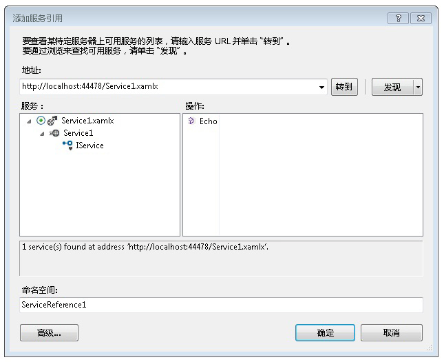
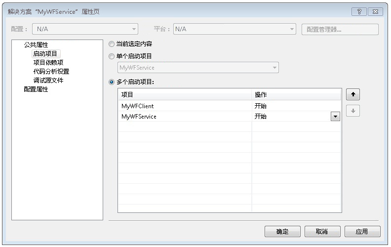

# 如何：从工作流应用程序访问服务
本主题说明如何从工作流控制台应用程序调用工作流服务。需要先完成[如何：使用消息传递活动创建工作流服务](../../../../docs/framework/wcf/feature-details/how-to-create-a-workflow-service-with-messaging-activities.md)主题，才能进行本主题。尽管本主题说明如何从工作流应用程序调用工作流服务，但是，当从工作流应用程序调用任何 [!INCLUDE[indigo1](../../../../includes/indigo1-md.md)] 服务时，同样可以使用相同方法。  
  
### 创建工作流控制台应用程序项目  
  
1.  启动 [!INCLUDE[vs_current_long](../../../../includes/vs-current-long-md.md)]。  
  
2.  加载在[如何：使用消息传递活动创建工作流服务](../../../../docs/framework/wcf/feature-details/how-to-create-a-workflow-service-with-messaging-activities.md)主题中创建的 MyWFService 项目。  
  
3.  右击**“解决方案资源管理器”**中的**“MyWFService”**解决方案，选择**“添加”**，然后选择**“新建项目”**。从项目类型列表的**“已安装的模板”**和**“工作流控制台应用程序”**中，选择**“工作流”**。将项目命名为 MyWFClient 并保存在默认位置，如以下插图所示。  
  
       
  
     单击**“确定”**按钮关闭**“添加新项目”**对话框。  
  
4.  创建项目以后，将在设计器中打开 Workflow1.xaml 文件。单击**“工具箱”**选项卡打开工具箱（如果尚未打开），然后单击图钉保持工具箱窗口打开。  
  
5.  按 Ctrl\+F5 生成并启动服务。与以前一样，将启动 ASP.NET Development Server，并且 Internet Explorer 将显示 WCF 帮助页。请注意该页面的 URI，因为在下一步中，您必须使用它。  
  
       
  
6.  在**“解决方案资源管理器”**中，右击**“MyWFClient”**项目，并选择**“添加服务引用”**。单击**“发现”**按钮搜索任何服务的当前解决方案。在“服务”列表中，单击 Service1.xamlx 旁边的三角形。单击 Service1 旁边的三角形列出由 Service1 服务实现的约定。在**“服务”**列表中，展开**“Service1”**节点。**“操作”**列表中将显示“Echo”操作，如以下插图所示。  
  
       
  
     保留默认命名空间不动，然后单击**“确定”**关闭**“添加服务引用”**对话框。将显示以下对话框。  
  
       
  
     单击**“确定”**关闭对话框。接下来，按 Ctrl\+Shift\+B 生成解决方案。请注意，工具箱中已添加一个名为**“MyWFClient.ServiceReference1.Activities”**的部分。展开此部分，请注意，此时已添加“Echo”活动，如以下插图所示。  
  
       
  
7.  将 <xref:System.ServiceModel.Activities.Sequence> 活动拖放到设计器图面。该活动将位于工具箱的**“控制流”**部分下。  
  
8.  当焦点位于 <xref:System.ServiceModel.Activities.Sequence> 活动时，单击**“变量”**链接，然后添加一个名为 `inString` 的字符串变量。为该变量指定默认值`“Hello, world”`，并指定一个名为 `outString` 的字符串变量，如下图所示。  
  
       
  
9. 将**“Echo”**活动拖放到 <xref:System.ServiceModel.Activities.Sequence> 中。在属性窗口中，将 \_string 参数绑定到 `inString` 变量，并将 `out_string` 参数绑定到 outString 变量，如以下插图所示。这样会将 `inString` 变量的值传入操作中，然后获取返回值，并将返回值放到 `outString` 变量中。  
  
       
  
10. 将**“WriteLine”**活动拖放至**“Echo”**活动下，以显示服务调用返回的字符串。**“WriteLine”**活动位于工具箱中的**“基元”**节点内。在**“WriteLine”**活动上的文本框中键入 `outString`，这样可以将**“WriteLine”**活动的**“Text”**参数绑定到 `outString` 变量。现在，此工作流应该如以下插图所示。  
  
       
  
11. 右击 MyWFService 解决方案，然后选择**“设置启动项目...”**。选中**“多启动项目”**单选按钮，并对**“操作”**列中的每个项目选择**“启动”**，如以下插图所示。  
  
       
  
12. 按 Ctrl\+F5 启动服务和客户端。ASP.NET Development Server 将承载该服务，Internet Explorer 显示 WCF 帮助页，客户端工作流应用程序将在工作台窗口中启动，并且该应用程序显示该服务返回的字符串（“Hello, world”）。  
  
## 请参阅  
 [工作流服务](../../../../docs/framework/wcf/feature-details/workflow-services.md)   
 [如何：使用消息传递活动创建工作流服务](../../../../docs/framework/wcf/feature-details/how-to-create-a-workflow-service-with-messaging-activities.md)   
 [从 Web 项目的工作流中使用 WCF 服务](http://go.microsoft.com/fwlink/?LinkId=207725)