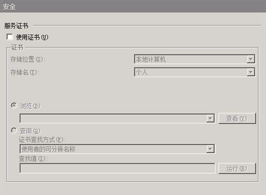
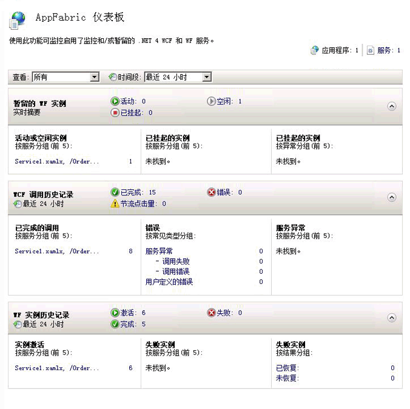

# 如何：使用 Windows Server App Fabric 承载工作流服务
在 App Fabric 中承载工作流服务类似于在 IIS\/WAS 下承载。唯一的区别在于 App Fabric 提供的用于部署、监控和管理工作流服务的工具。本主题使用在[创建长时间运行的工作流服务](../../../../docs/framework/wcf/feature-details/creating-a-long-running-workflow-service.md)中创建的工作流服务。本主题将指导您创建工作流服务。本主题将介绍如何使用 App Fabric 承载工作流服务。[!INCLUDE[crabout](../../../../includes/crabout-md.md)] Windows Server App Fabric 的更多信息，请参见 [Windows Server App Fabric 文档](http://go.microsoft.com/fwlink/?LinkID=193037&clcid=0x804)。完成以下步骤之前，请确保已安装 Windows Server App Fabric。为此，请打开 Internet 信息服务 \(inetmgr.exe\)，在**“连接”**视图中单击您的服务器名称，然后单击**“默认网站”**。在屏幕右侧，您应该会看到名为**“App Fabric”**的部分。如果您看不到这一节（它将右侧窗格的顶部），则表示您还未安装 App Fabric。[!INCLUDE[crabout](../../../../includes/crabout-md.md)]安装 Windows Server App Fabric 的更多信息，请参见[安装 Windows Server AppFabric](http://go.microsoft.com/fwlink/?LinkId=193136)。  
  
### 创建简单工作流服务  
  
1.  打开 [!INCLUDE[vs_current_long](../../../../includes/vs-current-long-md.md)]，并加载您在 [创建长时间运行的工作流服务](../../../../docs/framework/wcf/feature-details/creating-a-long-running-workflow-service.md) 主题中创建的 OrderProcessing 解决方案。  
  
2.  右击**“OrderService”**项目，然后选择**“属性”**和**“Web”**选项卡。  
  
3.  在属性页的**“启动操作”**部分，选择**“特定页”**，并在编辑框中键入 Service1.xamlx。  
  
4.  在属性页的**“服务器”**部分，选择**“使用本地 IIS Web 服务器”**，并键入以下 URL：`http://localhost/OrderService`。  
  
5.  单击**“创建虚拟目录”**按钮。这将新建一个虚拟目录，并将项目设置为在生成项目时将所需文件复制到此虚拟目录。或者，您也可以手动将 .xamlx、web.config 以及任何所需的 DLL 复制到此虚拟目录。  
  
### 配置承载于 Windows Server App Fabric 中的工作流服务  
  
1.  打开 Internet 信息服务管理器 \(inetmgr.exe\)。  
  
2.  在**“连接”**窗格中导航到 OrderService 虚拟目录。  
  
3.  右击 OrderService，并选择**“管理 WCF 和 WF 服务”**、**“配置…”**。将显示**“为应用程序配置 WCF 和 WF”**对话框。  
  
4.  选择**“常规”**选项卡以显示有关应用程序的一般信息，如下面的屏幕快照所示。  
  
       
  
5.  选择**“监控”**选项卡。这将显示各种监控设置，如下面的屏幕快照所示。  
  
       
  
     [!INCLUDE[crabout](../../../../includes/crabout-md.md)]在 App Fabric 中配置工作流服务监控的更多信息，请参见[使用 App Fabric 配置监控](http://go.microsoft.com/fwlink/?LinkId=193153)。  
  
6.  选择**“工作流暂留”**选项卡。这样，您可以将应用程序配置为使用 App Fabric 的默认暂留提供程序，如下面的屏幕快照所示。  
  
       
  
     [!INCLUDE[crabout](../../../../includes/crabout-md.md)]在 Windows Server App Fabric 中配置工作流暂留的更多信息，请参见[在 App Fabric 中配置工作流暂留](http://go.microsoft.com/fwlink/?LinkId=193148)。  
  
7.  选择**“工作流主机管理”**选项卡。这样，您可以指定何时应卸载和暂留空闲的工作流服务实例，如下面的屏幕快照所示。  
  
       
  
     [!INCLUDE[crabout](../../../../includes/crabout-md.md)]工作流主机管理配置的更多信息，请参见[在 App Fabric 中配置工作流主机管理](http://go.microsoft.com/fwlink/?LinkId=193151)。  
  
8.  选择**“自动启动”**选项卡。这样，您可以为应用程序中的工作流服务指定自动启动设置，如下面的屏幕快照所示。  
  
       
  
     [!INCLUDE[crabout](../../../../includes/crabout-md.md)]配置自动启动的更多信息，请参见[使用 App Fabric 配置自动启动](http://go.microsoft.com/fwlink/?LinkId=193150)。  
  
9. 选择**“限制”**选项卡。这样，您可以为工作流服务配置限制设置，如下面的屏幕快照所示。  
  
       
  
     [!INCLUDE[crabout](../../../../includes/crabout-md.md)]配置限制的更多信息，请参见[使用 App Fabric 配置限制](http://go.microsoft.com/fwlink/?LinkId=193149)。  
  
10. 选择**“安全性”**选项卡。这样，您可以为应用程序配置安全设置，如下面的屏幕快照所示。  
  
       
  
     [!INCLUDE[crabout](../../../../includes/crabout-md.md)]使用 Windows Server App Fabric 配置安全性的更多信息，请参见[使用 App Fabric 配置安全性](http://go.microsoft.com/fwlink/?LinkId=193152)。  
  
### 使用 Windows Server App Fabric  
  
1.  生成解决方案以便将所需的文件复制到虚拟目录。  
  
2.  右击 OrderClient 项目，并选择**“调试”**和**“启动新实例”**以启动客户端应用程序。  
  
3.  客户端将运行，并且 Visual Studio 将显示**“附加安全警告”**对话框，请单击**“不附加”**按钮。这会告知 Visual Studio 不要附加到 IIS 进程进行调试。  
  
4.  客户端应用程序将立即调用工作流服务，然后等待。工作流服务将转为空闲暂留状态。通过启动 Internet 信息服务 \(inetmgr.exe\)，在“连接”窗格中导航至 OrderService 并将其选中，可以对此进行验证。接下来，单击右侧窗格中的“App Fabric 仪表板”图标。在“暂留的 WF 实例”下，您将看到存在一个暂留的工作流服务实例，如下面的屏幕快照所示。  
  
       
  
     **“WF 实例历史记录”**列出有关工作流服务的信息，如工作流服务激活次数、工作流服务实例的完成数目和工作流实例的失败数目。在活动或空闲实例下将显示一个链接，单击此链接将显示更多有关空闲工作流实例的信息，如下面的屏幕快照所示。  
  
       
  
     有关 Windows Server App Fabric 功能以及如何使用这些功能的更多信息，请参见 [Windows Server App Fabric 承载功能](http://go.microsoft.com/fwlink/?LinkID=193143&clcid=0x804)  
  
## 请参阅  
 [创建长时间运行的工作流服务](../../../../docs/framework/wcf/feature-details/creating-a-long-running-workflow-service.md)   
 [Windows Server App Fabric 托管功能](http://go.microsoft.com/fwlink/?LinkId=193143)   
 [安装 Windows Server App Fabric](http://go.microsoft.com/fwlink/?LinkId=193136)   
 [Windows Server App Fabric 文档](http://go.microsoft.com/fwlink/?LinkID=193037&clcid=0x804)