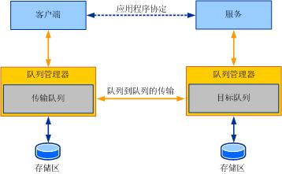

# 在 WCF 中排队
本节描述如何使用 [!INCLUDE[indigo1](../../../../includes/indigo1-md.md)] 中的排队通信。  
  
## 作为 WCF 传输绑定进行排队  
 在 [!INCLUDE[indigo2](../../../../includes/indigo2-md.md)] 中，协定指定要交换的内容。 协定是业务相关或应用程序特定的消息交换。 用于交换消息的机制（或“方式”）在绑定中指定。 [!INCLUDE[indigo2](../../../../includes/indigo2-md.md)] 中的绑定包装消息交换的详细信息。 它们为用户公开配置旋钮以控制绑定所表示的传输或协议的各个方面。 对在 [!INCLUDE[indigo2](../../../../includes/indigo2-md.md)] 中排队的处理方式与其他任何传输绑定类似，这对于很多排队应用程序而言优势巨大。 当今，很多排队应用程序的编写方式不同于其他远程过程调用 (RPC) 样式的分布式应用程序，这使得遵循和维护更加困难。 使用 [!INCLUDE[indigo2](../../../../includes/indigo2-md.md)]，编写分布式应用程序的风格非常相似，能使遵循和维护更为轻松。 而且，将交换机制从业务逻辑中单独分离出来后，就可以更为轻松地配置传输或对其进行更改，而不会影响应用程序特定的代码。 下图演示将 MSMQ 用作传输的 WCF 服务和客户端的结构。  
  
   
  
 如前图所示，客户端和服务必须仅定义应用程序语义，即协定及实现。 服务用首选设置来配置排队绑定。 客户端使用[ServiceModel 元数据实用工具 (Svcutil.exe)](../../../../docs/framework/wcf/servicemodel-metadata-utility-tool-svcutil-exe.md)生成[!INCLUDE[indigo2](../../../../includes/indigo2-md.md)]客户端到服务并生成一个配置文件，描述用于将消息发送到服务的绑定。 因此，若要发送排队消息，客户端需要实例化 [!INCLUDE[indigo2](../../../../includes/indigo2-md.md)] 客户端，并在其上调用操作。 这会导致将消息发送到传输队列，然后再传输到目标队列。 排队通信的所有复杂程度都将从发送和接收消息的应用程序中隐藏。  
  
 关于 [!INCLUDE[indigo2](../../../../includes/indigo2-md.md)] 中的排队绑定的警告包括：  
  
-   所有服务操作必须均为单向，原因是 [!INCLUDE[indigo2](../../../../includes/indigo2-md.md)] 中的默认排队绑定不支持使用队列进行双工通信。 双向通信示例 ([双向通信](../../../../docs/framework/wcf/samples/two-way-communication.md)) 演示了如何使用两个单向协定来实现使用队列进行双工通信。  
  
-   若要生成使用元数据交换的 [!INCLUDE[indigo2](../../../../includes/indigo2-md.md)] 客户端，要求服务上有一个额外的 HTTP 终结点，以便可以对该终结点直接查询，进而生成 [!INCLUDE[indigo2](../../../../includes/indigo2-md.md)] 客户端并获取用于适当配置排队通信的绑定信息。  
  
-   根据排队绑定，要求在 [!INCLUDE[indigo2](../../../../includes/indigo2-md.md)] 外部进行额外配置。 例如，<xref:System.ServiceModel.NetMsmqBinding> 随带的 [!INCLUDE[indigo2](../../../../includes/indigo2-md.md)] 类要求配置绑定并对消息队列 (MSMQ) 进行最低配置。  
  
 后面几节描述 [!INCLUDE[indigo2](../../../../includes/indigo2-md.md)] 附带的基于 MSMQ 的特定排队绑定。  
  
### MSMQ  
 [!INCLUDE[indigo2](../../../../includes/indigo2-md.md)] 中的排队传输使用 MSMQ 进行排队通信。  
  
 MSMQ 作为可选组件随 Windows 提供，并作为 NT 服务运行。 它在传输队列中捕获传输消息，并在目标队列中捕获传递消息。 MSMQ 队列管理器实现可靠的消息传输协议，以使消息不会在传输过程中丢失。 此协议可以是本机的，也可以是基于 SOAP 的，如 SOAP 可靠消息协议 (SRMP)。  
  
 在 MSMQ 中，队列可以是事务性的，也可以是非事务性的。 通过事务性队列，可以在事务中捕获和传递消息，然后将这些消息永久地存储在队列中。 发送至事务性队列的消息仅按顺序传输一次。 可以使用非事务性队列发送可变消息和持久性消息。 发送到非事务性队列的消息不具有任何可靠传输保证，因而消息可能会丢失。  
  
 也可以使用向 Active Directory 目录服务注册的 Windows 标识对 MSMQ 队列进行保护。 安装 MSMQ 时，可以安装 Active Directory 集成，这要求计算机加入 Windows 域网络。  
  
 [!INCLUDE[crabout](../../../../includes/crabout-md.md)]MSMQ，请参阅[安装消息队列 (MSMQ)](../../../../docs/framework/wcf/samples/installing-message-queuing-msmq.md)。  
  
### NetMsmqBinding  
 [ \<NetMsmqBinding >](../../../../docs/framework/configure-apps/file-schema/wcf/netmsmqbinding.md)是排队的绑定[!INCLUDE[indigo2](../../../../includes/indigo2-md.md)]提供两个[!INCLUDE[indigo2](../../../../includes/indigo2-md.md)]终结点使用 MSMQ 进行通信。 因此，该绑定将公开特定于 MSMQ 的属性。 然而，并非所有 MSMQ 功能和属性都在 `NetMsmqBinding` 中公开。 紧凑 `NetMsmqBinding` 设计为具有一组大多数客户都认为足够的最佳功能。  
  
 `NetMsmqBinding` 以绑定上的属性形式阐明了迄今为止所讨论的核心队列概念。 而这些属性又向 MSMQ 传达如何传输和传递消息。 后面几节将讨论属性类别。 [!INCLUDE[crdefault](../../../../includes/crdefault-md.md)]更完整地描述特定属性的概念性主题。  
  
#### ExactlyOnce 和 Durable 属性  
 `ExactlyOnce` 和 `Durable` 属性影响消息在队列之间的传输方式：  
  
-   `ExactlyOnce`：当设置为 `true`（默认值）时，排队通道可确保消息在传递时不会重复， 还可确保消息不会丢失。 如果无法传递消息，或在传递消息前已超过消息的生存时间，则将在死信队列中记录传递失败的消息以及失败原因。 当设置为 `false` 时，排队通道将尽量传输消息。 在这种情况下，可以任意选择一个死信队列。  
  
-   `Durable:`：当设置为 `true`（默认值）时，排队通道确保 MSMQ 将消息永久存储在磁盘上。 因而，如果 MSMQ 服务要停止并重新启动，则磁盘上的消息将传输到目标队列或传递到服务。 当设置为 `false` 时，消息将存储在可变存储区中，而且会在停止并重新启动 MSMQ 服务时丢失。  
  
 对于 `ExactlyOnce` 可靠传输，MSMQ 要求队列是事务性队列。 同时，MSMQ 还需要一个从事务性队列中进行读取的事务。 同样，在使用 `NetMsmqBinding` 时，请记住，如果将 `ExactlyOnce` 设置为 `true`，则需要使用事务来发送或接收消息。 与此类似，MSMQ 要求队列为非事务性队列来实现高效保证，例如，当 `ExactlyOnce` 为 `false` 以及进行可变消息传递时。 因此，将 `ExactlyOnce` 设置为 `false`，或将 durable 设置为 `false` 时，将无法使用事务发送或接收消息。  
  
> [!NOTE]
>  确保基于绑定中的设置创建正确的队列（事务性或非事务性）。 如果 `ExactlyOnce` 为 `true`，则使用事务性队列；否则，使用非事务性队列。  
  
#### 死信队列属性  
 死信队列用于存储传递失败的消息。 用户可以编写补偿逻辑来从死信队列中读取消息。  
  
 很多队列系统都提供系统级死信队列。 MSMQ 为向非事务性队列传递失败的消息提供一个系统级非事务性死信队列，为向事务性队列传递失败的消息提供一个系统级事务性死信队列。  
  
 如果向不同目标队列发送消息的多个客户端共享 MSMQ 服务，则客户端发送的所有消息将转到同一个死信队列。 这并不总是可取的。 为了更好地进行隔离，[!INCLUDE[indigo2](../../../../includes/indigo2-md.md)] 中的 [!INCLUDE[wv](../../../../includes/wv-md.md)] 和 MSMQ 提供了用户可以指定的自定义死信队列（或应用程序特定的死信队列）来存储传递失败的消息。 因此，不同的客户端并不共享同一个死信队列。  
  
 绑定具有两个相关属性：  
  
-   `DeadLetterQueue`：该属性是一个枚举，指示是否请求死信队列。 如果请求某类死信队列，则该枚举还包含这种死信队列。 该属性的值为 `None`、`System` 和 `Custom`。 [!INCLUDE[crabout](../../../../includes/crabout-md.md)]这些属性的解释，请参阅[使用死信队列的处理消息传输失败](../../../../docs/framework/wcf/feature-details/using-dead-letter-queues-to-handle-message-transfer-failures.md)  
  
-   `CustomDeadLetterQueue`：该属性是应用程序特定死信队列的统一资源标识符 (URI) 地址。 如果这是必需`DeadLetterQueue`。`Custom` 选择。  
  
#### 病毒消息处理属性  
 当服务从事务中的目标队列读取消息时，服务可能由于种种原因而无法处理消息。 然后，将消息放回队列以备再次读取。 若要处理反复失败的消息，可以在绑定中配置一组病毒消息处理属性。 有如下四个属性：`ReceiveRetryCount`、`MaxRetryCycles`、`RetryCycleDelay` 和 `ReceiveErrorHandling`。 [!INCLUDE[crabout](../../../../includes/crabout-md.md)]这些属性，请参阅[的病毒消息处理](../../../../docs/framework/wcf/feature-details/poison-message-handling.md)。  
  
#### 安全属性  
 MSMQ 公开其自己的安全模型，如队列上的访问控制列表 (ACL) 或发送经过验证身份的消息。 `NetMsmqBinding` 将这些安全属性作为其传输安全设置的一部分而公开。 绑定中有两个用于传输安全的属性：`MsmqAuthenticationMode` 和 `MsmqProtectionLevel`。 这些属性中的设置取决于 MSMQ 的配置方式。 [!INCLUDE[crdefault](../../../../includes/crdefault-md.md)][使用传输安全保护消息](../../../../docs/framework/wcf/feature-details/securing-messages-using-transport-security.md)。  
  
 除了传输安全，实际的 SOAP 消息本身也可以使用消息安全来进行保护。 [!INCLUDE[crdefault](../../../../includes/crdefault-md.md)][使用消息安全保护消息](../../../../docs/framework/wcf/feature-details/securing-messages-using-message-security.md)。  
  
 `MsmqTransportSecurity` 还公开两个属性，即 `MsmqEncryptionAlgorithm` 和 `MsmqHashAlgorithm`。 这些是要为消息的队列到队列传输加密和签名的哈希选择的不同算法的枚举。  
  
#### 其他属性  
 除了上述各属性，在绑定中公开的其他 MSMQ 特定的属性还包括：  
  
-   `UseSourceJournal`：指示打开源日记记录的属性。 源日记记录是一项 MSMQ 功能，用于跟踪从传输队列成功传输的消息。  
  
-   `UseMsmqTracing`：指示打开 MSMQ 跟踪的属性。 每当消息离开或到达承载 MSMQ 队列管理器的计算机时，MSMQ 跟踪都会向报告队列发送报告消息。  
  
-   `QueueTransferProtocol`：要用于队列到队列的消息传输的协议的枚举。 MSMQ 实现本机队列到队列的传输协议和称为 SOAP 可靠消息传输协议 (SRMP) 的基于 SOAP 的协议。 当使用 HTTP 传输进行队列到队列的传输时将使用 SRMP。 当使用 HTTPS 进行队列到队列的传输时将使用 SRMP 安全。  
  
-   `UseActiveDirectory`：一个布尔值，指示是否必须使用 Active Directory 进行队列地址解析。 默认情况下，此功能处于关闭状态。 [!INCLUDE[crdefault](../../../../includes/crdefault-md.md)][服务终结点和队列寻址](../../../../docs/framework/wcf/feature-details/service-endpoints-and-queue-addressing.md)。  
  
### MsmqIntegrationBinding  
 当希望 `MsmqIntegrationBinding` 终结点与用 C、C++、COM 或 System.Messaging API 编写的现有 MSMQ 应用程序通信时，请使用 [!INCLUDE[indigo2](../../../../includes/indigo2-md.md)]。  
  
 对于 `NetMsmqBinding`，绑定属性基本相同。 不过，存在以下差异：  
  
-   将 `MsmqIntegrationBinding` 的操作协定限制为采用一个类型为 <xref:System.ServiceModel.MsmqIntegration.MsmqMessage%601> 的参数，其中类型参数为正文类型。  
  
-   很多 MSMQ 本机消息属性都在 <xref:System.ServiceModel.MsmqIntegration.MsmqMessage%601> 中公开以供使用。  
  
-   为帮助对消息正文进行序列化和反序列化，提供了若干序列化程序，如 XML 和 ActiveX。  
  
### 代码示例  
 有关编写使用 MSMQ 的 WCF 服务的分步指导，请参见下列主题：  
  
-   [如何： 与 WCF 终结点交换消息和消息队列应用程序](../../../../docs/framework/wcf/feature-details/how-to-exchange-messages-with-wcf-endpoints-and-message-queuing-applications.md)  
  
-   [如何： 交换排队消息的 WCF 终结点](../../../../docs/framework/wcf/feature-details/how-to-exchange-queued-messages-with-wcf-endpoints.md)  
  
 有关说明 MSMQ 在 WCF 中的用法的完整代码示例，请参见下列主题：  
  
-   [事务处理的 MSMQ 绑定](../../../../docs/framework/wcf/samples/transacted-msmq-binding.md)  
  
-   [可变排队通信](../../../../docs/framework/wcf/samples/volatile-queued-communication.md)  
  
-   [死信队列](../../../../docs/framework/wcf/samples/dead-letter-queues.md)  
  
-   [会话和队列](../../../../docs/framework/wcf/samples/sessions-and-queues.md)  
  
-   [双向通信](../../../../docs/framework/wcf/samples/two-way-communication.md)  
  
-   [事务处理批处理](../../../../docs/framework/wcf/samples/transacted-batching.md)  
  
-   [SRMP](../../../../docs/framework/wcf/samples/srmp.md)  
  
-   [通过消息队列的消息安全](../../../../docs/framework/wcf/samples/message-security-over-message-queuing.md)  
  
## 另请参阅  
 [服务终结点和队列寻址](../../../../docs/framework/wcf/feature-details/service-endpoints-and-queue-addressing.md)  
 [承载排队应用程序的 web](../../../../docs/framework/wcf/feature-details/web-hosting-a-queued-application.md)
