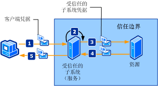

# 受信任的子系统
客户端访问分布在网络上的一个或多个 Web 服务。Web 服务的设计使对其他资源（比如数据库或其他 Web 服务）的访问包装在 Web 服务的企业逻辑中。必须保护这些资源不受到未经授权的访问。下图描述了一个受信任的子系统过程。  
  
   
  
 以下步骤说明如图所示的受信任子系统过程：  
  
1.  客户端向受信任的子系统随凭据一起提交请求。  
  
2.  受信任的子系统对用户进行身份验证和授权。  
  
3.  受信任的子系统向远程资源发送请求消息。此请求伴随受信任子系统（或在其下执行受信任子系统过程的服务帐户）的凭据。  
  
4.  后端资源对受信任子系统进行身份验证和授权。然后处理请求并对受信任子系统发出响应。  
  
5.  受信任子系统处理响应并对客户端发出其自己的响应。  
  
|特征|说明|  
|--------|--------|  
|安全模式|消息|  
|互操作性|仅 [!INCLUDE[indigo1](../../../../includes/indigo1-md.md)]。|  
|身份验证（服务）|安全令牌服务对客户端进行身份验证和授权。|  
|身份验证（客户端）|受信任子系统对客户端进行身份验证，资源对受信任子系统服务进行身份验证。|  
|完整性|是|  
|保密性|是|  
|传输|客户端和受信任子系统服务之间采用 HTTP。<br /><br /> 受信任子系统服务和资源（后端服务）之间采用 NET.TCP。|  
|绑定|<xref:System.ServiceModel.WSHttpBinding> 以及<xref:System.ServiceModel.NetTcpBinding>[\<wsFederationHttpBinding\>](../../../../docs/framework/configure-apps/file-schema/wcf/wsfederationhttpbinding.md)|  
  
## 资源（后端服务）  
  
### 代码  
 下面的代码演示如何创建资源的服务终结点，该服务终结点使用 TCP 上的传输安全传输协议。  
  
 [!code-csharp[TrustedSubSystemsResource#1](../../../../samples/snippets/csharp/VS_Snippets_CFX/trustedsubsystemsresource/cs/source.cs#1)]
 [!code-vb[TrustedSubSystemsResource#1](../../../../samples/snippets/visualbasic/VS_Snippets_CFX/trustedsubsystemsresource/vb/source.vb#1)]  
  
### 配置  
 下面的配置使用配置设置相同的终结点。  
  
```  
<?xml version="1.0" encoding="utf-8" ?>  
<configuration>  
  <system.serviceModel>  
    <services>  
      <service name="Microsoft.ServiceModel.Samples.BackendService"  
               behaviorConfiguration="BackendServiceBehavior">  
        <endpoint address="net.tcp://localhost.com:8001/BackendService"  
                  binding="customBinding"  
                  bindingConfiguration="Binding1"  
                  contract="Microsoft.ServiceModel.Samples.ICalculator"/>  
      </service>  
    </services>  
    <bindings>  
      <customBinding>  
        <binding name="Binding1">  
          <security authenticationMode="UserNameOverTransport"/>  
          <windowsStreamSecurity/>  
          <tcpTransport/>  
        </binding>  
      </customBinding>  
    </bindings>  
    <behaviors>  
      <serviceBehaviors>  
        <behavior name="BackendServiceBehavior">  
          <serviceCredentials>  
            <userNameAuthentication userNamePasswordValidationMode="Custom"  
                                    customUserNamePasswordValidatorType="Microsoft.ServiceModel.Samples.MyUserNamePasswordValidator, BackendService"/>  
          </serviceCredentials>  
        </behavior>  
      </serviceBehaviors>  
    </behaviors>  
  </system.serviceModel>  
</configuration>  
```  
  
## 受信任的子系统  
  
### 代码  
 下面的代码演示如何创建受信任子系统的服务终结点，该服务终结点使用 HTTP 上的消息安全协议以及用户名和密码进行身份验证。  
  
 [!code-csharp[TrustedSubSystems#1](../../../../samples/snippets/csharp/VS_Snippets_CFX/trustedsubsystems/cs/source.cs#1)]
 [!code-vb[TrustedSubSystems#1](../../../../samples/snippets/visualbasic/VS_Snippets_CFX/trustedsubsystems/vb/source.vb#1)]  
  
 下面的代码演示受信任子系统中使用 TCP 上的传输安全传输协议与后端服务进行通信的服务。  
  
 [!code-csharp[TrustedSubSystems#2](../../../../samples/snippets/csharp/VS_Snippets_CFX/trustedsubsystems/cs/source.cs#2)]
 [!code-vb[TrustedSubSystems#2](../../../../samples/snippets/visualbasic/VS_Snippets_CFX/trustedsubsystems/vb/source.vb#2)]  
  
### 配置  
 下面的配置使用配置设置相同的终结点。注意有两个绑定：一个用于保证承载于受信任子系统中的服务的安全，另一个用于在受信任子系统和后端服务之间进行通信。  
  
```  
<?xml version="1.0" encoding="utf-8" ?>  
<configuration>  
  <system.serviceModel>  
    <services>  
      <service name="Microsoft.ServiceModel.Samples.FacadeService"  
               behaviorConfiguration="FacadeServiceBehavior">  
        <host>  
          <baseAddresses>  
            <add baseAddress="http://localhost:8000/FacadeService"/>  
          </baseAddresses>  
        </host>  
        <endpoint address="http://localhost:8000/FacadeService"  
                  binding="wsHttpBinding"  
                  bindingConfiguration="Binding1"  
                  contract="Microsoft.ServiceModel.Samples.ICalculator"/>  
      </service>  
    </services>  
    <client>  
      <endpoint name=""   
                address="net.tcp://contoso.com:8001/BackendService"  
                binding="customBinding"  
                bindingConfiguration="ClientBinding"  
                contract="Microsoft.ServiceModel.Samples.ICalculator"/>  
    </client>  
    <bindings>  
      <wsHttpBinding>  
        <binding name="Binding1">  
          <security mode="Message">  
            <message clientCredentialType="UserName"/>  
          </security>  
        </binding>  
      </wsHttpBinding>  
      <customBinding>  
        <binding name="ClientBinding">  
          <security authenticationMode="UserNameOverTransport"/>  
          <windowsStreamSecurity/>  
          <tcpTransport/>  
        </binding>  
      </customBinding>  
    </bindings>  
    <behaviors>  
      <serviceBehaviors>  
        <behavior name="FacadeServiceBehavior">  
          <serviceMetadata httpGetEnabled="True"/>  
          <serviceCredentials>  
            <serviceCertificate findValue="Contoso.com"  
                                storeLocation="LocalMachine"  
                                storeName="My"  
                                x509FindType="FindBySubjectName" />  
            <userNameAuthentication userNamePasswordValidationMode="Custom"  
                                    customUserNamePasswordValidatorType="Microsoft.ServiceModel.Samples.MyUserNamePasswordValidator, FacadeService"/>  
          </serviceCredentials>  
        </behavior>  
      </serviceBehaviors>  
    </behaviors>  
  </system.serviceModel>  
</configuration>  
```  
  
## 客户端  
  
### 代码  
 下面的代码演示如何创建与受信任子系统进行通信的客户端，该客户端使用 HTTP 上的消息安全协议以及用户名和密码进行身份验证。  
  
 [!code-csharp[TrustedSubSystemsClient#1](../../../../samples/snippets/csharp/VS_Snippets_CFX/trustedsubsystemsclient/cs/source.cs#1)]
 [!code-vb[TrustedSubSystemsClient#1](../../../../samples/snippets/visualbasic/VS_Snippets_CFX/trustedsubsystemsclient/vb/source.vb#1)]  
  
### 配置  
 下面的代码将客户端配置成使用 HTTP 上的消息安全协议以及用户名和密码进行身份验证。用户名和密码只能使用代码指定（不可配置）。  
  
```  
<?xml version="1.0" encoding="utf-8" ?>  
<configuration>  
  <system.serviceModel>  
    <client>  
        <endpoint name=""   
                  address="http://www.cohowinery.com:8000/FacadeService"  
                  binding="wsHttpBinding"  
                  bindingConfiguration="Binding1"  
                  behaviorConfiguration="ClientUserNameBehavior"  
                  contract="Microsoft.ServiceModel.Samples.ICalculator"/>  
    </client>  
    <bindings>  
      <wsHttpBinding>  
        <binding name="Binding1">  
          <security mode="Message">  
            <message clientCredentialType="UserName"/>  
          </security>  
        </binding>  
      </wsHttpBinding>  
    </bindings>  
    <behaviors>  
      <endpointBehaviors>  
        <behavior name="ClientUserNameBehavior">  
          <clientCredentials>  
            <serviceCertificate>  
              <authentication certificateValidationMode="PeerOrChainTrust"/>  
            </serviceCertificate>  
          </clientCredentials>  
        </behavior>  
      </endpointBehaviors>  
    </behaviors>  
  </system.serviceModel>  
</configuration>  
```  
  
## 请参阅  
 [安全性概述](../../../../docs/framework/wcf/feature-details/security-overview.md)   
 [Windows Server App Fabric 的安全模型](http://go.microsoft.com/fwlink/?LinkID=201279&clcid=0x804)