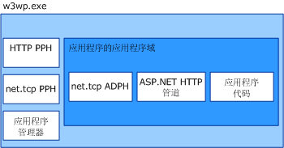

# <a name="was-activation-architecture"></a>WAS 激活体系结构
本主题详细列举和讨论了 Windows 进程激活服务（也称为 WAS）的组件。  
  
## <a name="activation-components"></a>激活组件  
 WAS 由几个体系结构组件组成：  
  
-   侦听器适配器。 通过特定的网络协议接收消息并与 WAS 进行通信以将传入消息路由到正确的辅助进程中的 Windows 服务。  
  
-   WAS。 管理工作进程的创建和生存期的 Windows 服务。  
  
-   一般辅助进程可执行程序 (w3wp.exe)。  
  
-   应用程序管理器。 管理在辅助进程中承载应用程序的应用程序域的创建和生存期。  
  
-   协议处理程序。 在辅助进程中运行并管理辅助进程与各个侦听器适配器之间的通信的协议特定的组件。 存在两种类型的协议处理程序：进程协议处理程序和 AppDomain 协议处理程序。  
  
 当 WAS 激活辅助进程实例时，会将所需的进程协议处理程序加载到辅助进程中，并使用应用程序管理器来创建一个应用程序域以承载应用程序。 应用程序域将加载应用程序的代码以及应用程序使用的网络协议所要求的 AppDomain 协议处理程序。  
  
   
  
### <a name="listener-adapters"></a>侦听器适配器  
 侦听器适配器是一些单独的 Windows 服务，这些服务可以实现用于通过其侦听的网络协议接收消息的网络通信逻辑。 下表列出了 Windows Communication Foundation (WCF) 协议的侦听器适配器。  
  
|侦听器适配器服务名称|协议|说明|  
|-----------------------------------|--------------|-----------|  
|W3SVC|http|提供有关 IIS 7.0 和 WCF HTTP 激活的常见组件。|  
|NetTcpActivator|net.tcp|取决于 NetTcpPortSharing 服务。|  
|NetPipeActivator|net.pipe||  
|NetMsmqActivator|net.msmq|与基于 WCF 的消息队列应用程序一起使用。|  
|NetMsmqActivator|msmq.formatname|提供与现有消息队列应用程序的向后兼容性。|  
  
 在安装过程中，在 applicationHost.config 文件中注册特定协议的侦听器适配器，如下面的 XML 示例中所示。  
  
```xml  
<system.applicationHost>  
    <listenerAdapters>  
        <add name="http" />  
        <add name="net.tcp"   
          identity="S-1-5-80-3579033775-2824656752-1522793541-1960352512-462907086" />  
         <add name="net.pipe"   
           identity="S-1-5-80-2943419899-937267781-4189664001-1229628381-3982115073" />  
          <add name="net.msmq"   
            identity="S-1-5-80-89244771-1762554971-1007993102-348796144-2203111529" />  
           <add name="msmq.formatname"   
             identity="S-1-5-80-89244771-1762554971-1007993102-348796144-2203111529" />  
    </listenerAdapters>  
</system.applicationHost>  
```  
  
### <a name="protocol-handlers"></a>协议处理程序  
 在计算机级别的 Web.config 文件中注册特定协议的进程和 AppDomain 协议处理程序。  
  
```xml  
<system.web>  
   <protocols>  
      <add name="net.tcp"   
        processHandlerType=  
         "System.ServiceModel.WasHosting.TcpProcessProtocolHandler"  
        appDomainHandlerType=  
         "System.ServiceModel.WasHosting.TcpAppDomainProtocolHandler"  
        validate="false" />  
      <add name="net.pipe"   
        processHandlerType=  
         "System.ServiceModel.WasHosting.NamedPipeProcessProtocolHandler"  
          appDomainHandlerType=  
           "System.ServiceModel.WasHosting.NamedPipeAppDomainProtocolHandler"/>  
      <add name="net.msmq"  
        processHandlerType=  
         "System.ServiceModel.WasHosting.MsmqProcessProtocolHandler"  
        appDomainHandlerType=  
         "System.ServiceModel.WasHosting.MsmqAppDomainProtocolHandler"  
        validate="false" />  
   </protocols>  
</system.web>  
```  
  
## <a name="see-also"></a>请参阅  
 [配置 WAS 以用于 WCF](../../../../docs/framework/wcf/feature-details/configuring-the-wpa--service-for-use-with-wcf.md)  
 [Windows Server App Fabric 承载功能](https://go.microsoft.com/fwlink/?LinkId=201276)
