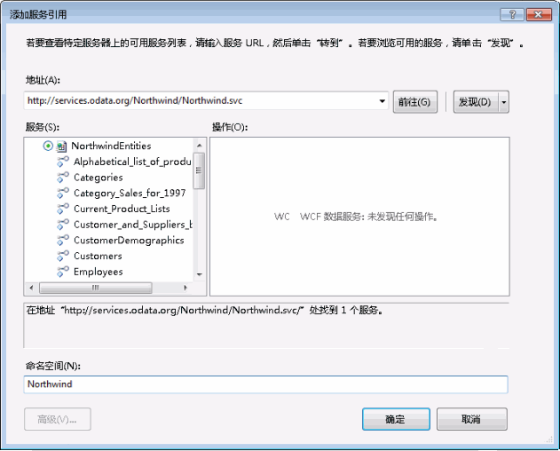

# 使用工作流中的 OData 源
WCF 数据服务是 [!INCLUDE[dnprdnshort](../../../includes/dnprdnshort-md.md)] 的一个组件，可以使用此组件创建一些服务，利用开放式数据协议 (OData) 来借助具象状态传输 (REST) 语义通过 Web 或 Intranet 公开和使用数据。 OData 将数据公开为可通过 URI 进行寻址的资源。 如果任一应用程序可发送 HTTP 请求并处理数据服务返回的 OData 源，则该应用程序可与基于 OData 的数据服务进行交互。 此外，WCF 数据服务包括多个客户端库，当从 [!INCLUDE[dnprdnshort](../../../includes/dnprdnshort-md.md)] 应用程序使用 OData 源时，这些客户端库会提供更丰富的编程体验。 本主题概述如何在使用/未使用客户端库的情况下，在工作流中使用 OData 源。  
  
## 使用示例 Northwind OData 服务  
 本主题中的示例使用示例 Northwind 数据服务[ http://services.odata.org/Northwind/Northwind.svc/ ](http://go.microsoft.com/fwlink/?LinkID=187426)。 此服务作为 [OData SDK](http://go.microsoft.com/fwlink/?LinkID=185248) 的一部分提供，它提供了对示例 Northwind 数据库的只读访问。 如果需要写权限或需要本地 WCF 数据服务，可按照 [WCF 数据服务快速入门](http://go.microsoft.com/fwlink/?LinkID=131076) 中的步骤执行操作，以创建可提供对 Northwind 数据库的访问的本地 OData 服务。 如果按照该快速入门中的步骤执行操作，则会用本地 URI 代替本主题中的代码示例中提供的 URI。  
  
## 通过客户端库使用 OData 源  
 WCF 数据服务包括一些客户端库，使您能够通过 [!INCLUDE[dnprdnshort](../../../includes/dnprdnshort-md.md)] 和客户端应用程序更轻松地使用 OData 源。 这些库简化了 HTTP 消息的发送和接收。 它们还可将消息负载转换为代表实体数据的 CLR 对象。 客户端库具有两个核心类 <xref:System.Data.Services.Client.DataServiceContext> 和 <xref:System.Data.Services.Client.DataServiceQuery%601>。 通过使用这些类，可以查询数据服务，然后作为 CLR 对象使用返回的实体数据。 本节介绍了用于创建使用客户端库的活动的两种方法。  
  
### 添加对 WCF 数据服务的服务引用  
 若要生成 Northwind 客户端库，可使用 **中的** “添加服务引用” [!INCLUDE[vs_current_long](../../../includes/vs-current-long-md.md)] 对话框添加对 Northwind OData 服务的引用。  
  
   
  
 请注意，此服务未公开任何服务操作，并且 **“服务”** 列表中包含表示由 Northwind 数据服务公开的实体的项目。 在添加服务引用时，将为这些实体生成类，并可在客户端代码中使用生成的类。 本主题中的示例使用这些类和 `NorthwindEntities` 类来执行查询。  
  
> [!NOTE]
>  有关详细信息，请参阅[生成数据服务客户端库 （WCF 数据服务）](http://go.microsoft.com/fwlink/?LinkID=191611)。  
  
### 使用异步方法  
 若要解决在通过 Web 访问资源时可能发生的延迟问题，建议您异步访问 WCF 数据服务。 WCF 数据服务客户端库包括用于调用查询的异步方法和 Windows Workflow Foundation (WF) 提供<xref:System.Activities.AsyncCodeActivity>用于创作异步活动的类。 可写入<xref:System.Activities.AsyncCodeActivity> 派生的活动以利用具有异步方法的 [!INCLUDE[dnprdnshort](../../../includes/dnprdnshort-md.md)] 类，或者可将要异步执行的代码放入某个方法中并使用委托进行调用。 本节提供了 <xref:System.Activities.AsyncCodeActivity> 派生的活动的两个示例；一个示例使用 WCF 数据服务客户端库的异步方法，另一个示例使用委托。  
  
> [!NOTE]
>  有关详细信息，请参阅[异步操作 （WCF 数据服务）](http://go.microsoft.com/fwlink/?LinkId=193396)和[创建异步活动](../../../docs/framework/windows-workflow-foundation/creating-asynchronous-activities-in-wf.md)。  
  
### 使用客户端库异步方法  
 <xref:System.Data.Services.Client.DataServiceQuery%601> 类提供 <xref:System.Data.Services.Client.DataServiceQuery%601.BeginExecute%2A> 和 <xref:System.Data.Services.Client.DataServiceQuery%601.EndExecute%2A> 方法来异步查询 OData 服务。 这些方法可从 <xref:System.Activities.AsyncCodeActivity.BeginExecute%2A> 派生的类的 <xref:System.Activities.AsyncCodeActivity.EndExecute%2A> 和 <xref:System.Activities.AsyncCodeActivity> 重写调用。 当 <xref:System.Activities.AsyncCodeActivity> <xref:System.Activities.AsyncCodeActivity.BeginExecute%2A> 重写返回时，工作流会进入空闲状态（但不保持）；当完成异步工作时，运行时将调用 <xref:System.Activities.AsyncCodeActivity.EndExecute%2A> 。  
  
 下面的示例中定义了一个含有两个输入参数的 `OrdersByCustomer` 活动。 `CustomerId` 参数表示标识要返回的订单的客户，`ServiceUri` 参数表示要查询的 OData 服务的 URI。 由于活动派生自 `AsyncCodeActivity<IEnumerable<Order>>` ，因此还有一个用于返回查询结果的 <xref:System.Activities.Activity%601.Result%2A> 输出参数。 <xref:System.Activities.AsyncCodeActivity.BeginExecute%2A> 重写创建了一个用于选择指定客户的所有订单的 LINQ 查询。 此查询将指定为已传递的 <xref:System.Activities.AsyncCodeActivityContext.UserState%2A> 的 <xref:System.Activities.AsyncCodeActivityContext>，然后将调用此查询的 <xref:System.Data.Services.Client.DataServiceQuery%601.BeginExecute%2A> 方法。 请注意，传递到查询的 <xref:System.Data.Services.Client.DataServiceQuery%601.BeginExecute%2A> 中的回调和状态是传递到活动的 <xref:System.Activities.AsyncCodeActivity.BeginExecute%2A> 方法中的回调和状态。 在执行完查询后，将调用 <xref:System.Activities.AsyncCodeActivity.EndExecute%2A> 方法。 从 <xref:System.Activities.AsyncCodeActivityContext.UserState%2A>中检索查询，然后调用查询的 <xref:System.Data.Services.Client.DataServiceQuery%601.EndExecute%2A> 方法。 此方法将返回指定的实体类型的 <xref:System.Collections.Generic.IEnumerable%601> ；此示例中为 `Order`。 由于 `IEnumerable<Order>` 是 <xref:System.Activities.AsyncCodeActivity%601>的泛型类型，因此 `IEnumerable` 将设置为活动的 <xref:System.Activities.Activity%601.Result%2A> <xref:System.Activities.OutArgument%601> 。  
  
 [!code-csharp[CFX_WCFDataServicesActivityExample#100](../../../samples/snippets/csharp/VS_Snippets_CFX/CFX_WCFDataServicesActivityExample/cs/Program.cs#100)]  
  
 在下面的示例中， `OrdersByCustomer` 活动将检索指定客户的订单列表，然后 <xref:System.Activities.Statements.ForEach%601> 活动将枚举返回的订单并将每份订单的日期写入控制台。  
  
 [!code-csharp[CFX_WCFDataServicesActivityExample#10](../../../samples/snippets/csharp/VS_Snippets_CFX/CFX_WCFDataServicesActivityExample/cs/Program.cs#10)]  
  
 调用该工作流时，会将以下数据写入控制台：  
  
 **Calling WCF Data Service...**  
**8/25/1997**   
**10/3/1997**   
**10/13/1997**   
**1/15/1998**   
**3/16/1998**   
**4/9/1998**    
> [!NOTE]
>  如果无法建立与 OData 服务器的连接，则您将收到与以下异常类似的异常：  
>   
>  未经处理的异常: System.InvalidOperationException: 处理此请求时出错。 ---> System.Net.WebException: 无法连接到远程服务器 ---> System.Net.Sockets.SocketException: 连接方在一段时间后未正确响应而导致连接尝试失败，或者连接的主机未能响应而导致已建立的连接失败。  
  
 如果需要对查询返回的数据进行任何其他处理，则可在活动的 <xref:System.Activities.AsyncCodeActivity%601.EndExecute%2A> 重写中执行此操作。 <xref:System.Activities.AsyncCodeActivity%601.BeginExecute%2A> 和 <xref:System.Activities.AsyncCodeActivity%601.EndExecute%2A> 都是通过使用工作流线程调用的，并且这些重写中的任何代码都不会异步运行。 如果其他处理的量很大或运行时间较长，或者查询结果已分页，则应考虑下一节中讨论的方法，该方法使用委托来执行查询并异步执行其他处理。  
  
### 使用委托  
 除了调用 [!INCLUDE[dnprdnshort](../../../includes/dnprdnshort-md.md)] 类的异步方法之外，基于 <xref:System.Activities.AsyncCodeActivity>的活动还可定义其某个方法中的异步逻辑。 此方法是通过使用活动的 <xref:System.Activities.AsyncCodeActivity.BeginExecute%2A> 重写中的委托来指定的。 当此方法返回时，运行时将调用活动的 <xref:System.Activities.AsyncCodeActivity.EndExecute%2A> 重写。 当从工作流调用 OData 服务时，此方法可用于查询服务和提供任何其他处理。  
  
 下面的示例定义了一个 `ListCustomers` 活动。 此活动将查询示例 Northwind 数据服务并返回一个包含 Northwind 数据库中的所有客户的 `List<Customer>` 。 异步工作由 `GetCustomers` 方法执行。 此方法将查询所有客户的服务，然后将这些客户复制到 `List<Customer>`。 然后，此方法会检查结果是否已分页。 如果结果已分页，则此方法会查询下一页结果的服务，再将这些结果添加到列表，然后继续操作直到检索到所有客户数据。  
  
> [!NOTE]
>  有关 WCF Data Services 中的分页的详细信息，请参阅。 [如何：加载分页结果（WCF 数据服务）](http://go.microsoft.com/fwlink/?LinkId=193452)。  
  
 在添加所有客户后，将返回该列表。 活动的 `GetCustomers` 重写中指定了 <xref:System.Activities.AsyncCodeActivity.BeginExecute%2A> 方法。 由于该方法具有一个返回值，因此将创建一个 `Func<string, List<Customer>>` 来指定该方法。  
  
> [!NOTE]
>  如果执行异步工作的方法不具有返回值，则使用 <xref:System.Action> 而非 <!--zz <xref:System.Func> --> `System.Func`。 创建异步示例使用这两种方法的示例，请参阅[创建异步活动](../../../docs/framework/windows-workflow-foundation/creating-asynchronous-activities-in-wf.md)。  
  
 将此 <!--zz <xref:System.Func> --> `System.Func` 分配给 <xref:System.Activities.AsyncCodeActivityContext.UserState%2A>，然后调用 `BeginInvoke` 。 由于要调用的方法无法访问活动的参数环境，因此 `ServiceUri` 参数的值将作为第一个参数与已传入 <xref:System.Activities.AsyncCodeActivity.BeginExecute%2A>中的回调和状态一起传递。 当 `GetCustomers` 返回时，运行时将调用 <xref:System.Activities.AsyncCodeActivity.EndExecute%2A>。 <xref:System.Activities.AsyncCodeActivity.EndExecute%2A> 中的代码将从 <xref:System.Activities.AsyncCodeActivityContext.UserState%2A>中检索委托，调用 `EndInvoke`并返回结果，该结果是从 `GetCustomers` 方法返回的客户列表。  
  
 [!code-csharp[CFX_WCFDataServicesActivityExample#200](../../../samples/snippets/csharp/VS_Snippets_CFX/CFX_WCFDataServicesActivityExample/cs/Program.cs#200)]  
  
 在下面的示例中， `ListCustomers` 活动将检索一个客户列表，然后 <xref:System.Activities.Statements.ForEach%601> 活动将枚举这些客户并将每个客户的公司名称和联系人姓名写入控制台。  
  
 [!code-csharp[CFX_WCFDataServicesActivityExample#20](../../../samples/snippets/csharp/VS_Snippets_CFX/CFX_WCFDataServicesActivityExample/cs/Program.cs#20)]  
  
 调用此工作流时，会将以下数据写入控制台。 由于此查询返回了多个客户，因此这里只显示部分输出。  
  
 **Calling WCF Data Service...**  
**Alfreds Futterkiste, Contact: Maria Anders**   
**Ana Trujillo Emparedados y helados, Contact: Ana Trujillo**   
**Antonio Moreno Taquería，联系人： Antonio Moreno**   
**Around the Horn, Contact: Thomas Hardy**   
**Berglunds snabbköp，联系人： Christina Berglund**   
**...**    
## 在不使用客户端库的情况下使用 OData 源  
 OData 将数据公开为可通过 URI 进行寻址的资源。 在使用客户端库时，将为您创建这些 URI，但您不必使用客户端库。 如果需要，可在不使用客户端库的情况下直接访问 OData 服务。 当不使用客户端库时，服务的位置和所需数据将由 URI 指定，并将返回结果以响应 HTTP 请求。 然后，可按所需方式处理或操作此原始数据。 检索 OData 查询的结果的一种方法是使用 <xref:System.Net.WebClient> 类。 在此示例中，将检索由键 ALFKI 表示的客户的联系人姓名。  
  
 [!code-csharp[CFX_WCFDataServicesActivityExample#2](../../../samples/snippets/csharp/VS_Snippets_CFX/CFX_WCFDataServicesActivityExample/cs/Program.cs#2)]  
  
 在运行此代码时，会将以下输出显示到控制台：  
  
 **返回的原始数据：**  
**\<？ xml 版本 ="1.0"encoding ="utf-8"独立 ="yes"？ >**   
**\<ContactName xmlns ="http://schemas.microsoft.com/ado/2007/08/dataservices"> Maria Anders\</ContactName >** 在工作流中此示例中的代码无法合并到<xref:System.Activities.CodeActivity.Execute%2A>的重写<xref:System.Activities.CodeActivity>-基于自定义活动，但相同此外可以通过使用实现的功能<xref:System.Activities.Expressions.InvokeMethod%601>活动。 利用 <xref:System.Activities.Expressions.InvokeMethod%601> 活动，工作流作者可调用类的静态和实例方法，并可选择异步调用指定方法。 在下面的示例中，将配置 <xref:System.Activities.Expressions.InvokeMethod%601> 活动以调用 <xref:System.Net.WebClient.DownloadString%2A> 类的 <xref:System.Net.WebClient> 方法并返回一个客户列表。  
  
 [!code-csharp[CFX_WCFDataServicesActivityExample#3](../../../samples/snippets/csharp/VS_Snippets_CFX/CFX_WCFDataServicesActivityExample/cs/Program.cs#3)]  
  
 <xref:System.Activities.Expressions.InvokeMethod%601> 可调用类的静态和实例方法。 由于 <xref:System.Net.WebClient.DownloadString%2A> 是 <xref:System.Net.WebClient> 类的一个实例方法，因此将为 <xref:System.Net.WebClient> 指定 <xref:System.Activities.Expressions.InvokeMethod%601.TargetObject%2A>类的一个新实例。 `DownloadString` 将指定为 <xref:System.Activities.Expressions.InvokeMethod%601.MethodName%2A>，将在 <xref:System.Activities.Expressions.InvokeMethod%601.Parameters%2A> 集合中指定包含查询的 URI，并会将返回值分配给 <xref:System.Activities.Activity%601.Result%2A> 值。 <xref:System.Activities.Expressions.InvokeMethod%601.RunAsynchronously%2A> 值将设置为 `true`，这意味着方法调用将根据工作流异步运行。 在下面的示例中，将构造一个工作流（该工作流使用 <xref:System.Activities.Expressions.InvokeMethod%601> 活动来查询特定客户的订单列表的示例 Northwind 数据服务），然后将返回的数据写入控制台。  
  
 [!code-csharp[CFX_WCFDataServicesActivityExample#1](../../../samples/snippets/csharp/VS_Snippets_CFX/CFX_WCFDataServicesActivityExample/cs/Program.cs#1)]  
  
 调用该工作流时，会将以下输出显示到控制台。 由于此查询返回了多份订单，因此这里只显示部分输出。  
  
 **Calling WCF Data Service...**  
**Raw data returned:**   
**\<？ xml 版本 ="1.0"encoding ="utf-8"独立 ="yes"？ >**   
**\<源**   
 **xml:base ="http://services.odata.org/Northwind/Northwind.svc/"**  
 **xmlns:d ="http://schemas.microsoft.com/ado/2007/08/dataservices"**  
 **xmlns:m ="http://schemas.microsoft.com/ado/2007/08/dataservices/metadata"**  
 **xmlns ="http://www.w3.org/2005/Atom">**  
 **\<标题类型 ="text"> 订单 \< /t >**  
 **\<id >http://services.odata.org/Northwind/Northwind.svc/Customers(ALFKI) /orders\</id >**  
 **\<更新 > 2010年-05-19T19:37:07Z\</ 更新 >**  
 **\<k rel ="自助"title ="Orders"href ="Orders"/ >**  
 **\<条目 >**  
 **\<id >http://services.odata.org/Northwind/Northwind.svc/Orders(10643)\</id >**  
 **\<标题类型 ="text"> \< /t >**  
 **\<更新 > 2010年-05-19T19:37:07Z\</ 更新 >**  
 **\<作者 >**  
 **\<名称 / >**  
 **\<创作/>**  
 **\<k rel ="edit"title ="Order"href="Orders(10643)"/ >**  
 **\<k rel ="http://schemas.microsoft.com/ado/2007/08/dataservices/related/Customer"**  
 **类型 ="应用程序/atom + xml; 键入 = entry"title ="客户"href ="订单 （10643）/客户"/ >**  
**...** 本示例提供了一个方法，工作流应用程序作者可通过该方法使用从 OData 服务返回的原始数据。 有关访问 WCF 数据服务使用 Uri 的详细信息，请参阅[访问数据服务资源 （WCF 数据服务）](http://go.microsoft.com/fwlink/?LinkId=193397)和[OData: URI 约定](http://go.microsoft.com/fwlink/?LinkId=185564)。
