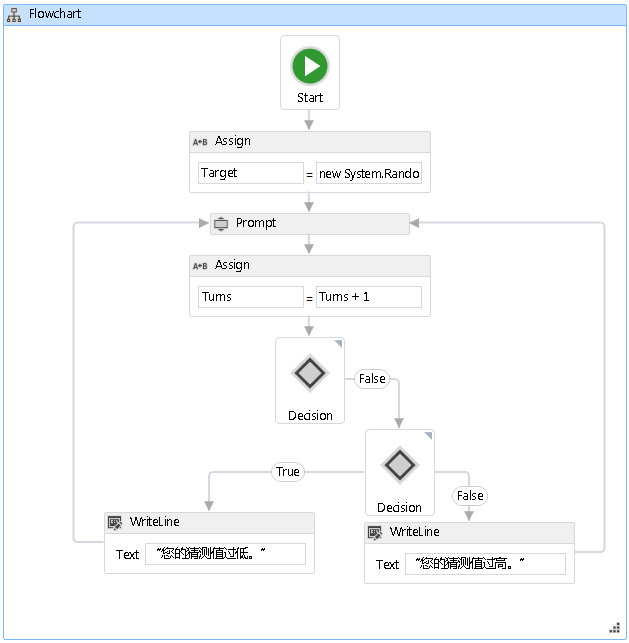

# <a name="how-to-create-a-flowchart-workflow"></a>如何：创建 Flowchart 工作流
工作流可基于内置活动以及自定义活动来构造。 本主题将指导通过创建工作流使用这两个内置的活动，如<xref:System.Activities.Statements.Flowchart>活动和自定义活动与上一[如何： 创建活动](../../../docs/framework/windows-workflow-foundation/how-to-create-an-activity.md)主题。 该工作流模拟猜数游戏。  
  
> [!NOTE]
>  入门教程中的每个主题都依赖于前面的主题。 若要完成本主题，必须先完成[如何： 创建活动](../../../docs/framework/windows-workflow-foundation/how-to-create-an-activity.md)。  
  
> [!NOTE]
>  若要下载完整版教程，请参阅 [Windows Workflow Foundation (WF45) — 入门教程](http://go.microsoft.com/fwlink/?LinkID=248976)。  
  
### <a name="to-create-the-workflow"></a>创建工作流  
  
1.  右键单击**NumberGuessWorkflowActivities**中**解决方案资源管理器**和选择**添加**，**新项**。  
  
2.  在**已安装**，**通用项**节点中，选择**工作流**。 选择**活动**从**工作流**列表。  
  
3.  类型`FlowchartNumberGuessWorkflow`到**名称**框中，单击**添加**。  
  
4.  拖动**流程图**活动从**流程图**部分**工具箱**拖放到**将活动拖至此处**上的标签工作流设计图面。  
  
### <a name="to-create-the-workflow-variables-and-arguments"></a>创建工作流变量和自变量  
  
1.  双击**FlowchartNumberGuessWorkflow.xaml**中**解决方案资源管理器**如果未显示在设计器中显示工作流。  
  
2.  单击**参数**中要显示的工作流设计器左下方**参数**窗格。  
  
3.  单击**创建自变量**。  
  
4.  类型`MaxNumber`到**名称**框中，选择**中**从**方向**下拉列表中，选择**Int32**从**自变量类型**下拉列表，然后按 ENTER 保存该自变量。  
  
5.  单击**创建自变量**。  
  
6.  类型`Turns`到**名称**低于新添加的框`MaxNumber`自变量中，选择**出**从**方向**下拉列表中，选择**Int32**从**自变量类型**下拉列表，然后按 ENTER。  
  
7.  单击**参数**要关闭的活动设计器左下方**参数**窗格。  
  
8.  单击**变量**中要显示的工作流设计器左下方**变量**窗格。  
  
9. 单击**创建变量**。  
  
    > [!TIP]
    >  如果没有**创建变量**显示框中，单击<xref:System.Activities.Statements.Flowchart>活动在工作流设计图面上以将其选中。  
  
10. 类型`Guess`到**名称**框中，选择**Int32**从**变量类型**下拉列表，然后按 ENTER 保存该变量。  
  
11. 单击**创建变量**。  
  
12. 类型`Target`到**名称**框中，选择**Int32**从**变量类型**下拉列表，然后按 ENTER 保存该变量。  
  
13. 单击**变量**要关闭的活动设计器左下方**变量**窗格。  
  
### <a name="to-add-the-workflow-activities"></a>添加工作流活动  
  
1.  拖动**分配**活动从**基元**部分**工具箱**并将其悬停**启动**节点，即在顶部流程图。 当**分配**活动位于**启动**节点，三个三角形周围将出现**启动**节点。 删除**分配**正下方的三角形上的活动**启动**节点。 这将链接在一起的两个项并指定**分配**流程图中的第一个活动的活动。  
  
    > [!NOTE]
    >  也还可以通过手动将活动链接到开始节点而将活动指示为流程图中的起始活动。 若要执行此操作，将鼠标悬停**启动**节点，单击鼠标位于上方时显示的矩形之一**启动**节点，然后拖动连接至所需的活动并将其放在其中一个上出现的矩形。 此外可以指定和作为右键单击它并选择起始活动的活动**设置为开始节点**。  
  
2.  类型`Target`到**到**框并将以下表达式键入**输入 C# 表达式**或**输入 VB 表达式**框。  
  
    ```vb  
    New System.Random().Next(1, MaxNumber + 1)  
    ```  
  
    ```csharp  
    new System.Random().Next(1, MaxNumber + 1)  
    ```  
  
    > [!TIP]
    >  如果**工具箱**不显示窗口中，选择**工具箱**从**视图**菜单。  
  
3.  拖动**提示**活动从**NumberGuessWorkflowActivities**部分**工具箱**，删除以下**分配**活动与上一步骤，并连接**提示**活动**分配**活动。 可通过三种方法来连接这两个活动。 第一种方法是将它们连接你拖动**提示**上工作流的活动。 如您拖动**提示**的工作流的活动将其悬停**分配**活动拖放到时出现的四个三角形之一**提示**活动位于**分配**活动。 第二种方法是删除**提示**活动拖放到所需位置处的工作流。 然后，将鼠标悬停**分配**活动并且将拖放到出现的矩形之一**提示**活动。 拖动鼠标，使连接线从**分配**活动连接到的矩形之一**提示**活动，然后松开鼠标按钮。 第三个方法是非常类似于第一种方法，只不过而不是拖动**提示**活动从**工具箱**，将其从其位置拖动工作流设计图面上，将其悬停**分配**活动，拖放到出现的三角形之一。  
  
4.  在**属性窗口**为**提示**活动中，键入`"EnterGuess"`包括引号**BookmarkName**属性值框。 类型`Guess`到**结果**属性值框中，并键入以下表达式键入**文本**属性框。  
  
    ```vb  
    "Please enter a number between 1 and " & MaxNumber  
    ```  
  
    ```csharp  
    "Please enter a number between 1 and " + MaxNumber  
    ```  
  
    > [!TIP]
    >  如果**属性窗口**未显示，选择**属性窗口**从**视图**菜单。  
  
5.  拖动**分配**活动从**基元**部分**工具箱**并将其使用，以便它在之下上一步中所述的方法之一连接**提示**活动。  
  
6.  类型`Turns`到**到**框和`Turns + 1`到**输入 C# 表达式**或**输入 VB 表达式**框。  
  
7.  拖动**flowdecision**从**流程图**部分**工具箱**并将其连接下面**分配**活动。 在**属性窗口**，以下表达式键入**条件**属性值框。  
  
    ```vb  
    Guess = Target  
    ```  
  
    ```csharp  
    Guess == Target  
    ```  
  
8.  将另一个**flowdecision**活动从**工具箱**并将其放第一个文本框下方。 通过将标记为的矩形中连接两个活动**False**在顶部**flowdecision**顶部的第二个活动的矩形**flowdecision**活动。  
  
    > [!TIP]
    >  如果看不到**True**和**False**标签上**flowdecision**，将鼠标悬停**flowdecision**。  
  
9. 单击第二个**flowdecision**活动以选择它。 在**属性窗口**，以下表达式键入**条件**属性值框。  
  
    ```
    Guess < Target  
    ```  
  
10. 将两个**WriteLine**从活动**基元**部分**工具箱**，而且删除它们，以便它们在并行至两个**flowdecision**活动。 连接**True**底部操作**flowdecision**到最左边的活动**WriteLine**活动，与**False**到的操作最右边**WriteLine**活动。  
  
11. 单击最左边**WriteLine**活动将其选中，然后键入以下表达式键入**文本**属性值框中**属性窗口**。  
  
    ```
    "Your guess is too low."  
    ```  
  
12. 连接**WriteLine**的左侧**提示**其上面的活动。  
  
13. 单击最右边**WriteLine**活动将其选中，然后键入以下表达式键入**文本**属性值框中**属性窗口**。  
  
    ```
    "Your guess is too high."  
    ```  
  
14. 连接**WriteLine**活动的右侧**提示**高于其活动。  
  
     下面的示例阐释已完成的工作流。  
  
       
  
### <a name="to-build-the-workflow"></a>生成工作流  
  
1.  按 Ctrl+Shift+B 生成解决方案。  
  
     有关如何运行工作流，说明，请参阅下一主题[如何： 运行工作流](../../../docs/framework/windows-workflow-foundation/how-to-run-a-workflow.md)。 如果你已经完成[如何： 运行工作流](../../../docs/framework/windows-workflow-foundation/how-to-run-a-workflow.md)用不同的样式，工作流的步骤和想要使用此步骤中的流程图工作流运行，跳到[生成并运行应用程序](../../../docs/framework/windows-workflow-foundation/how-to-run-a-workflow.md#BKMK_ToRunTheApplication)部分[如何： 运行工作流](../../../docs/framework/windows-workflow-foundation/how-to-run-a-workflow.md)。  
  
## <a name="see-also"></a>请参阅  
 <xref:System.Activities.Statements.Flowchart>  
 <xref:System.Activities.Statements.FlowDecision>  
 [Windows Workflow Foundation 编程](../../../docs/framework/windows-workflow-foundation/programming.md)  
 [设计工作流](../../../docs/framework/windows-workflow-foundation/designing-workflows.md)  
 [入门教程](../../../docs/framework/windows-workflow-foundation/getting-started-tutorial.md)  
 [如何：创建活动](../../../docs/framework/windows-workflow-foundation/how-to-create-an-activity.md)  
 [如何：运行工作流](../../../docs/framework/windows-workflow-foundation/how-to-run-a-workflow.md)
