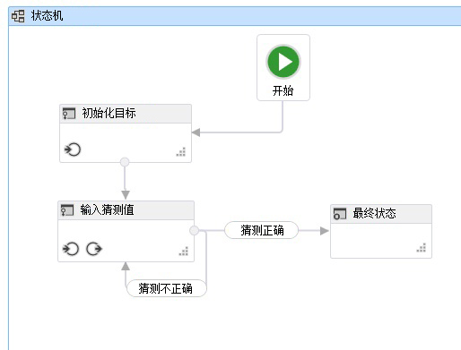

# 如何：创建状态机工作流
工作流可基于内置活动以及自定义活动来构造。本主题分步介绍如何创建使用内置活动（如 <xref:System.Activities.Statements.StateMachine> 活动）以及之前的[如何：创建活动](../../../docs/framework/windows-workflow-foundation//how-to-create-an-activity.md)主题中的自定义活动的工作流。该工作流模拟猜数游戏。  
  
> [!NOTE]
>  入门教程中的每个主题都依赖于前面的主题。若要完成本主题，必须先完成[如何：创建活动](../../../docs/framework/windows-workflow-foundation//how-to-create-an-activity.md)。  
  
> [!NOTE]
>  若要下载完整版教程，请参见 [Windows Workflow Foundation \(WF45\) \- 入门教程](http://go.microsoft.com/fwlink/?LinkID=248976)。  
  
### 创建工作流  
  
1.  在**解决方案资源管理器**中右键单击**“NumberGuessWorkflowActivities”**，并依次选择**“添加”**、**“新建项目”**。  
  
2.  在**“已安装”**、**“常用项”**节点中，选择**“工作流”**。从**“工作流”**列表中选择**“活动”**。  
  
3.  在**“名称”**框中键入 `StateMachineNumberGuessWorkflow`，然后单击**“添加”**。  
  
4.  从**“工具箱”**的**“状态机”**部分中，将**“StateMachine”**活动拖放到工作流设计图面上的**“在此处放置活动”**标签上。  
  
### 创建工作流变量和参数  
  
1.  如果设计器中尚未显示**“StateMachineNumberGuessWorkflow.xaml”**工作流，请在**解决方案资源管理器**中双击该工作流，使其显示在设计器中。  
  
2.  单击工作流设计器左下方的**“参数”**，以显示**“参数”**窗格。  
  
3.  单击**“创建参数”**。  
  
4.  在**“名称”**框中键入 `MaxNumber`，从**“方向”**下拉列表中选择**“输入”**，再从**“参数类型”**下拉列表中选择**“Int32”**，然后按 Enter 保存该参数。  
  
5.  单击**“创建参数”**。  
  
6.  在新添加的 `MaxNumber` 参数下方的**“名称”**框中键入 `Turns`，从**“方向”**下拉列表中选择**“输出”**，再从**“参数类型”**下拉列表中选择**“Int32”**，然后按 Enter。  
  
7.  单击活动设计器左下方的**“参数”**，以关闭**“参数”**窗格。  
  
8.  单击工作流设计器左下方的**“变量”**，以显示**“变量”**窗格。  
  
9. 单击**“创建变量”**。  
  
    > [!TIP]
    >  如果未显示**“创建变量”**框，请单击工作流设计器图面上的 <xref:System.Activities.Statements.StateMachine> 活动以将其选中。  
  
10. 在**“名称”**框中键入 `Guess`，从**“变量类型”**下拉列表中选择**“Int32”**，然后按 Enter 保存该变量。  
  
11. 单击**“创建变量”**。  
  
12. 在**“名称”**框中键入 `Target`，从**“变量类型”**下拉列表中选择**“Int32”**，然后按 Enter 保存该变量。  
  
13. 单击活动设计器左下方的**“变量”**，以关闭**“变量”**窗格。  
  
### 添加工作流活动  
  
1.  单击**“State1”**将其选中。在**“属性窗口”**中，将**“DisplayName”**更改为 `Initialize Target`。  
  
    > [!TIP]
    >  如果**“属性窗口”**未显示，请从**“视图”**菜单中选择**“属性窗口”**。  
  
2.  在工作流设计器中双击刚刚重命名的**“Initialize Target”**状态，以将其展开。  
  
3.  将**“Assign”**活动从**“工具箱”**的**“基元”**部分拖放至状态的**“输入”**部分。在**“To”**框中键入 `Target`，并将以下表达式键入**“输入 C\# 表达式”**或**“输入 VB 表达式”**框中。  
  
    ```vb  
    New System.Random().Next(1, MaxNumber + 1)  
    ```  
  
    ```csharp  
    new System.Random().Next(1, MaxNumber + 1)  
    ```  
  
    > [!TIP]
    >  如果**“工具箱”**窗口未显示，请从**“视图”**菜单中选择**“工具箱”**。  
  
4.  通过单击工作流设计器顶部的痕迹显示中的**“StateMachine”**，返回到工作流设计器中的整体状态机视图。  
  
5.  从**“工具箱”**的**“状态机”**部分，将一个**“State”**活动拖动到工作流设计器上，并将其悬停在**“Initialize Target”**状态上。请注意，当新状态悬停在其上时，**“Initialize Target”**状态周围会出现四个三角形。将新状态放到**“Initialize Target”**状态下面紧邻的三角形上。此操作将新状态放置到工作流，并创建从**“Initialize Target”**状态到新状态的转换。  
  
6.  单击**“State1”**以选择它，将**“DisplayName”**更改为 `Enter Guess`，然后双击工作流设计器中的状态，以将其展开。  
  
7.  将**“WriteLine”**活动从**“工具箱”**的**“基元”**部分拖放至状态的**“输入”**部分上。  
  
8.  将以下表达式键入**“WriteLine”**的**“文本”**属性框中。  
  
    ```vb  
    "Please enter a number between 1 and " & MaxNumber  
    ```  
  
    ```csharp  
    "Please enter a number between 1 and " + MaxNumber  
    ```  
  
9. 将**“Assign”**活动从**“工具箱”**的**“基元”**部分拖放至状态的**“退出”**部分。  
  
10. 在**“To”**框中键入 `Turns`，并将 `Turns + 1` 键入**“输入 C\# 表达式”**或**“输入 VB 表达式”**框中。  
  
11. 通过单击工作流设计器顶部的痕迹显示中的**“StateMachine”**，返回到工作流设计器中的整体状态机视图。  
  
12. 从**“工具箱”**的**“状态机”**部分拖动一个**“FinalState”**活动，将其悬停在**“Enter Guess”**状态上，并将其放到**“Enter Guess”**状态右侧显示的三角形上，以便在**“Enter Guess”**和**“FinalState”**之间创建转换。  
  
13. 转换的默认名称为 **T2**。在工作流设计器中单击该转换将其选中，并将其**“DisplayName”**设置为**“Guess Correct”**。然后单击并选择**“FinalState”**将其拖至右侧，以便留出空间显示完整的转换名称，而不会覆盖这两个状态中的任何一个。这样可以方便完成本教程中的剩余步骤。  
  
14. 在工作流设计器中双击刚刚重命名的**“Guess Correct”**转换，以将其展开。  
  
15. 将**“ReadInt”**活动从**“工具箱”**的**“NumberGuessWorkflowActivities”**部分拖放至转换的**“触发器”**部分。  
  
16. 在**“ReadInt”**活动的**“属性窗口”**中，将 `"EnterGuess"`（包括引号）键入**“BookmarkName”**属性值框中，并将 `Guess` 键入**“Result”**属性值框中。  
  
17. 将以下表达式键入**“Guess Correct”**转换的**“Condition”**属性值框中。  
  
    ```vb  
    Guess = Target  
    ```  
  
    ```csharp  
    Guess == Target  
    ```  
  
18. 通过单击工作流设计器顶部的痕迹显示中的**“StateMachine”**，返回到工作流设计器中的整体状态机视图。  
  
    > [!NOTE]
    >  当收到触发器事件和 <xref:System.Activities.Statements.Transition.Condition%2A>（如果存在）时，将发生转换，计算结果为 `True`。对于这一转换，如果用户的 `Guess` 匹配随机生成的 `Target`，则将控制传递给**“FinalState”**并且工作流完成。  
  
19. 根据猜测是否正确，工作流应转换到**“FinalState”**或返回到另一尝试的**“Enter Guess”**状态。这两个转换共享同一触发器，等待用户通过**“ReadInt”**活动接收猜测值。这称为共享转换。要创建共享转换，请单击圆圈，以指示**“Guess Correct”**转换的开始，并将它拖动到所需的状态。本例中的转换属自行转换，因此拖动**“Guess Correct”**转换的起始点并将其放回**“Enter Guess”**状态的底部。创建转换后，在工作流设计器中选中该转换，并将其**“DisplayName”**属性设置为**“Guess Incorrect”**。  
  
    > [!NOTE]
    >  也可以通过单击转换设计器底部的**“添加共享的触发器转换”**，再选择**“连接的可用状态”**下列表中的所需目标状态，在转换设计器中创建共享转换。  
  
    > [!NOTE]
    >  注意，如果转换的 <xref:System.Activities.Statements.Transition.Condition%2A> 计算结果为 `false`（或所有共享触发转换条件的计算结果均为 `false`），转换将不发生，并且此状态下的所有转换的所有触发将被重新计划。在本教程中，由于配置条件的方式，这种情况不会发生（我们针对猜测是正确或者错误提供了具体的操作）。  
  
20. 在工作流设计器中双击**“Guess Incorrect”**转换，以将其展开。请注意，**“触发器”**已设置为相同的**“ReadInt”**活动，该活动由**“Guess Correct”**转换使用。  
  
21. 将以下表达式键入**“Condition”**框属性值框。  
  
    ```vb  
    Guess <> Target  
    ```  
  
    ```csharp  
    Guess != Target  
    ```  
  
22. 将**“If”**活动从**“工具箱”**的**“控制流”**部分拖放至转换的**“操作”**部分。  
  
23. 将以下表达式键入**“If”**活动的**“Condition”**属性值框。  
  
    ```vb-c#  
    Guess < Target  
    ```  
  
24. 从**“工具箱”**的**“基元”**部分拖放两个**“WriteLine”**活动，一个放在**“If”**活动的**“Then”**部分，另一个放在**“Else”**部分。  
  
25. 单击**“Then”**部分中的**“WriteLine”**活动将其选中，然后将以下表达式键入**“Text”**属性值框中。  
  
    ```vb-c#  
    "Your guess is too low."  
    ```  
  
26. 单击**“Else”**部分中的**“WriteLine”**活动将其选中，然后将以下表达式键入**“Text”**属性值框中。  
  
    ```vb-c#  
    "Your guess is too high."  
    ```  
  
27. 通过单击工作流设计器顶部的痕迹显示中的**“StateMachine”**，返回到工作流设计器中的整体状态机视图。  
  
     下面的示例阐释已完成的工作流。  
  
       
  
### 生成工作流  
  
1.  按 Ctrl\+Shift\+B 生成解决方案。  
  
     有关如何运行工作流的说明，请参见下一主题[如何：运行工作流](../../../docs/framework/windows-workflow-foundation//how-to-run-a-workflow.md)。如果您已使用不同样式的工作流完成了[如何：运行工作流](../../../docs/framework/windows-workflow-foundation//how-to-run-a-workflow.md)步骤，并希望使用此步骤中的状态机工作流运行它，请跳到[如何：运行工作流](../../../docs/framework/windows-workflow-foundation//how-to-run-a-workflow.md)的[生成并运行应用程序](../../../docs/framework/windows-workflow-foundation//how-to-run-a-workflow.md#BKMK_ToRunTheApplication)部分。  
  
## 请参阅  
 <xref:System.Activities.Statements.Flowchart>   
 <xref:System.Activities.Statements.FlowDecision>   
 [Windows Workflow Foundation 编程](../../../docs/framework/windows-workflow-foundation//programming.md)   
 [设计工作流](../../../docs/framework/windows-workflow-foundation//designing-workflows.md)   
 [入门教程](../../../docs/framework/windows-workflow-foundation//getting-started-tutorial.md)   
 [如何：创建活动](../../../docs/framework/windows-workflow-foundation//how-to-create-an-activity.md)   
 [如何：运行工作流](../../../docs/framework/windows-workflow-foundation//how-to-run-a-workflow.md)