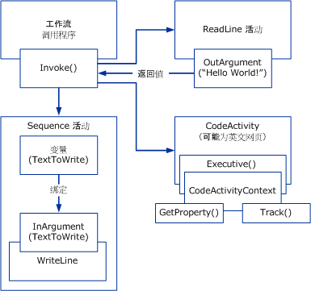

# Windows 工作流概述
工作流是一组的名为的基本单元*活动*作为描述实际过程的模型存储的。 工作流提供了一种方法，用于描述多项短期运行或长期运行的工作之间的执行顺序和依赖关系。 此工作从头到尾地贯穿模型，并且活动可以人工执行或由系统功能执行。  
  
## 工作流运行时引擎  
 每个正在运行的工作流实例都是由进程内运行时引擎创建和维护的，宿主进程通过以下类之一与其交互：  
  
-   <xref:System.Activities.WorkflowInvoker>，它像调用方法一样调用工作流。  
  
-   <xref:System.Activities.WorkflowApplication>，用于对单个工作流实例的执行进行显式控制。  
  
-   <xref:System.ServiceModel.WorkflowServiceHost>，用于多实例方案中基于消息的交互。  
  
 上述每个类对表示为负责活动执行的 <xref:System.Activities.ActivityInstance> 的核心活动运行时进行包装。 在一个应用程序域中可以并发运行多个 <xref:System.Activities.ActivityInstance> 对象。  
  
 上述三个主机交互对象中的每一个都是从称为工作流程序的活动树中创建的。 使用这些类型或自定义主机，用于包装<xref:System.Activities.ActivityInstance>，可以在包括控制台应用程序，任何 Windows 进程内执行工作流基于窗体的应用程序、 Windows 服务， [!INCLUDE[vstecasp](../../../includes/vstecasp-md.md)] Web 站点和 Windows Communication Foundation （WCF) 服务。  
  
   
托管进程中的工作流组件  
  
## 工作流组件之间的交互  
 下图演示工作流组件彼此之间如何进行交互。  
  
   
  
 在上图中，<xref:System.Activities.WorkflowInvoker.Invoke%2A> 类的 <xref:System.Activities.WorkflowInvoker> 方法用于调用多个工作流实例。 <xref:System.Activities.WorkflowInvoker> 用于不需要由宿主管理的轻型工作流；需要由宿主管理的工作流（如 <xref:System.Activities.Bookmark> 恢复）必须改用 <xref:System.Activities.WorkflowApplication.Run%2A> 来执行。 无需等待一个工作流实例完成即可调用下一个工作流实例；运行时引擎支持同时运行多个工作流实例。  调用的工作流如下：  
  
-   一个包含 <xref:System.Activities.Statements.Sequence> 子活动的 <xref:System.Activities.Statements.WriteLine> 活动。 父活动的 <xref:System.Activities.Variable> 绑定到子活动的 <xref:System.Activities.InArgument>。 在变量、 参数以及绑定的详细信息，请参阅[变量和自变量](../../../docs/framework/windows-workflow-foundation/variables-and-arguments.md)。  
  
-   一个调用 `ReadLine` 的自定义活动。 将 <xref:System.Activities.OutArgument> 活动的 `ReadLine` 返回给调用 <xref:System.Activities.WorkflowInvoker.Invoke%2A> 方法。  
  
-   一个派生自 <xref:System.Activities.CodeActivity> 抽象类的自定义活动。 <xref:System.Activities.CodeActivity> 可以使用作为 <xref:System.Activities.CodeActivityContext> 方法的参数提供的 <xref:System.Activities.CodeActivity.Execute%2A> 访问运行时功能（如跟踪和属性）。 有关这些运行时功能的详细信息，请参阅[工作流跟踪](../../../docs/framework/windows-workflow-foundation/workflow-tracking-and-tracing.md)并[工作流执行属性](../../../docs/framework/windows-workflow-foundation/workflow-execution-properties.md)。  
  
## 请参阅  
 [BizTalk Server 2006 还是 WF？为你的项目选择正确的工作流工具](https://go.microsoft.com/fwlink/?LinkId=154901)
