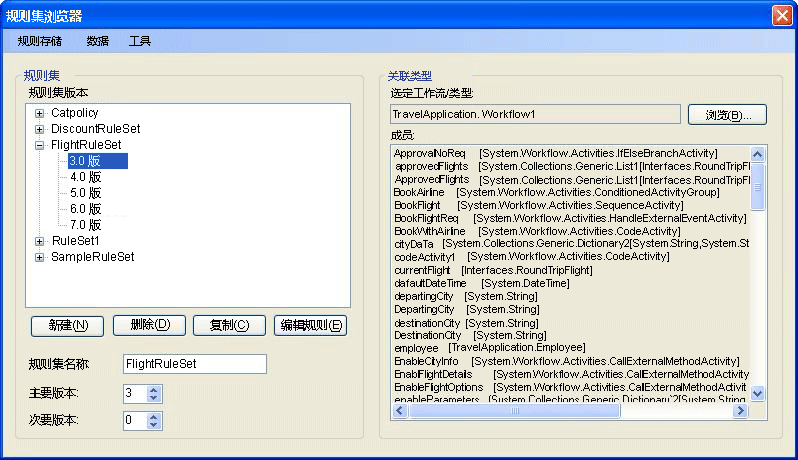
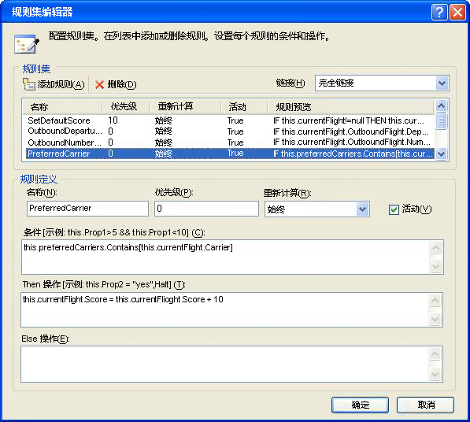
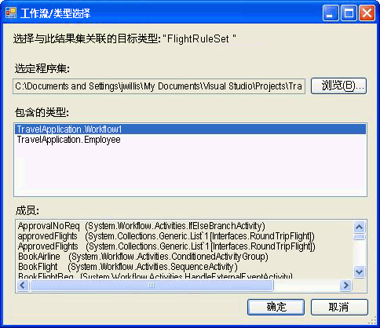
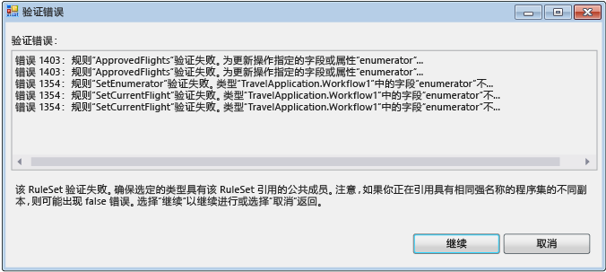
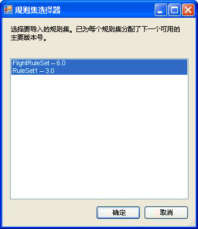

# <a name="external-ruleset-toolkit"></a>外部 RuleSet 工具包
通常在工作流应用程序中使用规则时，这些规则就是程序集的一部分。 在某些情况下，您可能希望将 RuleSet 和程序集分开维护，这样就可以在不重新生成和部署工作流程序集的情况下更新 RuleSet。 此示例使您可以在数据库中管理和编辑 RuleSet，并在运行时从工作流访问这些 RuleSet。 这样正在运行的工作流实例就能够自动合并 RuleSet 更改。  
  
 外部 RuleSet 工具包示例包含一个基于 Windows 窗体的工具，您可以使用它来管理和编辑数据库中的 RuleSet 版本。 它还包括一个活动和一个宿主服务，用以执行这些规则。  
  
> [!NOTE]
>  此示例要求[Microsoft SQL Server](http://go.microsoft.com/fwlink/?LinkId=96181)。  
  
 [!INCLUDE[vsprvsext](../../../../includes/vsprvsext-md.md)] 提供了一个 RuleSet 编辑器，它是 Windows Workflow Foundation (WF) 的一部分。 双击工作流中的 `Policy` 活动可以启动此编辑器。它将已定义的 RuleSet 对象序列化为与工作流相关联的 .rules 文件（`Policy` 活动依据工作流运行 RuleSet 实例）。 在生成工作流项目时，此 .rules 文件将作为资源编译到程序集中。  
  
 此示例包括的组件有：  
  
-   一个 RuleSet 图形用户界面工具，您可以使用它来编辑和管理数据库中的 RuleSet 版本。  
  
-   一项 RuleSet 服务，该服务在主机应用程序上进行配置，并从数据库访问 RuleSet。  
  
-   一个 `ExternalPolicy` 活动，该活动从 RuleSet 服务请求 RuleSet，并依工作流运行 RuleSet。  
  
 图 1 中演示了各个组件间的交互。 后面几节将对每个组件进行描述。  
  
   
  
 图 1：示例概述  
  
> [!IMPORTANT]
>  您的计算机上可能已安装这些示例。 在继续操作之前，请先检查以下（默认）目录：  
>   
>  `<InstallDrive>:\WF_WCF_Samples`  
>   
>  如果此目录不存在，请转到[Windows Communication Foundation (WCF) 和针对.NET Framework 4 的 Windows Workflow Foundation (WF) 示例](http://go.microsoft.com/fwlink/?LinkId=150780)下载所有 Windows Communication Foundation (WCF) 和[!INCLUDE[wf1](../../../../includes/wf1-md.md)]示例。 此示例位于以下目录：  
>   
>  `<InstallDrive>:\WF_WCF_Samples\WF\Scenario\ExternalRuleSetToolKit`  
  
## <a name="ruleset-tool"></a>RuleSet 工具  
 图 2 演示了 RuleSet 工具的屏幕快照。 从**规则存储**菜单上，你可以从数据库加载可用的 Ruleset，并将修改过的 Ruleset 保存回存储区。 应用程序配置文件为 RuleSet 数据库提供了数据库连接字符串。 启动工具时，它会从已配置的数据库自动加载 RuleSet。  
  
   
  
 图 2：RuleSet 浏览器  
  
 RuleSet 工具将主版本号和次版本号应用到 RuleSet，使您可以同时维护和存储多个版本（除了提供版本管理功能之外，此工具还提供无锁定或其他配置管理功能）。 使用这个工具，您可以创建新的 RuleSet 版本或删除现有版本。 当你单击**新建**，该工具创建新的 RuleSet 名称并应用 1.0 版。 复制版本时，此工具会为选定的 RuleSet 版本（包括所包含的规则）创建一个副本，并分配唯一的新版本号。 这些版本号基于现有的 RuleSet 版本号。 您可以使用窗体上相关联的字段，更改 RuleSet 的名称和版本号。  
  
 当你单击**编辑规则**，启动 RuleSet 编辑器，如图 3 中所示。  
  
   
  
 图 3：RuleSet 编辑器  
  
 这是重新承载的编辑器对话框是 Windows Workflow Foundation Visual Studio 外接程序的一部分。 它可提供相同的功能，包括 Intellisense 支持。 规则是根据与工具中 RuleSet 相关联的目标类型 （如工作流） 创作当你单击**浏览**在主工具对话框中，**工作流/类型选择器**对话框出现时，如图 4 中所示。  
  
   
  
 图 4：工作流/类型选择器  
  
 你可以使用**工作流/类型选择器**对话框来指定程序集和该程序集内的特定类型。 这个类型是创作（和运行）规则所依据的目标类型。 在很多情况下，目标类型会是工作流或某些其他活动类型。 但是，您可以依据任何 .NET 类型运行 RuleSet。  
  
 程序集文件和类型的路径`name are stored with the`数据库中的 RuleSet，以便从数据库中检索该规则集时该工具尝试自动加载的目标类型。  
  
 当你单击**确定**中**工作流/类型选择器**对话框中，它会验证所选的类型依据 RuleSet，以确保目标类型具有的规则所引用的所有成员。 错误将显示在**验证错误**对话框 （请参见图 5）。 你可以选择继续忽略错误，此更改，或单击**取消**。 从**工具**主工具对话框中的菜单上，你可以单击**验证**以重新验证依据目标活动的 RuleSet 版本。  
  
   
  
 图 5：验证错误  
  
 从**数据**菜单在工具中，你可以导入和导出 Ruleset。 当你单击**导入**，此时将显示文件选择器对话框，您可以从中选择.rules 文件。 这可能会也可能不是最初在 Visual Studio 中创建的文件。 此 .rules 文件应包含一个序列化的 `RuleDefinitions` 实例，该实例包含一个条件集合和一个 RuleSet 集合。 该工具不使用条件集合，但它使用`RuleDefinitions`.rules 格式，以允许与 Visual Studio 环境进行交互。  
  
 选择.rules 文件后, **RuleSet 选择器**对话框 （请参见图 6）。 您可以使用此对话框，从文件中选择想要导入的 RuleSet（默认指定的是所有 RuleSet）。 由于 WF 项目中的版本和程序集的版本相同，所以此 .rules 文件中的 RuleSet 没有版本号。 在导入过程中，该工具会自动分配的下一个可用主要版本号 （这可以在导入后进行更改）;你可以看到在分配的版本号**RuleSet 选择器**列表。  
  
 对于导入的每个 RuleSet，工具都会尝试基于 RuleSet 中使用的成员，从 .rules 文件（如果存在）位置下面的 bin\Debug 文件夹查找关联类型。 如果工具找到多个匹配的类型，它将尝试基于 .rules 文件名称和类型名称之间的匹配（例如，`Workflow1` 类型与 Workflow1.rules 相对应）选择一种类型。 如果存在多个匹配，系统会提示您选择类型。 如果此自动标识机制无法找到匹配的程序集或类型，则在导入后，你可以单击**浏览**主工具对话框导航到关联的类型上。  
  
   
  
 图 6：RuleSet 选择器  
  
 当你单击**数据导出**从主工具菜单中， **RuleSet 选择器**对话框会再次出现，从中你可以确定应该将导出的数据库从 Ruleset。 当你单击**确定**、**保存文件**对话框出现时，可以在其中指定的名称和生成的.rules 文件的位置。 由于此 .rules 文件不包含版本信息，因此您只能选择一个具有给定 RuleSet 名称的 RuleSet 版本。  
  
## <a name="policyfromservice-activity"></a>PolicyFromService 活动  
 `PolicyFromService` 活动的代码非常简单。 其工作方式与随 WF 提供的 `Policy` 活动非常相似，但它不会从 .rules 文件检索目标 RuleSet，而是调用宿主服务获取 RuleSet 实例。 然后依据根工作流活动实例运行 RuleSet。  
  
 若要在工作流中使用活动，请从工作流项目中添加对 `PolicyActivities` 和 `RuleSetService` 程序集的引用。 有关如何将活动添加到工具箱的讨论，请参见本主题最后讨论的过程。  
  
 将活动置于工作流中后，必须提供要运行的 RuleSet 名称。 您可以输入名称作为一个文本值或绑定到另一个活动的工作流变量或属性。 或者，您可以选择为应该运行的特定 RuleSet 输入版本号。 如果您保留主版本号和次版本号的默认值 (0)，则数据库中最新的版本号将自动提供给活动。  
  
## <a name="ruleset-service"></a>规则集服务  
 此服务负责从数据库中检索指定的 RuleSet 版本，并将其返回到调用活动中。 如前所述，如果在 `GetRuleSet` 调用中传递的主版本和次版本值均为 0，则该服务将检索最新版本。 此时并不存在 RuleSet 定义或实例的缓存；同样也不存在将 RuleSet 版本标记为“已部署”，以将它们与正在进行的 RuleSet 区分开来的功能。  
  
 应该使用应用程序配置文件，在主机上配置该服务要访问的数据库。  
  
#### <a name="to-run-the-tool"></a>运行此工具  
  
1.  设置由工具和服务使用的 RuleSet 表的文件夹包含一个 Setup.sql 文件。 您可以在 SQL Express 上运行 Setup.cmd 批处理文件来创建 Rules 数据库，并对 RuleSet 表进行设置。  
  
2.  如果您编辑批处理文件或 Setup.sql，并指定不使用 SQL Express 或不将表置于名称非 `Rules` 的数据库中，则应当使用相同的信息，对 RuleSet 工具和 `UsageSample` 项目中的应用程序配置文件进行编辑。  
  
3.  运行 Setup.sql 脚本后可以生成 `ExternalRuleSetToolkit` 解决方案，然后可以从 ExternalRuleSetTool 项目启动 RuleSet 工具。  
  
4.  `RuleSetToolkitUsageSample` 顺序工作流控制台应用程序解决方案包括一个示例工作流。 此工作流由一个 `PolicyFromService` 活动和两个变量 `orderValue` 和 `discount` 组成，它是目标 RuleSet 运行时依据的工作流。  
  
5.  若要使用示例，请生成 `RuleSetToolkitUsageSample` 解决方案。 然后从 RuleSet 工具主菜单中，单击**数据导入**并指向 RuleSetToolkitUsageSample 文件夹中的 DiscountRuleSet.rules 文件。 单击**规则存储保存**菜单选项将导入的 RuleSet 保存到数据库。  
  
6.  由于 `PolicyActivities` 程序集是从示例工作流项目中进行引用的，因此 `PolicyFromService` 活动将出现在工作流中。 但是，默认情况下它不出现在工具箱中。 若要将它添加到工具箱，可以执行以下操作：  
  
    -   右击工具箱并选择**选择项**（这可能需要一段时间）。  
  
    -   当**选择工具箱项**对话框出现时，单击**活动**选项卡。  
  
    -   浏览到`PolicyActivities`中的程序集`ExternalRuleSetToolkit`解决方案，然后单击**打开**。  
  
    -   确保`PolicyFromService`中选择活动**选择工具箱项**对话框，然后单击**确定**。  
  
    -   活动现在应显示在工具箱**RuleSetToolkitUsageSample 组件**类别。  
  
7.  已经使用 Program.cs 中的下列语句在控制台应用程序主机上对 RuleSet 服务进行了配置。  
  
    ```  
    workflowRuntime.AddService(new RuleSetService());  
    ```  
  
8.  您也可以使用配置文件在主机上配置该服务。有关详细信息，请参见 SDK 文档。  
  
9. 工作流项目中添加了一个应用程序配置文件，以便为服务要使用的数据库指定连接字符串。 这个连接字符串应与 RuleSet 工具使用的相同，它指向包含 RuleSet 表的数据库。  
  
10. 您现在可以像运行任何其他工作流控制台应用程序一样运行 `RuleSetToolkitUsageSample` 项目。 按 F5 或 Ctrl + F5 在 Visual Studio 内或直接运行 RuleSetToolkitUsageSample.exe 文件。  
  
    > [!NOTE]
    >  因为 RuleSet 工具会加载用法示例程序集，所以您必须关闭该工具才能重新编译用法示例。