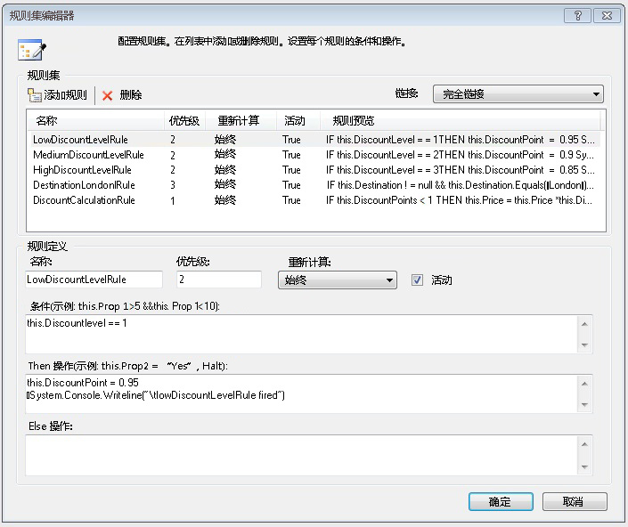

# 与 3.5 规则集交互
此示例演示如何使用 <xref:System.Activities.Statements.Interop> 活动来与 [!INCLUDE[netfx35_short](../../../../includes/netfx35-short-md.md)] 中使用 <xref:System.Workflow.Activities.Policy> 和规则的自定义活动集成。  此示例通过将 [!INCLUDE[netfx_current_long](../../../../includes/netfx-current-long-md.md)] 变量绑定到由自定义活动公开的依赖项属性，将数据传递给自定义活动。  
  
## 要求  
  
1.  [!INCLUDE[vs_current_long](../../../../includes/vs-current-long-md.md)]  
  
2.  [!INCLUDE[netfx_current_long](../../../../includes/netfx-current-long-md.md)]  
  
3.  [!INCLUDE[netfx35_long](../../../../includes/netfx35-long-md.md)]  
  
## 演示  
 <xref:System.Activities.Statements.Interop> 活动、<xref:System.Workflow.Activities.Policy> 中具有依赖项属性的 [!INCLUDE[netfx35_short](../../../../includes/netfx35-short-md.md)] 活动  
  
## 讨论  
 此示例演示与 [!INCLUDE[netfx35_short](../../../../includes/netfx35-short-md.md)] 活动集成的集成方案之一。  此示例包含一个调用 [!INCLUDE[netfx35_short](../../../../includes/netfx35-short-md.md)] 活动的 <xref:System.Workflow.Activities.Policy> 自定义活动。  
  
## TravelRuleLibrary  
 在设计器中打开 TravelRuleSet.cs 将会显示一个包含 Policy 活动的自定义顺序活动，如下所示。  
  
   
  
 双击**“DiscountPolicy”**策略活动以检查规则。  规则编辑器将会出现并显示规则。  
  
   
  
 右击**“DiscountPolicy”**活动，并选择**“查看代码”**选项以检查用此活动附带的 C\# 旁置代码。  观察 `DiscountLevel` 的依赖项属性设置。  这等效于 <xref:System.Activities.Argument> 中的 [!INCLUDE[netfx_current_short](../../../../includes/netfx-current-short-md.md)]。  
  
```  
public static DependencyProperty DiscountLevelProperty = DependencyProperty.Register("DiscountLevel", typeof(int), typeof(TravelRuleSet));  
  
[DescriptionAttribute("DiscountLevel")]  
[CategoryAttribute("DiscountLevel Category")]  
[BrowsableAttribute(true)]  
[DesignerSerializationVisibilityAttribute(DesignerSerializationVisibility.Visible)]  
public int DiscountLevel  
{  
   get  
   {  
return ((int)base.GetValue(TravelRuleSet.DiscountLevelProperty)));  
   }  
   set  
   {  
base.SetValue(TravelRuleSet.DiscountLevelProperty, value);  
   }  
}  
```  
  
## InteropWith35RuleSet  
 这是一个 [!INCLUDE[netfx_current_short](../../../../includes/netfx-current-short-md.md)] 顺序工作流项目，该项目使用 <xref:System.Activities.Statements.Interop> 活动与在 TravelRuleLibrary 项目中创建的自定义规则集进行集成。  变量是在顶级 <xref:System.Activities.Statements.Sequence> 上创建的，如下所示。  
  
   
  
   
  
 最后，<xref:System.Activities.Statements.Interop> 活动用于与 TravelRuleSet 进行集成。  前面在 <xref:System.Activities.Statements.Sequence> 上声明的变量用于绑定到依赖项属性。  
  
   
  
   
  
   
  
> [!IMPORTANT]
>  您的计算机上可能已安装这些示例。  在继续操作之前，请先检查以下（默认）目录：  
>   
>  `<安装驱动器>:\WF_WCF_Samples`  
>   
>  如果此目录不存在，请访问[针对 .NET Framework 4 的 Windows Communication Foundation \(WCF\) 和 Windows Workflow Foundation \(WF\) 示例](http://go.microsoft.com/fwlink/?LinkId=150780)（可能为英文网页），下载所有 [!INCLUDE[indigo1](../../../../includes/indigo1-md.md)] 和 [!INCLUDE[wf1](../../../../includes/wf1-md.md)] 示例。  此示例位于以下目录：  
>   
>  `<安装驱动器>:\WF_WCF_Samples\WF\Basic\Built-InActivities\InteropWith35RuleSet`