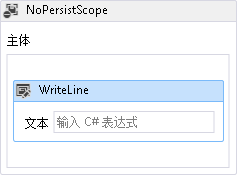
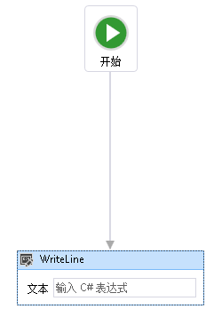
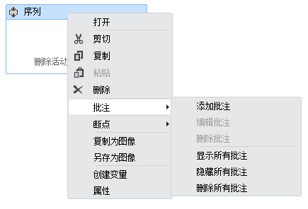

# 重新承载的工作流设计器中新 Workflow Foundation 4.5 功能的支持
[!INCLUDE[wf](../../../includes/wf-md.md)] 中的 [!INCLUDE[net_v45](../../../includes/net-v45-md.md)] 引入了许多新功能，包括对工作流设计器体验的多项增强。 本主题详细介绍重新承载的设计器中支持哪些功能以及当前不支持哪些功能。  
  
> [!NOTE]
>  有关的所有新列表[!INCLUDE[wf](../../../includes/wf-md.md)]中引入的功能[!INCLUDE[net_v45](../../../includes/net-v45-md.md)]，包括那些与设计器重新承载无关，请参阅[.NET 4.5 中的 Windows Workflow Foundation 中的新增](../../../docs/framework/windows-workflow-foundation/whats-new-in-wf-in-dotnet.md)。  
  
## 活动  
 内置活动库包含新活动和现有活动的新功能。 重新承载的设计器支持所有这些新活动。 有关这些新活动的详细信息，请参阅[活动](../../../docs/framework/windows-workflow-foundation/whats-new-in-wf-in-dotnet.md#BKMK_NewActivities)部分[.NET 4.5 中的 Windows Workflow Foundation 中的新增](../../../docs/framework/windows-workflow-foundation/whats-new-in-wf-in-dotnet.md)。  
  
## C# 表达式  
 在 [!INCLUDE[net_v45](../../../includes/net-v45-md.md)] 之前，工作流中的所有表达式只能用 Visual Basic 来编写。 在 [!INCLUDE[net_v45](../../../includes/net-v45-md.md)] 中，Visual Basic 表达式仅用于使用 Visual Basic 创建的项目。 Visual C# 项目现在将 C# 用于表达式。 在 [!INCLUDE[vs_current_long](../../../includes/vs-current-long-md.md)] 创作工作流时，可使用所提供的功能完全的 C# 表达式编辑器，其中包括语法突出显示和 Intellisense 等功能。 在使用 Visual Basic 表达式的以前版本中创建的 C# 工作流项目仍可继续使用。  
  
> [!WARNING]
>  重新承载的设计器不支持 C# 表达式。  
  
## 新设计器功能  
  
### 设计器搜索  
 [快速查找](../../../docs/framework/windows-workflow-foundation/whats-new-in-wf-in-dotnet.md#BKMK_QuickFind)和[在文件中查找](../../../docs/framework/windows-workflow-foundation/whats-new-in-wf-in-dotnet.md#BKMK_FindInFiles)功能引入了[!INCLUDE[net_v45](../../../includes/net-v45-md.md)]不支持在重新承载设计器中。 重新承载的设计器不支持 `Toolbox` 搜索。 有关这些功能的详细信息，请参阅[设计器搜索](../../../docs/framework/windows-workflow-foundation/whats-new-in-wf-in-dotnet.md#BKMK_DesignerSearch)。  
  
> [!WARNING]
>  [快速查找](../../../docs/framework/windows-workflow-foundation/whats-new-in-wf-in-dotnet.md#BKMK_QuickFind)和[在文件中查找](../../../docs/framework/windows-workflow-foundation/whats-new-in-wf-in-dotnet.md#BKMK_FindInFiles)不支持在重新承载设计器中。  
  
### 删除变量和自变量设计器中的上下文菜单项  
 在 [!INCLUDE[netfx40_short](../../../includes/netfx40-short-md.md)] 中，只能使用键盘来删除设计器中的变量和参数。 从 [!INCLUDE[net_v45](../../../includes/net-v45-md.md)] 开始，可以使用上下文菜单来删除变量和参数。 重新承载的编辑器支持此功能。  
  
 以下屏幕快照显示了变量和自变量设计器的上下文菜单。  
  
   
  
### 使用顺序进行自动环绕  
 由于工作流或特定容器活动（如 <xref:System.Activities.Statements.NoPersistScope>）只能包含单个主体活动，因此添加第二个活动需要开发人员删除第一个活动，请添加一个 <xref:System.Activities.Statements.Sequence> 活动，然后将两个活动都添加到该顺序活动中。 从 [!INCLUDE[net_v45](../../../includes/net-v45-md.md)] 开始，向设计器图面添加第二个活动时，将会自动创建 `Sequence` 活动以包装两个活动。 重新承载的编辑器支持此功能。  
  
 以下屏幕快照显示了 `WriteLine` 的 `Body` 中的 `NoPersistScope` 活动。  
  
   
  
 以下屏幕快照显示了在第一个 `Sequence` 下面丢弃第二个时在 `Body` 中自动创建的 `WriteLine` 活动。  
  
   
  
### 平移模式  
 若要更轻松地在设计器中浏览大型工作流，可以启用平移模式；通过此模式，开发人员可以单击并拖动工作流的可见部分将其移动，而无需使用滚动条。 用于激活平移模式的按钮位于设计器的右下角。 重新承载的编辑器支持此功能。  
  
 下面的屏幕快照显示了位于工作流设计器右下角的平移按钮。  
  
   
  
 也可以使用鼠标中键或空格键来平移工作流设计器。  
  
### 多选  
 通过拖动围绕活动的矩形（未启用平移模式时）或通过按住 Ctrl 键并逐一单击所需的活动，可以一次选择多个活动。 重新承载的编辑器支持此功能。  
  
 也可以在设计器中拖动并放置多个选择的活动，并使用上下文菜单与这些活动交互。  
  
### 工作流项的大纲视图  
 为了更加方便地浏览分层工作流，工作流的组件显示在树样式的大纲视图中。 大纲视图将显示在**文档大纲**视图。 若要在 Visual Studio 中，打开此视图，从顶部菜单中，选择**视图**，**其他窗口**，**文档大纲**，或按 Ctrl W、 u。 单击大纲视图中的节点将会定位到工作流设计器中的相应活动，并且该大纲视图将会更新以显示在设计器中选择的活动。 重新承载的编辑器支持此功能。  
  
 从完成的工作流的以下屏幕截图[入门教程](../../../docs/framework/windows-workflow-foundation/getting-started-tutorial.md)显示大纲视图中的，一个顺序工作流。  
  
   
  
### shell 栏和标头项的更多可见性控制  
 在重新承载的设计器中，某些标准 UI 控件可能对于给定的工作流没有意义，并可能已关闭。 在 [!INCLUDE[netfx40_short](../../../includes/netfx40-short-md.md)] 中，此自定义仅受设计器底部的 shell 栏支持。 在 [!INCLUDE[net_v45](../../../includes/net-v45-md.md)] 中，可通过用合适的 <xref:System.Activities.Presentation.View.DesignerView.WorkflowShellHeaderItemsVisibility%2A> 值设置 <xref:System.Activities.Presentation.View.ShellHeaderItemsVisibility> 来调整设计器顶部 shell 标头项的可见性。  
  
### 在流程图和状态机工作流中自动连接和自动插入  
 在 [!INCLUDE[netfx40_short](../../../includes/netfx40-short-md.md)] 中，必须手动添加流程图工作流中节点之间的连接。 在 [!INCLUDE[net_v45](../../../includes/net-v45-md.md)] 中，流程图和状态机节点具有自动连接点，这些自动连接点会在将一个活动从工具箱拖到设计器图面上时变为可见。 将活动放置在这些点中的一个点上会自动添加该活动以及必要的连接。  
  
 下面的屏幕快照显示了从工具箱中拖动活动时变为可见的附属点。  
  
   
  
 也可以将活动拖动到流程图节点和状态之间的连接上，以在两个其他节点之间自动插入该节点。 以下屏幕快照显示了突出显示的连接线，可在此连接线处从工具箱拖动并放置活动。  
  
   
  
 重新承载的设计器支持自动连接和自动插入。  
  
### 设计器批注  
 为促进开发较大型的工作流，设计器现在支持添加批注以帮助跟踪设计过程。 可以向活动、状态、流程图节点、变量和参数添加批注。 以下屏幕快照显示了用于将批注添加到设计器的上下文菜单。  
  
   
  
 重新承载的设计器支持设计器批注。  
  
### 在设计器中定义和使用 ActivityDelegate 对象  
 [!INCLUDE[netfx40_short](../../../includes/netfx40-short-md.md)] 中的活动使用 <xref:System.Activities.ActivityDelegate> 对象来公开执行点，在这些执行点处，工作流的其他部分可与工作流的执行交互；但是，使用这些执行点通常需要数量相当大的代码。 在此版本中，开发人员可以使用工作流设计器来定义和使用活动委托。 有关详细信息，请参阅[如何： 定义和使用工作流设计器中的活动委托](/visualstudio/workflow-designer/how-to-define-and-consume-activity-delegates-in-the-workflow-designer)。  
  
 重新承载的设计器支持活动委托。  
  
### 生成时验证  
 在 [!INCLUDE[netfx40_short](../../../includes/netfx40-short-md.md)] 中，不会将生成工作流项目期间的工作流验证错误计为生成错误。 这意味着即使存在工作流验证错误，工作流项目的生成也可能成功。 在 [!INCLUDE[net_v45](../../../includes/net-v45-md.md)] 中，工作流验证错误会导致生成失败。  
  
> [!WARNING]
>  重新承载的设计器不支持生成时验证。  
  
### 设计时后台验证  
 在 [!INCLUDE[netfx40_short](../../../includes/netfx40-short-md.md)] 中，会把工作流作为前台进程进行验证，这可能会在复杂或耗时的验证过程中将 UI 挂起。 工作流验证现在发生在后台线程上，因此不会阻止 UI。  
  
 重新承载的设计器支持设计时后台验证。  
  
### 位于 XAML 文件中的单独位置处的视图状态  
 在 [!INCLUDE[netfx40_short](../../../includes/netfx40-short-md.md)] 中，工作流的视图状态信息存储在 XAML 文件中的许多不同位置。 这对于想直接读取 XAML 或编写用于删除视图状态信息的代码的开发人员来说很不方便。 在[!INCLUDE[net_v45](../../../includes/net-v45-md.md)]，XAML 文件中的视图状态信息序列化为 XAML 文件中的一个单独的元素。  开发人员可以轻松地找到和编辑视图状态信息的一项活动，或完全删除的视图状态。  
  
 重新承载的工作流编辑器支持此功能。  
  
### 重新承载的设计器中 Workflow 4.5 功能的选择性加入  
 为保留向后兼容性，默认情况下，包括在 [!INCLUDE[net_v45](../../../includes/net-v45-md.md)] 中的一些新功能不会在重新承载的设计器中启用。 这是为了确保使用重新承载的设计器的现有应用程序不会由于更新至最新版本而中断。 若要启用重新承载的设计器中的新功能，可将 <xref:System.Activities.Presentation.DesignerConfigurationService.TargetFrameworkName%2A> 设置为“.Net Framework 4.5”，或设置 <xref:System.Activities.Presentation.DesignerConfigurationService> 的各成员以启用各个功能。  
  
## 新工作流开发模型  
 除流程图和顺序工作流开发模型外，此版本还包括状态机工作流和协定优先工作流服务。  
  
### 状态机工作流  
 状态机工作流中的.NET Framework 4.0.1 的一部分引入[Microsoft.NET Framework 4 平台更新 1](http://go.microsoft.com/fwlink/?LinkID=215092)。 此更新包括多个新类和活动，允许开发人员创建状态机工作流。 这些类和活动已针对 [!INCLUDE[net_v45](../../../includes/net-v45-md.md)] 进行更新。 更新包括：  
  
1.  能够对状态设置断点  
  
2.  能够在工作流设计器中复制和粘贴转换  
  
3.  设计器支持共享触发器转换创建  
  
4.  用于创建状态机工作流的活动，包括：<xref:System.Activities.Statements.StateMachine>、<xref:System.Activities.Statements.State> 和 <xref:System.Activities.Statements.Transition>  
  
 以下屏幕截图显示完成的状态机工作流从[入门教程](../../../docs/framework/windows-workflow-foundation/getting-started-tutorial.md)步骤[如何： 创建状态机工作流](../../../docs/framework/windows-workflow-foundation/how-to-create-a-state-machine-workflow.md)。  
  
   
  
 有关创建状态机工作流的详细信息，请参阅[状态机工作流](../../../docs/framework/windows-workflow-foundation/state-machine-workflows.md)。 重新承载的工作流编辑器状态机工作流。  
  
### 协定优先工作流开发  
 协定优先工作流开发工具允许开发人员可以先，设计一个协定在代码中的，然后在 Visual Studio 中单击几下，自动生成活动模板在工具箱中表示每个操作。 这些活动随后用于创建实现由该协定定义的操作的工作流。 工作流设计器将对该工作流服务进行验证，以确保实现这些操作并且工作流的签名与协定签名匹配。 开发人员还可以将工作流服务与所实现的协定的集合进行关联。 协定优先工作流服务开发的详细信息，请参阅[如何： 创建使用现有服务协定的工作流服务](../../../docs/framework/windows-workflow-foundation/how-to-create-a-workflow-service-that-consumes-an-existing-service-contract.md)。  
  
> [!WARNING]
>  工作流设计器不支持协定优先工作流开发。
