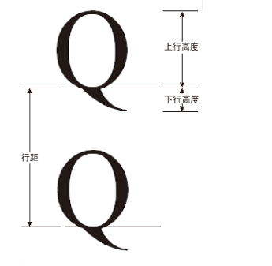

# 如何：获取字体规格
<xref:System.Drawing.FontFamily> 类提供了下列方法来检索特定字体\/字形组合的各种规格：  
  
-   <xref:System.Drawing.FontFamily.GetEmHeight%2A>\(FontStyle\)  
  
-   <xref:System.Drawing.FontFamily.GetCellAscent%2A>\(FontStyle\)  
  
-   <xref:System.Drawing.FontFamily.GetCellDescent%2A>\(FontStyle\)  
  
-   <xref:System.Drawing.FontFamily.GetLineSpacing%2A>\(FontStyle\)  
  
 这些方法返回的数字使用的是字体设计单位，因此，它们与特定的 <xref:System.Drawing.Font> 对象的大小和单位无关。  
  
 下面的插图显示了各种规格。  
  
   
  
## 示例  
 下面的示例显示 Arial 字体系列常规字形的规格。  该代码还创建一个大小为 16 像素的 <xref:System.Drawing.Font> 对象（基于 Arial 系列），并显示该特定 <xref:System.Drawing.Font> 对象的规格（以像素为单位）。  
  
 下面的插图显示代码示例的输出。  
  
   
  
 请注意上面的插图中的前两行输出。  <xref:System.Drawing.Font> 对象返回的大小为 16，<xref:System.Drawing.FontFamily> 对象返回的 em 高度为 2,048。  这两个数字（16 和 2,048）对于在字体设计单位和 <xref:System.Drawing.Font> 对象的单位（在本例中为像素）之间进行转换很关键。  
  
 例如，您可按照以下方法将升高值从设计单位转换为像素：  
  
   
  
 下面的代码通过设置 <xref:System.Drawing.PointF> 对象的 <xref:System.Drawing.PointF.Y%2A> 数据成员来在垂直方向上定位文本。  每新增加一行文本，y 坐标就增加 `font.Height`。  <xref:System.Drawing.Font> 对象的 <xref:System.Drawing.Font.Height%2A> 属性返回该特定 <xref:System.Drawing.Font> 对象的行距（以像素为单位）。  在此示例中，<xref:System.Drawing.Font.Height%2A> 返回的数值是 19。  请注意，这与通过将行距单位转换为像素而得到的数字（向上舍入为一个整数）是相同的。  
  
 注意 em 高度（也叫大小或 em 大小）不是升高值与降低值之和。  升高值与降低值之和称为单元格高度。  单元格高度减去内部间隙等于 em 高度。  单元格高度加外部间隙等于行距。  
  
 [!code-csharp[System.Drawing.FontsAndText#71](../../../../samples/snippets/csharp/VS_Snippets_Winforms/System.Drawing.FontsAndText/CS/Class1.cs#71)]
 [!code-vb[System.Drawing.FontsAndText#71](../../../../samples/snippets/visualbasic/VS_Snippets_Winforms/System.Drawing.FontsAndText/VB/Class1.vb#71)]  
  
## 编译代码  
 前面的示例是为使用 Windows 窗体而设计的，它需要 <xref:System.Windows.Forms.PaintEventHandler> 的参数 <xref:System.Windows.Forms.PaintEventArgs> `e`。  
  
## 请参阅  
 [Windows 窗体中的图形和绘制](../../../../docs/framework/winforms/advanced/graphics-and-drawing-in-windows-forms.md)   
 [使用字体和文本](../../../../docs/framework/winforms/advanced/using-fonts-and-text.md)