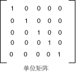

# 如何：使用颜色矩阵对单色进行转换
[!INCLUDE[ndptecgdiplus](../../../../includes/ndptecgdiplus-md.md)] 提供<xref:System.Drawing.Image>和<xref:System.Drawing.Bitmap>类用于存储和操作图像。 <xref:System.Drawing.Image> 和<xref:System.Drawing.Bitmap>对象 32 位数字的形式存储的每个像素的颜色： 8 位每次都红、 绿、 蓝方和字母。 每个四个组件是一个介于 0 到 255，其中 0 表示没有亮度，255 表示完整的强度。 Alpha 分量指定颜色的透明度： 0 表示完全透明，255 是完全不透明。  
  
 颜色向量是窗体 （红色、 绿色，蓝色、 alpha） 4 元组。 例如，颜色向量 （0，255，0，255） 表示一个不透明颜色没有红色或蓝色，但会达到最大亮度具有绿色。  
  
 用于表示颜色的另一个约定亮度达到最大使用数字 1。 使用这种约定，将由向量 （0、 1、 0、 1） 表示上一段中所述的颜色。 [!INCLUDE[ndptecgdiplus](../../../../includes/ndptecgdiplus-md.md)] 执行颜色转换时，请使用的约定 1 作为最大亮度。  
  
 乘以的 4 × 4 矩阵的颜色矢量，你可以应用到颜色矢量线性转换 （旋转、 缩放，以及类似的）。 但是，不能使用的 4 × 4 矩阵翻译 （非线性）。 如果将虚拟的第五个坐标 （例如，数字 1） 添加到每个颜色矢量，可以使用的 5 × 5 矩阵将线性转换和翻译的任意组合。 包含跟平移线性转换的转换称为仿射转换。  
  
 例如，假设你想要使用的颜色 （0.2，0.0，0.4，1.0） 开始，并应用以下转换：  
  
1.  Double 红色的组件  
  
2.  将 0.2 添加到红色、 绿色和蓝色组件  
  
 下面的矩阵乘法将按列出的顺序执行转换的对。  
  
   
  
 颜色矩阵的元素是按行和列然后索引 （从零开始）。 例如，由 M [4] [2] 表示第五个行和矩阵 M 的第三个列中的条目。  
  
 （在下图中所示） 的 5 × 5 标识矩阵具有的对角线上 1 和 0 其他位置。 如果颜色向量乘以单位矩阵，则不会更改颜色向量。 窗体的颜色转换矩阵一种简便方式是以开始单位矩阵，进行少量更改生成所需的转换。  
  
   
  
 矩阵和转换的更多详细讨论，请参阅[坐标系和坐标转换](../../../../docs/framework/winforms/advanced/coordinate-systems-and-transformations.md)。  
  
## 示例  
 下面的示例将一种颜色 （0.2，0.0，0.4，1.0） 和应用转换上面几段中所述的映像。  
  
 下图右侧显示在左侧的原始映像和变换后的图像。  
  
   
  
 下面的示例中的代码使用以下步骤进行重新着色：  
  
1.  初始化<xref:System.Drawing.Imaging.ColorMatrix>对象。  
  
2.  创建<xref:System.Drawing.Imaging.ImageAttributes>对象并将传递<xref:System.Drawing.Imaging.ColorMatrix>对象传递给<xref:System.Drawing.Imaging.ImageAttributes.SetColorMatrix%2A>方法<xref:System.Drawing.Imaging.ImageAttributes>对象。  
  
3.  传递<xref:System.Drawing.Imaging.ImageAttributes>对象传递给<xref:System.Drawing.Graphics.DrawImage%2A>方法<xref:System.Drawing.Graphics>对象。  
  
 [!code-csharp[System.Drawing.RecoloringImages#21](../../../../samples/snippets/csharp/VS_Snippets_Winforms/System.Drawing.RecoloringImages/CS/Class1.cs#21)]
 [!code-vb[System.Drawing.RecoloringImages#21](../../../../samples/snippets/visualbasic/VS_Snippets_Winforms/System.Drawing.RecoloringImages/VB/Class1.vb#21)]  
  
## 编译代码  
 前面的示例专用于 Windows 窗体，它需要 <xref:System.Windows.Forms.PaintEventArgs> `e`，后者是 <xref:System.Windows.Forms.Control.Paint> 事件处理程序的参数。  
  
## 请参阅  
 [对图像重新着色](../../../../docs/framework/winforms/advanced/recoloring-images.md)  
 [坐标系统和转换](../../../../docs/framework/winforms/advanced/coordinate-systems-and-transformations.md)
