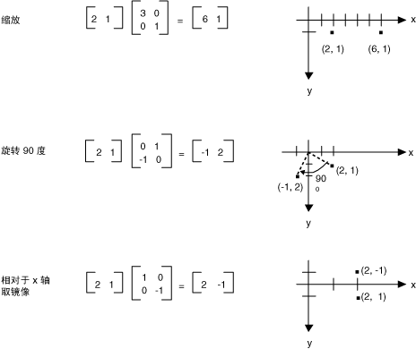
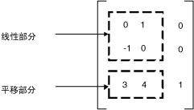

# 转换的矩阵表示形式
M × n 矩阵是一组按 m 行和 n 列排列的数字。 下图显示几个矩阵。  
  
   
  
 您可以通过添加各个元素添加相同大小的两个矩阵。 下图显示矩阵添加两个的示例。  
  
   
  
 M × n 矩阵可以乘以 n × p 矩阵，并且结果为 m × p 矩阵。 中的第一个矩阵的列数必须与第二个矩阵中的行数相同。 例如的 4 × 2 矩阵 2 的 × 3 矩阵来生成的 4 × 3 矩阵相乘。  
  
 平面和行和列矩阵的中点可以看作向量。 例如，（2，5） 是一个具有两个组件，向量和 （3，7，1） 是一个具有三个组件的向量。 两个向量的点积，如下所示定义：  
  
 (a、 b） • (c，d) = ac + bd  
  
 (a、 b、 c） • （d、 e、 f） 有 + = ad + cf  
  
 例如，个的点积 （2、 3） 和 （5，4） 是 (2)(5) + (3)(4) = 22。 点积 （2、 5、 1） 和 （4，3，1） 是 (2)(4) + (5)(3) + (1)(1) = 24。 请注意两个向量的点积，是一个数字，不是另一个向量。 另请注意，仅当两个矢量具有相同数量的组件，你可以计算点积。  
  
 让 A(i, j) 包含矩阵 A 中的第 i 个行和 jth 列条目。 例如 A （3，2） 是矩阵 A 中的第三行和第二列中的输入。 假设 A、 B 和 C 是矩阵和 AB = c。C 的条目的计算方式如下：  
  
 C （i，j） = （第 i，A 的行） • （列 j 的 B）  
  
 下图显示矩阵乘法的几个的示例。  
  
   
  
 如果您认为 1 × 2 矩阵作为平面中的点，您可以通过将乘以 2 × 2 矩阵转换该点。 下图显示应用于点 （2，1） 的多个转换。  
  
   
  
 所有前面的图中所示的转换都是线性转换。 某些其他转换，如转换过程中，不是线性的并且无法表示为 2 × 2 矩阵相乘。 假设你想开始 （2，1） 的点旋转 90 度，将其转换 3 个单位在 x 方向，并将其 y 方向的 4 个单位。 你可以通过使用跟矩阵添加矩阵乘法完成此操作。  
  
   
  
 线性转换 （2 × 2 矩阵相乘） 后, 跟一个翻译 （1 × 2 矩阵的加法） 称为仿射转换。 存储仿射转换矩阵 （一个用于线性部分），一个用于转换的一对中的替代方法是在 3 × 3 矩阵中存储整个转换。 若要完成此操作，请平面中的点必须存储在与虚拟的第三坐标的 1 × 3 矩阵。 常用方法是使所有第三个坐标等于 1。 例如，由矩阵 [2 1 1] 表示点 （2，1）。 下图显示仿射转换 （旋转 90 度; 转换在 x 方向 3 个单位，y 方向的 4 个单位） 表示为单个 3 × 3 矩阵相乘。  
  
   
  
 在前面的示例中，点 （2，1） 映射到的点 （2，6）。 请注意，3 × 3 矩阵的第三个列包含数字 0，0，1。 这将始终为仿射转换的 3 × 3 矩阵这种情况。 重要的数字是 1 和 2 的列中的六个数字。 矩阵的左上角 2 × 2 部分表示线性的转换的一部分，并且第三行中的前两个条目表示平移。  
  
   
  
 在[!INCLUDE[ndptecgdiplus](../../../../includes/ndptecgdiplus-md.md)]可以存储在仿射转换<xref:System.Drawing.Drawing2D.Matrix>对象。 因为表示仿射转换矩阵的第三个列始终为 （0，0，1），你在前两个列中指定六个数字，在构造时<xref:System.Drawing.Drawing2D.Matrix>对象。 语句`Matrix myMatrix = new Matrix(0, 1, -1, 0, 3, 4)`构造前面的图中所示的矩阵。  
  
## 复合转换  
 复合转换是转换，一个跟另一个序列。 请考虑矩阵和以下列表中的转换：  
  
|||  
|-|-|  
|矩阵 A|旋转 90 度|  
|矩阵 B|在 x 方向的 2 倍缩放|  
|矩阵 C|平移 y 方向的 3 个单位|  
  
 如果我们从开始点 （2，1）-表示通过矩阵 [2 1 1]-和乘以 A、 B，然后 C，点 （2，1） 将进行按列出的顺序的三个转换。  
  
 [2 1 1]ABC = [-2 5 1]  
  
 而是不是存储在三个单独的矩阵复合转换的三个部分，你可以乘以 A、 B 和 C 在一起以获取存储整个复合转换的单个 3 × 3 矩阵。 假设 ABC = d。然后乘以 D 点会使相同的结果为点乘以 A、 B，然后按 c。  
  
 [2 1 1]D = [-2 5 1]  
  
 下图显示了矩阵 A、 B、 C 和 d。  
  
   
  
 复合转换的矩阵，可以构建乘以单独的变换矩阵的事实意味着，可以在单个存储仿射转换的任何序列<xref:System.Drawing.Drawing2D.Matrix>对象。  
  
> [!CAUTION]
>  复合转换的顺序很重要。 一般情况下，旋转，再缩放、 然后转换不相同与先缩放、 旋转，然后转换。 同样，矩阵乘法的顺序很重要。 一般情况下，ABC 不与备份相同。  
  
 <xref:System.Drawing.Drawing2D.Matrix>类提供用于构建复合转换的多种方法： <xref:System.Drawing.Drawing2D.Matrix.Multiply%2A>， <xref:System.Drawing.Drawing2D.Matrix.Rotate%2A>， <xref:System.Drawing.Drawing2D.Matrix.RotateAt%2A>， <xref:System.Drawing.Drawing2D.Matrix.Scale%2A>， <xref:System.Drawing.Drawing2D.Matrix.Shear%2A>，和<xref:System.Drawing.Drawing2D.Matrix.Translate%2A>。 下面的示例创建一个复合转换，它首先旋转 30 度，然后按 y 方向的 2 倍缩放并会将 5 个单位在 x 方向的转换的矩阵。  
  
 [!code-csharp[System.Drawing.CoordinateSystems#11](../../../../samples/snippets/csharp/VS_Snippets_Winforms/System.Drawing.CoordinateSystems/CS/Class1.cs#11)]
 [!code-vb[System.Drawing.CoordinateSystems#11](../../../../samples/snippets/visualbasic/VS_Snippets_Winforms/System.Drawing.CoordinateSystems/VB/Class1.vb#11)]  
  
 下图显示矩阵。  
  
   
  
## 另请参阅  
 [坐标系统和转换](../../../../docs/framework/winforms/advanced/coordinate-systems-and-transformations.md)  
 [在托管 GDI+ 中使用转换](../../../../docs/framework/winforms/advanced/using-transformations-in-managed-gdi.md)
