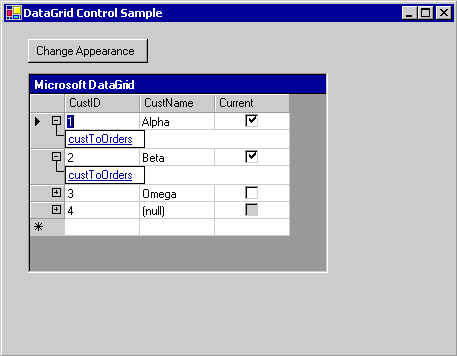

# DataGrid 控件概述（Windows 窗体）
> [!NOTE]
>  <xref:System.Windows.Forms.DataGridView>控件替换，并将功能添加到<xref:System.Windows.Forms.DataGrid>控件; 但是， <xref:System.Windows.Forms.DataGrid>控件以备向后兼容性和将来使用，您可以选择保留。 有关详细信息，请参阅[差异之间 Windows 窗体 DataGridView 控件与 DataGrid 控件](../../../../docs/framework/winforms/controls/differences-between-the-windows-forms-datagridview-and-datagrid-controls.md)。  
  
 Windows 窗体<xref:System.Windows.Forms.DataGrid>控件将数据显示在一系列的行和列。 最简单的情况是网格绑定到不包含任何关系的单个表的数据源。 在这种情况下，数据显示在简单的行和列中，如在电子表格中一样。 有关数据绑定到其他控件的详细信息，请参阅[数据绑定和 Windows 窗体](../../../../docs/framework/winforms/data-binding-and-windows-forms.md)。  
  
 如果<xref:System.Windows.Forms.DataGrid>绑定到具有多个数据相关的表，并在网格上启用了导航，网格将显示扩展器每一行中。 借助扩展器，用户可以从父表移到子表。 单击节点将显示子表，单击后退按钮将显示原始父表。 网格以这种方式显示表与表之间的层次结构关系。  
  
 下面的屏幕截图显示绑定到多个表的数据的 DataGrid。  
  
   
绑定到多个表的数据的 DataGrid  
  
 <xref:System.Windows.Forms.DataGrid>可提供数据集、 相关的表，以及丰富格式设置和编辑功能之间的导航用户界面。  
  
 显示数据和操作数据是两项单独的功能：控件处理用户界面，而数据更新则由 Windows 窗体数据绑定结构和 [!INCLUDE[dnprdnshort](../../../../includes/dnprdnshort-md.md)] 数据提供程序进行处理。 因此绑定到同一数据源的多个控件将保持同步。  
  
> [!NOTE]
>  如果您熟悉 Visual Basic 6.0 中的 DataGrid 控件，您会发现在 Windows 窗体中的一些重要差异<xref:System.Windows.Forms.DataGrid>控件。  
  
 当网格绑定到<xref:System.Data.DataSet>，行和列自动创建、 设置格式，并填充。 有关更多信息，请参见 [Data Binding and Windows Forms](../../../../docs/framework/winforms/data-binding-and-windows-forms.md)。 以下生成<xref:System.Windows.Forms.DataGrid>控件，您可以添加、 删除、 重新排列，并设置格式取决于您的需要的行和列。  
  
## 将数据绑定到控件  
 有关<xref:System.Windows.Forms.DataGrid>控件起作用，应将绑定到数据源使用<xref:System.Windows.Forms.DataGrid.DataSource%2A>和<xref:System.Windows.Forms.DataGrid.DataMember%2A>在设计时属性或<xref:System.Windows.Forms.DataGrid.SetDataBinding%2A>方法在运行时。 这种绑定<xref:System.Windows.Forms.DataGrid>到实例化的数据源对象，如<xref:System.Data.DataSet>或<xref:System.Data.DataTable>)。 <xref:System.Windows.Forms.DataGrid>控件将显示在对数据执行的操作的结果。 大多数特定于数据的操作不会执行通过<xref:System.Windows.Forms.DataGrid> ，而是通过数据源。  
  
 如果在绑定数据集中的数据通过任何机制进行了更新<xref:System.Windows.Forms.DataGrid>控件会反映这些变化。 如果数据网格及其表样式和列样式`ReadOnly`属性设置为`false`，可以通过更新数据集内的<xref:System.Windows.Forms.DataGrid>控件。  
  
 只有一个表可以中所示<xref:System.Windows.Forms.DataGrid>一次。 如果表之间定义了父-子关系，用户可以在相关表来选择要显示在表之间移动<xref:System.Windows.Forms.DataGrid>控件。 有关绑定信息<xref:System.Windows.Forms.DataGrid>控制转移到[!INCLUDE[vstecado](../../../../includes/vstecado-md.md)]数据源在设计时或运行的时，请参阅[如何︰ 将 Windows 窗体 DataGrid 控件绑定到数据源](../../../../docs/framework/winforms/controls/how-to-bind-the-windows-forms-datagrid-control-to-a-data-source.md)。  
  
 有效数据源<xref:System.Windows.Forms.DataGrid>包括︰  
  
-   <xref:System.Data.DataTable>类  
  
-   <xref:System.Data.DataView>类  
  
-   <xref:System.Data.DataSet>类  
  
-   <xref:System.Data.DataViewManager>类  
  
 如果源是一个数据集，那么该数据集可能是窗体中的某个对象或由 XML Web 服务传递到该窗体的某个对象。 可以绑定到类型化数据集，也可以绑定到非类型化数据集。  
  
 您还可以将绑定<xref:System.Windows.Forms.DataGrid>如果在结构中，例如数组中的元素的对象公开公共属性控制转移到其他结构。 网格将显示结构中该元素的所有公共属性。 例如，如果您将绑定<xref:System.Windows.Forms.DataGrid>控件添加到数组客户对象，该网格将显示这些客户对象的所有公共属性。 某些情况下，这意味着尽管可以绑定到结构，但最终绑定的结构可能不具有实际应用程序。 例如，你可以绑定到整数数组，但由于 `Integer` 数据类型不支持公共属性，因此该网格不会显示任何数据。  
  
 如果其元素公开公共属性，则可以绑定到以下结构：  
  
-   实现任何组件<xref:System.Collections.IList>接口。 这包括单维数组。  
  
-   实现任何组件<xref:System.ComponentModel.IListSource>接口。  
  
-   实现任何组件<xref:System.ComponentModel.IBindingList>接口。  
  
 有关可能数据源的详细信息，请参阅[支持的 Windows 窗体数据源](../../../../docs/framework/winforms/data-sources-supported-by-windows-forms.md)。  
  
## 网格显示  
 一个常见用途<xref:System.Windows.Forms.DataGrid>控件将显示单个表的数据集中的数据。 但是，该控件还可以用于显示多个表，包括相关表。 网格的显示可根据数据源自动调整。 下表显示各种配置显示的内容。  
  
|数据集内容|显示内容|  
|--------------------------|-----------------------|  
|单个表。|表显示在网格中。|  
|多个表。|网格可以显示树视图，用户可以通过浏览树视图找到希望显示的表。|  
|多个相关表。|网格可以显示树视图以便选择表格，你也可指定网格显示父表。 通过父表中的记录，用户可导航到相关的子行。|  
  
> [!NOTE]
>  使用关联数据集中的表<xref:System.Data.DataRelation>。  另请参阅[数据集中的超链接"http://msdn.microsoft.com/library/dbwcse3d (v = vs.110)"关系](http://msdn.microsoft.com/library/dbwcse3d\(v=vs.110\))或[数据集中的关系](http://msdn.microsoft.com/library/dbwcse3d\(v=vs.120\))。  
  
 当<xref:System.Windows.Forms.DataGrid>控件显示表和<xref:System.Windows.Forms.DataGrid.AllowSorting%2A>属性设置为`true`，数据可以通过单击列标题重新排序。 用户还可以添加行和编辑单元格。  
  
 通过使用父/子导航结构，向用户显示一组表之间的关系。 父表是最高级别的数据，子表是派生自父表中各个列表的数据表。 扩展器显示在包含子表的每个父行中。 单击扩展器将生成指向子表的类似 Web 链接的列表。 当用户选择某个链接时，将显示子表。 单击显示/隐藏父行图标 () 将隐藏父表有关的信息或将重新显示如果以前已经隐藏。 用户可以单击后退按钮，返回到之前查看的表。  
  
## 列和行  
 <xref:System.Windows.Forms.DataGrid>包含的集合<xref:System.Windows.Forms.DataGridTableStyle>中包含的对象<xref:System.Windows.Forms.DataGrid>控件的<xref:System.Windows.Forms.DataGrid.TableStyles%2A>属性。 表样式可能包含一套<xref:System.Windows.Forms.DataGridColumnStyle>中包含的对象<xref:System.Windows.Forms.DataGridTableStyle.GridColumnStyles%2A>属性<xref:System.Windows.Forms.DataGridTableStyle>... 您可以编辑<xref:System.Windows.Forms.DataGrid.TableStyles%2A>和<xref:System.Windows.Forms.DataGridTableStyle.GridColumnStyles%2A>属性通过使用集合编辑器通过访问**属性**窗口。  
  
 任何<xref:System.Windows.Forms.DataGridTableStyle>与关联<xref:System.Windows.Forms.DataGrid>可通过访问控制<xref:System.Windows.Forms.GridTableStylesCollection>。 <xref:System.Windows.Forms.GridTableStylesCollection>可以在设计器中编辑<xref:System.Windows.Forms.DataGridTableStyle>集合编辑器中，或以编程方式通过<xref:System.Windows.Forms.DataGrid>控件的<xref:System.Windows.Forms.DataGrid.TableStyles%2A>属性。  
  
   
下图显示 DataGrid 控件中包含的对象。  
  
 表样式和列样式与同步<xref:System.Data.DataTable>对象和<xref:System.Data.DataColumn>对象通过设置其`MappingName`属性设置为相应<xref:System.Data.DataTable.TableName%2A>和<xref:System.Data.DataColumn.ColumnName%2A>属性。 当<xref:System.Windows.Forms.DataGridTableStyle>没有列样式添加到<xref:System.Windows.Forms.DataGrid>控件绑定到有效的数据源和<xref:System.Windows.Forms.DataGridTableStyle.MappingName%2A>该表样式的属性设置为有效<xref:System.Data.DataTable.TableName%2A>属性、 集合<xref:System.Windows.Forms.DataGridColumnStyle>针对该表样式创建对象。 每个<xref:System.Data.DataColumn>中找到<xref:System.Data.DataTable.Columns%2A>集合<xref:System.Data.DataTable>，相应<xref:System.Windows.Forms.DataGridColumnStyle>添加到<xref:System.Windows.Forms.GridColumnStylesCollection>。 <xref:System.Windows.Forms.GridColumnStylesCollection>通过访问<xref:System.Windows.Forms.DataGridTableStyle.GridColumnStyles%2A>属性<xref:System.Windows.Forms.DataGridTableStyle>。 可以添加或删除从网格使用列<xref:System.Windows.Forms.GridColumnStylesCollection.Add%2A>或<xref:System.Windows.Forms.GridColumnStylesCollection.Remove%2A>方法<xref:System.Windows.Forms.GridColumnStylesCollection>。 有关详细信息，请参阅[如何︰ 向 Windows 窗体 DataGrid 控件添加表和列](../../../../docs/framework/winforms/controls/how-to-add-tables-and-columns-to-the-windows-forms-datagrid-control.md)和[如何︰ 删除或隐藏 Windows 窗体 DataGrid 控件中的列](../../../../docs/framework/winforms/controls/how-to-delete-or-hide-columns-in-the-windows-forms-datagrid-control.md)。  
  
 列类型的集合可扩展<xref:System.Windows.Forms.DataGridColumnStyle>具有丰富格式设置和编辑功能的类。 所有列类型都继承自<xref:System.Windows.Forms.DataGridColumnStyle>基类。 创建的类取决于<xref:System.Data.DataColumn.DataType%2A>属性<xref:System.Data.DataColumn>从中<xref:System.Web.UI.WebControls.DataGridColumn>为基础。 例如， <xref:System.Data.DataColumn>具有其<xref:System.Data.DataColumn.DataType%2A>属性设置为<xref:System.Boolean>将关联的<xref:System.Windows.Forms.DataGridBoolColumn>。 下表描述了每种列类型。  
  
|列名称|说明|  
|-----------------|-----------------|  
|<xref:System.Windows.Forms.DataGridTextBoxColumn>|接受并显示数据为格式化或非格式化的字符串。 编辑功能与它们进行编辑中一种简单的数据时相同<xref:System.Windows.Forms.TextBox>。 继承自<xref:System.Windows.Forms.DataGridColumnStyle>。|  
|<xref:System.Windows.Forms.DataGridBoolColumn>|接受并显示 `true`、`false` 和 null 值。 继承自<xref:System.Windows.Forms.DataGridColumnStyle>。|  
  
 双击列的右边缘可调整列大小，以显示其完整的标题和最宽的条目。  
  
## 表样式和列样式  
 一旦已建立的默认格式<xref:System.Windows.Forms.DataGrid>控件，您可以自定义数据网格中显示某些表时，将使用的颜色。  
  
 这通过创建的实例实现<xref:System.Windows.Forms.DataGridTableStyle>类。 表样式指定了不同的默认格式设置的特定表的格式设置<xref:System.Windows.Forms.DataGrid>控件本身。 每张表每次只能定义一种表样式。  
  
 有时，你会希望特定数据表中的特定列不同于表中的其他列。 可以通过创建一组自定义的列样式<xref:System.Windows.Forms.DataGridTableStyle.GridColumnStyles%2A>属性。  
  
 列样式与数据集中列相关，同样，表样式也与数据表相关。 与每张表每次只能定义一种表样式相同，在特定的表样式中每列也只能定义一种列样式。 这种关系中的列定义<xref:System.Windows.Forms.DataGridColumnStyle.MappingName%2A>属性。  
  
 如果已经创建了表样式，但未向其中添加列样式，则在运行时创建窗体和网格时，[!INCLUDE[vsprvs](../../../../includes/vsprvs-md.md)] 将添加默认列样式。 然而，如果已经创建了表样式，并且向其中添加了列样式，那么 [!INCLUDE[vsprvs](../../../../includes/vsprvs-md.md)] 将不会创建任何列样式。 此外，还需要定义列样式，并向它们分配映射名称以便在网格中显示你希望显示的列。  
  
 由于数据网格中包含的列是通过向它们分配列样式指定的，而尚未向列分配列样式，因此可包含网格中未显示的数据集中的数据列。 然而，由于数据列包含在数据集中，因此可采用编程方式来编辑未显示的数据。  
  
> [!NOTE]
>  一般情况下，应先创建列样式并将其添加到列样式集合，然后再向表样式集合添加表样式。 当将空表样式添加到集合时，会自动生成列样式。 如果你尝试添加具有重复的新列样式因此，将引发异常<xref:System.Windows.Forms.DataGridColumnStyle.MappingName%2A>向列样式集合的值。  
>   
>  有时，你可能只希望微调众多列中的某一列，例如，数据集包含 50 列，而你只需要其中的 49 列。 在这种情况下，相对简单的办法是导入所有 50 列，然后以编程方式删除其中的一列，而不是以编程方式添加 49 个单独的列。  
  
## 格式设置  
 格式设置可以应用于<xref:System.Windows.Forms.DataGrid>控件包括边框样式、 网格线样式、 字体、 标题属性、 数据对齐和交替行之间的背景颜色。 有关详细信息，请参阅[如何︰ 设置 Windows 窗体 DataGrid 控件的格式](../../../../docs/framework/winforms/controls/how-to-format-the-windows-forms-datagrid-control.md)。  
  
## 事件  
 除了常见的控件事件如<xref:System.Windows.Forms.Control.MouseDown>， <xref:System.Windows.Forms.Control.Enter>，和<xref:System.Windows.Forms.DataGrid.Scroll>、 <xref:System.Windows.Forms.DataGrid>控件支持的编辑和在网格内的导航关联的事件。 <xref:System.Windows.Forms.DataGrid.CurrentCell%2A>属性用于确定选择哪个单元格。 <xref:System.Windows.Forms.DataGrid.CurrentCellChanged>当用户导航到新的单元格时引发事件。 当用户导航到通过父/子关系的新表<xref:System.Windows.Forms.DataGrid.Navigate>引发事件。 <xref:System.Windows.Forms.DataGrid.BackButtonClick>用户时用户正在查看子表中，单击后退按钮时引发事件和<xref:System.Windows.Forms.DataGrid.ShowParentDetailsButtonClick>时单击显示/隐藏父行图标将引发事件。  
  
## 另请参阅  
 [DataGrid 控件](../../../../docs/framework/winforms/controls/datagrid-control-windows-forms.md)   
 [如何︰ 将 Windows 窗体 DataGrid 控件绑定到数据源](../../../../docs/framework/winforms/controls/how-to-bind-the-windows-forms-datagrid-control-to-a-data-source.md)   
 [如何︰ 添加表和列向 Windows 窗体 DataGrid 控件](../../../../docs/framework/winforms/controls/how-to-add-tables-and-columns-to-the-windows-forms-datagrid-control.md)   
 [如何︰ 删除或隐藏列在 Windows 窗体 DataGrid 控件](../../../../docs/framework/winforms/controls/how-to-delete-or-hide-columns-in-the-windows-forms-datagrid-control.md)   
 [如何︰ 设置 Windows 窗体 DataGrid 控件的格式](../../../../docs/framework/winforms/controls/how-to-format-the-windows-forms-datagrid-control.md)