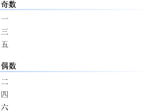

# 如何：使用设计器对 Windows 窗体 ListView 控件中的项进行分组
使用 <xref:System.Windows.Forms.ListView> 控件的分组功能可以以组的形式显示相关的项。  在屏幕上，这些组由包含组标题的水平组标头分隔。  可以使用 <xref:System.Windows.Forms.ListView> 组按字母顺序、日期或任何其他逻辑组合对项进行分组，从而简化大型列表的导航。  下图显示了一些分好组的项。  
  
   
  
 下面的过程需要一个**“Windows 应用程序”**项目，该项目拥有一个包含 <xref:System.Windows.Forms.ListView> 控件的窗体。  有关设置此类项目的信息，请参见[How to: Create a Windows Application Project](http://msdn.microsoft.com/zh-cn/b2f93fed-c635-4705-8d0e-cf079a264efa)和[如何：向 Windows 窗体添加控件](../../../../docs/framework/winforms/controls/how-to-add-controls-to-windows-forms.md)。  
  
 若要使用分组功能，必须先在设计器中或者以编程方式创建一个或多个 <xref:System.Windows.Forms.ListViewGroup> 对象。  一旦定义了组，即可向其分配项。  
  
> [!NOTE]
>  <xref:System.Windows.Forms.ListView> 组仅在应用程序调用 <xref:System.Windows.Forms.Application.EnableVisualStyles%2A?displayProperty=fullName> 方法时在 [!INCLUDE[WinXpFamily](../../../../includes/winxpfamily-md.md)] 上可用。  在以前的操作系统上，任何与组有关的代码都无效，并且组也不会出现。  有关更多信息，请参见 <xref:System.Windows.Forms.ListView.Groups%2A?displayProperty=fullName>。  
>   
>  显示的对话框和菜单命令可能会与“帮助”中的描述不同，具体取决于您现用的设置或版本。  若要更改设置，请在**“工具”**菜单上选择**“导入和导出设置”**。  有关更多信息，请参见 [Customizing Development Settings in Visual Studio](http://msdn.microsoft.com/zh-cn/22c4debb-4e31-47a8-8f19-16f328d7dcd3)。  
  
### 在设计器中添加或移除组  
  
1.  在**“属性”**窗口中，单击 <xref:System.Windows.Forms.ListView.Groups%2A> 属性旁的**“省略号”**\(\) 按钮。  
  
     出现**“ListViewGroup 集合编辑器”**。  
  
2.  若要添加组，请单击**“添加”**按钮。  然后可以设置新组的属性，如 <xref:System.Windows.Forms.ListViewGroup.Header%2A> 和 <xref:System.Windows.Forms.ListViewGroup.HeaderAlignment%2A> 属性。  若要移除某个组，请选择该组并单击**“移除”**按钮。  
  
### 在设计器中向组分配项  
  
1.  在**“属性”**窗口中，单击 <xref:System.Windows.Forms.ListView.Items%2A> 属性旁的**“省略号”**\(\) 按钮。  
  
     出现**“ListViewItem 集合编辑器”**。  
  
2.  若要添加新项，请单击**“添加”**按钮。  然后可以设置新项的属性，如 <xref:System.Windows.Forms.ListViewItem.Text%2A> 和 <xref:System.Windows.Forms.ListViewItem.ImageIndex%2A> 属性。  
  
3.  选择 <xref:System.Windows.Forms.ListViewItem.Group%2A> 属性，然后从下拉列表中选择一个组。  
  
## 请参阅  
 <xref:System.Windows.Forms.ListView>   
 <xref:System.Windows.Forms.ListView.Groups%2A>   
 <xref:System.Windows.Forms.ListViewGroup>   
 [ListView 控件](../../../../docs/framework/winforms/controls/listview-control-windows-forms.md)   
 [ListView 控件概述](../../../../docs/framework/winforms/controls/listview-control-overview-windows-forms.md)   
 [Windows XP Features and Windows Forms Controls](http://msdn.microsoft.com/zh-cn/bc7fab94-fce9-4bf1-a8ad-a5837c91c3c0)   
 [如何：使用 Windows 窗体 ListView 控件添加和移除项](../../../../docs/framework/winforms/controls/how-to-add-and-remove-items-with-the-windows-forms-listview-control.md)