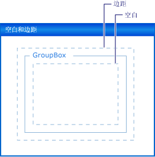

# 演练：使用 Padding、Margins 和 AutoSize 属性对 Windows 窗体控件进行布局
在窗体上精确地放置控件对于许多应用程序而言是高优先级。 **Windows 窗体设计器**为你提供许多布局工具实现此目的。 三个最重要是<xref:System.Windows.Forms.Control.Margin%2A>， <xref:System.Windows.Forms.Control.Padding%2A>，和<xref:System.Windows.Forms.Control.AutoSize%2A>属性，所有 Windows 窗体控件存在。  
  
 <xref:System.Windows.Forms.Control.Margin%2A> 属性定义控件周围的空间，该空间使其他控件与该控件的边框保持指定的距离。  
  
 <xref:System.Windows.Forms.Control.Padding%2A> 属性定义控件内部的空间，该空间使控件的内容（例如，其 <xref:System.Windows.Forms.Control.Text%2A> 属性的值）与该控件的边框保持指定的距离。  
  
 下图显示控件上的 <xref:System.Windows.Forms.Control.Padding%2A> 和 <xref:System.Windows.Forms.Control.Margin%2A> 属性。  
  
   
  
 <xref:System.Windows.Forms.Control.AutoSize%2A>属性告知一个控件，用于自动调整自身大小对其内容。 它将不调整自身大小要小于其原始值<xref:System.Windows.Forms.Control.Size%2A>属性，也将帐户的值其<xref:System.Windows.Forms.Control.Padding%2A>属性。  
  
 本演练涉及以下任务：  
  
-   创建 Windows 窗体项目  
  
-   边距设置为你的控件  
  
-   设置控件的填充  
  
-   自动调整控件大小  
  
 完成上述操作后，你将会了解这些重要布局功能所发挥的作用。  
  
> [!NOTE]
>  显示的对话框和菜单命令可能会与“帮助”中的描述不同，具体取决于你现用的设置或版本。 若要更改设置，请在 **“工具”** 菜单上选择 **“导入和导出设置”** 。 有关详细信息，请参阅[在 Visual Studio 中自定义开发设置](http://msdn.microsoft.com/en-us/22c4debb-4e31-47a8-8f19-16f328d7dcd3)。  
  
## 先决条件  
 若要完成本演练，你将需要：  
  
-   若要能够创建和运行 Windows 窗体应用程序项目的计算机上安装了 Visual Studio 的足够权限。  
  
## 创建项目  
 第一步是创建项目并设置窗体。  
  
#### 创建项目  
  
1.  创建**Windows 应用程序**项目称为`LayoutExample`。 有关详细信息，请参阅[如何： 创建 Windows 应用程序项目](http://msdn.microsoft.com/en-us/b2f93fed-c635-4705-8d0e-cf079a264efa)。  
  
2.  选择的窗体中**Windows 窗体设计器**。  
  
## 边距设置为你的控件  
 可以使用你控件之间设置的默认距离<xref:System.Windows.Forms.Control.Margin%2A>属性。 当你将控件移到另一个控件足够近，您将看到对齐线显示两个控件的边距。 要移动的控件也将对齐到由边距定义的距离。  
  
#### 若要在你使用的是 Margin 属性的窗体上排列控件  
  
1.  将两个<xref:System.Windows.Forms.Button>控件从**工具箱**拖动到窗体。  
  
2.  选择其中一个<xref:System.Windows.Forms.Button>控制并将其移近另一个，直到它们几乎接触。  
  
     观察它们之间的对齐线。 此距离为两个控件的总和<xref:System.Windows.Forms.Control.Margin%2A>值。 要移动的控件对齐到此距离。 有关详细信息，请参阅[演练： 在 Windows 窗体使用对齐线上排列控件](../../../../docs/framework/winforms/controls/walkthrough-arranging-controls-on-windows-forms-using-snaplines.md)。  
  
3.  更改<xref:System.Windows.Forms.Control.Margin%2A>属性之一的展开控件<xref:System.Windows.Forms.Control.Margin%2A>中的条目**属性**窗口和设置<xref:System.Windows.Forms.Padding.All%2A>属性设置为 20。  
  
4.  选择其中一个<xref:System.Windows.Forms.Button>控制并将其移接近另。  
  
     对齐线定义边距值的总和是更长，并且该控件从其他控件对齐更远的距离。  
  
5.  更改<xref:System.Windows.Forms.Control.Margin%2A>通过展开所选控件的属性<xref:System.Windows.Forms.Control.Margin%2A>中的条目**属性**窗口和设置<xref:System.Windows.Forms.Padding.Top%2A>属性设置为 5。  
  
6.  移动到其他控件下方所选的控件并观察对齐线更短。 将所选的控件移动到另一个控件的左侧，并观察对齐线将保留在步骤 4 中观测的值。  
  
7.  您可以将每个的方面<xref:System.Windows.Forms.Control.Margin%2A>属性， <xref:System.Windows.Forms.Padding.Left%2A>， <xref:System.Windows.Forms.Padding.Top%2A>， <xref:System.Windows.Forms.Padding.Right%2A>， <xref:System.Windows.Forms.Padding.Bottom%2A>、 到不同的值，或者让你可以将它们设置为使用相同的值的所有<xref:System.Windows.Forms.Padding.All%2A>属性。  
  
## 设置控件的填充  
 若要实现你的应用程序所需的精确布局，你的控件通常将包含子控件。 如果你想要指定父控件的边框的子控件的边框接近，使用父控件的<xref:System.Windows.Forms.Control.Padding%2A>结合子控件的属性<xref:System.Windows.Forms.Control.Margin%2A>属性。 <xref:System.Windows.Forms.Control.Padding%2A>属性还用于控制接近于控件的内容 (例如，<xref:System.Windows.Forms.Button>控件的<xref:System.Windows.Forms.Control.Text%2A>属性) 为其边界。  
  
#### 若要在使用填充窗体上排列控件  
  
1.  拖动<xref:System.Windows.Forms.Button>控件从**工具箱**拖动到窗体。  
  
2.  将 <xref:System.Windows.Forms.Button> 控件的 <xref:System.Windows.Forms.Control.AutoSize%2A> 属性值更改为 `true`。  
  
3.  更改<xref:System.Windows.Forms.Control.Padding%2A>属性通过展开<xref:System.Windows.Forms.Control.Padding%2A>中的条目**属性**窗口和设置<xref:System.Windows.Forms.Padding.All%2A>属性设置为 5。  
  
     控件扩展以提供新的填充的空间。  
  
4.  拖动<xref:System.Windows.Forms.GroupBox>控件从**工具箱**拖动到窗体。 拖动<xref:System.Windows.Forms.Button>控件从**工具箱**到<xref:System.Windows.Forms.GroupBox>控件。 位置<xref:System.Windows.Forms.Button>控制以便与的右下角对齐<xref:System.Windows.Forms.GroupBox>控件。  
  
     观察显示为对齐线<xref:System.Windows.Forms.Button>控件接近下边缘和右边框<xref:System.Windows.Forms.GroupBox>控件。 这些对齐线对应于<xref:System.Windows.Forms.Control.Margin%2A>属性<xref:System.Windows.Forms.Button>。  
  
5.  更改<xref:System.Windows.Forms.GroupBox>控件的<xref:System.Windows.Forms.Control.Padding%2A>属性通过展开<xref:System.Windows.Forms.Control.Padding%2A>中的条目**属性**窗口和设置<xref:System.Windows.Forms.Padding.All%2A>属性设置为 20。  
  
6.  选择<xref:System.Windows.Forms.Button>控件中<xref:System.Windows.Forms.GroupBox>控制并将其移向的中心<xref:System.Windows.Forms.GroupBox>。  
  
     对齐线在更大的距离出现与的边框<xref:System.Windows.Forms.GroupBox>控件。 此距离之<xref:System.Windows.Forms.Button>控件的<xref:System.Windows.Forms.Control.Margin%2A>属性和<xref:System.Windows.Forms.GroupBox>控件的<xref:System.Windows.Forms.Control.Padding%2A>属性。  
  
## 自动调整控件大小  
 在某些应用程序，控件的大小将不能相同在运行时在设计时那样。 文本<xref:System.Windows.Forms.Button>控件，例如，可能来自一个数据库，并将不能预先知道其长度。  
  
 当<xref:System.Windows.Forms.Control.AutoSize%2A>属性设置为`true`，控件将调整自身大小对其内容。 有关详细信息，请参阅[AutoSize 属性概述](../../../../docs/framework/winforms/controls/autosize-property-overview.md)。  
  
#### 若要在你使用 AutoSize 属性的窗体上排列控件  
  
1.  拖动<xref:System.Windows.Forms.Button>控件从**工具箱**拖动到窗体。  
  
2.  将 <xref:System.Windows.Forms.Button> 控件的 <xref:System.Windows.Forms.Control.AutoSize%2A> 属性值更改为 `true`。  
  
3.  更改<xref:System.Windows.Forms.Button>控件的<xref:System.Windows.Forms.Control.Text%2A>属性设置为"**针对其 Text 属性的长字符串，该按钮才**。"  
  
     如果提交了更改，<xref:System.Windows.Forms.Button>控件自行调整大小以容纳新的文本。  
  
4.  将另一个<xref:System.Windows.Forms.Button>控件从**工具箱**拖动到窗体。  
  
5.  更改<xref:System.Windows.Forms.Button>控件的<xref:System.Windows.Forms.Control.Text%2A>属性设置为"**针对其 Text 属性的长字符串，该按钮才。**"  
  
     如果提交了更改，<xref:System.Windows.Forms.Button>控件不调整大小本身，并且文本剪切的控件的右边缘。  
  
6.  更改<xref:System.Windows.Forms.Control.Padding%2A>属性通过展开<xref:System.Windows.Forms.Control.Padding%2A>中的条目**属性**窗口和设置<xref:System.Windows.Forms.Padding.All%2A>属性设置为 5。  
  
     所有四个边情况下，在控件的内部文本将被剪裁。  
  
7.  更改<xref:System.Windows.Forms.Button>控件的<xref:System.Windows.Forms.Control.AutoSize%2A>属性`true`。  
  
     <xref:System.Windows.Forms.Button>控件自行调整大小以容纳整个字符串。 此外，还将填充添加将文本环绕导致<xref:System.Windows.Forms.Button>控件展开所有四个方向。  
  
8.  拖动<xref:System.Windows.Forms.Button>控件从**工具箱**拖动到窗体。 将其置于窗体右下角附近。  
  
9. 将 <xref:System.Windows.Forms.Button> 控件的 <xref:System.Windows.Forms.Control.AutoSize%2A> 属性值更改为 `true`。  
  
10. 设置<xref:System.Windows.Forms.Button>控件的<xref:System.Windows.Forms.Control.Anchor%2A>属性<xref:System.Windows.Forms.AnchorStyles.Right>， <xref:System.Windows.Forms.AnchorStyles.Bottom>。  
  
11. 更改<xref:System.Windows.Forms.Button>控件的<xref:System.Windows.Forms.Control.Text%2A>属性设置为"**针对其 Text 属性的长字符串，该按钮才。**"  
  
     如果提交了更改，<xref:System.Windows.Forms.Button>控件在调整自身大小的左侧。 一般情况下，自动调整大小将增加相反的方向中的控件的大小及其<xref:System.Windows.Forms.Control.Anchor%2A>属性设置。  
  
## AutoSize 和 AutoSizeMode 属性  
 某些控件支持`AutoSizeMode`属性，这为你提供更好地控制细化控件自动调整大小行为。  
  
#### 若要使用 AutoSizeMode 属性  
  
1.  拖动<xref:System.Windows.Forms.Panel>控件从**工具箱**拖动到窗体。  
  
2.  设置的值<xref:System.Windows.Forms.Panel>控件的<xref:System.Windows.Forms.Control.AutoSize%2A>属性`true`。  
  
3.  拖动<xref:System.Windows.Forms.Button>控件从**工具箱**到<xref:System.Windows.Forms.Panel>控件。  
  
4.  位置<xref:System.Windows.Forms.Button>控件的右下角附近<xref:System.Windows.Forms.Panel>控件。  
  
5.  选择<xref:System.Windows.Forms.Panel>控件并抓住右下角尺寸控点。 调整大小<xref:System.Windows.Forms.Panel>控件，使其更大、 更小。  
  
    > [!NOTE]
    >  你可以自由地调整大小<xref:System.Windows.Forms.Panel>控件，但你无法调整其大小小于的位置<xref:System.Windows.Forms.Button>控件的右下角。 此行为的默认值由指定`AutoSizeMode`属性，它是<xref:System.Windows.Forms.AutoSizeMode.GrowOnly>。  
  
6.  设置的值<xref:System.Windows.Forms.Panel>控件的`AutoSizeMode`属性<xref:System.Windows.Forms.AutoSizeMode.GrowAndShrink>。  
  
     <xref:System.Windows.Forms.Panel>控件自行调整大小以环绕<xref:System.Windows.Forms.Button>控件。 不能调整<xref:System.Windows.Forms.Panel>控件。  
  
7.  拖动<xref:System.Windows.Forms.Button>朝着的左上角的控件<xref:System.Windows.Forms.Panel>控件。  
  
     <xref:System.Windows.Forms.Panel>控件的大小调整为<xref:System.Windows.Forms.Button>控件的新位置。  
  
## 后续步骤  
 有许多其他布局功能，用于在 Windows 窗体应用程序排列控件。 下面是可能会尝试某些组合：  
  
-   生成窗体使用<xref:System.Windows.Forms.TableLayoutPanel>控件。 有关详细信息，请参阅[演练： 在 Windows 窗体使用 TableLayoutPanel 上排列控件](../../../../docs/framework/winforms/controls/walkthrough-arranging-controls-on-windows-forms-using-a-tablelayoutpanel.md)。 请尝试更改的值<xref:System.Windows.Forms.TableLayoutPanel>控件的<xref:System.Windows.Forms.Control.Padding%2A>属性，以及<xref:System.Windows.Forms.Control.Margin%2A>及其子控件上的属性。  
  
-   请尝试相同的试验使用<xref:System.Windows.Forms.FlowLayoutPanel>控件。 有关详细信息，请参阅[演练： 在 Windows 窗体使用 FlowLayoutPanel 上排列控件](../../../../docs/framework/winforms/controls/walkthrough-arranging-controls-on-windows-forms-using-a-flowlayoutpanel.md)。  
  
-   停靠子控件在试验<xref:System.Windows.Forms.Panel>控件。 <xref:System.Windows.Forms.Control.Padding%2A>属性是的更多常规实现<xref:System.Windows.Forms.ScrollableControl.DockPadding%2A>属性，并且可以满足自己这种情况，通过将子控件放入<xref:System.Windows.Forms.Panel>控件并设置子控件的<xref:System.Windows.Forms.Control.Dock%2A>属性<xref:System.Windows.Forms.DockStyle.Fill>. 设置<xref:System.Windows.Forms.Panel>控件的<xref:System.Windows.Forms.Control.Padding%2A>到各种值并记下影响的属性。  
  
## 另请参阅  
 <xref:System.Windows.Forms.Control.AutoSize%2A>  
 <xref:System.Windows.Forms.ScrollableControl.DockPadding%2A>  
 <xref:System.Windows.Forms.Control.Margin%2A>  
 <xref:System.Windows.Forms.Control.Padding%2A>  
 [AutoSize 属性概述](../../../../docs/framework/winforms/controls/autosize-property-overview.md)  
 [演练：使用 TableLayoutPanel 在 Windows 窗体上排列控件](../../../../docs/framework/winforms/controls/walkthrough-arranging-controls-on-windows-forms-using-a-tablelayoutpanel.md)  
 [演练：使用 FlowLayoutPanel 在 Windows 窗体上排列控件](../../../../docs/framework/winforms/controls/walkthrough-arranging-controls-on-windows-forms-using-a-flowlayoutpanel.md)  
 [演练：使用对齐线在 Windows 窗体上排列控件](../../../../docs/framework/winforms/controls/walkthrough-arranging-controls-on-windows-forms-using-snaplines.md)
