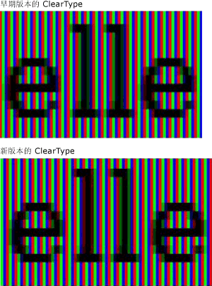

# ClearType 概述
本主题提供 [!INCLUDE[TLA#tla_winclient](../../../../includes/tlasharptla-winclient-md.md)] 中的 [!INCLUDE[TLA#tla_ct](../../../../includes/tlasharptla-ct-md.md)] 技术概述。  
  
   
  
   
## 技术概述  
 [!INCLUDE[TLA2#tla_ct](../../../../includes/tla2sharptla-ct-md.md)] 是由 [!INCLUDE[TLA#tla_ms](../../../../includes/tlasharptla-ms-md.md)] 开发的一种软件技术，可以改善文字在现有 LCD（液晶显示器，如便携式计算机屏幕、Pocket PC 屏幕和平板显示器）上的可读性。  [!INCLUDE[TLA2#tla_ct](../../../../includes/tla2sharptla-ct-md.md)] 通过访问 LCD 屏幕的每个像素中的单个垂直色带元素来工作。  在 [!INCLUDE[TLA2#tla_ct](../../../../includes/tla2sharptla-ct-md.md)] 之前，计算机能够显示的最小级别的细节是一个像素，但是有了在 LCD 显示器上运行的 [!INCLUDE[TLA2#tla_ct](../../../../includes/tla2sharptla-ct-md.md)]，我们现在显示的文本特征可以小到一个像素宽度的一部分。  额外的分辨率增加了文本显示中细节的清晰度，使其更便于长时间阅读。  
  
 [!INCLUDE[TLA#tla_winclient](../../../../includes/tlasharptla-winclient-md.md)] 中的 [!INCLUDE[TLA2#tla_ct](../../../../includes/tla2sharptla-ct-md.md)] 是最新一代的 [!INCLUDE[TLA2#tla_ct](../../../../includes/tla2sharptla-ct-md.md)]，该版本相对于 [!INCLUDE[TLA#tla_gdi](../../../../includes/tlasharptla-gdi-md.md)] 中的版本有了若干项改进。  
  
   
## 子像素定位  
 对比前一个 [!INCLUDE[TLA2#tla_ct](../../../../includes/tla2sharptla-ct-md.md)] 版本，一个重大的改进是使用子像素定位。  与 [!INCLUDE[TLA2#tla_gdi](../../../../includes/tla2sharptla-gdi-md.md)] 中的 [!INCLUDE[TLA2#tla_ct](../../../../includes/tla2sharptla-ct-md.md)] 实现不同，[!INCLUDE[TLA#tla_winclient](../../../../includes/tlasharptla-winclient-md.md)] 中的 [!INCLUDE[TLA2#tla_ct](../../../../includes/tla2sharptla-ct-md.md)] 允许标志符号在像素内开始，而不是必须在像素的起始边界处开始。  由于定位标志符号中的这种特别的分辨率，标志符号的间隔和比例更为精确和一致。  
  
 下面两个示例演示在使用子像素定位时标志符号如何在任意子像素边界处开始。  左边的示例是使用早期的 [!INCLUDE[TLA2#tla_ct](../../../../includes/tla2sharptla-ct-md.md)] 呈现器版本呈现的，没有采用子像素定位。  右边的示例是使用新的 [!INCLUDE[TLA2#tla_ct](../../../../includes/tla2sharptla-ct-md.md)] 呈现器版本呈现的，采用了子像素定位。  请注意，右侧图像中的每个 **e** 和 **l** 的呈现都稍有不同，因为每一个都开始于一个不同的子像素。  当在屏幕上以正常大小查看文本，由于标志符号图像的高对比度，所以这种差异不易觉察。  因为 [!INCLUDE[TLA2#tla_ct](../../../../includes/tla2sharptla-ct-md.md)] 中采用了复杂的颜色筛选，所以才能显示出此差异。  
  
   
使用低版和高版 ClearType 所显示的文本对比  
  
 下面两个示例将新版 [!INCLUDE[TLA2#tla_ct](../../../../includes/tla2sharptla-ct-md.md)] 呈现器的输出与低版 [!INCLUDE[TLA2#tla_ct](../../../../includes/tla2sharptla-ct-md.md)] 呈现器的输出进行对比。  显示在右侧的子像素定位显著改善了屏幕上的字样间隔，尤其是在较小的尺寸处，子像素与整个像素之间的差异表示了明显的标志符号宽度比例。  请注意字母之间的间隔在第二幅图中更为均等。  子像素定位相对于文本屏幕总体外观的累积优势大大增强，并意味着 [!INCLUDE[TLA2#tla_ct](../../../../includes/tla2sharptla-ct-md.md)] 技术的重大发展。  
  
   
使用低版和高版 ClearType 的文本对比  
  
   
## Y 方向抗锯齿  
 [!INCLUDE[TLA#tla_winclient](../../../../includes/tlasharptla-winclient-md.md)] 中的 [!INCLUDE[TLA2#tla_ct](../../../../includes/tla2sharptla-ct-md.md)] 的另一个改进是 Y 方向抗锯齿。  [!INCLUDE[TLA2#tla_gdi](../../../../includes/tla2sharptla-gdi-md.md)] 中的 [!INCLUDE[TLA2#tla_ct](../../../../includes/tla2sharptla-ct-md.md)] 不具有 Y 方向抗锯齿功能，它在 X 轴方向提供较好的分辨率，但在 Y 轴上则并非如此。  在平缓曲线的顶部和底部，带锯齿的边缘会降低其可读性。  
  
 下面的示例演示了不具有 Y 方向抗锯齿功能的效果。  在这种情况下，字母顶部和底部的带锯齿边缘是很明显的。  
  
   
平缓曲线上具有带锯齿边缘的文本  
  
 [!INCLUDE[TLA#tla_winclient](../../../../includes/tlasharptla-winclient-md.md)] 中的 [!INCLUDE[TLA2#tla_ct](../../../../includes/tla2sharptla-ct-md.md)] 提供 Y 方向级别的抗锯齿功能，使任何带锯齿的边缘变得平滑。  这对于改进东亚语言的可读性尤其重要，在东亚语言中，表意文字几乎具有等量的水平平缓曲线和垂直平缓曲线。  
  
 下面的示例演示 Y 方向抗锯齿功能的效果。  在本例中，字母的顶部和底部表现为平缓曲线。  
  
   
使用 ClearType Y 轴方向抗锯齿的文本  
  
   
## 硬件加速  
 [!INCLUDE[TLA#tla_winclient](../../../../includes/tlasharptla-winclient-md.md)] 中的 [!INCLUDE[TLA2#tla_ct](../../../../includes/tla2sharptla-ct-md.md)] 可以利用硬件加速来提高性能，以减少 CPU 负载和系统内存需求。  通过使用像素着色器和图形卡的视频内存，[!INCLUDE[TLA2#tla_ct](../../../../includes/tla2sharptla-ct-md.md)] 提供更快的文本呈现，尤其在使用动画时此优势更为明显。  
  
 [!INCLUDE[TLA#tla_winclient](../../../../includes/tlasharptla-winclient-md.md)] 中的 [!INCLUDE[TLA2#tla_ct](../../../../includes/tla2sharptla-ct-md.md)] 不修改系统范围的 [!INCLUDE[TLA2#tla_ct](../../../../includes/tla2sharptla-ct-md.md)] 设置。  在 [!INCLUDE[TLA#tla_mswin](../../../../includes/tlasharptla-mswin-md.md)] 中禁用 [!INCLUDE[TLA2#tla_ct](../../../../includes/tla2sharptla-ct-md.md)] 会将 [!INCLUDE[TLA#tla_winclient](../../../../includes/tlasharptla-winclient-md.md)] 抗锯齿功能设置为灰度模式。此外，[!INCLUDE[TLA#tla_winclient](../../../../includes/tlasharptla-winclient-md.md)] 中的 [!INCLUDE[TLA2#tla_ct](../../../../includes/tla2sharptla-ct-md.md)] 不修改 [ClearType Tuner PowerToy](http://www.microsoft.com/typography/ClearTypePowerToy.mspx)（ClearType 调谐器 PowerToy）的设置。  
  
 [!INCLUDE[TLA#tla_winclient](../../../../includes/tlasharptla-winclient-md.md)] 体系结构设计决策之一是使不依赖于分辨率的布局更好地支持较高分辨率 DPI 显示器，这种显示器正日益普及。  此决策的后果是 [!INCLUDE[TLA#tla_winclient](../../../../includes/tlasharptla-winclient-md.md)] 不支持某些东亚字体中抗锯齿的文本呈现或位图，因为它们都依赖于分辨率。  
  
   
## 更多信息  
 [ClearType Information（ClearType 信息）](http://www.microsoft.com/typography/ClearTypeInfo.mspx)  
  
 [ClearType Tuner PowerToy（ClearType 调谐器 PowerToy）](http://www.microsoft.com/typography/ClearTypePowerToy.mspx)  
  
## 请参阅  
 [ClearType 注册表设置](../../../../docs/framework/wpf/advanced/cleartype-registry-settings.md)