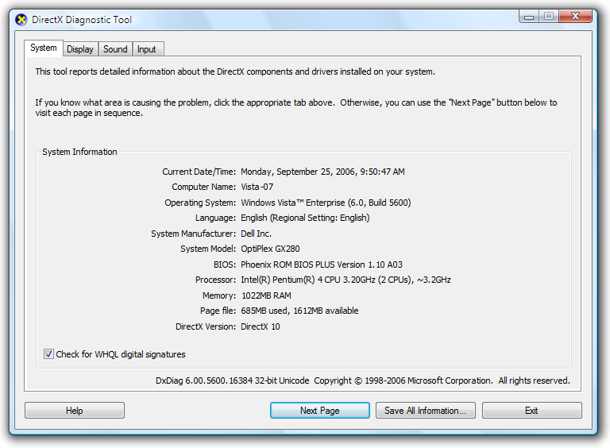

# 图形呈现层
呈现层为运行 [!INCLUDE[TLA2#tla_winclient](../../../../includes/tla2sharptla-winclient-md.md)] 应用程序的设备定义图形硬件功能和性能级别。  
  
 [!INCLUDE[autoOutline](../Token/autoOutline_md.md)]  
  
   
## 图形硬件  
 对呈现层级别影响最大的图形硬件功能包括：  
  
-   **视频 RAM** 图形硬件中的视频内存量决定了可用于合成图形的缓冲区的大小和数量。  
  
-   **像素着色器** 像素着色器是按像素计算效果的图形处理功能。  每个显示帧可能有数百万像素需要处理，具体取决于所显示的图形的分辨率。  
  
-   **顶点着色器** 顶点着色器是对对象的顶点数据执行数学运算的图形处理功能。  
  
-   **多纹理支持** 多纹理支持是指在对三维图形对象执行混合操作期间应用两个或更多个不同纹理的功能。  多纹理支持的程度由图形硬件中的多纹理单元数决定。  
  
   
## 呈现层定义  
 图形硬件的功能决定了 [!INCLUDE[TLA2#tla_winclient](../../../../includes/tla2sharptla-winclient-md.md)] 应用程序的呈现功能。  [!INCLUDE[TLA2#tla_winclient](../../../../includes/tla2sharptla-winclient-md.md)] 系统定义了三个呈现层：  
  
-   **呈现层 0** 无图形硬件加速。  所有图形功能都使用软件加速。  [!INCLUDE[TLA2#tla_dx](../../../../includes/tla2sharptla-dx-md.md)] 版本级别低于 9.0。  
  
-   **呈现层 1** 某些图形功能使用图形硬件加速。  [!INCLUDE[TLA2#tla_dx](../../../../includes/tla2sharptla-dx-md.md)] 版本级别高于或等于 9.0。  
  
-   **呈现层 2** 大多数图形功能都使用图形硬件加速。  [!INCLUDE[TLA2#tla_dx](../../../../includes/tla2sharptla-dx-md.md)] 版本级别高于或等于 9.0。  
  
 使用 <xref:System.Windows.Media.RenderCapability.Tier%2A?displayProperty=fullName> 属性可以在应用程序运行时检索呈现层。  使用呈现层可确定设备是否支持某些硬件加速图形功能。  然后应用程序就可以在运行时根据设备支持的呈现层采用不同的代码路径。  
  
### 呈现层 0  
 呈现层的值为 0 意味着设备上的应用程序没有图形硬件加速可用。  在这一层次级别，应假设所有图形都将由软件呈现，而没有硬件加速。  这一层的功能与低于 9.0 的 [!INCLUDE[TLA2#tla_dx](../../../../includes/tla2sharptla-dx-md.md)] 版本对应。  
  
### 呈现层 1 与呈现层 2  
  
> [!NOTE]
>  从 .NET Framework 4 开始，呈现层 1 进行了重新定义，只包含支持 [!INCLUDE[TLA2#tla_dx](../../../../includes/tla2sharptla-dx-md.md)] 9.0 或更高版本的图形硬件。  支持 [!INCLUDE[TLA2#tla_dx](../../../../includes/tla2sharptla-dx-md.md)] 7 或 8 的图形硬件现在定义为呈现层 0。  
  
 呈现层的值为 1 或 2 意味着，如果必要的系统资源可用并且尚未耗尽，则 [!INCLUDE[TLA2#tla_winclient](../../../../includes/tla2sharptla-winclient-md.md)] 的大部分图形功能会使用硬件加速。  这对应于高于或等于 9.0 的 [!INCLUDE[TLA2#tla_dx](../../../../includes/tla2sharptla-dx-md.md)] 版本。  
  
 下表显示呈现层 1 和呈现层 2 的图形硬件要求差异：  
  
|功能|层 1|层 2|  
|--------|---------|---------|  
|[!INCLUDE[TLA2#tla_dx](../../../../includes/tla2sharptla-dx-md.md)] 版本|必须高于或等于 9.0。|必须高于或等于 9.0。|  
|视频 RAM|必须大于或等于 60MB。|必须大于或等于 120MB。|  
|像素着色器|版本级别必须高于或等于 2.0。|版本级别必须高于或等于 2.0。|  
|顶点着色器|没有要求。|版本级别必须高于或等于 2.0。|  
|多纹理单元|没有要求。|单元数必须大于或等于 4。|  
  
 下面的功能是呈现层 1 和呈现层 2 的硬件加速功能：  
  
|功能|注释|  
|--------|--------|  
|二维呈现|支持大多数二维呈现。|  
|三维光栅化|支持大多数三维光栅化。|  
|三维各向异性筛选|[!INCLUDE[TLA2#tla_winclient](../../../../includes/tla2sharptla-winclient-md.md)] 在呈现三维内容时尝试使用各向异性筛选。  各向异性筛选是指改善位置较远且与照相机成一定角度的图面上的纹理的图像质量。|  
|三维 MIP 映射|[!INCLUDE[TLA2#tla_winclient](../../../../includes/tla2sharptla-winclient-md.md)] 会在呈现三维内容时尝试使用 MIP 映射。当纹理占据 <xref:System.Windows.Controls.Viewport3D> 中的较小视图区域时，MIP 映射可改进纹理呈现的质量。|  
|径向渐变|虽然支持此功能，但应避免对大型对象使用 <xref:System.Windows.Media.RadialGradientBrush>。|  
|三维光照计算|[!INCLUDE[TLA2#tla_winclient](../../../../includes/tla2sharptla-winclient-md.md)] 执行每个顶点的光照，这意味着必须在应用于网格的每个材料的每个顶点计算光照强度。|  
|文本呈现|子像素字体呈现使用图形硬件上可用的像素着色器。|  
  
 下面的功能只是呈现层 2 的硬件加速功能：  
  
|功能|注释|  
|--------|--------|  
|三维抗锯齿|只有支持 Windows 显示驱动程序模型 \(WDDM\) 的操作系统（如 [!INCLUDE[TLA2#tla_winvista](../../../../includes/tla2sharptla-winvista-md.md)] 和 [!INCLUDE[win7](../../../../includes/win7-md.md)]）才支持三维抗锯齿。|  
  
 下面的功能**不是**硬件加速功能：  
  
|功能|注释|  
|--------|--------|  
|打印内容|所有打印内容都使用 [!INCLUDE[TLA2#tla_winclient](../../../../includes/tla2sharptla-winclient-md.md)] 软件管道呈现。|  
|使用 <xref:System.Windows.Media.Imaging.RenderTargetBitmap> 的光栅化内容|使用 <xref:System.Windows.Media.Imaging.RenderTargetBitmap> 的 <xref:System.Windows.Media.Imaging.RenderTargetBitmap.Render%2A> 方法呈现的任何内容。|  
|使用 <xref:System.Windows.Media.TileBrush> 的平铺内容|<xref:System.Windows.Media.TileBrush> 的 <xref:System.Windows.Media.TileBrush.TileMode%2A> 属性设置为 <xref:System.Windows.Media.TileMode> 的任何平铺内容。|  
|超过图形硬件的最大纹理大小的图面|对于大多数图形硬件而言，大型图面是指达到 2048x2048 或 4096x4096 像素大小的图面。|  
|视频 RAM 要求超过图形硬件内存的任何操作|可以使用 Windows SDK 中的 [WPF 性能套件](../Topic/WPF%20Performance%20Suite.md)包含的分析器工具，来监视应用程序视频 RAM 使用情况。|  
|分层窗口|分层窗口使 [!INCLUDE[TLA2#tla_winclient](../../../../includes/tla2sharptla-winclient-md.md)] 应用程序可以将内容呈现到屏幕中的非矩形窗口。  在支持 Windows 显示驱动程序模型 \(WDDM\)的操作系统（如 [!INCLUDE[TLA2#tla_winvista](../../../../includes/tla2sharptla-winvista-md.md)] 和 [!INCLUDE[win7](../../../../includes/win7-md.md)]）上，分层窗口是硬件加速的。  在其他系统上，如 [!INCLUDE[winxp](../../../../includes/winxp-md.md)]，分层窗口是通过软件来呈现的，没有硬件加速。   在 [!INCLUDE[TLA2#tla_winclient](../../../../includes/tla2sharptla-winclient-md.md)] 中，您可以通过设置以下 <xref:System.Windows.Window> 属性来启用分层窗口：   -   <xref:System.Windows.Window.WindowStyle%2A> \= <xref:System.Windows.WindowStyle> -   <xref:System.Windows.Window.AllowsTransparency%2A> \= `true` -   <xref:System.Windows.Controls.Control.Background%2A> \= <xref:System.Windows.Media.Brushes.Transparent%2A>|  
  
   
## 其他资源  
 下面的资源可帮助您分析 [!INCLUDE[TLA2#tla_winclient](../../../../includes/tla2sharptla-winclient-md.md)] 应用程序的性能特征。  
  
### 图形呈现注册表设置  
 [!INCLUDE[TLA2#tla_winclient](../../../../includes/tla2sharptla-winclient-md.md)] 提供了四个注册表设置来控制 [!INCLUDE[TLA2#tla_winclient](../../../../includes/tla2sharptla-winclient-md.md)] 呈现：  
  
|设置|说明|  
|--------|--------|  
|**禁用硬件加速选项**|指定是否应启用硬件加速。|  
|**最大多级采样值**|指定消除 [!INCLUDE[TLA2#tla_3d](../../../../includes/tla2sharptla-3d-md.md)] 内容锯齿的多级采样级别。|  
|**必需的视频驱动程序日期设置**|指定系统是否对 2004 年 11 月之前发布的驱动程序禁用硬件加速。|  
|**使用参考光栅器选项**|指定 [!INCLUDE[TLA2#tla_winclient](../../../../includes/tla2sharptla-winclient-md.md)] 是否应使用参考光栅器。|  
  
 知道如何引用 [!INCLUDE[TLA2#tla_winclient](../../../../includes/tla2sharptla-winclient-md.md)] 注册表设置的任何外部配置实用工具都可以访问这些设置。  还可以直接使用 [!INCLUDE[TLA#tla_mswin](../../../../includes/tlasharptla-mswin-md.md)] 注册表编辑器来访问这些值，从而创建或修改这些设置。  有关更多信息，请参见[图形呈现注册表设置](../../../../docs/framework/wpf/graphics-multimedia/graphics-rendering-registry-settings.md)。  
  
### WPF 性能分析工具  
 [!INCLUDE[TLA2#tla_winclient](../../../../includes/tla2sharptla-winclient-md.md)] 提供了一套性能分析工具，来帮助您分析应用程序的运行时行为，并确定可以应用的性能优化的类型。  下表列出了 [!INCLUDE[TLA2#tla_lhsdk](../../../../includes/tla2sharptla-lhsdk-md.md)] 工具 WPF 性能套件中包括的性能分析工具：  
  
|工具|说明|  
|--------|--------|  
|分析器|用于分析呈现行为。|  
|可视化探查器|用于按可视化树中的元素分析 [!INCLUDE[TLA2#tla_winclient](../../../../includes/tla2sharptla-winclient-md.md)] 服务（如布局和事件处理）的使用。|  
  
 WPF 性能套件提供性能数据的丰富图形视图。  有关 WPF 性能工具的更多信息，请参见 [WPF 性能套件](../Topic/WPF%20Performance%20Suite.md)。  
  
### DirectX 诊断工具  
 [!INCLUDE[TLA2#tla_dx](../../../../includes/tla2sharptla-dx-md.md)] 诊断工具 Dxdiag.exe 旨在帮助您解决与 [!INCLUDE[TLA2#tla_dx](../../../../includes/tla2sharptla-dx-md.md)] 有关的问题。  [!INCLUDE[TLA2#tla_dx](../../../../includes/tla2sharptla-dx-md.md)] 诊断工具的默认安装文件夹是：  
  
 `~\Windows\System32`  
  
 当您运行 [!INCLUDE[TLA2#tla_dx](../../../../includes/tla2sharptla-dx-md.md)] 诊断工具时，主窗口中包含一组选项卡，使您可以显示和诊断与 [!INCLUDE[TLA2#tla_dx](../../../../includes/tla2sharptla-dx-md.md)] 有关的信息。  例如，**“系统”**选项卡提供有关您的计算机的系统信息，并指定安装在您的计算机上的 [!INCLUDE[TLA2#tla_dx](../../../../includes/tla2sharptla-dx-md.md)] 的版本。  
  
   
“DirectX 诊断工具”主窗口  
  
## 请参阅  
 <xref:System.Windows.Media.RenderCapability>   
 <xref:System.Windows.Media.RenderOptions>   
 [优化 WPF 应用程序性能](../../../../docs/framework/wpf/advanced/optimizing-wpf-application-performance.md)   
 [WPF 性能套件](../Topic/WPF%20Performance%20Suite.md)   
 [图形呈现注册表设置](../../../../docs/framework/wpf/graphics-multimedia/graphics-rendering-registry-settings.md)   
 [动画提示和技巧](../../../../docs/framework/wpf/graphics-multimedia/animation-tips-and-tricks.md)