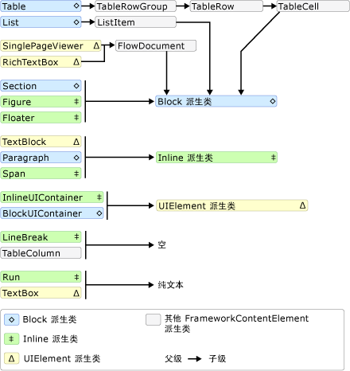

# TextElement 内容模型概述
此内容模型概述介绍支持的内容<xref:System.Windows.Documents.TextElement>。 <xref:System.Windows.Documents.Paragraph>类是一种<xref:System.Windows.Documents.TextElement>。 内容模型描述哪些对象/元素可包含在其他对象/元素中。 本概述汇总了用于派生自的对象的内容模型<xref:System.Windows.Documents.TextElement>。 有关详细信息，请参阅[流文档概述](../../../../docs/framework/wpf/advanced/flow-document-overview.md)。  
  
  
   
## 内容模型图  
 下图总结了内容模型，类派生自<xref:System.Windows.Documents.TextElement>以及如何其他非`TextElement`适应此模型的类。  
  
   
  
 如下所示从之前的图，允许的元素的子级不一定由是否派生自该类<xref:System.Windows.Documents.Block>类或<xref:System.Windows.Documents.Inline>类。 例如， <xref:System.Windows.Documents.Span> ( <xref:System.Windows.Documents.Inline>-派生类) 只能有<xref:System.Windows.Documents.Inline>子元素，但<xref:System.Windows.Documents.Figure>(还<xref:System.Windows.Documents.Inline>-派生类) 只能有<xref:System.Windows.Documents.Block>子元素。 因此，关系图可用于快速确定哪些元素可以包含在其他元素中。 例如，让我们使用关系图来确定如何构造的流内容<xref:System.Windows.Controls.RichTextBox>。  
  
1.  A<xref:System.Windows.Controls.RichTextBox>必须包含<xref:System.Windows.Documents.FlowDocument>其中反过来必须包含<xref:System.Windows.Documents.Block>-派生对象。 以下是上述关系图中的相应部分。  
  
       
  
     到此为止，标记可能类似于所示内容。  
  
     [!code-xaml[FlowOvwSnippets_snip#SchemaWalkThrough1](../../../../samples/snippets/csharp/VS_Snippets_Wpf/FlowOvwSnippets_snip/CS/MiscSnippets.xaml#schemawalkthrough1)]  
  
2.  根据关系图中，有几个<xref:System.Windows.Documents.Block>元素可供选择包括<xref:System.Windows.Documents.Paragraph>， <xref:System.Windows.Documents.Section>， <xref:System.Windows.Documents.Table>， <xref:System.Windows.Documents.List>，和<xref:System.Windows.Documents.BlockUIContainer>（请参阅之前的图块派生的类）。 假设我们想<xref:System.Windows.Documents.Table>。 上图中，根据<xref:System.Windows.Documents.Table>包含<xref:System.Windows.Documents.TableRowGroup>包含<xref:System.Windows.Documents.TableRow>元素，其中包含<xref:System.Windows.Documents.TableCell>元素包含<xref:System.Windows.Documents.Block>-派生对象。 以下是为相应的分段<xref:System.Windows.Documents.Table>来自之前的图。  
  
       
  
     下面是相应的标记。  
  
     [!code-xaml[FlowOvwSnippets_snip#SchemaWalkThrough2](../../../../samples/snippets/csharp/VS_Snippets_Wpf/FlowOvwSnippets_snip/CS/MiscSnippets.xaml#schemawalkthrough2)]  
  
3.  同样，一个或多个<xref:System.Windows.Documents.Block>下都需要所元素<xref:System.Windows.Documents.TableCell>。 为简单起见，在单元格内部放置一些文本。 可以执行此操作使用<xref:System.Windows.Documents.Paragraph>与<xref:System.Windows.Documents.Run>元素。 下面是从显示的关系图中的相应段<xref:System.Windows.Documents.Paragraph>可以<xref:System.Windows.Documents.Inline>元素，而<xref:System.Windows.Documents.Run>(<xref:System.Windows.Documents.Inline>元素) 只能采用纯文本。  
  
       
  
       
  
 下面是标记中的完整示例。  
  
 [!code-xaml[FlowOvwSnippets_snip#SchemaExampleWholePage](../../../../samples/snippets/csharp/VS_Snippets_Wpf/FlowOvwSnippets_snip/CS/SchemaExample.xaml#schemaexamplewholepage)]  
  
   
## 以编程方式处理 TextElement 内容  
 内容<xref:System.Windows.Documents.TextElement>组成的集合，因此以编程方式操作的内容<xref:System.Windows.Documents.TextElement>对象可通过使用这些集合。 有三个不同的集合使用<xref:System.Windows.Documents.TextElement>-派生类：  
  
-   <xref:System.Windows.Documents.InlineCollection>： 表示的集合<xref:System.Windows.Documents.Inline>元素。 <xref:System.Windows.Documents.InlineCollection> 定义的允许的子内容的<xref:System.Windows.Documents.Paragraph>， <xref:System.Windows.Documents.Span>，和<xref:System.Windows.Controls.TextBlock>元素。  
  
-   <xref:System.Windows.Documents.BlockCollection>： 表示的集合<xref:System.Windows.Documents.Block>元素。 <xref:System.Windows.Documents.BlockCollection> 定义 <xref:System.Windows.Documents.FlowDocument>、<xref:System.Windows.Documents.Section>、<xref:System.Windows.Documents.ListItem>、<xref:System.Windows.Documents.TableCell>、<xref:System.Windows.Documents.Floater> 和 <xref:System.Windows.Documents.Figure> 元素允许的子内容。  
  
-   <xref:System.Windows.Documents.ListItemCollection>： 表示排序中的特定内容项的流内容元素或无序<xref:System.Windows.Documents.List>。  
  
 你可以操作 （添加或删除项） 从这些集合使用的相应属性**内联**，**块**，和**ListItems**。 下面的示例演示如何操作的范围使用的内容**内联**属性。  
  
> [!NOTE]
>  表格使用多个集合来操作其内容，但这里不对其进行说明。 有关详细信息，请参阅[表概述](../../../../docs/framework/wpf/advanced/table-overview.md)。  
  
 下面的示例创建一个新<xref:System.Windows.Documents.Span>对象，然后使用`Add`方法添加两个文本运行，作为内容的子级<xref:System.Windows.Documents.Span>。  
  
 [!code-csharp[SpanSnippets#_SpanInlinesAdd](../../../../samples/snippets/csharp/VS_Snippets_Wpf/SpanSnippets/CSharp/Window1.xaml.cs#_spaninlinesadd)]
 [!code-vb[SpanSnippets#_SpanInlinesAdd](../../../../samples/snippets/visualbasic/VS_Snippets_Wpf/SpanSnippets/visualbasic/window1.xaml.vb#_spaninlinesadd)]  
  
 下面的示例创建一个新<xref:System.Windows.Documents.Run>元素并将其插入的开始处<xref:System.Windows.Documents.Span>。  
  
 [!code-csharp[SpanSnippets#_SpanInlinesInsert](../../../../samples/snippets/csharp/VS_Snippets_Wpf/SpanSnippets/CSharp/Window1.xaml.cs#_spaninlinesinsert)]
 [!code-vb[SpanSnippets#_SpanInlinesInsert](../../../../samples/snippets/visualbasic/VS_Snippets_Wpf/SpanSnippets/visualbasic/window1.xaml.vb#_spaninlinesinsert)]  
  
 以下示例将删除最后一个<xref:System.Windows.Documents.Inline>中的元素<xref:System.Windows.Documents.Span>。  
  
 [!code-csharp[SpanSnippets#_SpanInlinesRemoveLast](../../../../samples/snippets/csharp/VS_Snippets_Wpf/SpanSnippets/CSharp/Window1.xaml.cs#_spaninlinesremovelast)]
 [!code-vb[SpanSnippets#_SpanInlinesRemoveLast](../../../../samples/snippets/visualbasic/VS_Snippets_Wpf/SpanSnippets/visualbasic/window1.xaml.vb#_spaninlinesremovelast)]  
  
 下面的示例清除的所有内容 (<xref:System.Windows.Documents.Inline>元素) 从<xref:System.Windows.Documents.Span>。  
  
 [!code-csharp[SpanSnippets#_SpanInlinesClear](../../../../samples/snippets/csharp/VS_Snippets_Wpf/SpanSnippets/CSharp/Window1.xaml.cs#_spaninlinesclear)]
 [!code-vb[SpanSnippets#_SpanInlinesClear](../../../../samples/snippets/visualbasic/VS_Snippets_Wpf/SpanSnippets/visualbasic/window1.xaml.vb#_spaninlinesclear)]  
  
   
## 共享此内容模型的类型  
 以下类型都继承自<xref:System.Windows.Documents.TextElement>类，并可能用来显示此概述中所述的内容。  
  
 <xref:System.Windows.Documents.Bold>, <xref:System.Windows.Documents.Figure>, <xref:System.Windows.Documents.Floater>, <xref:System.Windows.Documents.Hyperlink>, <xref:System.Windows.Documents.InlineUIContainer>, <xref:System.Windows.Documents.Italic>, <xref:System.Windows.Documents.LineBreak>, <xref:System.Windows.Documents.List>, <xref:System.Windows.Documents.ListItem>, <xref:System.Windows.Documents.Paragraph>, <xref:System.Windows.Documents.Run>, <xref:System.Windows.Documents.Section>, <xref:System.Windows.Documents.Span>, <xref:System.Windows.Documents.Table>, <xref:System.Windows.Documents.Underline>.  
  
 请注意，此列表仅包含与一起发行的非抽象类型[!INCLUDE[TLA2#tla_winfxsdk](../../../../includes/tla2sharptla-winfxsdk-md.md)]。 你可能使用继承自其他类型<xref:System.Windows.Documents.TextElement>。  
  
   
## 可包含 TextElement 对象的类型  
 请参阅[WPF 内容模型](../../../../docs/framework/wpf/controls/wpf-content-model.md)。  
  
## 请参阅  
 [通过 Blocks 属性控制 FlowDocument](../../../../docs/framework/wpf/advanced/how-to-manipulate-a-flowdocument-through-the-blocks-property.md)  
 [通过 Blocks 属性控制流内容元素](../../../../docs/framework/wpf/advanced/how-to-manipulate-flow-content-elements-through-the-blocks-property.md)  
 [通过 Blocks 属性控制 FlowDocument](../../../../docs/framework/wpf/advanced/how-to-manipulate-a-flowdocument-through-the-blocks-property.md)  
 [通过 Columns 属性控制表列](../../../../docs/framework/wpf/advanced/how-to-manipulate-table-columns-through-the-columns-property.md)  
 [通过 RowGroups 属性操作表的行组](../../../../docs/framework/wpf/advanced/how-to-manipulate-table-row-groups-through-the-rowgroups-property.md)
