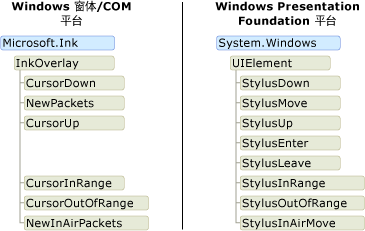

# Ink 对象模型：Windows 窗体和 COM 与 WPF 之比较
主要有三个支持数字墨迹的平台：Tablet PC Windows 窗体平台、Tablet PC COM 平台和 [!INCLUDE[TLA#tla_wpf](../../../../includes/tlasharptla-wpf-md.md)] 平台。  Windows 窗体平台和 COM 平台的对象模型非常类似，但 [!INCLUDE[TLA2#tla_wpf](../../../../includes/tla2sharptla-wpf-md.md)] 平台的对象模型有根本的不同。  本主题从较高层次讨论其区别，以便只使用一种对象模型的开发人员可以更好地了解其他对象模型。  
  
## 在应用程序中启用墨迹  
 所有三个平台都附带了对象和控件，这些对象和控件使应用程序可以接收触笔的输入。  Windows 窗体平台和 COM 平台附带了 <xref:Microsoft.Ink.InkPicture>、<xref:Microsoft.Ink.InkEdit>、<xref:Microsoft.Ink.InkOverlay> 和 <xref:Microsoft.Ink.InkCollector> 类。  <xref:Microsoft.Ink.InkPicture> 和 <xref:Microsoft.Ink.InkEdit> 是可以添加到应用程序中用来收集墨迹的控件。  <xref:Microsoft.Ink.InkOverlay> 和 <xref:Microsoft.Ink.InkCollector> 可以附加到现有的窗口，以便对窗口和自定义控件启用墨迹。  
  
 WPF 平台包含 <xref:System.Windows.Controls.InkCanvas> 控件。  可以将 <xref:System.Windows.Controls.InkCanvas> 添加到应用程序中并立即开始收集墨迹。  使用 <xref:System.Windows.Controls.InkCanvas>，用户可以复制、选择墨迹和调整墨迹大小。  也可以将其他控件添加到 <xref:System.Windows.Controls.InkCanvas>，用户可以在这些控件上进行手写。  可以通过将 <xref:System.Windows.Controls.InkPresenter> 添加到自定义控件并收集其触笔接触点，创建支持墨迹的自定义控件。  
  
 下表列出了在何处可以了解有关在应用程序中启用墨迹的更多信息：  
  
|若要执行此操作...|在 WPF 平台上…|在 Windows 窗体\/COM 平台上…|  
|----------------|----------------|----------------------------|  
|将支持墨迹的控件添加到应用程序中|请参见[墨迹入门](../../../../docs/framework/wpf/advanced/getting-started-with-ink.md)。|请参见[Auto Claims Form Sample](http://msdn.microsoft.com/zh-cn/bec4333a-62ca-4254-a39b-04bc2c556992)|  
|在自定义控件上启用墨迹|请参见[创建墨迹输入控件](../../../../docs/framework/wpf/advanced/creating-an-ink-input-control.md)。|请参见[Ink Clipboard Sample](http://msdn.microsoft.com/zh-cn/a0c42f1c-543d-44f8-83d9-fe810de410ff)。|  
  
## 墨迹数据  
 在 Windows 窗体平台和 COM 平台上，<xref:Microsoft.Ink.InkCollector>、<xref:Microsoft.Ink.InkOverlay>、<xref:Microsoft.Ink.InkEdit> 和 <xref:Microsoft.Ink.InkPicture> 都公开一个 <xref:Microsoft.Ink.Ink?displayProperty=fullName> 对象。  <xref:Microsoft.Ink.Ink> 对象包含一个或多个 <xref:Microsoft.Ink.Stroke?displayProperty=fullName> 对象的数据，并公开常用方法和属性，以管理和操作这些笔画。  <xref:Microsoft.Ink.Ink> 对象管理所包含笔画的生命周期；<xref:Microsoft.Ink.Ink> 对象创建并删除所拥有的笔画。  每个 <xref:Microsoft.Ink.Stroke> 在其父 <xref:Microsoft.Ink.Ink> 对象中都有一个唯一标识符。  
  
 在 WPF 平台上，<xref:System.Windows.Ink.Stroke?displayProperty=fullName> 类拥有并管理自己的生命周期。  可以将一组 <xref:System.Windows.Ink.Stroke> 对象收集到一个 <xref:System.Windows.Ink.StrokeCollection> 中，以提供常用墨迹数据管理操作（如命中测试、擦除、转换和序列化墨迹）方法。  在任意给定时刻，<xref:System.Windows.Ink.Stroke> 可以属于零个、一个或多个 <xref:System.Windows.Ink.StrokeCollection> 对象。  <xref:System.Windows.Controls.InkCanvas> 和 <xref:System.Windows.Controls.InkPresenter> 包含 <xref:System.Windows.Ink.StrokeCollection?displayProperty=fullName>，而不是 <xref:Microsoft.Ink.Ink?displayProperty=fullName> 对象。  
  
 下面两个插图对墨迹数据对象模型进行了比较。  在 Windows 窗体平台和 COM 平台上，<xref:Microsoft.Ink.Ink?displayProperty=fullName> 对象约束 <xref:Microsoft.Ink.Stroke?displayProperty=fullName> 对象的生命周期，且触笔数据包属于单个笔画。  如下图所示，两个或更多笔画可以引用同一 <xref:Microsoft.Ink.DrawingAttributes?displayProperty=fullName> 对象。  
  
   
  
 在 [!INCLUDE[TLA2#tla_winclient](../../../../includes/tla2sharptla-winclient-md.md)] 上，每个 <xref:System.Windows.Ink.Stroke?displayProperty=fullName> 都是一个常用语言运行时对象，只要有对象引用就会存在。  每个 <xref:System.Windows.Ink.Stroke> 均引用 <xref:System.Windows.Input.StylusPointCollection> 和 <xref:System.Windows.Ink.DrawingAttributes?displayProperty=fullName> 对象，这两个对象都是常用语言运行时对象。  
  
   
  
 下表对在 [!INCLUDE[TLA2#tla_wpf](../../../../includes/tla2sharptla-wpf-md.md)] 平台、Windows 窗体平台和 COM 平台上完成某些常用任务的方法进行了比较。  
  
|任务|Windows Presentation Foundation|Windows 窗体和 COM|  
|--------|-------------------------------------|---------------------|  
|保存墨迹|<xref:System.Windows.Ink.StrokeCollection.Save%2A>|<xref:Microsoft.Ink.Ink.Save%2A>|  
|加载墨迹|使用 <xref:System.Windows.Ink.StrokeCollection.%23ctor%28System.IO.Stream%29?displayProperty=fullName> 构造函数创建 <xref:System.Windows.Ink.StrokeCollection>|[M:Microsoft.Ink.Ink.Load\(System.Byte\<xref:Microsoft.Ink.Ink.Load%2A>|  
|命中测试|<xref:System.Windows.Ink.StrokeCollection.HitTest%2A>|<xref:Microsoft.Ink.Ink.HitTest%2A>|  
|复制墨迹|<xref:System.Windows.Controls.InkCanvas.CopySelection%2A>|<xref:Microsoft.Ink.Ink.ClipboardCopy%2A>|  
|粘贴墨迹|<xref:System.Windows.Controls.InkCanvas.Paste%2A>|<xref:Microsoft.Ink.Ink.ClipboardPaste%2A>|  
|访问笔画集合的自定义属性|<xref:System.Windows.Ink.StrokeCollection.AddPropertyData%2A>（这些属性存储在内部，并通过 <xref:System.Windows.Ink.StrokeCollection.AddPropertyData%2A>、<xref:System.Windows.Ink.StrokeCollection.RemovePropertyData%2A> 和 <xref:System.Windows.Ink.StrokeCollection.ContainsPropertyData%2A> 访问）|使用 <xref:Microsoft.Ink.Ink.ExtendedProperties%2A>|  
  
### 在平台之间共享墨迹  
 虽然各平台的墨迹数据对象模型不同，但是在各平台之间共享数据却非常简单。  下面的示例保存 Windows 窗体应用程序中的墨迹，并将该墨迹加载到 Windows Presentation Foundation 应用程序。  
  
 [!code-csharp[WinFormWPFInk#UsingWinforms](../../../../samples/snippets/csharp/VS_Snippets_Wpf/WinformWPFInk/CSharp/Program.cs#usingwinforms)]
 [!code-vb[WinFormWPFInk#UsingWinforms](../../../../samples/snippets/visualbasic/VS_Snippets_Wpf/WinformWPFInk/VisualBasic/Module1.vb#usingwinforms)]  
[!code-csharp[WinFormWPFInk#SaveWinforms](../../../../samples/snippets/csharp/VS_Snippets_Wpf/WinformWPFInk/CSharp/Program.cs#savewinforms)]
[!code-vb[WinFormWPFInk#SaveWinforms](../../../../samples/snippets/visualbasic/VS_Snippets_Wpf/WinformWPFInk/VisualBasic/Module1.vb#savewinforms)]  
  
 [!code-csharp[WinFormWPFInk#UsingWPF](../../../../samples/snippets/csharp/VS_Snippets_Wpf/WinformWPFInk/CSharp/Program.cs#usingwpf)]
 [!code-vb[WinFormWPFInk#UsingWPF](../../../../samples/snippets/visualbasic/VS_Snippets_Wpf/WinformWPFInk/VisualBasic/Module1.vb#usingwpf)]  
[!code-csharp[WinFormWPFInk#LoadWPF](../../../../samples/snippets/csharp/VS_Snippets_Wpf/WinformWPFInk/CSharp/Program.cs#loadwpf)]
[!code-vb[WinFormWPFInk#LoadWPF](../../../../samples/snippets/visualbasic/VS_Snippets_Wpf/WinformWPFInk/VisualBasic/Module1.vb#loadwpf)]  
  
 下面的示例保存 Windows Presentation Foundation 应用程序中的墨迹，并将该墨迹加载到 Windows 窗体应用程序。  
  
 [!code-csharp[WinFormWPFInk#UsingWPF](../../../../samples/snippets/csharp/VS_Snippets_Wpf/WinformWPFInk/CSharp/Program.cs#usingwpf)]
 [!code-vb[WinFormWPFInk#UsingWPF](../../../../samples/snippets/visualbasic/VS_Snippets_Wpf/WinformWPFInk/VisualBasic/Module1.vb#usingwpf)]  
[!code-csharp[WinFormWPFInk#SaveWPF](../../../../samples/snippets/csharp/VS_Snippets_Wpf/WinformWPFInk/CSharp/Program.cs#savewpf)]
[!code-vb[WinFormWPFInk#SaveWPF](../../../../samples/snippets/visualbasic/VS_Snippets_Wpf/WinformWPFInk/VisualBasic/Module1.vb#savewpf)]  
  
 [!code-csharp[WinFormWPFInk#UsingWinforms](../../../../samples/snippets/csharp/VS_Snippets_Wpf/WinformWPFInk/CSharp/Program.cs#usingwinforms)]
 [!code-vb[WinFormWPFInk#UsingWinforms](../../../../samples/snippets/visualbasic/VS_Snippets_Wpf/WinformWPFInk/VisualBasic/Module1.vb#usingwinforms)]  
[!code-csharp[WinFormWPFInk#LoadWinforms](../../../../samples/snippets/csharp/VS_Snippets_Wpf/WinformWPFInk/CSharp/Program.cs#loadwinforms)]
[!code-vb[WinFormWPFInk#LoadWinforms](../../../../samples/snippets/visualbasic/VS_Snippets_Wpf/WinformWPFInk/VisualBasic/Module1.vb#loadwinforms)]  
  
## 触笔的事件  
 Windows 窗体平台和 COM 平台上的 <xref:Microsoft.Ink.InkOverlay>、<xref:Microsoft.Ink.InkCollector> 和 <xref:Microsoft.Ink.InkPicture> 在用户输入笔数据时接收事件。  <xref:Microsoft.Ink.InkOverlay> 或 <xref:Microsoft.Ink.InkCollector> 附加到窗口或控件中，可以订阅由 Tablet 输入数据引发的事件。  这些事件发生时所在的线程取决于该事件是由笔、鼠标还是以编程方式引发。  有关与这些事件相关的线程的更多信息，请参见[General Threading Considerations](http://msdn.microsoft.com/zh-cn/cf35724f-5f80-4b3e-992a-a9d5ea99aae9)和[Threads on Which an Event Can Fire](http://msdn.microsoft.com/zh-cn/d1a5ab9b-d474-4ed7-9aa8-b5bdb771934f)。  
  
 在 Windows Presentation Foundation 平台上，<xref:System.Windows.UIElement> 类具有笔输入事件。  这意味着每个控件都公开完整的触笔事件集。  触笔事件具有隧道\/冒泡事件对，并始终发生于应用程序线程上。  有关更多信息，请参见[路由事件概述](../../../../docs/framework/wpf/advanced/routed-events-overview.md)。  
  
 下图对引发触笔事件的类的对象模型进行了比较。  Windows Presentation Foundation 对象模型只显示冒泡事件，不显示对应的隧道事件。  
  
   
  
## 笔数据  
 所有三个平台都为您提供了截获和操作来自触笔的数据的方法。  在 Windows 窗体平台和 COM 平台上，这通过创建一个 <xref:Microsoft.StylusInput.RealTimeStylus>、为其附加窗口或控件并创建实现 <xref:Microsoft.StylusInput.IStylusSyncPlugin> 或 <xref:Microsoft.StylusInput.IStylusAsyncPlugin> 接口的类来完成。  随后，将自定义插件添加到 <xref:Microsoft.StylusInput.RealTimeStylus> 的插件集合中。  有关此对象模型的更多信息，请参见 [Architecture of the StylusInput APIs](http://msdn.microsoft.com/zh-cn/88bab0ab-df9f-4813-9a9f-9a137813f0b4)。  
  
 在 [!INCLUDE[TLA2#tla_wpf](../../../../includes/tla2sharptla-wpf-md.md)] 平台上，<xref:System.Windows.UIElement> 类公开一个插件集合，在设计上类似于 <xref:Microsoft.StylusInput.RealTimeStylus>。  若要截获笔数据，请创建一个从 <xref:System.Windows.Input.StylusPlugIns.StylusPlugIn> 继承的类，并将该对象添加到 <xref:System.Windows.UIElement> 的 <xref:System.Windows.UIElement.StylusPlugIns%2A> 集合中。  有关此交互的更多信息，请参见[截获触笔输入](../../../../docs/framework/wpf/advanced/intercepting-input-from-the-stylus.md)。  
  
 在所有平台上，线程池通过触笔事件接收墨迹数据，并将其发送到应用程序线程。  有关 COM 和 Windows 平台上线程处理的更多信息，请参见 [Threading Considerations for the StylusInput APIs](http://msdn.microsoft.com/zh-cn/5d98768a-c60b-4bb0-8640-9bf38254d41f)。  有关 Windows Presentation 软件上线程处理的更多信息，请参见 [墨迹线程处理模型](../../../../docs/framework/wpf/advanced/the-ink-threading-model.md)。  
  
 下图对接收笔线程池中的笔数据的类的对象模型进行了比较。  
  
 