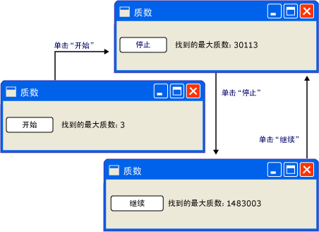

# 线程处理模型
[!INCLUDE[TLA#tla_winclient](../../../../includes/tlasharptla-winclient-md.md)]旨在帮助开发人员的线程处理问题。 因此，大部分[!INCLUDE[TLA2#tla_winclient](../../../../includes/tla2sharptla-winclient-md.md)]开发人员无需编写一个接口，使用多个线程。 由于多线程的程序中是复杂且难以调试，则他们应避免存在单线程解决方案。  
  
 无论程度构建，但是，没有[!INCLUDE[TLA2#tla_ui](../../../../includes/tla2sharptla-ui-md.md)]framework 曾经能够为每一类问题提供单线程的解决方案。              [!INCLUDE[TLA2#tla_winclient](../../../../includes/tla2sharptla-winclient-md.md)]接近，但仍有多个线程来提高其中的情况下[!INCLUDE[TLA#tla_ui](../../../../includes/tlasharptla-ui-md.md)]响应能力或应用程序的性能。 之后讨论一些背景材料，本白皮书探讨了其中一些情况，并最后从较低级别的一些详细信息的讨论。  
  
   
  
> [!NOTE]
>  本主题讨论了通过使用线程处理<xref:System.Windows.Threading.Dispatcher.BeginInvoke%2A>对于异步调用的方法。 您还可以通过调用进行异步调用<xref:System.Windows.Threading.Dispatcher.InvokeAsync%2A>方法，采用<xref:System.Action>或<xref:System.Func%601>作为参数。  <xref:System.Windows.Threading.Dispatcher.InvokeAsync%2A>方法将返回<xref:System.Windows.Threading.DispatcherOperation>或<xref:System.Windows.Threading.DispatcherOperation%601>，它具有<xref:System.Windows.Threading.DispatcherOperation.Task%2A>属性。 您可以使用`await`关键字与<xref:System.Windows.Threading.DispatcherOperation>或关联<xref:System.Threading.Tasks.Task>。 如果你需要等待同步<xref:System.Threading.Tasks.Task>所返回<xref:System.Windows.Threading.DispatcherOperation>或<xref:System.Windows.Threading.DispatcherOperation%601>，调用<xref:System.Windows.Threading.TaskExtensions.DispatcherOperationWait%2A>扩展方法。  调用<xref:System.Threading.Tasks.Task.Wait%2A?displayProperty=fullName>将导致死锁。 有关使用<xref:System.Threading.Tasks.Task>若要执行异步操作，请参阅任务并行度。  <xref:System.Windows.Threading.Dispatcher.Invoke%2A>方法还具有重载采用<xref:System.Action>或<xref:System.Func%601>作为参数。  您可以使用<xref:System.Windows.Threading.Dispatcher.Invoke%2A>方法来执行同步调用通过在委托中，传入<xref:System.Action>或<xref:System.Func%601>。  
  
   
## 概述和调度程序  
 通常情况下，[!INCLUDE[TLA2#tla_winclient](../../../../includes/tla2sharptla-winclient-md.md)]具有两个线程启动的应用程序︰ 一个用于处理呈现和另一个用于管理[!INCLUDE[TLA2#tla_ui](../../../../includes/tla2sharptla-ui-md.md)]。 呈现线程有效地隐藏在后台运行[!INCLUDE[TLA2#tla_ui](../../../../includes/tla2sharptla-ui-md.md)]线程接收输入、 处理事件、 绘制屏幕和运行应用程序代码。 大多数应用程序使用单个[!INCLUDE[TLA2#tla_ui](../../../../includes/tla2sharptla-ui-md.md)]线程，尽管在某些情况下最好同时使用多个。 我们将讨论这方面的示例更高版本。  
  
 [!INCLUDE[TLA2#tla_ui](../../../../includes/tla2sharptla-ui-md.md)]线程队列的工作项内一个名为对象<xref:System.Windows.Threading.Dispatcher>。 <xref:System.Windows.Threading.Dispatcher>可以选择基于优先级的工作项并运行直至完成每个。  每个[!INCLUDE[TLA2#tla_ui](../../../../includes/tla2sharptla-ui-md.md)]线程必须确保至少一个<xref:System.Windows.Threading.Dispatcher>，并且每个<xref:System.Windows.Threading.Dispatcher>可以在一个线程中执行的工作项。  
  
 构建响应性、 用户友好应用程序的诀窍是最大限度地<xref:System.Windows.Threading.Dispatcher>通过保持小的工作项的吞吐量。 这样，工作项永远不会过时坐在<xref:System.Windows.Threading.Dispatcher>队列中等待进行处理。 输入与响应之间任何察觉的延迟可以妨碍用户。  
  
 如何则[!INCLUDE[TLA2#tla_winclient](../../../../includes/tla2sharptla-winclient-md.md)]应用程序应处理大型操作？ 如果您的代码涉及大型计算还是需要查询远程服务器上的数据库？ 通常情况下，答案是处理大型操作在单独的线程，离开[!INCLUDE[TLA2#tla_ui](../../../../includes/tla2sharptla-ui-md.md)]线程可以自由地倾向于中的项<xref:System.Windows.Threading.Dispatcher>队列。 大型操作完成后，它可以将结果报告回[!INCLUDE[TLA2#tla_ui](../../../../includes/tla2sharptla-ui-md.md)]线程以进行显示。  
  
 从历史上看，[!INCLUDE[TLA#tla_mswin](../../../../includes/tlasharptla-mswin-md.md)]允许[!INCLUDE[TLA2#tla_ui](../../../../includes/tla2sharptla-ui-md.md)]元素只能由创建它们的线程访问。 这意味着完成后，负责某些长时间运行的任务的后台线程不能更新文本框。                  [!INCLUDE[TLA#tla_mswin](../../../../includes/tlasharptla-mswin-md.md)]这样做是为了确保完整性的[!INCLUDE[TLA2#tla_ui](../../../../includes/tla2sharptla-ui-md.md)]组件。 列表框看上去可能很奇怪，如果其内容在绘制过程中被后台线程更新。  
  
 [!INCLUDE[TLA2#tla_winclient](../../../../includes/tla2sharptla-winclient-md.md)]具有内置互斥机制来强制执行这种协调。 中的大多数类[!INCLUDE[TLA2#tla_winclient](../../../../includes/tla2sharptla-winclient-md.md)]从派生<xref:System.Windows.Threading.DispatcherObject>。 在构建过程中<xref:System.Windows.Threading.DispatcherObject>存储对引用<xref:System.Windows.Threading.Dispatcher>链接到当前正在运行的线程。 实际上， <xref:System.Windows.Threading.DispatcherObject>将与创建它的线程相关联。 在程序执行过程<xref:System.Windows.Threading.DispatcherObject>可以调用它的公共<xref:System.Windows.Threading.DispatcherObject.VerifyAccess%2A>方法。                  <xref:System.Windows.Threading.DispatcherObject.VerifyAccess%2A>检查<xref:System.Windows.Threading.Dispatcher>与当前线程相关联，并将其向<xref:System.Windows.Threading.Dispatcher>构造过程中存储的引用。 如果它们不匹配， <xref:System.Windows.Threading.DispatcherObject.VerifyAccess%2A>将引发异常。                  <xref:System.Windows.Threading.DispatcherObject.VerifyAccess%2A>应属于每个方法的开头调用<xref:System.Windows.Threading.DispatcherObject>。  
  
 如果只有一个线程可以修改[!INCLUDE[TLA2#tla_ui](../../../../includes/tla2sharptla-ui-md.md)]，如何执行后台线程的用户进行交互？ 后台线程可以请求[!INCLUDE[TLA2#tla_ui](../../../../includes/tla2sharptla-ui-md.md)]线程来执行对代表其自身的操作。 这是通过注册工作项与<xref:System.Windows.Threading.Dispatcher>的[!INCLUDE[TLA2#tla_ui](../../../../includes/tla2sharptla-ui-md.md)]线程。 <xref:System.Windows.Threading.Dispatcher>类提供两种方法来注册工作项︰ <xref:System.Windows.Threading.Dispatcher.Invoke%2A>和<xref:System.Windows.Threading.Dispatcher.BeginInvoke%2A>。 这两种方法调度一个委托来执行。                  <xref:System.Windows.Threading.Dispatcher.Invoke%2A>是同步调用 – 也就是说，它不会返回之前[!INCLUDE[TLA2#tla_ui](../../../../includes/tla2sharptla-ui-md.md)]线程实际执行完该委托。                  <xref:System.Windows.Threading.Dispatcher.BeginInvoke%2A>是异步的将立即返回。  
  
 <xref:System.Windows.Threading.Dispatcher>按优先级排列其队列中的元素。 有可能会添加到某个元素时指定的十个级别<xref:System.Windows.Threading.Dispatcher>队列。 这些优先级均维护在<xref:System.Windows.Threading.DispatcherPriority>枚举。 有关详细信息<xref:System.Windows.Threading.DispatcherPriority>中找不到级别[!INCLUDE[TLA2#tla_winfxsdk](../../../../includes/tla2sharptla-winfxsdk-md.md)]文档。  
  
   
## 操作中的线程︰ 示例  
  
   
### 一个单线程具有长时间运行计算应用程序  
 大多数[!INCLUDE[TLA#tla_gui#plural](../../../../includes/tlasharptla-guisharpplural-md.md)]花费其时间处于空闲状态等待响应用户交互中生成的事件的大部分内容。 使用编程时，注意此空闲时间可用建设性，而不会影响的响应能力[!INCLUDE[TLA2#tla_ui](../../../../includes/tla2sharptla-ui-md.md)]。 [!INCLUDE[TLA2#tla_winclient](../../../../includes/tla2sharptla-winclient-md.md)]线程模型不允许输入以中断操作中发生的事件[!INCLUDE[TLA2#tla_ui](../../../../includes/tla2sharptla-ui-md.md)]线程。 这意味着您必须确保返回到<xref:System.Windows.Threading.Dispatcher>定期对挂起的输入事件在获得过期之前的过程。  
  
 请看下面的示例：  
  
   
  
 此简单的应用程序将从三个搜索质数向上计数。 当用户单击**启动**按钮，开始执行搜索。 当程序找到一个质数时，它将用它的搜索更新用户界面。 在任何时刻，用户可以停止搜索。  
  
 虽然非常简单，但质数搜索可以在无止境，提供了一些问题。  如果我们处理了整个搜索按钮的单击事件处理程序，我们绝不会给[!INCLUDE[TLA2#tla_ui](../../../../includes/tla2sharptla-ui-md.md)]线程有机会处理其他事件。 [!INCLUDE[TLA2#tla_ui](../../../../includes/tla2sharptla-ui-md.md)]者将无法响应输入或处理消息。 它将永远不会重绘并永远不会响应按钮点击。  
  
 我们无法执行质数搜索在单独的线程，但然后我们需要能够处理同步问题。 使用单线程方法时，我们可以直接更新列出找到的最大质数的标签。  
  
 如果我们分解为易于管理多个块的计算的任务，我们可以定期返回到<xref:System.Windows.Threading.Dispatcher>和处理事件。 我们就可以赋予[!INCLUDE[TLA2#tla_winclient](../../../../includes/tla2sharptla-winclient-md.md)]重绘和处理输入的机会。  
  
 拆分计算和事件处理之间的处理时间的最好办法是管理计算从<xref:System.Windows.Threading.Dispatcher>。 通过使用<xref:System.Windows.Threading.Dispatcher.BeginInvoke%2A>方法中，我们可以安排质数检查中的同一队列[!INCLUDE[TLA2#tla_ui](../../../../includes/tla2sharptla-ui-md.md)]从中提取事件。 在我们的示例中，我们只将检查安排在一个质数一次。 质数检查完成后，将立即安排下一次检查。 此检查之后才继续挂起的[!INCLUDE[TLA2#tla_ui](../../../../includes/tla2sharptla-ui-md.md)]在处理事件。  
  
   
  
 [!INCLUDE[TLA#tla_word](../../../../includes/tlasharptla-word-md.md)]实现了使用此机制中的拼写检查。 使用的空闲时间在后台执行了拼写检查[!INCLUDE[TLA2#tla_ui](../../../../includes/tla2sharptla-ui-md.md)]线程。 让我们看一下代码。  
  
 下面的示例演示创建用户界面的 XAML。  
  
 [!code-xml[ThreadingPrimeNumbers#ThreadingPrimeNumberXAML](../../../../samples/snippets/csharp/VS_Snippets_Wpf/ThreadingPrimeNumbers/CSharp/Window1.xaml#threadingprimenumberxaml)]  
  
 下面的示例演示代码隐藏。  
  
 [!code-csharp[ThreadingPrimeNumbers#ThreadingPrimeNumberCodeBehind](../../../../samples/snippets/csharp/VS_Snippets_Wpf/ThreadingPrimeNumbers/CSharp/Window1.xaml.cs#threadingprimenumbercodebehind)]
 [!code-vb[ThreadingPrimeNumbers#ThreadingPrimeNumberCodeBehind](../../../../samples/snippets/visualbasic/VS_Snippets_Wpf/ThreadingPrimeNumbers/visualbasic/mainwindow.xaml.vb#threadingprimenumbercodebehind)]  
  
 下面的示例演示的事件处理程序<xref:System.Windows.Controls.Button>。  
  
 [!code-csharp[ThreadingPrimeNumbers#ThreadingPrimeNumberStartOrStop](../../../../samples/snippets/csharp/VS_Snippets_Wpf/ThreadingPrimeNumbers/CSharp/Window1.xaml.cs#threadingprimenumberstartorstop)]
 [!code-vb[ThreadingPrimeNumbers#ThreadingPrimeNumberStartOrStop](../../../../samples/snippets/visualbasic/VS_Snippets_Wpf/ThreadingPrimeNumbers/visualbasic/mainwindow.xaml.vb#threadingprimenumberstartorstop)]  
  
 除了上更新的文本<xref:System.Windows.Controls.Button>，此处理程序负责计划通过添加到委托的第一个质数检查<xref:System.Windows.Threading.Dispatcher>队列。 此事件处理程序已完成其工作后, 一段时间内<xref:System.Windows.Threading.Dispatcher>会选择执行此委派。  
  
 如前文所述， <xref:System.Windows.Threading.Dispatcher.BeginInvoke%2A>是<xref:System.Windows.Threading.Dispatcher>成员用来安排一个委托来执行。 在这种情况下，我们选择<xref:System.Windows.Threading.DispatcherPriority>优先级。 <xref:System.Windows.Threading.Dispatcher>仅当没有要处理的重要事件时，才会执行此委托。                          [!INCLUDE[TLA2#tla_ui](../../../../includes/tla2sharptla-ui-md.md)]响应是与数字检查相比，更重要。 我们还传递一个表示数字检查例程新委托。  
  
 [!code-csharp[ThreadingPrimeNumbers#ThreadingPrimeNumberCheckNextNumber](../../../../samples/snippets/csharp/VS_Snippets_Wpf/ThreadingPrimeNumbers/CSharp/Window1.xaml.cs#threadingprimenumberchecknextnumber)]
 [!code-vb[ThreadingPrimeNumbers#ThreadingPrimeNumberCheckNextNumber](../../../../samples/snippets/visualbasic/VS_Snippets_Wpf/ThreadingPrimeNumbers/visualbasic/mainwindow.xaml.vb#threadingprimenumberchecknextnumber)]  
  
 此方法检查下一个奇数是否素数。 如果它是素数，该方法直接更新`bigPrime` <xref:System.Windows.Controls.TextBlock>以反映其发现。 我们可以这样做是因为在创建该组件所用的同一线程中进行计算。 我们已选择要用于计算的一个单独的线程，我们必须使用更复杂的同步机制，并执行中的更新[!INCLUDE[TLA2#tla_ui](../../../../includes/tla2sharptla-ui-md.md)]线程。 接下来，我们将演示这种情况。  
  
 此示例的完整源代码，请参阅[单线程应用程序长时间运行计算示例](http://go.microsoft.com/fwlink/?LinkID=160038)  
  
   
### 处理与后台线程的阻止操作  
 处理图形的应用程序中的阻止操作可能很困难。 我们不想要从事件处理程序调用阻止方法，因为该应用程序看上去好像已冻结。 我们可以使用一个单独的线程来处理这些操作，但当我们完成时，我们必须与同步[!INCLUDE[TLA2#tla_ui](../../../../includes/tla2sharptla-ui-md.md)]线程因为我们不能直接修改[!INCLUDE[TLA2#tla_gui](../../../../includes/tla2sharptla-gui-md.md)]从我们的工作线程。 我们可以使用<xref:System.Windows.Threading.Dispatcher.Invoke%2A>或<xref:System.Windows.Threading.Dispatcher.BeginInvoke%2A>插入到委托<xref:System.Windows.Threading.Dispatcher>的[!INCLUDE[TLA2#tla_ui](../../../../includes/tla2sharptla-ui-md.md)]线程。 最后，将以具有修改权限执行这些委托[!INCLUDE[TLA2#tla_ui](../../../../includes/tla2sharptla-ui-md.md)]元素。  
  
 在此示例中，我们可以模仿检索天气预报的远程过程调用。 我们使用单独的工作线程来执行此调用中，并且我们计划中的更新方法<xref:System.Windows.Threading.Dispatcher>的[!INCLUDE[TLA2#tla_ui](../../../../includes/tla2sharptla-ui-md.md)]线程在完成后。  
  
   
  
 [!code-csharp[ThreadingWeatherForecast#ThreadingWeatherCodeBehind](../../../../samples/snippets/csharp/VS_Snippets_Wpf/ThreadingWeatherForecast/CSharp/Window1.xaml.cs#threadingweathercodebehind)]
 [!code-vb[ThreadingWeatherForecast#ThreadingWeatherCodeBehind](../../../../samples/snippets/visualbasic/VS_Snippets_Wpf/ThreadingWeatherForecast/visualbasic/window1.xaml.vb#threadingweathercodebehind)]  
  
 以下是一些要注意的详细信息。  
  
-   创建按钮处理程序  
  
     [!code-csharp[ThreadingWeatherForecast#ThreadingWeatherButtonHandler](../../../../samples/snippets/csharp/VS_Snippets_Wpf/ThreadingWeatherForecast/CSharp/Window1.xaml.cs#threadingweatherbuttonhandler)]
     [!code-vb[ThreadingWeatherForecast#ThreadingWeatherButtonHandler](../../../../samples/snippets/visualbasic/VS_Snippets_Wpf/ThreadingWeatherForecast/visualbasic/window1.xaml.vb#threadingweatherbuttonhandler)]  
  
 当单击按钮时，我们将显示时钟图，开始进行动画处理。 禁用该按钮。 我们调用`FetchWeatherFromServer`中一个新线程，然后我们方法返回时，允许<xref:System.Windows.Threading.Dispatcher>以处理事件时我们等待收集天气预报。  
  
-   获取天气预报  
  
     [!code-csharp[ThreadingWeatherForecast#ThreadingWeatherFetchWeather](../../../../samples/snippets/csharp/VS_Snippets_Wpf/ThreadingWeatherForecast/CSharp/Window1.xaml.cs#threadingweatherfetchweather)]
     [!code-vb[ThreadingWeatherForecast#ThreadingWeatherFetchWeather](../../../../samples/snippets/visualbasic/VS_Snippets_Wpf/ThreadingWeatherForecast/visualbasic/window1.xaml.vb#threadingweatherfetchweather)]  
  
 为简便起见，我们实际上没有任何网络代码在此示例中。 相反，我们将通过使新线程进入睡眠状态四秒钟模拟网络访问的延迟。 在此时间，原始[!INCLUDE[TLA2#tla_ui](../../../../includes/tla2sharptla-ui-md.md)]线程仍然是正在运行并对事件作出响应。 为了说明这一点，我们使动画保持运行，并使最小化和最大化按钮也继续工作。  
  
 当延迟结束，并且我们已随机选择了天气预报时，就应该报告回[!INCLUDE[TLA2#tla_ui](../../../../includes/tla2sharptla-ui-md.md)]线程。 为此计划对的调用，我们`UpdateUserInterface`中[!INCLUDE[TLA2#tla_ui](../../../../includes/tla2sharptla-ui-md.md)]线程使用该线程<xref:System.Windows.Threading.Dispatcher>。 我们将传递到此计划的方法调用天气描述的字符串。  
  
-   更新[!INCLUDE[TLA2#tla_ui](../../../../includes/tla2sharptla-ui-md.md)]  
  
     [!code-csharp[ThreadingWeatherForecast#ThreadingWeatherUpdateUI](../../../../samples/snippets/csharp/VS_Snippets_Wpf/ThreadingWeatherForecast/CSharp/Window1.xaml.cs#threadingweatherupdateui)]
     [!code-vb[ThreadingWeatherForecast#ThreadingWeatherUpdateUI](../../../../samples/snippets/visualbasic/VS_Snippets_Wpf/ThreadingWeatherForecast/visualbasic/window1.xaml.vb#threadingweatherupdateui)]  
  
 当<xref:System.Windows.Threading.Dispatcher>中[!INCLUDE[TLA2#tla_ui](../../../../includes/tla2sharptla-ui-md.md)]线程都有时间，它将执行计划的调用`UpdateUserInterface`。 此方法停止时钟动画，并选择一个图像来描述天气。 它显示此映像，并还原"提取预测"按钮。  
  
   
### 多个窗口，多个线程  
 某些[!INCLUDE[TLA2#tla_winclient](../../../../includes/tla2sharptla-winclient-md.md)]应用程序需要多个顶级窗口。 它是完全可以接受一个线程 /<xref:System.Windows.Threading.Dispatcher>组合来管理多个窗口，但有时多个线程完成更好地工作。 这是其中一个 windows 是否存在任何机会将独占线程尤其如此。  
  
 [!INCLUDE[TLA#tla_mswin](../../../../includes/tlasharptla-mswin-md.md)]在这种方式，资源管理器中工作正常。 每个新的浏览器窗口属于原始的过程中，但它独立线程的控制下创建。  
  
 通过使用[!INCLUDE[TLA2#tla_winclient](../../../../includes/tla2sharptla-winclient-md.md)]<xref:System.Windows.Controls.Frame>控件中，我们可以显示网页。 我们可以轻松地创建一个简单[!INCLUDE[TLA2#tla_ie](../../../../includes/tla2sharptla-ie-md.md)]替换。 我们从开始一项重要功能︰ 能够打开一个新的资源管理器窗口。 当用户单击"新建窗口"按钮，我们启动了窗口在单独的线程的一个副本。 这样一来，在其中一个窗口中的长时间运行或阻止操作就不会锁定所有其他窗口。  
  
 在实际情况下，Web 浏览器模型具有其自己的复杂线程模型。 我们选择它是因为它应为大多数读者所熟悉。  
  
 下面的示例显示的代码。  
  
 [!code-xml[ThreadingMultipleBrowsers#ThreadingMultiBrowserXAML](../../../../samples/snippets/csharp/VS_Snippets_Wpf/ThreadingMultipleBrowsers/CSharp/Window1.xaml#threadingmultibrowserxaml)]  
  
 [!code-csharp[ThreadingMultipleBrowsers#ThreadingMultiBrowserCodeBehind](../../../../samples/snippets/csharp/VS_Snippets_Wpf/ThreadingMultipleBrowsers/CSharp/Window1.xaml.cs#threadingmultibrowsercodebehind)]
 [!code-vb[ThreadingMultipleBrowsers#ThreadingMultiBrowserCodeBehind](../../../../samples/snippets/visualbasic/VS_Snippets_Wpf/ThreadingMultipleBrowsers/VisualBasic/Window1.xaml.vb#threadingmultibrowsercodebehind)]  
  
 此代码的以下线程片段是最值得关注对我们在此上下文中︰  
  
 [!code-csharp[ThreadingMultipleBrowsers#ThreadingMultiBrowserNewWindow](../../../../samples/snippets/csharp/VS_Snippets_Wpf/ThreadingMultipleBrowsers/CSharp/Window1.xaml.cs#threadingmultibrowsernewwindow)]
 [!code-vb[ThreadingMultipleBrowsers#ThreadingMultiBrowserNewWindow](../../../../samples/snippets/visualbasic/VS_Snippets_Wpf/ThreadingMultipleBrowsers/VisualBasic/Window1.xaml.vb#threadingmultibrowsernewwindow)]  
  
 当调用此方法的"新建窗口"按钮。 它创建一个新线程，并以异步方式启动。  
  
 [!code-csharp[ThreadingMultipleBrowsers#ThreadingMultiBrowserThreadStart](../../../../samples/snippets/csharp/VS_Snippets_Wpf/ThreadingMultipleBrowsers/CSharp/Window1.xaml.cs#threadingmultibrowserthreadstart)]
 [!code-vb[ThreadingMultipleBrowsers#ThreadingMultiBrowserThreadStart](../../../../samples/snippets/visualbasic/VS_Snippets_Wpf/ThreadingMultipleBrowsers/VisualBasic/Window1.xaml.vb#threadingmultibrowserthreadstart)]  
  
 此方法是新线程的起始点。 我们创建此线程的控制下一个新窗口。                          [!INCLUDE[TLA2#tla_winclient](../../../../includes/tla2sharptla-winclient-md.md)]自动创建一个新<xref:System.Windows.Threading.Dispatcher>来管理新线程。 我们所要做才能使窗口中正常运行是启动<xref:System.Windows.Threading.Dispatcher>。  
  
   
## 技术细节和难点  
  
### 使用线程编写组件  
 [!INCLUDE[TLA#tla_netframewk](../../../../includes/tlasharptla-netframewk-md.md)]开发人员指南 》 描述组件如何公开给其客户端的异步行为的模式 (请参阅[基于事件的异步模式概述](../../../../docs/standard/asynchronous-programming-patterns/event-based-asynchronous-pattern-overview.md))。 例如，假设我们想要打包`FetchWeatherFromServer`方法划分为可重复使用的非图形组件。 采用标准[!INCLUDE[TLA#tla_netframewk](../../../../includes/tlasharptla-netframewk-md.md)]模式，这看起来如下所示。  
  
 [!code-csharp[CommandingOverviewSnippets#ThreadingArticleWeatherComponent1](../../../../samples/snippets/csharp/VS_Snippets_Wpf/CommandingOverviewSnippets/CSharp/Window1.xaml.cs#threadingarticleweathercomponent1)]
 [!code-vb[CommandingOverviewSnippets#ThreadingArticleWeatherComponent1](../../../../samples/snippets/visualbasic/VS_Snippets_Wpf/CommandingOverviewSnippets/visualbasic/window1.xaml.vb#threadingarticleweathercomponent1)]  
  
 `GetWeatherAsync`常会用到一个更早版本，如创建后台线程，所介绍的方法来以异步方式执行工作不会阻止调用线程。  
  
 此模式最重要的部分之一调用*MethodName* `Completed`方法调用的同一线程上*MethodName* `Async`方法的开头加入。 您可以这样做使用[!INCLUDE[TLA2#tla_winclient](../../../../includes/tla2sharptla-winclient-md.md)]相当轻松地通过将存储<xref:System.Windows.Threading.Dispatcher.CurrentDispatcher%2A>— 但然后非图形组件可能只能用在[!INCLUDE[TLA2#tla_winclient](../../../../includes/tla2sharptla-winclient-md.md)]应用程序中，不在[!INCLUDE[TLA#tla_winforms](../../../../includes/tlasharptla-winforms-md.md)]或[!INCLUDE[TLA#tla_aspnet](../../../../includes/tlasharptla-aspnet-md.md)]程序。  
  
 <xref:System.Windows.Threading.DispatcherSynchronizationContext>类解决了上述需要，其看作的简化版本<xref:System.Windows.Threading.Dispatcher>这是使用其他[!INCLUDE[TLA2#tla_ui](../../../../includes/tla2sharptla-ui-md.md)]以及框架。  
  
 [!code-csharp[CommandingOverviewSnippets#ThreadingArticleWeatherComponent2](../../../../samples/snippets/csharp/VS_Snippets_Wpf/CommandingOverviewSnippets/CSharp/Window1.xaml.cs#threadingarticleweathercomponent2)]
 [!code-vb[CommandingOverviewSnippets#ThreadingArticleWeatherComponent2](../../../../samples/snippets/visualbasic/VS_Snippets_Wpf/CommandingOverviewSnippets/visualbasic/window1.xaml.vb#threadingarticleweathercomponent2)]  
  
### 嵌套泵  
 有时不能完全锁定[!INCLUDE[TLA2#tla_ui](../../../../includes/tla2sharptla-ui-md.md)]线程。 让我们看一下<xref:System.Windows.MessageBox.Show%2A>方法<xref:System.Windows.MessageBox>类。                          <xref:System.Windows.MessageBox.Show%2A>直到用户单击确定按钮不会返回。 它存在，但是，创建必须有一个消息循环才能进行交互的窗口。 在我们等待用户单击确定，原始应用程序窗口不会响应用户输入。 但是，它会继续处理绘制消息。 原始窗口在重绘自己被遮盖和显示。  
  
   
  
 负责消息框窗口必须有一个线程。                          [!INCLUDE[TLA2#tla_winclient](../../../../includes/tla2sharptla-winclient-md.md)]可以创建一个新线程只为消息框窗口中，但此线程将无法绘制原始窗口中的已禁用的元素 （请记住的相互排斥的讨论）。 相反，[!INCLUDE[TLA2#tla_winclient](../../../../includes/tla2sharptla-winclient-md.md)]使用嵌套的消息处理系统。 <xref:System.Windows.Threading.Dispatcher>类包括一个称为特殊方法<xref:System.Windows.Threading.Dispatcher.PushFrame%2A>，从而存储应用程序的当前执行点然后开始新的消息循环。 嵌套的消息循环完成时，将在原始后恢复执行<xref:System.Windows.Threading.Dispatcher.PushFrame%2A>调用。  
  
 在这种情况下， <xref:System.Windows.Threading.Dispatcher.PushFrame%2A>可维护到调用程序上下文<xref:System.Windows.MessageBox>。                         <xref:System.Windows.MessageBox.Show%2A>，并启动新的消息循环，以重新绘制背景窗口并处理消息框窗口的输入。 当用户单击确定，并清除弹出窗口中时，嵌套的循环将退出并控制将恢复在调用之后<xref:System.Windows.MessageBox.Show%2A>。  
  
### 失效的路由事件  
 中的路由的事件系统[!INCLUDE[TLA2#tla_winclient](../../../../includes/tla2sharptla-winclient-md.md)]引发事件时，会通知整个树。  
  
 [!code-xml[InputOvw#ThreadingArticleStaticRoutedEvent](../../../../samples/snippets/csharp/VS_Snippets_Wpf/InputOvw/CSharp/Page1.xaml#threadingarticlestaticroutedevent)]  
  
 在椭圆上按下鼠标左键时`handler2`执行。 之后`handler2`结束后，该事件传递给<xref:System.Windows.Controls.Canvas>对象，后者使用`handler1`若要对其进行处理。 仅当发生这种情况`handler2`不显式标记的事件对象为已处理。  
  
 可能的`handler2`将需要很长的时间来处理此事件。                          `handler2`可以使用<xref:System.Windows.Threading.Dispatcher.PushFrame%2A>开始小时不会返回一个嵌套的消息循环。 如果`handler2`未的标记该事件为已处理此消息循环时完成，即使它是很久以前，树向上传递的事件。  
  
### 重新进入和锁定  
 锁定机制[!INCLUDE[TLA#tla_clr](../../../../includes/tlasharptla-clr-md.md)]完全相同的行为不可能想象一个; 某个用户可能希望完全停止操作，当请求锁的线程。 在现实中，线程将继续接收和处理高优先级的消息。 这有助于防止死锁，并使界面最小响应的但这样做会产生细微错误的可能性。  大多数情况下不需要了解有关这一点，但在极少数情况下 (通常会涉及[!INCLUDE[TLA2#tla_win32](../../../../includes/tla2sharptla-win32-md.md)]窗口消息或 COM STA 组件) 这可能是值得。  
  
 大多数界面都不在构建时考虑线程安全性，因为开发人员在假设的[!INCLUDE[TLA2#tla_ui](../../../../includes/tla2sharptla-ui-md.md)]永远不会由多个线程访问。 在此情况下，单个线程可能会意外情况下，使环境更改，导致这些错误效果<xref:System.Windows.Threading.DispatcherObject>互斥机制旨在解决。 请考虑下面的伪代码︰  
  
   
  
 大多数情况下，这是正确的事情，但有时在[!INCLUDE[TLA2#tla_winclient](../../../../includes/tla2sharptla-winclient-md.md)]其中此类异常的重入确实会导致问题。 因此，在某些关键时刻，[!INCLUDE[TLA2#tla_winclient](../../../../includes/tla2sharptla-winclient-md.md)]调用<xref:System.Windows.Threading.Dispatcher.DisableProcessing%2A>，其更改为使用该线程的锁指令[!INCLUDE[TLA2#tla_winclient](../../../../includes/tla2sharptla-winclient-md.md)]重入释放锁，而不是常规[!INCLUDE[TLA2#tla_clr](../../../../includes/tla2sharptla-clr-md.md)]锁。  
  
 那么，为什么未[!INCLUDE[TLA2#tla_clr](../../../../includes/tla2sharptla-clr-md.md)]团队选择这种现象？ 它必须与 COM STA 对象和终止线程。 当一个对象进行垃圾回收，其`Finalize`方法不在专门的终结器线程上运行[!INCLUDE[TLA2#tla_ui](../../../../includes/tla2sharptla-ui-md.md)]线程。 其中就是问题，因为 COM STA 对象，其上创建[!INCLUDE[TLA2#tla_ui](../../../../includes/tla2sharptla-ui-md.md)]仅可以对已释放线程[!INCLUDE[TLA2#tla_ui](../../../../includes/tla2sharptla-ui-md.md)]线程。 [!INCLUDE[TLA2#tla_clr](../../../../includes/tla2sharptla-clr-md.md)]的等效<xref:System.Windows.Threading.Dispatcher.BeginInvoke%2A> (在这种情况下使用 Win32 的`SendMessage`)。 但是，如果[!INCLUDE[TLA2#tla_ui](../../../../includes/tla2sharptla-ui-md.md)]线程正忙，终结器线程将停止，且不能释放 COM STA 对象，这种结构造成严重的内存泄漏。 因此[!INCLUDE[TLA2#tla_clr](../../../../includes/tla2sharptla-clr-md.md)]团队进行严格的调用来使锁的工作方式一样。  
  
 有关任务[!INCLUDE[TLA2#tla_winclient](../../../../includes/tla2sharptla-winclient-md.md)]是为了避免意外的重新进入而无需重新引入内存泄漏，这是为什么我们不阻止无处不在可重入。  
  
## 另请参阅  
 [具有长时间运行计算示例单线程应用程序](http://go.microsoft.com/fwlink/?LinkID=160038)