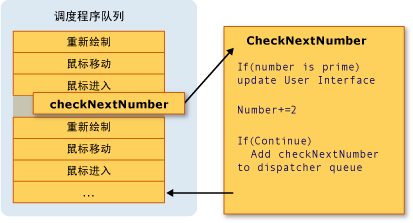

# 线程处理模型
[!INCLUDE[TLA#tla_winclient](../../../../includes/tlasharptla-winclient-md.md)] 旨在帮助开发人员处理复杂的线程处理问题。 因此，大部分[!INCLUDE[TLA2#tla_winclient](../../../../includes/tla2sharptla-winclient-md.md)]开发人员无需编写一个接口，使用多个线程。 由于多线程程序既复杂又难以调试，因此当存在单线程解决方案时，应避免使用多线程程序。  
  
 无论构建得多好，但是，否[!INCLUDE[TLA2#tla_ui](../../../../includes/tla2sharptla-ui-md.md)]framework 曾经能够为每种问题提供单线程解决方案。 [!INCLUDE[TLA2#tla_winclient](../../../../includes/tla2sharptla-winclient-md.md)] 就关闭，但仍有些情况下，多个线程来改进[!INCLUDE[TLA#tla_ui](../../../../includes/tlasharptla-ui-md.md)]响应能力或应用程序的性能。 基于上文所述的背景材料，本文对上述情况进行探讨，然后通过对一些低级别的细节进行讨论作出总结。  
  

  
> [!NOTE]
>  本主题讨论了使用线程处理<xref:System.Windows.Threading.Dispatcher.BeginInvoke%2A>异步调用的方法。 您还可以通过调用进行异步调用<xref:System.Windows.Threading.Dispatcher.InvokeAsync%2A>方法，这需要<xref:System.Action>或<xref:System.Func%601>作为参数。  <xref:System.Windows.Threading.Dispatcher.InvokeAsync%2A>方法将返回<xref:System.Windows.Threading.DispatcherOperation>或<xref:System.Windows.Threading.DispatcherOperation%601>，其中包含<xref:System.Windows.Threading.DispatcherOperation.Task%2A>属性。 可以使用`await`使用的关键字<xref:System.Windows.Threading.DispatcherOperation>或关联<xref:System.Threading.Tasks.Task>。 如果你需要同步等待<xref:System.Threading.Tasks.Task>返回的<xref:System.Windows.Threading.DispatcherOperation>或<xref:System.Windows.Threading.DispatcherOperation%601>，调用<xref:System.Windows.Threading.TaskExtensions.DispatcherOperationWait%2A>扩展方法。  调用<xref:System.Threading.Tasks.Task.Wait%2A?displayProperty=nameWithType>将导致死锁。 详细了解使用<xref:System.Threading.Tasks.Task>执行异步操作，请参阅任务并行。  <xref:System.Windows.Threading.Dispatcher.Invoke%2A>方法还具有采用重载<xref:System.Action>或<xref:System.Func%601>作为参数。  可以使用<xref:System.Windows.Threading.Dispatcher.Invoke%2A>方法来进行同步调用通过传入一个委托，委托<xref:System.Action>或<xref:System.Func%601>。  
  
   
## 概述和调度程序  
 通常情况下，[!INCLUDE[TLA2#tla_winclient](../../../../includes/tla2sharptla-winclient-md.md)]应用程序启动两个线程： 一个用于处理呈现和另一个用于管理[!INCLUDE[TLA2#tla_ui](../../../../includes/tla2sharptla-ui-md.md)]。 呈现线程有效地在隐藏模式运行的同时在后台[!INCLUDE[TLA2#tla_ui](../../../../includes/tla2sharptla-ui-md.md)]线程接收输入、 处理事件、 绘制屏幕和运行应用程序代码。 大多数应用程序使用单个[!INCLUDE[TLA2#tla_ui](../../../../includes/tla2sharptla-ui-md.md)]线程，尽管在某些情况下最好使用多个。 我们将稍后通过示例对此进行讨论。  
  
 [!INCLUDE[TLA2#tla_ui](../../../../includes/tla2sharptla-ui-md.md)]线程队列工作项调用的对象内<xref:System.Windows.Threading.Dispatcher>。 <xref:System.Windows.Threading.Dispatcher> 基于优先级选择工作项，并运行每一个工作项直到完成。  每个[!INCLUDE[TLA2#tla_ui](../../../../includes/tla2sharptla-ui-md.md)]线程必须至少一个<xref:System.Windows.Threading.Dispatcher>，和每个<xref:System.Windows.Threading.Dispatcher>可以在一个线程中执行的工作项。  
  
 构建响应迅速的用户友好应用程序的诀窍是最大限度地<xref:System.Windows.Threading.Dispatcher>通过保留的工作项小吞吐量。 这样，工作项永远不会过时坐在<xref:System.Windows.Threading.Dispatcher>队列等待处理。 输入和响应间任何可察觉的延迟都会让用户不满。  
  
 如何[!INCLUDE[TLA2#tla_winclient](../../../../includes/tla2sharptla-winclient-md.md)]应用程序应处理大型操作？ 如果代码涉及大型计算，或需要查询某些远程服务器上的数据库，应该怎么办？ 通常情况下，答案是处理大型操作在单独的线程，离开[!INCLUDE[TLA2#tla_ui](../../../../includes/tla2sharptla-ui-md.md)]线程可以自由地倾向于中的项<xref:System.Windows.Threading.Dispatcher>队列。 大型操作完成后，它可以报告其结果返回到[!INCLUDE[TLA2#tla_ui](../../../../includes/tla2sharptla-ui-md.md)]线程以进行显示。  
  
 从历史上看，[!INCLUDE[TLA#tla_mswin](../../../../includes/tlasharptla-mswin-md.md)]允许[!INCLUDE[TLA2#tla_ui](../../../../includes/tla2sharptla-ui-md.md)]元素只能由创建它们的线程访问。 这意味着，负责长时间运行任务的后台线程无法在任务完成时更新文本框。 [!INCLUDE[TLA#tla_mswin](../../../../includes/tlasharptla-mswin-md.md)] 这样做是为了确保完整性[!INCLUDE[TLA2#tla_ui](../../../../includes/tla2sharptla-ui-md.md)]组件。 如果在绘制过程中后台线程更新了列表框的内容，则此列表框看起来可能会很奇怪。  
  
 [!INCLUDE[TLA2#tla_winclient](../../../../includes/tla2sharptla-winclient-md.md)] 具有内置互相排斥机制，此机制能强制执行这种协调。 中的大多数类[!INCLUDE[TLA2#tla_winclient](../../../../includes/tla2sharptla-winclient-md.md)]派生自<xref:System.Windows.Threading.DispatcherObject>。 在构建过程中<xref:System.Windows.Threading.DispatcherObject>存储到的引用<xref:System.Windows.Threading.Dispatcher>链接到当前运行的线程。 实际上，<xref:System.Windows.Threading.DispatcherObject>将与创建它的线程相关联。 在程序执行期间<xref:System.Windows.Threading.DispatcherObject>可以调用它的公共<xref:System.Windows.Threading.DispatcherObject.VerifyAccess%2A>方法。 <xref:System.Windows.Threading.DispatcherObject.VerifyAccess%2A> 检查<xref:System.Windows.Threading.Dispatcher>与当前线程相关联并将其到比较<xref:System.Windows.Threading.Dispatcher>构造过程中存储的引用。 如果它们不匹配，<xref:System.Windows.Threading.DispatcherObject.VerifyAccess%2A>将引发异常。 <xref:System.Windows.Threading.DispatcherObject.VerifyAccess%2A> 应属于每个方法的开头调用<xref:System.Windows.Threading.DispatcherObject>。  
  
 如果只有一个线程可以修改[!INCLUDE[TLA2#tla_ui](../../../../includes/tla2sharptla-ui-md.md)]，如何执行后台线程与用户交互？ 后台线程可请求[!INCLUDE[TLA2#tla_ui](../../../../includes/tla2sharptla-ui-md.md)]线程来执行代表其自身的操作。 这是通过注册与工作项<xref:System.Windows.Threading.Dispatcher>的[!INCLUDE[TLA2#tla_ui](../../../../includes/tla2sharptla-ui-md.md)]线程。 <xref:System.Windows.Threading.Dispatcher>类提供了两种方法来注册工作项：<xref:System.Windows.Threading.Dispatcher.Invoke%2A>和<xref:System.Windows.Threading.Dispatcher.BeginInvoke%2A>。 这两种方法都计划一个用于执行的委托。 <xref:System.Windows.Threading.Dispatcher.Invoke%2A> 是一个同步调用 – 也就是说，它不会返回直到[!INCLUDE[TLA2#tla_ui](../../../../includes/tla2sharptla-ui-md.md)]线程完成执行委托。 <xref:System.Windows.Threading.Dispatcher.BeginInvoke%2A> 是异步的将立即返回。  
  
 <xref:System.Windows.Threading.Dispatcher>按优先级排列其队列中的元素。 有可能会添加到的元素时指定的十个级别<xref:System.Windows.Threading.Dispatcher>队列。 这些优先级均维护在<xref:System.Windows.Threading.DispatcherPriority>枚举。 有关详细信息<xref:System.Windows.Threading.DispatcherPriority>级别可在[!INCLUDE[TLA2#tla_winfxsdk](../../../../includes/tla2sharptla-winfxsdk-md.md)]文档。  
  
   
## 实际线程：示例  
  
   
### 具有长时间运行计算的单线程应用程序  
 大多数[!INCLUDE[TLA#tla_gui#plural](../../../../includes/tlasharptla-guisharpplural-md.md)]花费其时间处于空闲状态等待响应用户交互中生成的事件时有很大一部分。 通过精心编程此空闲时间可建设性地，而不会影响的响应能力[!INCLUDE[TLA2#tla_ui](../../../../includes/tla2sharptla-ui-md.md)]。 [!INCLUDE[TLA2#tla_winclient](../../../../includes/tla2sharptla-winclient-md.md)]线程模型不允许输入中断中发生的操作[!INCLUDE[TLA2#tla_ui](../../../../includes/tla2sharptla-ui-md.md)]线程。 这意味着您必须确保返回到<xref:System.Windows.Threading.Dispatcher>定期到挂起的输入事件在过时之前的进程。  
  
 请看下面的示例：  
  
   
  
 这个简单的应用程序从 3 开始向上计数以搜索质数。 当用户单击**启动**按钮，开始执行搜索。 当程序查找到一个质数时，它将根据其发现内容更新用户界面。 用户可随时停止搜索。  
  
 尽管十分简单，但对质数的搜索可以永远持续下去，这会带来一些问题。  如果我们处理整个搜索按钮的单击事件处理程序，我们绝不会给[!INCLUDE[TLA2#tla_ui](../../../../includes/tla2sharptla-ui-md.md)]线程有机会处理其他事件。 [!INCLUDE[TLA2#tla_ui](../../../../includes/tla2sharptla-ui-md.md)]者将无法响应输入或进程消息。 它将永远不会重绘，也永远不会响应按钮单击。  
  
 可以在单独的线程中搜索质数，但这样的话，我们需要处理一些同步问题。 通过单线程方法，可以直接更新列出所找到的最大质数的标签。  
  
 如果我们分解成可管理块的计算的任务，我们可以定期返回到<xref:System.Windows.Threading.Dispatcher>和处理事件。 我们可以提供[!INCLUDE[TLA2#tla_winclient](../../../../includes/tla2sharptla-winclient-md.md)]机会重绘和处理输入。  
  
 划分计算和事件处理之间的处理时间的最佳方式是管理计算从<xref:System.Windows.Threading.Dispatcher>。 通过使用<xref:System.Windows.Threading.Dispatcher.BeginInvoke%2A>方法中，我们可以计划质数检查中的同一队列[!INCLUDE[TLA2#tla_ui](../../../../includes/tla2sharptla-ui-md.md)]来自事件。 在我们的示例中，一次仅计划一个质数检查。 完成质数检查后，立即计划下一个检查。 此检查才会继续后才挂起[!INCLUDE[TLA2#tla_ui](../../../../includes/tla2sharptla-ui-md.md)]已处理事件。  
  
   
  
 [!INCLUDE[TLA#tla_word](../../../../includes/tlasharptla-word-md.md)] 通过此机制完成拼写检查。 使用的空闲时间在后台执行了拼写检查[!INCLUDE[TLA2#tla_ui](../../../../includes/tla2sharptla-ui-md.md)]线程。 我们来看一看代码。  
  
 下列示例显示了创建用户界面的 XAML。  
  
 [!code-xaml[ThreadingPrimeNumbers#ThreadingPrimeNumberXAML](../../../../samples/snippets/csharp/VS_Snippets_Wpf/ThreadingPrimeNumbers/CSharp/Window1.xaml#threadingprimenumberxaml)]  
  
 以下示例显示了代码隐藏。  
  
 [!code-csharp[ThreadingPrimeNumbers#ThreadingPrimeNumberCodeBehind](../../../../samples/snippets/csharp/VS_Snippets_Wpf/ThreadingPrimeNumbers/CSharp/Window1.xaml.cs#threadingprimenumbercodebehind)]
 [!code-vb[ThreadingPrimeNumbers#ThreadingPrimeNumberCodeBehind](../../../../samples/snippets/visualbasic/VS_Snippets_Wpf/ThreadingPrimeNumbers/visualbasic/mainwindow.xaml.vb#threadingprimenumbercodebehind)]  
  
 下面的示例演示的事件处理程序<xref:System.Windows.Controls.Button>。  
  
 [!code-csharp[ThreadingPrimeNumbers#ThreadingPrimeNumberStartOrStop](../../../../samples/snippets/csharp/VS_Snippets_Wpf/ThreadingPrimeNumbers/CSharp/Window1.xaml.cs#threadingprimenumberstartorstop)]
 [!code-vb[ThreadingPrimeNumbers#ThreadingPrimeNumberStartOrStop](../../../../samples/snippets/visualbasic/VS_Snippets_Wpf/ThreadingPrimeNumbers/visualbasic/mainwindow.xaml.vb#threadingprimenumberstartorstop)]  
  
 除了上更新的文本<xref:System.Windows.Controls.Button>，此处理程序负责通过添加委托，计划首个质数检查<xref:System.Windows.Threading.Dispatcher>队列。 此事件处理程序完成其工作后一段时间内<xref:System.Windows.Threading.Dispatcher>将选择执行此委托。  
  
 更早版本，我们提到<xref:System.Windows.Threading.Dispatcher.BeginInvoke%2A>是<xref:System.Windows.Threading.Dispatcher>成员用于计划用于执行的委托。 在这种情况下，我们选择<xref:System.Windows.Threading.DispatcherPriority.SystemIdle>优先级。 <xref:System.Windows.Threading.Dispatcher>仅当没有要处理的重要事件时，会执行此委托。 [!INCLUDE[TLA2#tla_ui](../../../../includes/tla2sharptla-ui-md.md)] 响应能力比数字检查更重要。 我们还传递了一个表示数字检查例程的新委托。  
  
 [!code-csharp[ThreadingPrimeNumbers#ThreadingPrimeNumberCheckNextNumber](../../../../samples/snippets/csharp/VS_Snippets_Wpf/ThreadingPrimeNumbers/CSharp/Window1.xaml.cs#threadingprimenumberchecknextnumber)]
 [!code-vb[ThreadingPrimeNumbers#ThreadingPrimeNumberCheckNextNumber](../../../../samples/snippets/visualbasic/VS_Snippets_Wpf/ThreadingPrimeNumbers/visualbasic/mainwindow.xaml.vb#threadingprimenumberchecknextnumber)]  
  
 此方法检查下一个奇数是否是质数。 如果是质数，此方法将直接更新`bigPrime`<xref:System.Windows.Controls.TextBlock>以反映此发现。 可以如此操作的原因是，该计算发生在用于创建组件的相同线程中。 如果选择使用单独的线程进行计算，我们必须使用更复杂的同步机制，并执行在更新[!INCLUDE[TLA2#tla_ui](../../../../includes/tla2sharptla-ui-md.md)]线程。 我们将在下一步中演示这种情况。  
  
 此示例的完整源代码，请参阅[单线程应用程序使用长时间运行计算示例](https://go.microsoft.com/fwlink/?LinkID=160038)  
  
   
### 使用后台线程处理阻塞操作  
 在图形应用程序中处理阻塞操作可能很困难。 我们不希望从事件处理程序调用阻塞方法，因为应用程序可能看上去冻结。 我们可以使用单独的线程来处理这些操作，但操作完成后，我们必须将与同步[!INCLUDE[TLA2#tla_ui](../../../../includes/tla2sharptla-ui-md.md)]线程因为我们不能直接修改[!INCLUDE[TLA2#tla_gui](../../../../includes/tla2sharptla-gui-md.md)]从工作线程。 我们可以使用<xref:System.Windows.Threading.Dispatcher.Invoke%2A>或<xref:System.Windows.Threading.Dispatcher.BeginInvoke%2A>要插入到委托<xref:System.Windows.Threading.Dispatcher>的[!INCLUDE[TLA2#tla_ui](../../../../includes/tla2sharptla-ui-md.md)]线程。 最终，将以具有修改权限执行这些委托[!INCLUDE[TLA2#tla_ui](../../../../includes/tla2sharptla-ui-md.md)]元素。  
  
 在本例中，我们模拟了一个检索天气预报的远程过程调用。 我们使用单独的工作线程来执行此调用，并且计划中的更新方法在调用<xref:System.Windows.Threading.Dispatcher>的[!INCLUDE[TLA2#tla_ui](../../../../includes/tla2sharptla-ui-md.md)]线程完成时。  
  
   
  
 [!code-csharp[ThreadingWeatherForecast#ThreadingWeatherCodeBehind](../../../../samples/snippets/csharp/VS_Snippets_Wpf/ThreadingWeatherForecast/CSharp/Window1.xaml.cs#threadingweathercodebehind)]
 [!code-vb[ThreadingWeatherForecast#ThreadingWeatherCodeBehind](../../../../samples/snippets/visualbasic/VS_Snippets_Wpf/ThreadingWeatherForecast/visualbasic/window1.xaml.vb#threadingweathercodebehind)]  
  
 以下是一些需要注意的详细信息。  
  
-   创建按钮处理程序  
  
     [!code-csharp[ThreadingWeatherForecast#ThreadingWeatherButtonHandler](../../../../samples/snippets/csharp/VS_Snippets_Wpf/ThreadingWeatherForecast/CSharp/Window1.xaml.cs#threadingweatherbuttonhandler)]
     [!code-vb[ThreadingWeatherForecast#ThreadingWeatherButtonHandler](../../../../samples/snippets/visualbasic/VS_Snippets_Wpf/ThreadingWeatherForecast/visualbasic/window1.xaml.vb#threadingweatherbuttonhandler)]  
  
 单击按钮时，会显示时钟绘图并开始对其进行动画处理。 禁用该按钮。 我们调用`FetchWeatherFromServer`中一个新线程，然后，我们的方法返回，从而允许<xref:System.Windows.Threading.Dispatcher>处理事件时我们等待收集天气预报。  
  
-   获取天气  
  
     [!code-csharp[ThreadingWeatherForecast#ThreadingWeatherFetchWeather](../../../../samples/snippets/csharp/VS_Snippets_Wpf/ThreadingWeatherForecast/CSharp/Window1.xaml.cs#threadingweatherfetchweather)]
     [!code-vb[ThreadingWeatherForecast#ThreadingWeatherFetchWeather](../../../../samples/snippets/visualbasic/VS_Snippets_Wpf/ThreadingWeatherForecast/visualbasic/window1.xaml.vb#threadingweatherfetchweather)]  
  
 为简便起见，本例中没有任何网络代码。 通过使新线程进入休眠状态四秒钟，模拟网络访问的延迟。 在此期间，原始[!INCLUDE[TLA2#tla_ui](../../../../includes/tla2sharptla-ui-md.md)]线程仍在运行并对事件作出响应。 为了对此进行演示，我们让动画保持运行状态，最小化和最大化按钮也继续工作。  
  
 当延迟已完成，并且我们随机选择了天气预报时，就可以报告回时[!INCLUDE[TLA2#tla_ui](../../../../includes/tla2sharptla-ui-md.md)]线程。 为此，计划调用我们`UpdateUserInterface`中[!INCLUDE[TLA2#tla_ui](../../../../includes/tla2sharptla-ui-md.md)]线程使用该线程<xref:System.Windows.Threading.Dispatcher>。 将描述天气的字符串传递给此计划方法调用。  
  
-   正在更新 [!INCLUDE[TLA2#tla_ui](../../../../includes/tla2sharptla-ui-md.md)]  
  
     [!code-csharp[ThreadingWeatherForecast#ThreadingWeatherUpdateUI](../../../../samples/snippets/csharp/VS_Snippets_Wpf/ThreadingWeatherForecast/CSharp/Window1.xaml.cs#threadingweatherupdateui)]
     [!code-vb[ThreadingWeatherForecast#ThreadingWeatherUpdateUI](../../../../samples/snippets/visualbasic/VS_Snippets_Wpf/ThreadingWeatherForecast/visualbasic/window1.xaml.vb#threadingweatherupdateui)]  
  
 当<xref:System.Windows.Threading.Dispatcher>中[!INCLUDE[TLA2#tla_ui](../../../../includes/tla2sharptla-ui-md.md)]线程有时间时，它将执行计划的调用`UpdateUserInterface`。 此方法停止时钟动画，并选择一张映像用于描述天气。 它将显示此映像，并还原“获取预报”按钮。  
  
   
### 多窗口、多线程  
 某些[!INCLUDE[TLA2#tla_winclient](../../../../includes/tla2sharptla-winclient-md.md)]应用程序需要多个顶层窗口。 它是完全可以接受一个线程 /<xref:System.Windows.Threading.Dispatcher>组合来管理多个时段，但有时多线程更好地。 尤其当这些窗口中的某一个将有可能要独占线程时，更是如此。  
  
 [!INCLUDE[TLA#tla_mswin](../../../../includes/tlasharptla-mswin-md.md)] 资源管理器以这种方式工作。 每个新资源管理器窗口都属于原始进程，但它是在独立线程的控件下创建的。  
  
 通过使用[!INCLUDE[TLA2#tla_winclient](../../../../includes/tla2sharptla-winclient-md.md)]<xref:System.Windows.Controls.Frame>控件中，我们可以显示网页。 我们可以轻松地创建一个简单[!INCLUDE[TLA2#tla_ie](../../../../includes/tla2sharptla-ie-md.md)]替换。 让我们从一个重要功能开始：打开新资源管理器窗口的能力。 当用户单击“新建窗口”按钮时，我们将在单独的线程中启动窗口的副本。 这样一来，在其中一个窗口中的长时间运行或阻塞操作将不会锁定其他窗口。  
  
 在实际情况下，Web 浏览器模型自身拥有复杂的线程模型。 由于大多数读者都熟悉它，所以我们选择它。  
  
 以下示例显示了代码。  
  
 [!code-xaml[ThreadingMultipleBrowsers#ThreadingMultiBrowserXAML](../../../../samples/snippets/csharp/VS_Snippets_Wpf/ThreadingMultipleBrowsers/CSharp/Window1.xaml#threadingmultibrowserxaml)]  
  
 [!code-csharp[ThreadingMultipleBrowsers#ThreadingMultiBrowserCodeBehind](../../../../samples/snippets/csharp/VS_Snippets_Wpf/ThreadingMultipleBrowsers/CSharp/Window1.xaml.cs#threadingmultibrowsercodebehind)]
 [!code-vb[ThreadingMultipleBrowsers#ThreadingMultiBrowserCodeBehind](../../../../samples/snippets/visualbasic/VS_Snippets_Wpf/ThreadingMultipleBrowsers/VisualBasic/Window1.xaml.vb#threadingmultibrowsercodebehind)]  
  
 此代码中的以下线程段对我们来说是最有趣的：  
  
 [!code-csharp[ThreadingMultipleBrowsers#ThreadingMultiBrowserNewWindow](../../../../samples/snippets/csharp/VS_Snippets_Wpf/ThreadingMultipleBrowsers/CSharp/Window1.xaml.cs#threadingmultibrowsernewwindow)]
 [!code-vb[ThreadingMultipleBrowsers#ThreadingMultiBrowserNewWindow](../../../../samples/snippets/visualbasic/VS_Snippets_Wpf/ThreadingMultipleBrowsers/VisualBasic/Window1.xaml.vb#threadingmultibrowsernewwindow)]  
  
 当单击“新建窗口”按钮时，将调用该方法。 它创建了一个新线程，并以异步方式启动。  
  
 [!code-csharp[ThreadingMultipleBrowsers#ThreadingMultiBrowserThreadStart](../../../../samples/snippets/csharp/VS_Snippets_Wpf/ThreadingMultipleBrowsers/CSharp/Window1.xaml.cs#threadingmultibrowserthreadstart)]
 [!code-vb[ThreadingMultipleBrowsers#ThreadingMultiBrowserThreadStart](../../../../samples/snippets/visualbasic/VS_Snippets_Wpf/ThreadingMultipleBrowsers/VisualBasic/Window1.xaml.vb#threadingmultibrowserthreadstart)]  
  
 此方法是新线程的起点。 我们在此线程的控件下创建了一个新窗口。 [!INCLUDE[TLA2#tla_winclient](../../../../includes/tla2sharptla-winclient-md.md)] 自动创建一个新<xref:System.Windows.Threading.Dispatcher>来管理新线程。 我们所要执行的操作使窗口功能是启动<xref:System.Windows.Threading.Dispatcher>。  
  
   
## 技术详细信息和疑难点  
  
### 使用线程处理编写组件  
 Microsoft.NET Framework 开发人员指南介绍了如何一个组件可以公开给其客户端的异步行为的模式 (请参阅[基于事件的异步模式概述](../../../../docs/standard/asynchronous-programming-patterns/event-based-asynchronous-pattern-overview.md))。 例如，假设我们想要打包`FetchWeatherFromServer`到可重用的非图形组件的方法。 遵循标准的 Microsoft.NET Framework 模式，它看起来应如下所示。  
  
 [!code-csharp[CommandingOverviewSnippets#ThreadingArticleWeatherComponent1](../../../../samples/snippets/csharp/VS_Snippets_Wpf/CommandingOverviewSnippets/CSharp/Window1.xaml.cs#threadingarticleweathercomponent1)]
 [!code-vb[CommandingOverviewSnippets#ThreadingArticleWeatherComponent1](../../../../samples/snippets/visualbasic/VS_Snippets_Wpf/CommandingOverviewSnippets/visualbasic/window1.xaml.vb#threadingarticleweathercomponent1)]  
  
 `GetWeatherAsync` 将使用上述的技术之一（如创建后台线程）来以异步方式工作，而非阻止调用线程。  
  
 此模式的最重要的部分之一调用*MethodName* `Completed`方法调用的同一线程上*MethodName* `Async`方法开头。 无法执行此操作使用[!INCLUDE[TLA2#tla_winclient](../../../../includes/tla2sharptla-winclient-md.md)]相当轻松地通过将存储<xref:System.Windows.Threading.Dispatcher.CurrentDispatcher%2A>— 但然后非图形组件可能只能用在[!INCLUDE[TLA2#tla_winclient](../../../../includes/tla2sharptla-winclient-md.md)]应用程序，不在[!INCLUDE[TLA#tla_winforms](../../../../includes/tlasharptla-winforms-md.md)]或[!INCLUDE[TLA#tla_aspnet](../../../../includes/tlasharptla-aspnet-md.md)]程序。  
  
 <xref:System.Windows.Threading.DispatcherSynchronizationContext>类解决了上述需要，将其视为的简化版本<xref:System.Windows.Threading.Dispatcher>的工作方式与其他[!INCLUDE[TLA2#tla_ui](../../../../includes/tla2sharptla-ui-md.md)]框架的积极。  
  
 [!code-csharp[CommandingOverviewSnippets#ThreadingArticleWeatherComponent2](../../../../samples/snippets/csharp/VS_Snippets_Wpf/CommandingOverviewSnippets/CSharp/Window1.xaml.cs#threadingarticleweathercomponent2)]
 [!code-vb[CommandingOverviewSnippets#ThreadingArticleWeatherComponent2](../../../../samples/snippets/visualbasic/VS_Snippets_Wpf/CommandingOverviewSnippets/visualbasic/window1.xaml.vb#threadingarticleweathercomponent2)]  
  
### 嵌套泵  
 有时不可行完全锁定[!INCLUDE[TLA2#tla_ui](../../../../includes/tla2sharptla-ui-md.md)]线程。 让我们考虑<xref:System.Windows.MessageBox.Show%2A>方法的<xref:System.Windows.MessageBox>类。 <xref:System.Windows.MessageBox.Show%2A> 不会返回，直到用户单击确定按钮。 但是，它却会创建一个窗口，该窗口为了获得交互性而必须具有消息循环。 在等待用户单击“确定”时，原始应用程序窗口将不会响应用户的输入。 但是，它将继续处理绘制消息。 当被覆盖和被显示时，原始窗口将重绘其本身。  
  
   
  
 一些线程必须负责消息框窗口。 [!INCLUDE[TLA2#tla_winclient](../../../../includes/tla2sharptla-winclient-md.md)] 可以为消息框窗口创建新线程，但此线程无法在原始窗口中绘制禁用的元素（请回忆之前所讨论的互相排斥）。 相反，[!INCLUDE[TLA2#tla_winclient](../../../../includes/tla2sharptla-winclient-md.md)]使用嵌套的消息处理系统。 <xref:System.Windows.Threading.Dispatcher>类包含一个名为的特殊方法<xref:System.Windows.Threading.Dispatcher.PushFrame%2A>，用于存储应用程序的当前执行点然后开始新的消息循环。 当嵌套的消息循环完成后时，原始后恢复执行<xref:System.Windows.Threading.Dispatcher.PushFrame%2A>调用。  
  
 在这种情况下，<xref:System.Windows.Threading.Dispatcher.PushFrame%2A>维护到调用程序上下文<xref:System.Windows.MessageBox>。<xref:System.Windows.MessageBox.Show%2A>，并启动新的消息循环重绘后台窗口和处理消息框窗口的输入。 当用户单击确定，并清除弹出窗口中时，嵌套的循环退出，并在调用后继续控制<xref:System.Windows.MessageBox.Show%2A>。  
  
### 过时的路由事件  
 中的路由的事件系统[!INCLUDE[TLA2#tla_winclient](../../../../includes/tla2sharptla-winclient-md.md)]会引发事件时通知整个树。  
  
 [!code-xaml[InputOvw#ThreadingArticleStaticRoutedEvent](../../../../samples/snippets/csharp/VS_Snippets_Wpf/InputOvw/CSharp/Page1.xaml#threadingarticlestaticroutedevent)]  
  
 在椭圆上按下鼠标左键时`handler2`执行。 之后`handler2`完成之后，事件将传递到<xref:System.Windows.Controls.Canvas>对象，后者使用`handler1`若要对其进行处理。 仅当发生这种情况`handler2`没有显式标记事件对象为已处理。  
  
 可能的`handler2`将需要很长的时间来处理此事件。 `handler2` 可以使用<xref:System.Windows.Threading.Dispatcher.PushFrame%2A>开始小时内不会返回一个嵌套的消息循环。 如果`handler2`不的标记该事件为已处理此消息循环时完成，则树向上传递事件，即使它是非常陈旧。  
  
### 重新进入和锁定  
 锁定机制[!INCLUDE[TLA#tla_clr](../../../../includes/tlasharptla-clr-md.md)]不完全相同的行为可能想象一个; 可能有人以为将完全停止操作，请求锁定时的线程。 实际上，该线程将继续接收和处理高优先级的消息。 这样有助于防止死锁，并使接口最低限度地响应，但这样做有可能引入细微 bug。  大多数情况下无需知道任何有关此操作，但在极少数情况下 (通常涉及[!INCLUDE[TLA2#tla_win32](../../../../includes/tla2sharptla-win32-md.md)]窗口消息或 COM STA 组件) 这可能是值得。  
  
 大多数接口不构建记住的线程安全，因为开发人员在假设的[!INCLUDE[TLA2#tla_ui](../../../../includes/tla2sharptla-ui-md.md)]永远不会由多个线程访问。 在此情况下，单个线程可能会使在意外情况的环境更改可导致这些错误影响的<xref:System.Windows.Threading.DispatcherObject>应该互相排斥机制来解决。 请看下面的伪代码：  
  
   
  
 大多数情况下，这是正确的事情，但有时候，在[!INCLUDE[TLA2#tla_winclient](../../../../includes/tla2sharptla-winclient-md.md)]其中此类异常的重入确实会造成问题。 这样，在某些关键时刻[!INCLUDE[TLA2#tla_winclient](../../../../includes/tla2sharptla-winclient-md.md)]调用<xref:System.Windows.Threading.Dispatcher.DisableProcessing%2A>，这将更改为使用该线程的锁定指令[!INCLUDE[TLA2#tla_winclient](../../../../includes/tla2sharptla-winclient-md.md)]无重入锁，而非常规[!INCLUDE[TLA2#tla_clr](../../../../includes/tla2sharptla-clr-md.md)]锁。  
  
 那么，为什么未[!INCLUDE[TLA2#tla_clr](../../../../includes/tla2sharptla-clr-md.md)]团队选择这种行为？ 它与 COM STA 对象和完成线程有关。 当一个对象进行垃圾回收，其`Finalize`方法不运行，在专用终结器线程上[!INCLUDE[TLA2#tla_ui](../../../../includes/tla2sharptla-ui-md.md)]线程。 其中问题出在这里，因为 COM STA 对象，其上创建[!INCLUDE[TLA2#tla_ui](../../../../includes/tla2sharptla-ui-md.md)]线程仅在释放上[!INCLUDE[TLA2#tla_ui](../../../../includes/tla2sharptla-ui-md.md)]线程。 [!INCLUDE[TLA2#tla_clr](../../../../includes/tla2sharptla-clr-md.md)]相当于<xref:System.Windows.Threading.Dispatcher.BeginInvoke%2A>(在这种情况下使用 Win32 的`SendMessage`)。 但是，如果[!INCLUDE[TLA2#tla_ui](../../../../includes/tla2sharptla-ui-md.md)]线程正忙，终结器线程被停止，COM STA 对象无法被释放，这种结构造成严重的内存泄漏。 因此[!INCLUDE[TLA2#tla_clr](../../../../includes/tla2sharptla-clr-md.md)]团队通过严格的调用，使锁定的工作方式以它们执行操作。  
  
 有关任务[!INCLUDE[TLA2#tla_winclient](../../../../includes/tla2sharptla-winclient-md.md)]是为了避免意外重新进入而无需重新引入内存泄露，这正是我们不会阻止无处不在可重入性。  
  
## 请参阅  
 [具有长时间运行计算的单线程应用程序示例](https://go.microsoft.com/fwlink/?LinkID=160038)
