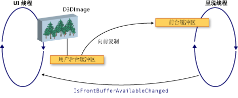

# WPF 和 Direct3D9 互操作
你可以在 Windows Presentation Foundation (WPF) 应用程序中包含 Direct3D9 内容。 本主题介绍如何创建 Direct3D9 内容，以便它有效地与 WPF 互操作。  
  
> [!NOTE]
>  在 WPF 中使用 Direct3D9 内容，还需要考虑性能。 有关如何优化性能的详细信息，请参阅[Direct3D9 和 WPF 互操作性的性能注意事项](../../../../docs/framework/wpf/advanced/performance-considerations-for-direct3d9-and-wpf-interoperability.md)。  
  
## 显示缓冲区  
 <xref:System.Windows.Interop.D3DImage>类管理两个显示缓冲区，称为*后台缓冲区*和*前台缓冲区*。 后台缓冲区是 Direct3D9 图面。 更改对后台缓冲区复制转发到前台缓冲区在调用时<xref:System.Windows.Interop.D3DImage.Unlock%2A>方法。  
  
 下图显示后台缓冲区和前端缓冲区之间的关系。  
  
   
  
## 创建 Direct3D9 设备  
 若要呈现 Direct3D9 内容，必须创建 Direct3D9 设备。 有两个可用于创建设备的 Direct3D9 对象`IDirect3D9`和`IDirect3D9Ex`。 这些对象用于创建`IDirect3DDevice9`和`IDirect3DDevice9Ex`设备，分别。  
  
 通过调用以下方法之一创建一个设备。  
  
-   `IDirect3D9 * Direct3DCreate9(UINT SDKVersion);`  
  
-   `HRESULT Direct3DCreate9Ex(UINT SDKVersion, IDirect3D9Ex **ppD3D);`  
  
 在 Windows Vista 或更高版本操作系统上，使用`Direct3DCreate9Ex`具有配置为使用 Windows 显示驱动程序模型 (WDDM) 显示的方法。 使用`Direct3DCreate9`在任何其他平台上的方法。  
  
### Direct3DCreate9Ex 方法的可用性  
 D3d9.dll 具有`Direct3DCreate9Ex`只会在 Windows Vista 或更高版本操作系统的方法。 如果直接将链接到该函数会在 Windows XP，你的应用程序将无法加载。 若要确定是否`Direct3DCreate9Ex`支持方法、 加载 DLL 和查找进程地址。 下面的代码演示如何测试`Direct3DCreate9Ex`方法。 有关完整的代码示例，请参阅[演练： 创建内容的 WPF 中的托管的 Direct3D9](../../../../docs/framework/wpf/advanced/walkthrough-creating-direct3d9-content-for-hosting-in-wpf.md)。  
  
 [!code-cpp[System.Windows.Interop.D3DImage#RendererManager_EnsureD3DObjects](../../../../samples/snippets/cpp/VS_Snippets_Wpf/System.Windows.Interop.D3DImage/cpp/renderermanager.cpp#renderermanager_ensured3dobjects)]  
  
### HWND 创建  
 创建设备需要 HWND。 一般情况下，你创建 Direct3D9 使用 dummy HWND。 下面的代码示例演示如何创建 dummy HWND。  
  
 [!code-cpp[System.Windows.Interop.D3DImage#RendererManager_EnsureHWND](../../../../samples/snippets/cpp/VS_Snippets_Wpf/System.Windows.Interop.D3DImage/cpp/renderermanager.cpp#renderermanager_ensurehwnd)]  
  
### 存在的参数  
 创建设备还要求`D3DPRESENT_PARAMETERS`结构，但仅几个参数很重要。 这些参数是选择最大程度减少内存占用量。  
  
 设置`BackBufferHeight`和`BackBufferWidth`字段为 1。 将它们设置为 0 会导致它们被设置为的 HWND 的尺寸。  
  
 始终设置`D3DCREATE_MULTITHREADED`和`D3DCREATE_FPU_PRESERVE`标记以避免损坏 Direct3D9 和阻止 Direct3D9 更改 FPU 设置使用的内存。  
  
 下面的代码演示如何初始化`D3DPRESENT_PARAMETERS`结构。  
  
 [!code-cpp[System.Windows.Interop.D3DImage#Renderer_Init](../../../../samples/snippets/cpp/VS_Snippets_Wpf/System.Windows.Interop.D3DImage/cpp/renderer.cpp#renderer_init)]  
  
## 创建后台缓冲区呈现器目标  
 若要显示在 Direct3D9 内容<xref:System.Windows.Interop.D3DImage>，创建 Direct3D9 面并将其分配通过调用<xref:System.Windows.Interop.D3DImage.SetBackBuffer%2A>方法。  
  
### 验证适配器支持  
 在创建图面之前, 请验证所有适配器都支持图面所需的属性。 即使你呈现到只有一个适配器，可能会在系统中任何适配器上显示 WPF 窗口。 你应始终编写 Direct3D9 代码来处理多适配器配置，因为 WPF 可能移动之间的可用适配器的图面，应检查所有适配器的支持。  
  
 下面的代码示例演示如何检查对 Direct3D9 系统上的所有适配器都支持。  
  
 [!code-cpp[System.Windows.Interop.D3DImage#RendererManager_TestSurfaceSettings](../../../../samples/snippets/cpp/VS_Snippets_Wpf/System.Windows.Interop.D3DImage/cpp/renderermanager.cpp#renderermanager_testsurfacesettings)]  
  
### 创建面  
 在创建图面之前, 请验证的设备功能，在目标操作系统上支持良好的性能。 有关详细信息，请参阅[Direct3D9 和 WPF 互操作性的性能注意事项](../../../../docs/framework/wpf/advanced/performance-considerations-for-direct3d9-and-wpf-interoperability.md)。  
  
 如果你已验证设备功能，你可以创建面。 下面的代码示例演示如何创建呈现器目标。  
  
 [!code-cpp[System.Windows.Interop.D3DImage#Renderer_CreateSurface](../../../../samples/snippets/cpp/VS_Snippets_Wpf/System.Windows.Interop.D3DImage/cpp/renderer.cpp#renderer_createsurface)]  
  
### WDDM  
 在 Windows Vista 和更高版本操作系统，这都配置为使用的 WDDM，你可以创建呈现器目标纹理，并将传递到的级别 0 面<xref:System.Windows.Interop.D3DImage.SetBackBuffer%2A>方法。 不建议使用此方法在 Windows XP 中，因为不能创建可锁定呈现器目标纹理，性能将会降低。  
  
## 处理设备的状态更改  
 <xref:System.Windows.Interop.D3DImage>类管理两个显示缓冲区，称为*后台缓冲区*和*前台缓冲区*。 后台缓冲区是你的 Direct3D 面。  更改对后台缓冲区复制转发到前台缓冲区在调用时<xref:System.Windows.Interop.D3DImage.Unlock%2A>方法，其中显示在硬件。 有时，前台缓冲区变得不可用。 此缺乏可用性可能引起屏幕锁定、 全屏幕独占 Direct3D 应用程序、 用户切换或其他系统活动。 当发生这种情况时，通知 WPF 应用程序通过处理<xref:System.Windows.Interop.D3DImage.IsFrontBufferAvailableChanged>事件。  你的应用程序响应前台缓冲区变得不可用的方式取决于是否启用 WPF 为回退到软件呈现。 <xref:System.Windows.Interop.D3DImage.SetBackBuffer%2A>方法具有一个重载采用一个参数，指定是否 WPF 回退到软件呈现。  
  
 当调用<xref:System.Windows.Interop.D3DImage.SetBackBuffer%28System.Windows.Interop.D3DResourceType%2CSystem.IntPtr%29>重载或调用<xref:System.Windows.Interop.D3DImage.SetBackBuffer%28System.Windows.Interop.D3DResourceType%2CSystem.IntPtr%2CSystem.Boolean%29>重载`enableSoftwareFallback`参数设置为`false`，当前台缓冲区变得不可用，并且执行任何操作时，呈现系统释放其对后台缓冲区的引用显示。 呈现系统前台缓冲区再次可用时，将引发<xref:System.Windows.Interop.D3DImage.IsFrontBufferAvailableChanged>事件以通知你的 WPF 应用程序。  你可以创建的事件处理程序<xref:System.Windows.Interop.D3DImage.IsFrontBufferAvailableChanged>事件重新启动再次与有效的 Direct3D 面呈现。 若要重新启动呈现，必须调用<xref:System.Windows.Interop.D3DImage.SetBackBuffer%2A>。  
  
 当调用<xref:System.Windows.Interop.D3DImage.SetBackBuffer%28System.Windows.Interop.D3DResourceType%2CSystem.IntPtr%2CSystem.Boolean%29>重载`enableSoftwareFallback`参数设置为`true`，呈现系统保留它对后台缓冲区的引用时前台缓冲区变得不可用，因此无需调用<xref:System.Windows.Interop.D3DImage.SetBackBuffer%2A>时前面缓冲区重新变为可用。  
  
 启用软件呈现后，可能存在其中用户的设备变得不可用，但呈现系统会保留到 Direct3D 面的引用。 若要检查 Direct3D9 设备是否不可用，请调用`TestCooperativeLevel`方法。 若要检查 Direct3D9Ex 设备调用`CheckDeviceState`方法，因为`TestCooperativeLevel`方法已弃用，并始终返回成功。 如果用户设备已变为不可用，调用<xref:System.Windows.Interop.D3DImage.SetBackBuffer%2A>来释放对后台缓冲区的 WPF 的引用。  如果你需要重置你的设备，调用<xref:System.Windows.Interop.D3DImage.SetBackBuffer%2A>与`backBuffer`参数设置为`null`，然后调用<xref:System.Windows.Interop.D3DImage.SetBackBuffer%2A>试`backBuffer`设置为有效的 Direct3D 图面。  
  
 调用`Reset`方法，以恢复从无效的设备，仅当实现多适配器支持。 否则为释放所有 Direct3D9 接口，并且完全重新创建它们。 如果适配器布局已更改，更改之前创建的 Direct3D9 对象不会更新。  
  
## 处理调整大小  
 如果<xref:System.Windows.Interop.D3DImage>显示在其原始大小以外分辨率，根据当前缩放<xref:System.Windows.Media.RenderOptions.BitmapScalingMode%2A>，只不过<xref:System.Windows.Media.Effects.SamplingMode.Bilinear>替换为<xref:System.Windows.Media.BitmapScalingMode.Fant>。  
  
 如果需要更高的保真度，你必须创建一个新图面时的容器<xref:System.Windows.Interop.D3DImage>大小更改。  
  
 有以下三种方法来处理调整大小。  
  
-   参与布局系统，并在大小发生更改时创建新的图面。 不要创建过多的图面，因为可能会耗尽或产生视频内存碎片。  
  
-   等待，直到调整大小事件后未发生的一段固定的时间来创建新的图面。  
  
-   创建<xref:System.Windows.Threading.DispatcherTimer>，用于检查对容器维度进行多次每秒。  
  
## 多监视器优化  
 呈现系统移动时，会导致性能显著降低<xref:System.Windows.Interop.D3DImage>到另一个监视器。  
  
 在上 WDDM，只要监视器位于相同的视频卡上，并使用`Direct3DCreate9Ex`，就不在性能会下降。 如果监视器位于不同的视频卡上，性能会下降。 在 Windows XP 中，会始终会降低性能。  
  
 当<xref:System.Windows.Interop.D3DImage>将移到另一个监视器，你可以创建新的图面上的相应的适配器，以还原良好的性能。  
  
 若要避免对性能的影响，编写专门为多监视器情况的代码。 以下列表显示编写多监视器代码的一种方法。  
  
1.  查找的点<xref:System.Windows.Interop.D3DImage>中使用的屏幕空间`Visual.ProjectToScreen`方法。  
  
2.  使用`MonitorFromPoint`GDI 方法以查找显示该点的监视器。  
  
3.  使用`IDirect3D9::GetAdapterMonitor`方法查找监视器的哪个 Direct3D9 适配器位于。  
  
4.  如果适配器不是后台缓冲区的适配器相同，在新的监视器上创建新的后台缓冲区，并且将其分配给<xref:System.Windows.Interop.D3DImage>后台缓冲区。  
  
> [!NOTE]
>  如果<xref:System.Windows.Interop.D3DImage>跨多台监视器，性能将很慢，除对于 WDDM 和`IDirect3D9Ex`同一适配器上。 没有方法来提高性能在此情况下。  
  
 下面的代码示例演示如何查找当前监视器。  
  
 [!code-cpp[System.Windows.Interop.D3DImage#RendererManager_SetAdapter](../../../../samples/snippets/cpp/VS_Snippets_Wpf/System.Windows.Interop.D3DImage/cpp/renderermanager.cpp#renderermanager_setadapter)]  
  
 更新监视器时<xref:System.Windows.Interop.D3DImage>容器的大小或位置发生变化或更新通过使用监视器`DispatcherTimer`每秒几次更新。  
  
## WPF 软件呈现  
 WPF 将以同步方式呈现在以下情况下的软件中的 UI 线程上。  
  
-   打印  
  
-   <xref:System.Windows.Media.Effects.BitmapEffect>  
  
-   <xref:System.Windows.Media.Imaging.RenderTargetBitmap>  
  
 当发生这些情况之一时，呈现系统调用<xref:System.Windows.Interop.D3DImage.CopyBackBuffer%2A>方法将硬件缓冲区复制到的软件。 默认实现调用`GetRenderTargetData`方法与您的图面。 因为此调用发生在锁定/解锁模式之外，则可能会失败。 在这种情况下，`CopyBackBuffer`方法返回`null`和不显示任何图像。  
  
 您可以重写<xref:System.Windows.Interop.D3DImage.CopyBackBuffer%2A>方法，调用基实现，如果它返回`null`，你可以返回一个占位符<xref:System.Windows.Media.Imaging.BitmapSource>。  
  
 你也可以实现自己的软件呈现，而不是调用基实现。  
  
> [!NOTE]
>  如果在软件中，完全呈现 WPF<xref:System.Windows.Interop.D3DImage>未显示，因为 WPF 没有前台缓冲区。  
  
## 请参阅  
 <xref:System.Windows.Interop.D3DImage>  
 [Direct3D9 和 WPF 互操作性的性能注意事项](../../../../docs/framework/wpf/advanced/performance-considerations-for-direct3d9-and-wpf-interoperability.md)  
 [演练：创建在 WPF 中托管的 Direct3D9 内容](../../../../docs/framework/wpf/advanced/walkthrough-creating-direct3d9-content-for-hosting-in-wpf.md)  
 [演练：在 WPF 中托管 Direct3D9 内容](../../../../docs/framework/wpf/advanced/walkthrough-hosting-direct3d9-content-in-wpf.md)
