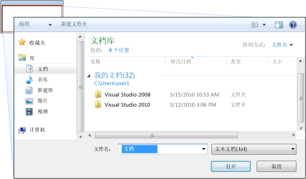
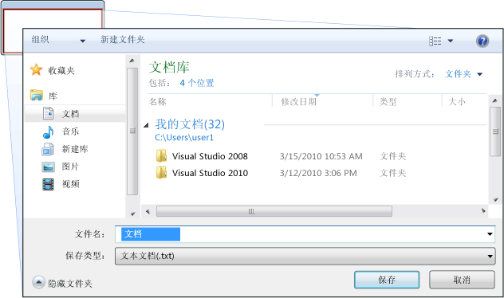

# 对话框概述
独立应用程序通常具有主窗口，同时显示的主数据，通过该应用程序进行运行，并将处理通过该数据的功能公开[!INCLUDE[TLA#tla_ui](../../../../includes/tlasharptla-ui-md.md)]机制，如菜单栏、 工具栏和状态栏。 重要的应用程序可能还会显示其他窗口来执行以下操作：  
  
-   向用户显示特定信息。  
  
-   从用户处收集信息。  
  
-   同时显示并收集信息。  
  
 这些类型的 windows 称为*对话框*，并且有两种类型： 模式和无模式。  
  
 A*模式*函数需要用户继续从其他数据时，对话框将显示函数。 由于函数依赖于模式对话框收集数据，模式对话框还会在其保持打开状态时防止用户激活应用程序中的其他窗口。 在大多数情况下，模式对话框，用户可以发出信号时它们完成的模式对话框中按任一**确定**或**取消**按钮。 按**确定**按钮指示用户输入了数据，想要继续处理该数据的函数。 按**取消**按钮指示用户想要停止中一起执行的函数。 最常见的模式对话框示例显示为可以打开、保存并打印数据。  
  
 A*无模式*对话框中，另一方面，不会阻止用户激活其他窗口处于打开状态时。 例如，如果用户想要在某个文档中查找特定字的出现次数，主窗口通常会打开一个对话框，询问用户要查找的字是什么。 查找字并不会防止用户编辑文档，因此对话框无需为模式对话框。 无模式对话框至少提供**关闭**按钮以关闭对话框，并可能提供其他按钮来执行特定的功能，如**查找下一个**按钮以查找下一个词与 word 搜索查找条件匹配。  
  
 Windows Presentation Foundation (WPF)，可创建几种类型的对话框框中，包括消息框、 通用对话框和自定义对话框。 本主题介绍了每一个，和[对话框示例](http://go.microsoft.com/fwlink/?LinkID=159984)提供匹配的示例。  
  
 
  
   
## 消息框  
 A*消息框*是可以用于显示文本的信息并允许用户通过按钮做出决定的对话框。 下图显示的消息框显示文本信息、提出问题并向用户提供了三个按钮来回答问题。  
  
   
  
 若要创建一个消息框，你可以使用<xref:System.Windows.MessageBox>类。 <xref:System.Windows.MessageBox> 可以配置消息框文本、 标题、 图标和按钮，使用代码如下所示。  
  
 [!code-csharp[DialogBoxesOverviewSnippets#MsgBoxConfigureCODEBEHIND](../../../../samples/snippets/csharp/VS_Snippets_Wpf/DialogBoxesOverviewSnippets/CSharp/Window1.xaml.cs#msgboxconfigurecodebehind)]
 [!code-vb[DialogBoxesOverviewSnippets#MsgBoxConfigureCODEBEHIND](../../../../samples/snippets/visualbasic/VS_Snippets_Wpf/DialogBoxesOverviewSnippets/VisualBasic/window1.xaml.vb#msgboxconfigurecodebehind)]  
  
 若要显示一个消息框，则调用`static`<xref:System.Windows.MessageBox.Show%2A>方法，如下面的代码所示。  
  
 [!code-csharp[DialogBoxesOverviewSnippets#MsgBoxShowCODEBEHIND](../../../../samples/snippets/csharp/VS_Snippets_Wpf/DialogBoxesOverviewSnippets/CSharp/Window1.xaml.cs#msgboxshowcodebehind)]
 [!code-vb[DialogBoxesOverviewSnippets#MsgBoxShowCODEBEHIND](../../../../samples/snippets/visualbasic/VS_Snippets_Wpf/DialogBoxesOverviewSnippets/VisualBasic/window1.xaml.vb#msgboxshowcodebehind)]  
  
 当显示消息框的代码需要检测并处理用户决定（按下了哪个按钮）时，该代码可以检查消息框的结果，如以下代码中所示。  
  
 [!code-csharp[DialogBoxesOverviewSnippets#MsgBoxShowAndResultCODEBEHIND1](../../../../samples/snippets/csharp/VS_Snippets_Wpf/DialogBoxesOverviewSnippets/CSharp/Window1.xaml.cs#msgboxshowandresultcodebehind1)]
 [!code-vb[DialogBoxesOverviewSnippets#MsgBoxShowAndResultCODEBEHIND1](../../../../samples/snippets/visualbasic/VS_Snippets_Wpf/DialogBoxesOverviewSnippets/VisualBasic/window1.xaml.vb#msgboxshowandresultcodebehind1)]  
  
 使用消息框的详细信息，请参阅<xref:System.Windows.MessageBox>， [MessageBox 示例](http://go.microsoft.com/fwlink/?LinkID=160023)，和[对话框示例](http://go.microsoft.com/fwlink/?LinkID=159984)。  
  
 尽管<xref:System.Windows.MessageBox>可提供简单对话框框中用户体验，使用的优点<xref:System.Windows.MessageBox>是可以由在部分信任安全沙盒中运行的应用程序显示的窗口的唯一类型 (请参阅[安全](../../../../docs/framework/wpf/security-wpf.md))，如[!INCLUDE[TLA#tla_xbap#plural](../../../../includes/tlasharptla-xbapsharpplural-md.md)]。  
  
 大多数对话框显示和收集比消息框结果更复杂的数据，包括文本、选项（复选框）、互斥选项（单选按钮）和列表选项（列表框、组合框、下拉列表框）。 对于这些数据，Windows Presentation Foundation (WPF) 提供几个通用对话框，并允许你创建你自己的对话框，尽管这两类使用仅限于以完全信任运行的应用程序。  
  
   
## 通用对话框  
 [!INCLUDE[TLA#tla_mswin](../../../../includes/tlasharptla-mswin-md.md)] 实现所有应用程序（包括用于打开文件、保存文件和打印的对话框）共用的各种可重用的对话框。 这些对话框由操作系统实现，因此可以在运行于该操作系统上的所有应用程序之间共享，这对用户体验的一致性很有帮助；当用户熟悉一个应用程序中操作系统所提供的对话框时，他们就无需再去了解如何在其他应用程序中使用该对话框。 因为这些对话框可供所有应用程序，因为它可以帮助提供一致的用户体验，它们被称为*通用对话框*。  
  
 Windows Presentation Foundation (WPF) 封装打开的文件、 保存文件，并打印通用对话框并将它们公开为托管的类供你使用独立应用程序中。 本主题提供每个通用对话框的简要概述。  
  
   
### 打开文件对话框  
 如下图中所示的打开文件对话框由文件打开功能用于检索要打开文件的名称。  
  
   
  
 作为实现通用的打开文件对话框<xref:Microsoft.Win32.OpenFileDialog>类，且位于<xref:Microsoft.Win32>命名空间。 以下代码显示了如何创建、配置和显示保存文件对话框以及如何处理结果。  
  
 [!code-csharp[DialogBoxesOverviewSnippets#OpenFileDialogBoxCODEBEHIND](../../../../samples/snippets/csharp/VS_Snippets_Wpf/DialogBoxesOverviewSnippets/CSharp/Window1.xaml.cs#openfiledialogboxcodebehind)]
 [!code-vb[DialogBoxesOverviewSnippets#OpenFileDialogBoxCODEBEHIND](../../../../samples/snippets/visualbasic/VS_Snippets_Wpf/DialogBoxesOverviewSnippets/VisualBasic/window1.xaml.vb#openfiledialogboxcodebehind)]  
  
 打开文件对话框中的详细信息，请参阅<xref:Microsoft.Win32.OpenFileDialog?displayProperty=nameWithType>。  
  
> [!NOTE]
>  <xref:Microsoft.Win32.OpenFileDialog> 可以用于安全地检索文件的名称在部分信任运行的应用程序 (请参阅[安全](../../../../docs/framework/wpf/security-wpf.md))。  
  
   
### 保存文件对话框  
 如下图中所示的保存文件对话框由文件保存功能用以检索要保存的文件的名称。  
  
   
  
 保存文件对话框中的常见实现为<xref:Microsoft.Win32.SaveFileDialog>类，并且位于<xref:Microsoft.Win32>命名空间。 以下代码显示了如何创建、配置和显示保存文件对话框以及如何处理结果。  
  
 [!code-csharp[DialogBoxesOverviewSnippets#SaveFileDialogBoxCODEBEHIND](../../../../samples/snippets/csharp/VS_Snippets_Wpf/DialogBoxesOverviewSnippets/CSharp/Window1.xaml.cs#savefiledialogboxcodebehind)]
 [!code-vb[DialogBoxesOverviewSnippets#SaveFileDialogBoxCODEBEHIND](../../../../samples/snippets/visualbasic/VS_Snippets_Wpf/DialogBoxesOverviewSnippets/VisualBasic/window1.xaml.vb#savefiledialogboxcodebehind)]  
  
 有关详细信息保存文件对话框中，请参阅<xref:Microsoft.Win32.SaveFileDialog?displayProperty=nameWithType>。  
  
   
### 打印对话框  
 如下图中所示的打印对话框由打印功能用以选择和配置用户想要将数据打印到的打印机。  
  
   
  
 作为实现通用打印对话框<xref:System.Windows.Controls.PrintDialog>类，并且位于<xref:System.Windows.Controls>命名空间。 以下代码显示了如何创建、配置和显示打印对话框。  
  
 [!code-csharp[DialogBoxesOverviewSnippets#PrintDialogBoxCODEBEHIND](../../../../samples/snippets/csharp/VS_Snippets_Wpf/DialogBoxesOverviewSnippets/CSharp/Window1.xaml.cs#printdialogboxcodebehind)]
 [!code-vb[DialogBoxesOverviewSnippets#PrintDialogBoxCODEBEHIND](../../../../samples/snippets/visualbasic/VS_Snippets_Wpf/DialogBoxesOverviewSnippets/VisualBasic/window1.xaml.vb#printdialogboxcodebehind)]  
  
 打印对话框的详细信息，请参阅<xref:System.Windows.Controls.PrintDialog?displayProperty=nameWithType>。 有关详细讨论中的打印[!INCLUDE[TLA2#tla_wpf](../../../../includes/tla2sharptla-wpf-md.md)]，请参阅[打印概述](../../../../docs/framework/wpf/advanced/printing-overview.md)。  
  
   
## 自定义对话框  
 尽管通用对话框很有用并应尽可能使用，但它们并不支持特定于域的对话框的要求。 在这些情况下，就需要创建自己的对话框。 如我们所见，对话框是具有特殊行为的窗口。 <xref:System.Windows.Window> 实现这些行为和中，因此，使用<xref:System.Windows.Window>创建自定义模式和无模式对话框。  
  
   
### 创建模式自定义对话框  
 本主题演示如何使用<xref:System.Windows.Window>创建一个典型的模式对话框框中实现，它使用`Margins`作为示例的对话框中 (请参阅[对话框示例](http://go.microsoft.com/fwlink/?LinkID=159984))。 `Margins`如下图中显示对话框。  
  
   
  
#### 配置模式对话框  
 典型对话框的用户界面包括以下内容：  
  
-   收集所需数据要求的各种控件。  
  
-   显示**确定**按钮用户单击以关闭对话框，返回到该功能，并继续进行处理。  
  
-   显示**取消**用户单击来关闭对话框并停止进一步处理功能的按钮。  
  
-   显示**关闭**标题栏中的按钮。  
  
-   显示一个图标。  
  
-   显示**最小化**，**最大化**，和**还原**按钮。  
  
-   显示**系统**菜单以最小化、 最大化、 还原和关闭对话框。  
  
-   在打开对话框的窗口上方和中心打开。  
  
-   对话框应尽可能可以调整大小（以防对话框过小）并为用户提供合适的默认尺寸，需要分别设置默认和最小尺寸。  
  
-   按 ESC 键应配置为与导致的键盘快捷方式**取消**按按钮。 这可通过设置<xref:System.Windows.Controls.Button.IsCancel%2A>属性**取消**按钮`true`。  
  
-   按 ENTER 键 （或 RETURN） 键应配置为将导致的键盘快捷方式**确定**按按钮。 这可通过设置<xref:System.Windows.Controls.Button.IsDefault%2A>属性**确定**按钮`true`。  
  
 以下代码演示了这种配置。  
  
 [!code-xaml[DialogBoxSample#MarginsDialogBoxMainBitsMARKUP1](../../../../samples/snippets/csharp/VS_Snippets_Wpf/DialogBoxSample/CSharp/MarginsDialogBox.xaml#marginsdialogboxmainbitsmarkup1)]  
[!code-xaml[DialogBoxSample#MarginsDialogBoxMainBitsMARKUP2](../../../../samples/snippets/csharp/VS_Snippets_Wpf/DialogBoxSample/CSharp/MarginsDialogBox.xaml#marginsdialogboxmainbitsmarkup2)]  
  
 [!code-csharp[DialogBoxSample#MarginsDialogBoxMainBitsCODEBEHIND1](../../../../samples/snippets/csharp/VS_Snippets_Wpf/DialogBoxSample/CSharp/MarginsDialogBox.xaml.cs#marginsdialogboxmainbitscodebehind1)]
 [!code-vb[DialogBoxSample#MarginsDialogBoxMainBitsCODEBEHIND1](../../../../samples/snippets/visualbasic/VS_Snippets_Wpf/DialogBoxSample/VisualBasic/MarginsDialogBox.xaml.vb#marginsdialogboxmainbitscodebehind1)]  
[!code-csharp[DialogBoxSample#MarginsDialogBoxMainBitsCODEBEHIND2](../../../../samples/snippets/csharp/VS_Snippets_Wpf/DialogBoxSample/CSharp/MarginsDialogBox.xaml.cs#marginsdialogboxmainbitscodebehind2)]
[!code-vb[DialogBoxSample#MarginsDialogBoxMainBitsCODEBEHIND2](../../../../samples/snippets/visualbasic/VS_Snippets_Wpf/DialogBoxSample/VisualBasic/MarginsDialogBox.xaml.vb#marginsdialogboxmainbitscodebehind2)]  
  
 对话框用户体验还扩展到打开对话框的窗口菜单栏。 当菜单项运行需要用户通过对话框交互才能继续运行的函数时，函数的菜单项标题上会有一个省略号，如此处所示。  
  
 [!code-xaml[DialogBoxSample#MainWindowMarginsDialogBoxMenuItemMARKUP1](../../../../samples/snippets/csharp/VS_Snippets_Wpf/DialogBoxSample/CSharp/MainWindow.xaml#mainwindowmarginsdialogboxmenuitemmarkup1)]  
[!code-xaml[DialogBoxSample#MainWindowMarginsDialogBoxMenuItemMARKUP2](../../../../samples/snippets/csharp/VS_Snippets_Wpf/DialogBoxSample/CSharp/MainWindow.xaml#mainwindowmarginsdialogboxmenuitemmarkup2)]  
  
 当菜单项运行的函数显示无需用户交互的对话框（如“关于”对话框）时，则不需要省略号。  
  
#### 打开模式对话框  
 对话框通常显示为用户选择菜单项来执行特定于域的函数的结果，比如在字处理器中设置文档边距。 将窗口显示为对话框类似于显示普通窗口，只是它需要其他特定于对话框的配置。 以下代码中显示了实例化、配置和打开对话框的整个过程。  
  
 [!code-csharp[DialogBoxSample#OpenMarginsDialogCODEBEHIND1](../../../../samples/snippets/csharp/VS_Snippets_Wpf/DialogBoxSample/CSharp/MainWindow.xaml.cs#openmarginsdialogcodebehind1)]
 [!code-vb[DialogBoxSample#OpenMarginsDialogCODEBEHIND1](../../../../samples/snippets/visualbasic/VS_Snippets_Wpf/DialogBoxSample/VisualBasic/MainWindow.xaml.vb#openmarginsdialogcodebehind1)]  
[!code-csharp[DialogBoxSample#OpenMarginsDialogCODEBEHIND2](../../../../samples/snippets/csharp/VS_Snippets_Wpf/DialogBoxSample/CSharp/MainWindow.xaml.cs#openmarginsdialogcodebehind2)]
[!code-vb[DialogBoxSample#OpenMarginsDialogCODEBEHIND2](../../../../samples/snippets/visualbasic/VS_Snippets_Wpf/DialogBoxSample/VisualBasic/MainWindow.xaml.vb#openmarginsdialogcodebehind2)]  
[!code-csharp[DialogBoxSample#OpenMarginsDialogCODEBEHIND3](../../../../samples/snippets/csharp/VS_Snippets_Wpf/DialogBoxSample/CSharp/MainWindow.xaml.cs#openmarginsdialogcodebehind3)]
[!code-vb[DialogBoxSample#OpenMarginsDialogCODEBEHIND3](../../../../samples/snippets/visualbasic/VS_Snippets_Wpf/DialogBoxSample/VisualBasic/MainWindow.xaml.vb#openmarginsdialogcodebehind3)]  
[!code-csharp[DialogBoxSample#OpenMarginsDialogCODEBEHIND4](../../../../samples/snippets/csharp/VS_Snippets_Wpf/DialogBoxSample/CSharp/MainWindow.xaml.cs#openmarginsdialogcodebehind4)]
[!code-vb[DialogBoxSample#OpenMarginsDialogCODEBEHIND4](../../../../samples/snippets/visualbasic/VS_Snippets_Wpf/DialogBoxSample/VisualBasic/MainWindow.xaml.vb#openmarginsdialogcodebehind4)]  
  
 此处代码将默认信息（当前边距）传递给对话框。 它设置<xref:System.Windows.Window.Owner%2A?displayProperty=nameWithType>具有对显示的对话框窗口的引用属性。 一般情况下，应始终设置对话框中提供窗口与状态相关的行为所共有的所有对话框的所有者 (请参阅[WPF Windows 概述](../../../../docs/framework/wpf/app-development/wpf-windows-overview.md)有关详细信息)。  
  
> [!NOTE]
>  必须提供一个所有者，以支持[!INCLUDE[TLA#tla_ui](../../../../includes/tlasharptla-ui-md.md)]对话框自动化 (请参阅[UI 自动化概述](../../../../docs/framework/ui-automation/ui-automation-overview.md))。  
  
 配置对话框中后，它将显示有模式地通过调用<xref:System.Windows.Window.ShowDialog%2A>方法。  
  
#### 验证用户提供的数据  
 当打开对话框并且用户提供所需数据时，对话框出于以下原因负责确保提供的数据有效：  
  
-   从安全角度，应该验证所有输入。  
  
-   从特定于域的角度，数据验证可以防止代码处理错误数据，这可能引发异常。  
  
-   从用户体验角度，对话框可以帮助用户显示他们输入的哪些数据无效。  
  
-   从性能角度，多层应用程序中的数据验证可以减少客户端和应用程序层之间的往返次数，尤其当应用程序由 Web 服务或基于服务器的数据库构成时。  
  
 若要验证中的绑定的控件[!INCLUDE[TLA2#tla_wpf](../../../../includes/tla2sharptla-wpf-md.md)]，你需要定义验证规则并将其与绑定相关联。 验证规则是派生自的自定义类<xref:System.Windows.Controls.ValidationRule>。 下面的示例演示验证规则， `MarginValidationRule`，一个绑定的值的检查<xref:System.Double>，并且在指定范围内。  
  
 [!code-csharp[DialogBoxSample#MarginValidationRuleCODE](../../../../samples/snippets/csharp/VS_Snippets_Wpf/DialogBoxSample/CSharp/MarginValidationRule.cs#marginvalidationrulecode)]
 [!code-vb[DialogBoxSample#MarginValidationRuleCODE](../../../../samples/snippets/visualbasic/VS_Snippets_Wpf/DialogBoxSample/VisualBasic/MarginValidationRule.vb#marginvalidationrulecode)]  
  
 在此代码中，验证规则的验证逻辑实现通过重写<xref:System.Windows.Controls.ValidationRule.Validate%2A>方法，它的数据进行验证，并返回相应<xref:System.Windows.Controls.ValidationResult>。  
  
 要将验证规则与绑定控件进行关联，可以使用以下标记。  
  
 [!code-xaml[DialogBoxSample#MarginsValidationMARKUP1](../../../../samples/snippets/csharp/VS_Snippets_Wpf/DialogBoxSample/CSharp/MarginsDialogBox.xaml#marginsvalidationmarkup1)]  
[!code-xaml[DialogBoxSample#MarginsValidationMARKUP2](../../../../samples/snippets/csharp/VS_Snippets_Wpf/DialogBoxSample/CSharp/MarginsDialogBox.xaml#marginsvalidationmarkup2)]  
[!code-xaml[DialogBoxSample#MarginsValidationMARKUP3](../../../../samples/snippets/csharp/VS_Snippets_Wpf/DialogBoxSample/CSharp/MarginsDialogBox.xaml#marginsvalidationmarkup3)]  
  
 一旦验证规则是相关联，[!INCLUDE[TLA2#tla_wpf](../../../../includes/tla2sharptla-wpf-md.md)]会自动将它应用数据输入到绑定控件时。 如果控件包含无效的数据，[!INCLUDE[TLA2#tla_wpf](../../../../includes/tla2sharptla-wpf-md.md)]将红色的周围显示边框无效的控件，如下图中所示。  
  
   
  
 [!INCLUDE[TLA2#tla_wpf](../../../../includes/tla2sharptla-wpf-md.md)] 不会在用户输入有效数据之前限制其对无效控件的访问。 这对于对话框来说很好，无论数据是否有效用户都应该可以自由导航到对话框中的控件。 但是，这意味着用户可以输入无效数据，然后按**确定**按钮。 为此，你的代码还需要验证在对话框中的所有控件当**确定**按钮按下处理<xref:System.Windows.Controls.Primitives.ButtonBase.Click>事件。  
  
 [!code-csharp[DialogBoxSample#MarginsDialogBoxValidationCODEBEHIND1](../../../../samples/snippets/csharp/VS_Snippets_Wpf/DialogBoxSample/CSharp/MarginsDialogBox.xaml.cs#marginsdialogboxvalidationcodebehind1)]
 [!code-vb[DialogBoxSample#MarginsDialogBoxValidationCODEBEHIND1](../../../../samples/snippets/visualbasic/VS_Snippets_Wpf/DialogBoxSample/VisualBasic/MarginsDialogBox.xaml.vb#marginsdialogboxvalidationcodebehind1)]  
[!code-csharp[DialogBoxSample#MarginsDialogBoxValidationCODEBEHIND2](../../../../samples/snippets/csharp/VS_Snippets_Wpf/DialogBoxSample/CSharp/MarginsDialogBox.xaml.cs#marginsdialogboxvalidationcodebehind2)]
[!code-vb[DialogBoxSample#MarginsDialogBoxValidationCODEBEHIND2](../../../../samples/snippets/visualbasic/VS_Snippets_Wpf/DialogBoxSample/VisualBasic/MarginsDialogBox.xaml.vb#marginsdialogboxvalidationcodebehind2)]  
[!code-csharp[DialogBoxSample#MarginsDialogBoxValidationCODEBEHIND3](../../../../samples/snippets/csharp/VS_Snippets_Wpf/DialogBoxSample/CSharp/MarginsDialogBox.xaml.cs#marginsdialogboxvalidationcodebehind3)]
[!code-vb[DialogBoxSample#MarginsDialogBoxValidationCODEBEHIND3](../../../../samples/snippets/visualbasic/VS_Snippets_Wpf/DialogBoxSample/VisualBasic/MarginsDialogBox.xaml.vb#marginsdialogboxvalidationcodebehind3)]  
  
 此代码枚举窗口上的所有依赖项对象，如果任何无效 (由返回<xref:System.Windows.Controls.Validation.GetHasError%2A>，无效的控件获得焦点，`IsValid`方法返回`false`，和窗口被认为是无效。  
  
 一旦对话框有效，就可以安全关闭并返回。 作为返回过程的一部分，需要将结果返回到调用函数。  
  
#### 设置模式对话框结果  
 打开对话框框中使用<xref:System.Windows.Window.ShowDialog%2A>它基本上是像调用的方法： 打开对话框框中使用的代码<xref:System.Windows.Window.ShowDialog%2A>将等待，直至<xref:System.Windows.Window.ShowDialog%2A>返回。 当<xref:System.Windows.Window.ShowDialog%2A>代码需要调用它以确定是否继续处理或停止处理，根据是否，则会返回用户按下**确定**按钮或**取消**按钮。 若要便于做出此决定，对话框中需要返回用户的选择为<xref:System.Boolean>从返回的值<xref:System.Windows.Window.ShowDialog%2A>方法。  
  
 当**确定**单击按钮时，<xref:System.Windows.Window.ShowDialog%2A>应返回`true`。 这可通过设置<xref:System.Windows.Window.DialogResult%2A>属性对话框框中时**确定**单击按钮。  
  
 [!code-csharp[DialogBoxSample#MarginsDialogBoxOKResultSetCODEBEHIND1](../../../../samples/snippets/csharp/VS_Snippets_Wpf/DialogBoxSample/CSharp/MarginsDialogBox.xaml.cs#marginsdialogboxokresultsetcodebehind1)]
 [!code-vb[DialogBoxSample#MarginsDialogBoxOKResultSetCODEBEHIND1](../../../../samples/snippets/visualbasic/VS_Snippets_Wpf/DialogBoxSample/VisualBasic/MarginsDialogBox.xaml.vb#marginsdialogboxokresultsetcodebehind1)]  
[!code-csharp[DialogBoxSample#MarginsDialogBoxOKResultSetCODEBEHIND2](../../../../samples/snippets/csharp/VS_Snippets_Wpf/DialogBoxSample/CSharp/MarginsDialogBox.xaml.cs#marginsdialogboxokresultsetcodebehind2)]
[!code-vb[DialogBoxSample#MarginsDialogBoxOKResultSetCODEBEHIND2](../../../../samples/snippets/visualbasic/VS_Snippets_Wpf/DialogBoxSample/VisualBasic/MarginsDialogBox.xaml.vb#marginsdialogboxokresultsetcodebehind2)]  
[!code-csharp[DialogBoxSample#MarginsDialogBoxOKResultSetCODEBEHIND3](../../../../samples/snippets/csharp/VS_Snippets_Wpf/DialogBoxSample/CSharp/MarginsDialogBox.xaml.cs#marginsdialogboxokresultsetcodebehind3)]
[!code-vb[DialogBoxSample#MarginsDialogBoxOKResultSetCODEBEHIND3](../../../../samples/snippets/visualbasic/VS_Snippets_Wpf/DialogBoxSample/VisualBasic/MarginsDialogBox.xaml.vb#marginsdialogboxokresultsetcodebehind3)]  
[!code-csharp[DialogBoxSample#MarginsDialogBoxOKResultSetCODEBEHIND4](../../../../samples/snippets/csharp/VS_Snippets_Wpf/DialogBoxSample/CSharp/MarginsDialogBox.xaml.cs#marginsdialogboxokresultsetcodebehind4)]
[!code-vb[DialogBoxSample#MarginsDialogBoxOKResultSetCODEBEHIND4](../../../../samples/snippets/visualbasic/VS_Snippets_Wpf/DialogBoxSample/VisualBasic/MarginsDialogBox.xaml.vb#marginsdialogboxokresultsetcodebehind4)]  
  
 请注意，设置<xref:System.Windows.Window.DialogResult%2A>属性也会导致窗口的窗口自动关闭，减少了需要显式调用<xref:System.Windows.Window.Close%2A>。  
  
 当**取消**单击按钮时，<xref:System.Windows.Window.ShowDialog%2A>应返回`false`，这也要求设置<xref:System.Windows.Window.DialogResult%2A>属性。  
  
 [!code-csharp[DialogBoxSample#MarginsDialogBoxCancelResultSetCODEBEHIND1](../../../../samples/snippets/csharp/VS_Snippets_Wpf/DialogBoxSample/CSharp/MarginsDialogBox.xaml.cs#marginsdialogboxcancelresultsetcodebehind1)]
 [!code-vb[DialogBoxSample#MarginsDialogBoxCancelResultSetCODEBEHIND1](../../../../samples/snippets/visualbasic/VS_Snippets_Wpf/DialogBoxSample/VisualBasic/MarginsDialogBox.xaml.vb#marginsdialogboxcancelresultsetcodebehind1)]  
[!code-csharp[DialogBoxSample#MarginsDialogBoxCancelResultSetCODEBEHIND2](../../../../samples/snippets/csharp/VS_Snippets_Wpf/DialogBoxSample/CSharp/MarginsDialogBox.xaml.cs#marginsdialogboxcancelresultsetcodebehind2)]
[!code-vb[DialogBoxSample#MarginsDialogBoxCancelResultSetCODEBEHIND2](../../../../samples/snippets/visualbasic/VS_Snippets_Wpf/DialogBoxSample/VisualBasic/MarginsDialogBox.xaml.vb#marginsdialogboxcancelresultsetcodebehind2)]  
[!code-csharp[DialogBoxSample#MarginsDialogBoxCancelResultSetCODEBEHIND3](../../../../samples/snippets/csharp/VS_Snippets_Wpf/DialogBoxSample/CSharp/MarginsDialogBox.xaml.cs#marginsdialogboxcancelresultsetcodebehind3)]
[!code-vb[DialogBoxSample#MarginsDialogBoxCancelResultSetCODEBEHIND3](../../../../samples/snippets/visualbasic/VS_Snippets_Wpf/DialogBoxSample/VisualBasic/MarginsDialogBox.xaml.vb#marginsdialogboxcancelresultsetcodebehind3)]  
  
 当将按钮的<xref:System.Windows.Controls.Button.IsCancel%2A>属性设置为`true`并且用户按任一**取消**按钮或 ESC 键，<xref:System.Windows.Window.DialogResult%2A>自动设置为`false`。 以下标记具有相同的效果与上面的代码，而无需处理<xref:System.Windows.Controls.Primitives.ButtonBase.Click>事件。  
  
 [!code-xaml[DialogBoxSample#MarginsDialogDefaultCancelMARKUP](../../../../samples/snippets/csharp/VS_Snippets_Wpf/DialogBoxSample/CSharp/MarginsDialogBox.xaml#marginsdialogdefaultcancelmarkup)]  
  
 对话框中会自动将返回`false`当用户按下**关闭**标题栏中按钮或选择**关闭**从菜单项**系统**菜单。  
  
#### 处理从模式对话框返回的数据  
 当<xref:System.Windows.Window.DialogResult%2A>设置通过对话框中，打开它的函数可以通过检查获取对话框结果<xref:System.Windows.Window.DialogResult%2A>属性时<xref:System.Windows.Window.ShowDialog%2A>返回。  
  
 [!code-csharp[DialogBoxSample#OpenMarginsDialogProcessReturnCODEBEHIND1](../../../../samples/snippets/csharp/VS_Snippets_Wpf/DialogBoxSample/CSharp/MainWindow.xaml.cs#openmarginsdialogprocessreturncodebehind1)]
 [!code-vb[DialogBoxSample#OpenMarginsDialogProcessReturnCODEBEHIND1](../../../../samples/snippets/visualbasic/VS_Snippets_Wpf/DialogBoxSample/VisualBasic/MainWindow.xaml.vb#openmarginsdialogprocessreturncodebehind1)]  
[!code-csharp[DialogBoxSample#OpenMarginsDialogProcessReturnCODEBEHIND2](../../../../samples/snippets/csharp/VS_Snippets_Wpf/DialogBoxSample/CSharp/MainWindow.xaml.cs#openmarginsdialogprocessreturncodebehind2)]
[!code-vb[DialogBoxSample#OpenMarginsDialogProcessReturnCODEBEHIND2](../../../../samples/snippets/visualbasic/VS_Snippets_Wpf/DialogBoxSample/VisualBasic/MainWindow.xaml.vb#openmarginsdialogprocessreturncodebehind2)]  
[!code-csharp[DialogBoxSample#OpenMarginsDialogProcessReturnCODEBEHIND3](../../../../samples/snippets/csharp/VS_Snippets_Wpf/DialogBoxSample/CSharp/MainWindow.xaml.cs#openmarginsdialogprocessreturncodebehind3)]
[!code-vb[DialogBoxSample#OpenMarginsDialogProcessReturnCODEBEHIND3](../../../../samples/snippets/visualbasic/VS_Snippets_Wpf/DialogBoxSample/VisualBasic/MainWindow.xaml.vb#openmarginsdialogprocessreturncodebehind3)]  
[!code-csharp[DialogBoxSample#OpenMarginsDialogProcessReturnCODEBEHIND4](../../../../samples/snippets/csharp/VS_Snippets_Wpf/DialogBoxSample/CSharp/MainWindow.xaml.cs#openmarginsdialogprocessreturncodebehind4)]
[!code-vb[DialogBoxSample#OpenMarginsDialogProcessReturnCODEBEHIND4](../../../../samples/snippets/visualbasic/VS_Snippets_Wpf/DialogBoxSample/VisualBasic/MainWindow.xaml.vb#openmarginsdialogprocessreturncodebehind4)]  
  
 如果对话框结果为`true`，该功能将其作为提示信息检索和处理由用户提供的数据。  
  
> [!NOTE]
>  后<xref:System.Windows.Window.ShowDialog%2A>已返回，无法重新打开一个对话框。 相反，需要创建新实例。  
  
 如果对话框结果为`false`，该函数应结束适当地处理。  
  
   
### 创建无模式自定义对话框  
 无模式对话框（如下图中所示的“查找”对话框）与模式对话框具有相同的基本外观。  
  
   
  
 但行为稍有不同，如以下各节中所述。  
  
#### 打开无模式对话框  
 无模式对话框打开通过调用<xref:System.Windows.Window.Show%2A>方法。  
  
 [!code-xaml[DialogBoxSample#OpenFindDialogMARKUP1](../../../../samples/snippets/csharp/VS_Snippets_Wpf/DialogBoxSample/CSharp/MainWindow.xaml#openfinddialogmarkup1)]  
  
 [!code-csharp[DialogBoxSample#OpenFindDialogCODEBEHIND1](../../../../samples/snippets/csharp/VS_Snippets_Wpf/DialogBoxSample/CSharp/MainWindow.xaml.cs#openfinddialogcodebehind1)]
 [!code-vb[DialogBoxSample#OpenFindDialogCODEBEHIND1](../../../../samples/snippets/visualbasic/VS_Snippets_Wpf/DialogBoxSample/VisualBasic/MainWindow.xaml.vb#openfinddialogcodebehind1)]  
[!code-csharp[DialogBoxSample#OpenFindDialogCODEBEHIND2](../../../../samples/snippets/csharp/VS_Snippets_Wpf/DialogBoxSample/CSharp/MainWindow.xaml.cs#openfinddialogcodebehind2)]
[!code-vb[DialogBoxSample#OpenFindDialogCODEBEHIND2](../../../../samples/snippets/visualbasic/VS_Snippets_Wpf/DialogBoxSample/VisualBasic/MainWindow.xaml.vb#openfinddialogcodebehind2)]  
[!code-csharp[DialogBoxSample#OpenFindDialogCODEBEHIND3](../../../../samples/snippets/csharp/VS_Snippets_Wpf/DialogBoxSample/CSharp/MainWindow.xaml.cs#openfinddialogcodebehind3)]
[!code-vb[DialogBoxSample#OpenFindDialogCODEBEHIND3](../../../../samples/snippets/visualbasic/VS_Snippets_Wpf/DialogBoxSample/VisualBasic/MainWindow.xaml.vb#openfinddialogcodebehind3)]  
  
 与不同<xref:System.Windows.Window.ShowDialog%2A>，<xref:System.Windows.Window.Show%2A>立即返回。 因此，调用窗口无法判断无模式对话框何时关闭，也就不知道何时检查对话框结果或从对话框获取数据进行进一步处理。 相反，对话框需要创建替代方法来将数据返回到调用窗口进行处理。  
  
#### 处理无模式对话框返回的数据  
 在此示例中，`FindDialogBox`可能会返回一个或多个查找到主窗口中，具体取决于而无需任何特定的频率要搜索的文本的结果。 和模式对话框一样，无模式对话框也可以使用属性返回结果。 但拥有对话框的窗口需要了解何时检查那些属性。 实现此目的的一种方法是用对话框实现事件，只要找到文本就引发它。 `FindDialogBox` 实现`TextFoundEvent`用于此目的，这首先需要委托。  
  
 [!code-csharp[DialogBoxSample#TextFoundEventHandlerCODE](../../../../samples/snippets/csharp/VS_Snippets_Wpf/DialogBoxSample/CSharp/TextFoundEventHandler.cs#textfoundeventhandlercode)]
 [!code-vb[DialogBoxSample#TextFoundEventHandlerCODE](../../../../samples/snippets/visualbasic/VS_Snippets_Wpf/DialogBoxSample/VisualBasic/TextFoundEventHandler.vb#textfoundeventhandlercode)]  
  
 使用`TextFoundEventHandler`委托，`FindDialogBox`实现`TextFoundEvent`。  
  
 [!code-csharp[DialogBoxSample#TextFoundEventCODEBEHIND1](../../../../samples/snippets/csharp/VS_Snippets_Wpf/DialogBoxSample/CSharp/FindDialogBox.xaml.cs#textfoundeventcodebehind1)]
 [!code-vb[DialogBoxSample#TextFoundEventCODEBEHIND1](../../../../samples/snippets/visualbasic/VS_Snippets_Wpf/DialogBoxSample/VisualBasic/FindDialogBox.xaml.vb#textfoundeventcodebehind1)]  
[!code-csharp[DialogBoxSample#TextFoundEventCODEBEHIND2](../../../../samples/snippets/csharp/VS_Snippets_Wpf/DialogBoxSample/CSharp/FindDialogBox.xaml.cs#textfoundeventcodebehind2)]
[!code-vb[DialogBoxSample#TextFoundEventCODEBEHIND2](../../../../samples/snippets/visualbasic/VS_Snippets_Wpf/DialogBoxSample/VisualBasic/FindDialogBox.xaml.vb#textfoundeventcodebehind2)]  
  
 因此，`Find`可以引发事件时找到搜索结果。  
  
 [!code-csharp[DialogBoxSample#TextFoundEventRaiseCODEBEHIND1](../../../../samples/snippets/csharp/VS_Snippets_Wpf/DialogBoxSample/CSharp/FindDialogBox.xaml.cs#textfoundeventraisecodebehind1)]
 [!code-vb[DialogBoxSample#TextFoundEventRaiseCODEBEHIND1](../../../../samples/snippets/visualbasic/VS_Snippets_Wpf/DialogBoxSample/VisualBasic/FindDialogBox.xaml.vb#textfoundeventraisecodebehind1)]  
[!code-csharp[DialogBoxSample#TextFoundEventRaiseCODEBEHIND2](../../../../samples/snippets/csharp/VS_Snippets_Wpf/DialogBoxSample/CSharp/FindDialogBox.xaml.cs#textfoundeventraisecodebehind2)]
[!code-vb[DialogBoxSample#TextFoundEventRaiseCODEBEHIND2](../../../../samples/snippets/visualbasic/VS_Snippets_Wpf/DialogBoxSample/VisualBasic/FindDialogBox.xaml.vb#textfoundeventraisecodebehind2)]  
[!code-csharp[DialogBoxSample#TextFoundEventRaiseCODEBEHIND3](../../../../samples/snippets/csharp/VS_Snippets_Wpf/DialogBoxSample/CSharp/FindDialogBox.xaml.cs#textfoundeventraisecodebehind3)]
[!code-vb[DialogBoxSample#TextFoundEventRaiseCODEBEHIND3](../../../../samples/snippets/visualbasic/VS_Snippets_Wpf/DialogBoxSample/VisualBasic/FindDialogBox.xaml.vb#textfoundeventraisecodebehind3)]  
[!code-csharp[DialogBoxSample#TextFoundEventRaiseCODEBEHIND4](../../../../samples/snippets/csharp/VS_Snippets_Wpf/DialogBoxSample/CSharp/FindDialogBox.xaml.cs#textfoundeventraisecodebehind4)]
[!code-vb[DialogBoxSample#TextFoundEventRaiseCODEBEHIND4](../../../../samples/snippets/visualbasic/VS_Snippets_Wpf/DialogBoxSample/VisualBasic/FindDialogBox.xaml.vb#textfoundeventraisecodebehind4)]  
[!code-csharp[DialogBoxSample#TextFoundEventRaiseCODEBEHIND5](../../../../samples/snippets/csharp/VS_Snippets_Wpf/DialogBoxSample/CSharp/FindDialogBox.xaml.cs#textfoundeventraisecodebehind5)]
[!code-vb[DialogBoxSample#TextFoundEventRaiseCODEBEHIND5](../../../../samples/snippets/visualbasic/VS_Snippets_Wpf/DialogBoxSample/VisualBasic/FindDialogBox.xaml.vb#textfoundeventraisecodebehind5)]  
  
 所有者窗口则需要注册和处理此事件。  
  
 [!code-csharp[DialogBoxSample#OpenFindDialogResultCODEBEHIND1](../../../../samples/snippets/csharp/VS_Snippets_Wpf/DialogBoxSample/CSharp/MainWindow.xaml.cs#openfinddialogresultcodebehind1)]
 [!code-vb[DialogBoxSample#OpenFindDialogResultCODEBEHIND1](../../../../samples/snippets/visualbasic/VS_Snippets_Wpf/DialogBoxSample/VisualBasic/MainWindow.xaml.vb#openfinddialogresultcodebehind1)]  
[!code-csharp[DialogBoxSample#OpenFindDialogResultCODEBEHIND2](../../../../samples/snippets/csharp/VS_Snippets_Wpf/DialogBoxSample/CSharp/MainWindow.xaml.cs#openfinddialogresultcodebehind2)]
[!code-vb[DialogBoxSample#OpenFindDialogResultCODEBEHIND2](../../../../samples/snippets/visualbasic/VS_Snippets_Wpf/DialogBoxSample/VisualBasic/MainWindow.xaml.vb#openfinddialogresultcodebehind2)]  
  
#### 关闭无模式对话框  
 因为<xref:System.Windows.Window.DialogResult%2A>不需要是一组，可以关闭一个无模式对话框，使用系统提供的机制，其中包括：  
  
-   单击**关闭**标题栏中的按钮。  
  
-   按 ALT+F4。  
  
-   选择**关闭**从**系统**菜单。  
  
 或者，你的代码可以调用<xref:System.Windows.Window.Close%2A>时**关闭**单击按钮。  
  
 [!code-csharp[DialogBoxSample#FindDialogCloseCODEBEHIND1](../../../../samples/snippets/csharp/VS_Snippets_Wpf/DialogBoxSample/CSharp/FindDialogBox.xaml.cs#finddialogclosecodebehind1)]
 [!code-vb[DialogBoxSample#FindDialogCloseCODEBEHIND1](../../../../samples/snippets/visualbasic/VS_Snippets_Wpf/DialogBoxSample/VisualBasic/FindDialogBox.xaml.vb#finddialogclosecodebehind1)]  
[!code-csharp[DialogBoxSample#FindDialogCloseCODEBEHIND2](../../../../samples/snippets/csharp/VS_Snippets_Wpf/DialogBoxSample/CSharp/FindDialogBox.xaml.cs#finddialogclosecodebehind2)]
[!code-vb[DialogBoxSample#FindDialogCloseCODEBEHIND2](../../../../samples/snippets/visualbasic/VS_Snippets_Wpf/DialogBoxSample/VisualBasic/FindDialogBox.xaml.vb#finddialogclosecodebehind2)]  
  
## 请参阅  
 [Popup 概述](../../../../docs/framework/wpf/controls/popup-overview.md)  
 [对话框示例](http://go.microsoft.com/fwlink/?LinkID=159984)  
 [ColorPicker 自定义控件示例](http://go.microsoft.com/fwlink/?LinkID=159977)
