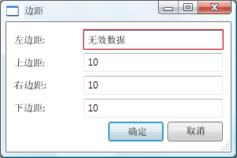
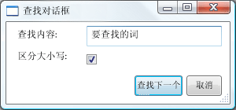

# 对话框概述
独立应用程序通常具有不但显示通过其应用程序运行和公开的功能来处理通过该数据的主数据的主窗口[!INCLUDE[TLA#tla_ui](../../../../includes/tlasharptla-ui-md.md)]机制，如菜单栏、 工具栏和状态栏。 重要的应用程序可能还会显示其他窗口来执行下列操作︰  
  
-   向用户显示的特定信息。  
  
-   从用户收集信息。  
  
-   同时显示和收集的信息。  
  
 这些类型的窗口称为*对话框*，并有两种类型︰ 模式和无模式。  
  
 一个*模式*函数需要来自用户以便继续执行的其他数据时，对话框将显示函数。 该功能依赖于模式对话框来收集数据，因为模式对话框中还会阻止用户激活应用程序中的其他窗口保持打开状态时。 在大多数情况下，一个模式对话框允许用户指示他们具有完成时模式对话框中通过按**确定**或**取消**按钮。 按**确定**按钮指示用户已输入数据，希望该功能继续处理该数据。 按**取消**按钮指示用户想要停止该功能的完全执行。 最常见的模式对话框的示例显示可以打开、 保存和打印数据。  
  
 一个*无模式*对话框中，另一方面，不会阻止用户打开时激活其他窗口。 例如，如果用户想要在文档中查找特定词的匹配项，主窗口将通常会打开一个对话框，询问用户他们寻找什么单词。 由于查找单词不能防止用户编辑文档，但是，对话框中无需为模式。 无模式对话框至少提供**关闭**按钮以关闭该对话框中，并且可能提供其他按钮来执行特定的功能，如**查找下一个**按钮以查找与单词搜索查找条件匹配的下一个单词。  
  
 [!INCLUDE[TLA#tla_wpf](../../../../includes/tlasharptla-wpf-md.md)]允许您创建多种类型的对话框中，包括消息框、 公共对话框和自定义对话框。 本主题介绍了每一个，和[对话框示例](http://go.microsoft.com/fwlink/?LinkID=159984)提供匹配的示例。  
  
 [!INCLUDE[autoOutline](../Token/autoOutline_md.md)]  
  
   
## 消息框  
 一个*消息框*是一个对话框，可以使用显示文字信息并允许用户通过按钮做出决定。 下图显示一个消息框，显示的文本信息、 提出问题和用户提供了三个按钮，为了回答的问题。  
  
   
  
 若要创建一个消息框，您可以使用<xref:System.Windows.MessageBox>类。                  <xref:System.Windows.MessageBox>允许您配置消息框文本、 标题、 图标和按钮，使用类似于下面的代码。  
  
 [!code-csharp[DialogBoxesOverviewSnippets#MsgBoxConfigureCODEBEHIND](../../../../samples/snippets/csharp/VS_Snippets_Wpf/DialogBoxesOverviewSnippets/CSharp/Window1.xaml.cs#msgboxconfigurecodebehind)]
 [!code-vb[DialogBoxesOverviewSnippets#MsgBoxConfigureCODEBEHIND](../../../../samples/snippets/visualbasic/VS_Snippets_Wpf/DialogBoxesOverviewSnippets/VisualBasic/window1.xaml.vb#msgboxconfigurecodebehind)]  
  
 若要显示一个消息框，则调用`static`<xref:System.Windows.MessageBox.Show%2A>方法，如下面的代码所示。  
  
 [!code-csharp[DialogBoxesOverviewSnippets#MsgBoxShowCODEBEHIND](../../../../samples/snippets/csharp/VS_Snippets_Wpf/DialogBoxesOverviewSnippets/CSharp/Window1.xaml.cs#msgboxshowcodebehind)]
 [!code-vb[DialogBoxesOverviewSnippets#MsgBoxShowCODEBEHIND](../../../../samples/snippets/visualbasic/VS_Snippets_Wpf/DialogBoxesOverviewSnippets/VisualBasic/window1.xaml.vb#msgboxshowcodebehind)]  
  
 当需要时显示一个消息框的代码来检测和处理 （按下的按钮） 的用户的决定时，该代码可以检查消息框的结果，如下面的代码中所示。  
  
 [!code-csharp[DialogBoxesOverviewSnippets#MsgBoxShowAndResultCODEBEHIND1](../../../../samples/snippets/csharp/VS_Snippets_Wpf/DialogBoxesOverviewSnippets/CSharp/Window1.xaml.cs#msgboxshowandresultcodebehind1)]
 [!code-vb[DialogBoxesOverviewSnippets#MsgBoxShowAndResultCODEBEHIND1](../../../../samples/snippets/visualbasic/VS_Snippets_Wpf/DialogBoxesOverviewSnippets/VisualBasic/window1.xaml.vb#msgboxshowandresultcodebehind1)]  
  
 使用消息框的详细信息，请参阅<xref:System.Windows.MessageBox>， [MessageBox 示例](http://go.microsoft.com/fwlink/?LinkID=160023)，和[对话框示例](http://go.microsoft.com/fwlink/?LinkID=159984)。  
  
 尽管<xref:System.Windows.MessageBox>可能提供的简单对话框框中的用户体验，使用的优点<xref:System.Windows.MessageBox>是唯一的一种可以在部分信任安全沙箱内运行的应用程序所示的窗口 (请参阅[安全](../../../../docs/framework/wpf/security-wpf.md))，如[!INCLUDE[TLA#tla_xbap#plural](../../../../includes/tlasharptla-xbapsharpplural-md.md)]。  
  
 大多数对话框显示和收集比消息框中，包括文本、 选择 （复选框） 互相排斥的选择 （单选按钮） 的结果更复杂的数据并列出所选内容 （列表框、 组合框、 下拉列表框）。 对于这些数据，[!INCLUDE[TLA#tla_wpf](../../../../includes/tlasharptla-wpf-md.md)]提供几个通用对话框，并允许您创建您自己的对话框，不过这两类使用仅限于以完全信任运行的应用程序。  
  
   
## 通用对话框  
 [!INCLUDE[TLA#tla_mswin](../../../../includes/tlasharptla-mswin-md.md)]实现各种的可重用的对话框所共有的所有应用程序，包括用于打开文件、 保存文件和打印对话框。 这些对话框由操作系统实现的因为它们可以间共享，在操作系统中，这很有帮助的用户体验一致性; 运行的所有应用程序当用户熟悉使用一个应用程序中提供操作系统对话框时，他们无需了解如何使用该对话框中，在其他应用程序。 因为这些对话框可供所有应用程序，因为它们可帮助提供一致的用户体验，因此它们被称为*公共对话框*。  
  
 [!INCLUDE[TLA#tla_wpf](../../../../includes/tlasharptla-wpf-md.md)]封装用于打开文件，保存文件和打印的通用对话框，并将它们公开为托管的类供您在独立的应用程序中使用。 本主题提供简要概述每个。  
  
   
### 打开文件对话框  
 打开文件对话框中，如下图所示的文件打开功能用于检索要打开的文件的名称。  
  
   
  
 常见的打开的文件对话框中作为实现<xref:Microsoft.Win32.OpenFileDialog>类，它位于<xref:Microsoft.Win32>命名空间。 下面的代码演示如何创建、 配置和显示其中一个，以及如何处理结果。  
  
 [!code-csharp[DialogBoxesOverviewSnippets#OpenFileDialogBoxCODEBEHIND](../../../../samples/snippets/csharp/VS_Snippets_Wpf/DialogBoxesOverviewSnippets/CSharp/Window1.xaml.cs#openfiledialogboxcodebehind)]
 [!code-vb[DialogBoxesOverviewSnippets#OpenFileDialogBoxCODEBEHIND](../../../../samples/snippets/visualbasic/VS_Snippets_Wpf/DialogBoxesOverviewSnippets/VisualBasic/window1.xaml.vb#openfiledialogboxcodebehind)]  
  
 打开文件对话框中的详细信息，请参阅<xref:Microsoft.Win32.OpenFileDialog?displayProperty=fullName>。  
  
> [!NOTE]
>  <xref:Microsoft.Win32.OpenFileDialog>可以用于安全地检索文件的名称在部分信任运行的应用程序 (请参阅[安全](../../../../docs/framework/wpf/security-wpf.md))。  
  
   
### 保存文件对话框  
 保存文件对话框中，如下图所示使用文件保存功能来检索要保存的文件的名称。  
  
   
  
 保存文件对话框中的常见实现为<xref:Microsoft.Win32.SaveFileDialog>类，并位于<xref:Microsoft.Win32>命名空间。 下面的代码演示如何创建、 配置和显示其中一个，以及如何处理结果。  
  
 [!code-csharp[DialogBoxesOverviewSnippets#SaveFileDialogBoxCODEBEHIND](../../../../samples/snippets/csharp/VS_Snippets_Wpf/DialogBoxesOverviewSnippets/CSharp/Window1.xaml.cs#savefiledialogboxcodebehind)]
 [!code-vb[DialogBoxesOverviewSnippets#SaveFileDialogBoxCODEBEHIND](../../../../samples/snippets/visualbasic/VS_Snippets_Wpf/DialogBoxesOverviewSnippets/VisualBasic/window1.xaml.vb#savefiledialogboxcodebehind)]  
  
 有关详细信息保存文件对话框中，请参阅<xref:Microsoft.Win32.SaveFileDialog?displayProperty=fullName>。  
  
   
### 打印对话框  
 打印功能使用打印对话框中，如下图所示选择和配置用户想要的数据打印到打印机。  
  
   
  
 常见打印对话框中作为实现<xref:System.Windows.Controls.PrintDialog>类，并位于<xref:System.Windows.Controls>命名空间。 下面的代码演示如何创建、 配置和显示其中一个。  
  
 [!code-csharp[DialogBoxesOverviewSnippets#PrintDialogBoxCODEBEHIND](../../../../samples/snippets/csharp/VS_Snippets_Wpf/DialogBoxesOverviewSnippets/CSharp/Window1.xaml.cs#printdialogboxcodebehind)]
 [!code-vb[DialogBoxesOverviewSnippets#PrintDialogBoxCODEBEHIND](../../../../samples/snippets/visualbasic/VS_Snippets_Wpf/DialogBoxesOverviewSnippets/VisualBasic/window1.xaml.vb#printdialogboxcodebehind)]  
  
 打印对话框中的详细信息，请参阅<xref:System.Windows.Controls.PrintDialog?displayProperty=fullName>。 有关中的打印功能的详细讨论[!INCLUDE[TLA2#tla_wpf](../../../../includes/tla2sharptla-wpf-md.md)]，请参阅[打印概述](../../../../docs/framework/wpf/advanced/printing-overview.md)。  
  
   
## 自定义对话框  
 虽然通用对话框很有用，并且在可能时应使用，它们不支持特定于域的对话框中的要求。 在这些情况下，您需要创建您自己的对话框。 如我们所见，对话框将是具有特殊的行为的窗口。                  <xref:System.Windows.Window>实现这些行为，因此，使用<xref:System.Windows.Window>来创建自定义模式和无模式对话框。  
  
   
### 创建模式的自定义对话框  
 本主题演示如何使用<xref:System.Windows.Window>创建的典型模式对话框框中实现，使用`Margins`作为示例的对话框中 (请参阅[对话框示例](http://go.microsoft.com/fwlink/?LinkID=159984))。 `Margins`对话框中显示在下图中。  
  
   
  
#### 配置一个模式对话框  
 典型的对话框中的用户界面包括︰  
  
-   收集所需的数据所需的各种控件。  
  
-   显示**确定**按钮用户单击此项可关闭对话框，返回到该功能，并继续进行处理。  
  
-   显示**取消**用户单击此项可关闭该对话框并停止该功能的进一步处理的按钮。  
  
-   显示**关闭**标题栏中的按钮。  
  
-   显示一个图标。  
  
-   Showing                                          **Minimize**,                                          **Maximize**, and                                          **Restore** buttons.  
  
-   显示**系统**菜单以最小化、 最大化、 还原和关闭该对话框。  
  
-   打开的上方和中心的打开对话框中的窗口。  
  
-   对话框应分别在可能的因此，若要防止对话框中太小，并向用户提供有效的默认大小，您需要设置默认构造函数和一个最少，可调整大小的尺寸。  
  
-   按 ESC 键应配置为将导致的键盘快捷方式**取消**按按钮。 这通过设置<xref:System.Windows.Controls.Button.IsCancel%2A>属性**取消**按钮以`true`。  
  
-   按 ENTER 键 （或 RETURN） 键应配置为将导致的键盘快捷方式**确定**按按钮。 这通过设置<xref:System.Windows.Controls.Button.IsDefault%2A>属性**确定**按钮`true`。  
  
 下面的代码演示此配置。  
  
 [!code-xml[DialogBoxSample#MarginsDialogBoxMainBitsMARKUP1](../../../../samples/snippets/csharp/VS_Snippets_Wpf/DialogBoxSample/CSharp/MarginsDialogBox.xaml#marginsdialogboxmainbitsmarkup1)]  
[!code-xml[DialogBoxSample#MarginsDialogBoxMainBitsMARKUP2](../../../../samples/snippets/csharp/VS_Snippets_Wpf/DialogBoxSample/CSharp/MarginsDialogBox.xaml#marginsdialogboxmainbitsmarkup2)]  
  
 [!code-csharp[DialogBoxSample#MarginsDialogBoxMainBitsCODEBEHIND1](../../../../samples/snippets/csharp/VS_Snippets_Wpf/DialogBoxSample/CSharp/MarginsDialogBox.xaml.cs#marginsdialogboxmainbitscodebehind1)]
 [!code-vb[DialogBoxSample#MarginsDialogBoxMainBitsCODEBEHIND1](../../../../samples/snippets/visualbasic/VS_Snippets_Wpf/DialogBoxSample/VisualBasic/MarginsDialogBox.xaml.vb#marginsdialogboxmainbitscodebehind1)]  
[!code-csharp[DialogBoxSample#MarginsDialogBoxMainBitsCODEBEHIND2](../../../../samples/snippets/csharp/VS_Snippets_Wpf/DialogBoxSample/CSharp/MarginsDialogBox.xaml.cs#marginsdialogboxmainbitscodebehind2)]
[!code-vb[DialogBoxSample#MarginsDialogBoxMainBitsCODEBEHIND2](../../../../samples/snippets/visualbasic/VS_Snippets_Wpf/DialogBoxSample/VisualBasic/MarginsDialogBox.xaml.vb#marginsdialogboxmainbitscodebehind2)]  
  
 对话框中的用户体验还扩展到打开对话框中的窗口中的菜单栏。 菜单项在运行时需要通过一个对话框中的用户交互，该函数才能继续的函数，该函数的菜单项将在其标题中，有省略号，如下所示。  
  
 [!code-xml[DialogBoxSample#MainWindowMarginsDialogBoxMenuItemMARKUP1](../../../../samples/snippets/csharp/VS_Snippets_Wpf/DialogBoxSample/CSharp/MainWindow.xaml#mainwindowmarginsdialogboxmenuitemmarkup1)]  
[!code-xml[DialogBoxSample#MainWindowMarginsDialogBoxMenuItemMARKUP2](../../../../samples/snippets/csharp/VS_Snippets_Wpf/DialogBoxSample/CSharp/MainWindow.xaml#mainwindowmarginsdialogboxmenuitemmarkup2)]  
  
 如果菜单项运行一个函数，显示一个对话框，它不需要用户交互，如关于对话框中，则不需要一个省略号。  
  
#### 打开一个模式对话框  
 对话框中通常会显示由于用户选择菜单项来执行特定于域的功能，例如在字处理器中设置文档的边距。 显示作为对话框窗口类似于是显示普通的窗口中，尽管它要求其他对话框框中特定的配置。 实例化的整个过程，配置和打开一个对话框，显示在下面的代码。  
  
 [!code-csharp[DialogBoxSample#OpenMarginsDialogCODEBEHIND1](../../../../samples/snippets/csharp/VS_Snippets_Wpf/DialogBoxSample/CSharp/MainWindow.xaml.cs#openmarginsdialogcodebehind1)]
 [!code-vb[DialogBoxSample#OpenMarginsDialogCODEBEHIND1](../../../../samples/snippets/visualbasic/VS_Snippets_Wpf/DialogBoxSample/VisualBasic/MainWindow.xaml.vb#openmarginsdialogcodebehind1)]  
[!code-csharp[DialogBoxSample#OpenMarginsDialogCODEBEHIND2](../../../../samples/snippets/csharp/VS_Snippets_Wpf/DialogBoxSample/CSharp/MainWindow.xaml.cs#openmarginsdialogcodebehind2)]
[!code-vb[DialogBoxSample#OpenMarginsDialogCODEBEHIND2](../../../../samples/snippets/visualbasic/VS_Snippets_Wpf/DialogBoxSample/VisualBasic/MainWindow.xaml.vb#openmarginsdialogcodebehind2)]  
[!code-csharp[DialogBoxSample#OpenMarginsDialogCODEBEHIND3](../../../../samples/snippets/csharp/VS_Snippets_Wpf/DialogBoxSample/CSharp/MainWindow.xaml.cs#openmarginsdialogcodebehind3)]
[!code-vb[DialogBoxSample#OpenMarginsDialogCODEBEHIND3](../../../../samples/snippets/visualbasic/VS_Snippets_Wpf/DialogBoxSample/VisualBasic/MainWindow.xaml.vb#openmarginsdialogcodebehind3)]  
[!code-csharp[DialogBoxSample#OpenMarginsDialogCODEBEHIND4](../../../../samples/snippets/csharp/VS_Snippets_Wpf/DialogBoxSample/CSharp/MainWindow.xaml.cs#openmarginsdialogcodebehind4)]
[!code-vb[DialogBoxSample#OpenMarginsDialogCODEBEHIND4](../../../../samples/snippets/visualbasic/VS_Snippets_Wpf/DialogBoxSample/VisualBasic/MainWindow.xaml.vb#openmarginsdialogcodebehind4)]  
  
 在这里，该代码将默认的信息 （当前边距） 传递给对话框中。 它设置<xref:System.Windows.Window.Owner%2A?displayProperty=fullName>具有对所显示的对话框窗口的引用属性。 一般情况下，还应始终设置为对话框的所有者提供的窗口中与状态相关的行为所共有的所有对话框 (请参阅[WPF Windows 概述](../../../../docs/framework/wpf/app-development/wpf-windows-overview.md)有关详细信息)。  
  
> [!NOTE]
>  必须提供一个所有者来支持[!INCLUDE[TLA#tla_ui](../../../../includes/tlasharptla-ui-md.md)]自动化对话框 (请参阅[UI 自动化概述](../../../../docs/framework/ui-automation/ui-automation-overview.md))。  
  
 对话框中配置后，它将显示有模式地通过调用<xref:System.Windows.Window.ShowDialog%2A>方法。  
  
#### 验证用户提供的数据  
 当打开一个对话框，并且用户提供所需的数据时，对话框是负责确保提供的数据有效以下原因引起的︰  
  
-   从安全角度看，应验证所有输入。  
  
-   从特定于域的角度看，数据验证阻止正在处理的代码，可能会引发异常的错误的数据。  
  
-   从用户体验的角度，一个对话框，可以帮助用户本教程通过说明他们输入的数据无效。  
  
-   从性能角度看，多层应用程序中的数据验证可以减少客户端应用程序层之间的往返次数，尤其是在该应用程序由 Web 服务或基于服务器的数据库时。  
  
 若要验证中的绑定的控件[!INCLUDE[TLA2#tla_wpf](../../../../includes/tla2sharptla-wpf-md.md)]，需要先定义验证规则并将其与绑定相关联。 验证规则是派生自的自定义类<xref:System.Windows.Controls.ValidationRule>。 下面的示例演示的验证规则， `MarginValidationRule`，绑定的值是哪些检查<xref:System.Double>并且是否在指定范围内。  
  
 [!code-csharp[DialogBoxSample#MarginValidationRuleCODE](../../../../samples/snippets/csharp/VS_Snippets_Wpf/DialogBoxSample/CSharp/MarginValidationRule.cs#marginvalidationrulecode)]
 [!code-vb[DialogBoxSample#MarginValidationRuleCODE](../../../../samples/snippets/visualbasic/VS_Snippets_Wpf/DialogBoxSample/VisualBasic/MarginValidationRule.vb#marginvalidationrulecode)]  
  
 在此代码中，验证规则的验证逻辑实现通过重写<xref:System.Windows.Controls.ValidationRule.Validate%2A>方法，它的数据进行验证并返回相应<xref:System.Windows.Controls.ValidationResult>。  
  
 要绑定的控件相关联的验证规则，您可以使用以下标记。  
  
 [!code-xml[DialogBoxSample#MarginsValidationMARKUP1](../../../../samples/snippets/csharp/VS_Snippets_Wpf/DialogBoxSample/CSharp/MarginsDialogBox.xaml#marginsvalidationmarkup1)]  
[!code-xml[DialogBoxSample#MarginsValidationMARKUP2](../../../../samples/snippets/csharp/VS_Snippets_Wpf/DialogBoxSample/CSharp/MarginsDialogBox.xaml#marginsvalidationmarkup2)]  
[!code-xml[DialogBoxSample#MarginsValidationMARKUP3](../../../../samples/snippets/csharp/VS_Snippets_Wpf/DialogBoxSample/CSharp/MarginsDialogBox.xaml#marginsvalidationmarkup3)]  
  
 一旦验证规则都有相关，[!INCLUDE[TLA2#tla_wpf](../../../../includes/tla2sharptla-wpf-md.md)]会自动将它应用在绑定控件中输入数据时。 如果控件包含无效数据，[!INCLUDE[TLA2#tla_wpf](../../../../includes/tla2sharptla-wpf-md.md)]将红色的周围显示边框无效的控件，如下图所示。  
  
   
  
 [!INCLUDE[TLA2#tla_wpf](../../../../includes/tla2sharptla-wpf-md.md)]不限制用户对无效的控件，直到他们输入有效的数据。 这是正常行为对话框;用户应该能够自由地导航控件在对话框中，无论数据有效。 但是，这意味着用户可以输入无效数据，然后按**确定**按钮。 出于此原因，您的代码还需要验证在对话框中的所有控件当**确定**按钮按下处理<xref:System.Windows.Controls.Primitives.ButtonBase.Click>事件。  
  
 [!code-csharp[DialogBoxSample#MarginsDialogBoxValidationCODEBEHIND1](../../../../samples/snippets/csharp/VS_Snippets_Wpf/DialogBoxSample/CSharp/MarginsDialogBox.xaml.cs#marginsdialogboxvalidationcodebehind1)]
 [!code-vb[DialogBoxSample#MarginsDialogBoxValidationCODEBEHIND1](../../../../samples/snippets/visualbasic/VS_Snippets_Wpf/DialogBoxSample/VisualBasic/MarginsDialogBox.xaml.vb#marginsdialogboxvalidationcodebehind1)]  
[!code-csharp[DialogBoxSample#MarginsDialogBoxValidationCODEBEHIND2](../../../../samples/snippets/csharp/VS_Snippets_Wpf/DialogBoxSample/CSharp/MarginsDialogBox.xaml.cs#marginsdialogboxvalidationcodebehind2)]
[!code-vb[DialogBoxSample#MarginsDialogBoxValidationCODEBEHIND2](../../../../samples/snippets/visualbasic/VS_Snippets_Wpf/DialogBoxSample/VisualBasic/MarginsDialogBox.xaml.vb#marginsdialogboxvalidationcodebehind2)]  
[!code-csharp[DialogBoxSample#MarginsDialogBoxValidationCODEBEHIND3](../../../../samples/snippets/csharp/VS_Snippets_Wpf/DialogBoxSample/CSharp/MarginsDialogBox.xaml.cs#marginsdialogboxvalidationcodebehind3)]
[!code-vb[DialogBoxSample#MarginsDialogBoxValidationCODEBEHIND3](../../../../samples/snippets/visualbasic/VS_Snippets_Wpf/DialogBoxSample/VisualBasic/MarginsDialogBox.xaml.vb#marginsdialogboxvalidationcodebehind3)]  
  
 此代码将枚举窗口上的所有依赖项对象和任何无效，则 (返回<xref:System.Windows.Controls.Validation.GetHasError%2A>，无效的控件获得焦点，`IsValid`方法将返回`false`，和窗口中将被视为无效。  
  
 确认对话框中有效后，它可以安全地关闭并返回。 作为在返回过程的一部分，它需要将结果返回给调用的函数。  
  
#### 设置模式对话框结果  
 打开对话框框中使用<xref:System.Windows.Window.ShowDialog%2A>基本上就像调用方法︰ 打开对话框框中使用的代码<xref:System.Windows.Window.ShowDialog%2A>将等待，直至<xref:System.Windows.Window.ShowDialog%2A>返回。 当<xref:System.Windows.Window.ShowDialog%2A> ，代码需要调用它以确定是否要继续进行处理或停止处理，根据是否会返回用户按下**确定**按钮或**取消**按钮。 若要简化这一决定，对话框中需要返回用户的选择作为<xref:System.Boolean>从返回的值<xref:System.Windows.Window.ShowDialog%2A>方法。  
  
 当**确定**单击按钮时， <xref:System.Windows.Window.ShowDialog%2A>应返回`true`。 这通过设置<xref:System.Windows.Window.DialogResult%2A>属性对话框的框中时**确定**单击按钮。  
  
 [!code-csharp[DialogBoxSample#MarginsDialogBoxOKResultSetCODEBEHIND1](../../../../samples/snippets/csharp/VS_Snippets_Wpf/DialogBoxSample/CSharp/MarginsDialogBox.xaml.cs#marginsdialogboxokresultsetcodebehind1)]
 [!code-vb[DialogBoxSample#MarginsDialogBoxOKResultSetCODEBEHIND1](../../../../samples/snippets/visualbasic/VS_Snippets_Wpf/DialogBoxSample/VisualBasic/MarginsDialogBox.xaml.vb#marginsdialogboxokresultsetcodebehind1)]  
[!code-csharp[DialogBoxSample#MarginsDialogBoxOKResultSetCODEBEHIND2](../../../../samples/snippets/csharp/VS_Snippets_Wpf/DialogBoxSample/CSharp/MarginsDialogBox.xaml.cs#marginsdialogboxokresultsetcodebehind2)]
[!code-vb[DialogBoxSample#MarginsDialogBoxOKResultSetCODEBEHIND2](../../../../samples/snippets/visualbasic/VS_Snippets_Wpf/DialogBoxSample/VisualBasic/MarginsDialogBox.xaml.vb#marginsdialogboxokresultsetcodebehind2)]  
[!code-csharp[DialogBoxSample#MarginsDialogBoxOKResultSetCODEBEHIND3](../../../../samples/snippets/csharp/VS_Snippets_Wpf/DialogBoxSample/CSharp/MarginsDialogBox.xaml.cs#marginsdialogboxokresultsetcodebehind3)]
[!code-vb[DialogBoxSample#MarginsDialogBoxOKResultSetCODEBEHIND3](../../../../samples/snippets/visualbasic/VS_Snippets_Wpf/DialogBoxSample/VisualBasic/MarginsDialogBox.xaml.vb#marginsdialogboxokresultsetcodebehind3)]  
[!code-csharp[DialogBoxSample#MarginsDialogBoxOKResultSetCODEBEHIND4](../../../../samples/snippets/csharp/VS_Snippets_Wpf/DialogBoxSample/CSharp/MarginsDialogBox.xaml.cs#marginsdialogboxokresultsetcodebehind4)]
[!code-vb[DialogBoxSample#MarginsDialogBoxOKResultSetCODEBEHIND4](../../../../samples/snippets/visualbasic/VS_Snippets_Wpf/DialogBoxSample/VisualBasic/MarginsDialogBox.xaml.vb#marginsdialogboxokresultsetcodebehind4)]  
  
 请注意，设置<xref:System.Windows.Window.DialogResult%2A>属性还会导致窗口以自动关闭，从而缓解了在需要显式调用<xref:System.Windows.Window.Close%2A>。  
  
 当**取消**单击按钮时， <xref:System.Windows.Window.ShowDialog%2A>应返回`false`，从而还需要设置<xref:System.Windows.Window.DialogResult%2A>属性。  
  
 [!code-csharp[DialogBoxSample#MarginsDialogBoxCancelResultSetCODEBEHIND1](../../../../samples/snippets/csharp/VS_Snippets_Wpf/DialogBoxSample/CSharp/MarginsDialogBox.xaml.cs#marginsdialogboxcancelresultsetcodebehind1)]
 [!code-vb[DialogBoxSample#MarginsDialogBoxCancelResultSetCODEBEHIND1](../../../../samples/snippets/visualbasic/VS_Snippets_Wpf/DialogBoxSample/VisualBasic/MarginsDialogBox.xaml.vb#marginsdialogboxcancelresultsetcodebehind1)]  
[!code-csharp[DialogBoxSample#MarginsDialogBoxCancelResultSetCODEBEHIND2](../../../../samples/snippets/csharp/VS_Snippets_Wpf/DialogBoxSample/CSharp/MarginsDialogBox.xaml.cs#marginsdialogboxcancelresultsetcodebehind2)]
[!code-vb[DialogBoxSample#MarginsDialogBoxCancelResultSetCODEBEHIND2](../../../../samples/snippets/visualbasic/VS_Snippets_Wpf/DialogBoxSample/VisualBasic/MarginsDialogBox.xaml.vb#marginsdialogboxcancelresultsetcodebehind2)]  
[!code-csharp[DialogBoxSample#MarginsDialogBoxCancelResultSetCODEBEHIND3](../../../../samples/snippets/csharp/VS_Snippets_Wpf/DialogBoxSample/CSharp/MarginsDialogBox.xaml.cs#marginsdialogboxcancelresultsetcodebehind3)]
[!code-vb[DialogBoxSample#MarginsDialogBoxCancelResultSetCODEBEHIND3](../../../../samples/snippets/visualbasic/VS_Snippets_Wpf/DialogBoxSample/VisualBasic/MarginsDialogBox.xaml.vb#marginsdialogboxcancelresultsetcodebehind3)]  
  
 当将按钮的<xref:System.Windows.Controls.Button.IsCancel%2A>属性设置为`true`并且用户按任何一个**取消**按钮或 ESC 键， <xref:System.Windows.Window.DialogResult%2A>自动设置为`false`。 下面的标记具有相同的效果与上面的代码，而无需处理<xref:System.Windows.Controls.Primitives.ButtonBase.Click>事件。  
  
 [!code-xml[DialogBoxSample#MarginsDialogDefaultCancelMARKUP](../../../../samples/snippets/csharp/VS_Snippets_Wpf/DialogBoxSample/CSharp/MarginsDialogBox.xaml#marginsdialogdefaultcancelmarkup)]  
  
 对话框中会自动将返回`false`当用户按下**关闭**按钮的标题栏中，或者选择**关闭**菜单项，**系统**菜单。  
  
#### 处理从一个模式对话框返回的数据  
 当<xref:System.Windows.Window.DialogResult%2A>设置对话框中，通过打开它的函数可以通过检查获得对话框结果<xref:System.Windows.Window.DialogResult%2A>属性时<xref:System.Windows.Window.ShowDialog%2A>返回。  
  
 [!code-csharp[DialogBoxSample#OpenMarginsDialogProcessReturnCODEBEHIND1](../../../../samples/snippets/csharp/VS_Snippets_Wpf/DialogBoxSample/CSharp/MainWindow.xaml.cs#openmarginsdialogprocessreturncodebehind1)]
 [!code-vb[DialogBoxSample#OpenMarginsDialogProcessReturnCODEBEHIND1](../../../../samples/snippets/visualbasic/VS_Snippets_Wpf/DialogBoxSample/VisualBasic/MainWindow.xaml.vb#openmarginsdialogprocessreturncodebehind1)]  
[!code-csharp[DialogBoxSample#OpenMarginsDialogProcessReturnCODEBEHIND2](../../../../samples/snippets/csharp/VS_Snippets_Wpf/DialogBoxSample/CSharp/MainWindow.xaml.cs#openmarginsdialogprocessreturncodebehind2)]
[!code-vb[DialogBoxSample#OpenMarginsDialogProcessReturnCODEBEHIND2](../../../../samples/snippets/visualbasic/VS_Snippets_Wpf/DialogBoxSample/VisualBasic/MainWindow.xaml.vb#openmarginsdialogprocessreturncodebehind2)]  
[!code-csharp[DialogBoxSample#OpenMarginsDialogProcessReturnCODEBEHIND3](../../../../samples/snippets/csharp/VS_Snippets_Wpf/DialogBoxSample/CSharp/MainWindow.xaml.cs#openmarginsdialogprocessreturncodebehind3)]
[!code-vb[DialogBoxSample#OpenMarginsDialogProcessReturnCODEBEHIND3](../../../../samples/snippets/visualbasic/VS_Snippets_Wpf/DialogBoxSample/VisualBasic/MainWindow.xaml.vb#openmarginsdialogprocessreturncodebehind3)]  
[!code-csharp[DialogBoxSample#OpenMarginsDialogProcessReturnCODEBEHIND4](../../../../samples/snippets/csharp/VS_Snippets_Wpf/DialogBoxSample/CSharp/MainWindow.xaml.cs#openmarginsdialogprocessreturncodebehind4)]
[!code-vb[DialogBoxSample#OpenMarginsDialogProcessReturnCODEBEHIND4](../../../../samples/snippets/visualbasic/VS_Snippets_Wpf/DialogBoxSample/VisualBasic/MainWindow.xaml.vb#openmarginsdialogprocessreturncodebehind4)]  
  
 如果对话框结果为`true`，该函数将其用作提示以检索和处理由用户提供的数据。  
  
> [!NOTE]
>  之后<xref:System.Windows.Window.ShowDialog%2A>已返回，无法重新打开一个对话框。 相反，您需要创建一个新实例。  
  
 如果对话框结果为`false`，该函数应相应地结束处理。  
  
   
### 创建无模式的自定义对话框  
 无模式对话框，如下面的图所示查找对话框中具有相同的基本外观为模式对话框。  
  
   
  
 但是，行为是稍有不同，如以下各节中所述。  
  
#### 打开无模式对话框  
 无模式对话框打开通过调用<xref:System.Windows.Window.Show%2A>方法。  
  
 [!code-xml[DialogBoxSample#OpenFindDialogMARKUP1](../../../../samples/snippets/csharp/VS_Snippets_Wpf/DialogBoxSample/CSharp/MainWindow.xaml#openfinddialogmarkup1)]  
  
 [!code-csharp[DialogBoxSample#OpenFindDialogCODEBEHIND1](../../../../samples/snippets/csharp/VS_Snippets_Wpf/DialogBoxSample/CSharp/MainWindow.xaml.cs#openfinddialogcodebehind1)]
 [!code-vb[DialogBoxSample#OpenFindDialogCODEBEHIND1](../../../../samples/snippets/visualbasic/VS_Snippets_Wpf/DialogBoxSample/VisualBasic/MainWindow.xaml.vb#openfinddialogcodebehind1)]  
[!code-csharp[DialogBoxSample#OpenFindDialogCODEBEHIND2](../../../../samples/snippets/csharp/VS_Snippets_Wpf/DialogBoxSample/CSharp/MainWindow.xaml.cs#openfinddialogcodebehind2)]
[!code-vb[DialogBoxSample#OpenFindDialogCODEBEHIND2](../../../../samples/snippets/visualbasic/VS_Snippets_Wpf/DialogBoxSample/VisualBasic/MainWindow.xaml.vb#openfinddialogcodebehind2)]  
[!code-csharp[DialogBoxSample#OpenFindDialogCODEBEHIND3](../../../../samples/snippets/csharp/VS_Snippets_Wpf/DialogBoxSample/CSharp/MainWindow.xaml.cs#openfinddialogcodebehind3)]
[!code-vb[DialogBoxSample#OpenFindDialogCODEBEHIND3](../../../../samples/snippets/visualbasic/VS_Snippets_Wpf/DialogBoxSample/VisualBasic/MainWindow.xaml.vb#openfinddialogcodebehind3)]  
  
 与不同<xref:System.Windows.Window.ShowDialog%2A>，<xref:System.Windows.Window.Show%2A>立即返回。 因此，调用窗口中看不出来后，无模式对话框关闭，因此，不知道何时检查对话框结果或从对话框中获取数据，以进行进一步处理。 相反，对话框中创建所需的替代方法将数据返回到调用窗口中进行处理。  
  
#### 处理从无模式对话框返回的数据  
 在此示例中，`FindDialogBox`可能会返回一个或多个查找到主窗口中，具体取决于而无需任何特定频率要搜索的文本结果。 模式对话框，使用无模式对话框中可以使用属性返回结果。 但是，拥有对话框窗口需要知道何时检查这些属性。 为实现此目的的一种方法是在对话框中，若要实现只要找到文本就会引发一个事件。                                  `FindDialogBox`实现`TextFoundEvent`出于此目的，这首先需要委托。  
  
 [!code-csharp[DialogBoxSample#TextFoundEventHandlerCODE](../../../../samples/snippets/csharp/VS_Snippets_Wpf/DialogBoxSample/CSharp/TextFoundEventHandler.cs#textfoundeventhandlercode)]
 [!code-vb[DialogBoxSample#TextFoundEventHandlerCODE](../../../../samples/snippets/visualbasic/VS_Snippets_Wpf/DialogBoxSample/VisualBasic/TextFoundEventHandler.vb#textfoundeventhandlercode)]  
  
 Using the                                  `TextFoundEventHandler` delegate,                                  `FindDialogBox` implements the                                  `TextFoundEvent`.  
  
 [!code-csharp[DialogBoxSample#TextFoundEventCODEBEHIND1](../../../../samples/snippets/csharp/VS_Snippets_Wpf/DialogBoxSample/CSharp/FindDialogBox.xaml.cs#textfoundeventcodebehind1)]
 [!code-vb[DialogBoxSample#TextFoundEventCODEBEHIND1](../../../../samples/snippets/visualbasic/VS_Snippets_Wpf/DialogBoxSample/VisualBasic/FindDialogBox.xaml.vb#textfoundeventcodebehind1)]  
[!code-csharp[DialogBoxSample#TextFoundEventCODEBEHIND2](../../../../samples/snippets/csharp/VS_Snippets_Wpf/DialogBoxSample/CSharp/FindDialogBox.xaml.cs#textfoundeventcodebehind2)]
[!code-vb[DialogBoxSample#TextFoundEventCODEBEHIND2](../../../../samples/snippets/visualbasic/VS_Snippets_Wpf/DialogBoxSample/VisualBasic/FindDialogBox.xaml.vb#textfoundeventcodebehind2)]  
  
 因此，`Find`可以引发该事件时找到搜索结果。  
  
 [!code-csharp[DialogBoxSample#TextFoundEventRaiseCODEBEHIND1](../../../../samples/snippets/csharp/VS_Snippets_Wpf/DialogBoxSample/CSharp/FindDialogBox.xaml.cs#textfoundeventraisecodebehind1)]
 [!code-vb[DialogBoxSample#TextFoundEventRaiseCODEBEHIND1](../../../../samples/snippets/visualbasic/VS_Snippets_Wpf/DialogBoxSample/VisualBasic/FindDialogBox.xaml.vb#textfoundeventraisecodebehind1)]  
[!code-csharp[DialogBoxSample#TextFoundEventRaiseCODEBEHIND2](../../../../samples/snippets/csharp/VS_Snippets_Wpf/DialogBoxSample/CSharp/FindDialogBox.xaml.cs#textfoundeventraisecodebehind2)]
[!code-vb[DialogBoxSample#TextFoundEventRaiseCODEBEHIND2](../../../../samples/snippets/visualbasic/VS_Snippets_Wpf/DialogBoxSample/VisualBasic/FindDialogBox.xaml.vb#textfoundeventraisecodebehind2)]  
[!code-csharp[DialogBoxSample#TextFoundEventRaiseCODEBEHIND3](../../../../samples/snippets/csharp/VS_Snippets_Wpf/DialogBoxSample/CSharp/FindDialogBox.xaml.cs#textfoundeventraisecodebehind3)]
[!code-vb[DialogBoxSample#TextFoundEventRaiseCODEBEHIND3](../../../../samples/snippets/visualbasic/VS_Snippets_Wpf/DialogBoxSample/VisualBasic/FindDialogBox.xaml.vb#textfoundeventraisecodebehind3)]  
[!code-csharp[DialogBoxSample#TextFoundEventRaiseCODEBEHIND4](../../../../samples/snippets/csharp/VS_Snippets_Wpf/DialogBoxSample/CSharp/FindDialogBox.xaml.cs#textfoundeventraisecodebehind4)]
[!code-vb[DialogBoxSample#TextFoundEventRaiseCODEBEHIND4](../../../../samples/snippets/visualbasic/VS_Snippets_Wpf/DialogBoxSample/VisualBasic/FindDialogBox.xaml.vb#textfoundeventraisecodebehind4)]  
[!code-csharp[DialogBoxSample#TextFoundEventRaiseCODEBEHIND5](../../../../samples/snippets/csharp/VS_Snippets_Wpf/DialogBoxSample/CSharp/FindDialogBox.xaml.cs#textfoundeventraisecodebehind5)]
[!code-vb[DialogBoxSample#TextFoundEventRaiseCODEBEHIND5](../../../../samples/snippets/visualbasic/VS_Snippets_Wpf/DialogBoxSample/VisualBasic/FindDialogBox.xaml.vb#textfoundeventraisecodebehind5)]  
  
 所有者窗口中则需要注册和处理此事件。  
  
 [!code-csharp[DialogBoxSample#OpenFindDialogResultCODEBEHIND1](../../../../samples/snippets/csharp/VS_Snippets_Wpf/DialogBoxSample/CSharp/MainWindow.xaml.cs#openfinddialogresultcodebehind1)]
 [!code-vb[DialogBoxSample#OpenFindDialogResultCODEBEHIND1](../../../../samples/snippets/visualbasic/VS_Snippets_Wpf/DialogBoxSample/VisualBasic/MainWindow.xaml.vb#openfinddialogresultcodebehind1)]  
[!code-csharp[DialogBoxSample#OpenFindDialogResultCODEBEHIND2](../../../../samples/snippets/csharp/VS_Snippets_Wpf/DialogBoxSample/CSharp/MainWindow.xaml.cs#openfinddialogresultcodebehind2)]
[!code-vb[DialogBoxSample#OpenFindDialogResultCODEBEHIND2](../../../../samples/snippets/visualbasic/VS_Snippets_Wpf/DialogBoxSample/VisualBasic/MainWindow.xaml.vb#openfinddialogresultcodebehind2)]  
  
#### 关闭无模式对话框  
 因为<xref:System.Windows.Window.DialogResult%2A>不需要进行设置，可以关闭无模式对话框，使用系统提供的机制，其中包括︰  
  
-   单击**关闭**标题栏中的按钮。  
  
-   按 ALT + F4。  
  
-   Choosing                                          **Close** from the                                          **System** menu.  
  
 或者，您的代码可以调用<xref:System.Windows.Window.Close%2A>时**关闭**单击按钮。  
  
 [!code-csharp[DialogBoxSample#FindDialogCloseCODEBEHIND1](../../../../samples/snippets/csharp/VS_Snippets_Wpf/DialogBoxSample/CSharp/FindDialogBox.xaml.cs#finddialogclosecodebehind1)]
 [!code-vb[DialogBoxSample#FindDialogCloseCODEBEHIND1](../../../../samples/snippets/visualbasic/VS_Snippets_Wpf/DialogBoxSample/VisualBasic/FindDialogBox.xaml.vb#finddialogclosecodebehind1)]  
[!code-csharp[DialogBoxSample#FindDialogCloseCODEBEHIND2](../../../../samples/snippets/csharp/VS_Snippets_Wpf/DialogBoxSample/CSharp/FindDialogBox.xaml.cs#finddialogclosecodebehind2)]
[!code-vb[DialogBoxSample#FindDialogCloseCODEBEHIND2](../../../../samples/snippets/visualbasic/VS_Snippets_Wpf/DialogBoxSample/VisualBasic/FindDialogBox.xaml.vb#finddialogclosecodebehind2)]  
  
## 另请参阅  
 [Popup 概述](../../../../docs/framework/wpf/controls/popup-overview.md)   
 [对话框示例](http://go.microsoft.com/fwlink/?LinkID=159984)   
 [自定义颜色选取器控件示例](http://go.microsoft.com/fwlink/?LinkID=159977)