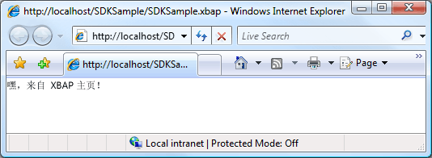
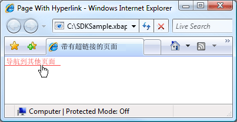
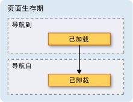
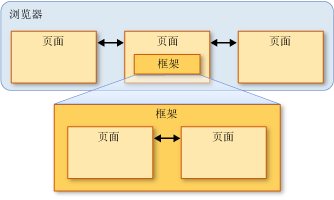
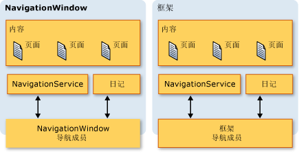
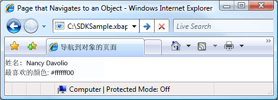

# 导航概述
[!INCLUDE[TLA#tla_wpf](../../../../includes/tlasharptla-wpf-md.md)]支持两种类型的应用程序中的可用的浏览器样式导航： 独立应用程序和[!INCLUDE[TLA#tla_xbap#plural](../../../../includes/tlasharptla-xbapsharpplural-md.md)]。 以导航窗格中的包内容[!INCLUDE[TLA2#tla_wpf](../../../../includes/tla2sharptla-wpf-md.md)]提供<xref:System.Windows.Controls.Page>类。 你可以从一个导航<xref:System.Windows.Controls.Page>到另一个以声明方式，通过使用<xref:System.Windows.Documents.Hyperlink>，或以编程方式使用<xref:System.Windows.Navigation.NavigationService>。 [!INCLUDE[TLA2#tla_wpf](../../../../includes/tla2sharptla-wpf-md.md)] 使用日志记住从其导航和导航回它们的页。  
  
 <xref:System.Windows.Controls.Page><xref:System.Windows.Documents.Hyperlink>， <xref:System.Windows.Navigation.NavigationService>，和日记构成导航支持部门提供核心[!INCLUDE[TLA2#tla_wpf](../../../../includes/tla2sharptla-wpf-md.md)]。 本概述介绍包括导航到宽松的高级的导航支持之前探讨这些功能进行了介绍[!INCLUDE[TLA#tla_xaml](../../../../includes/tlasharptla-xaml-md.md)]文件，[!INCLUDE[TLA#tla_html](../../../../includes/tlasharptla-html-md.md)]文件和对象。  
  
> [!NOTE]
>  在本主题中，术语"浏览器"指仅可以托管的浏览器[!INCLUDE[TLA2#tla_wpf](../../../../includes/tla2sharptla-wpf-md.md)]当前包括的应用程序[!INCLUDE[TLA#tla_ie](../../../../includes/tlasharptla-ie-md.md)]和 Firefox。 在特定[!INCLUDE[TLA2#tla_wpf](../../../../includes/tla2sharptla-wpf-md.md)]功能仅受特定浏览器，浏览器版本引用。  
   
     
## WPF 应用程序中的导航  
 本主题提供中的键导航功能的概述[!INCLUDE[TLA2#tla_wpf](../../../../includes/tla2sharptla-wpf-md.md)]。 这些功能可供这两个独立应用程序和[!INCLUDE[TLA2#tla_xbap#plural](../../../../includes/tla2sharptla-xbapsharpplural-md.md)]，但本主题提供它们的上下文中[!INCLUDE[TLA2#tla_xbap](../../../../includes/tla2sharptla-xbap-md.md)]。  
  
> [!NOTE]
>  本主题不讨论如何生成和部署[!INCLUDE[TLA2#tla_xbap#plural](../../../../includes/tla2sharptla-xbapsharpplural-md.md)]。 有关详细信息[!INCLUDE[TLA2#tla_xbap#plural](../../../../includes/tla2sharptla-xbapsharpplural-md.md)]，请参阅[WPF XAML 浏览器应用程序概述](../../../../docs/framework/wpf/app-development/wpf-xaml-browser-applications-overview.md)。  
  
 本节解释并演示导航的以下方面：  
  
-   [实现页](#CreatingAXAMLPage)  
  
-   [配置起始页](#Configuring_a_Start_Page)  
  
-   [配置主机窗口的标题、宽度和高度](#ConfiguringAXAMLPage)  
  
-   [超链接导航](#NavigatingBetweenXAMLPages)  
  
-   [片段导航](#FragmentNavigation)  
  
-   [导航服务](#NavigationService)  
  
-   [使用导航服务以编程方式导航](#Programmatic_Navigation_with_the_Navigation_Service)  
  
-   [导航生存期](#Navigation_Lifetime)  
  
-   [使用日志记住导航](#NavigationHistory)  
  
-   [页生存期和日志](#PageLifetime)  
  
-   [保留导航历史记录的内容状态](#RetainingContentStateWithNavigationHistory)  
  
-   [Cookie](#Cookies)  
  
-   [结构化导航](#Structured_Navigation)  
  
   
### 实现页  
 在[!INCLUDE[TLA2#tla_wpf](../../../../includes/tla2sharptla-wpf-md.md)]，您可以导航到包含的多个内容类型[!INCLUDE[TLA2#tla_winfx](../../../../includes/tla2sharptla-winfx-md.md)]对象、 自定义对象、 枚举值、 用户控件[!INCLUDE[TLA2#tla_xaml](../../../../includes/tla2sharptla-xaml-md.md)]文件，和[!INCLUDE[TLA#tla_html](../../../../includes/tlasharptla-html-md.md)]文件。 但是，你将发现最常见方便地对包内容是通过使用<xref:System.Windows.Controls.Page>。 此外，<xref:System.Windows.Controls.Page>实现特定于导航的功能来改善其外观，并简化开发。  
  
 使用<xref:System.Windows.Controls.Page>，你可以以声明方式实现的可导航页[!INCLUDE[TLA2#tla_xaml](../../../../includes/tla2sharptla-xaml-md.md)]内容通过使用如下所示的标记。  
  
 [!code-xaml[NavigationOverviewSnippets#Page1XAML](../../../../samples/snippets/csharp/VS_Snippets_Wpf/NavigationOverviewSnippets/CSharp/Page1.xaml#page1xaml)]  
  
 A<xref:System.Windows.Controls.Page>中实现[!INCLUDE[TLA2#tla_xaml](../../../../includes/tla2sharptla-xaml-md.md)]标记具有`Page`作为其根元素和要求[!INCLUDE[TLA2#tla_wpf](../../../../includes/tla2sharptla-wpf-md.md)][!INCLUDE[TLA#tla_xml](../../../../includes/tlasharptla-xml-md.md)]命名空间声明。 `Page`元素包含你想要导航到并显示内容。 通过设置添加内容`Page.Content`属性元素中，在下列标记中所示。  
  
 [!code-xaml[NavigationOverviewSnippets#Page2XAML](../../../../samples/snippets/csharp/VS_Snippets_Wpf/NavigationOverviewSnippets/CSharp/Page2.xaml#page2xaml)]  
  
 `Page.Content` 只能包含一个子元素，在前面的实例中，内容是一个单独的字符串“Hello, Page!”。 在实践中，你通常将使用一种布局控件作为子元素 (请参阅[布局](../../../../docs/framework/wpf/advanced/layout.md)) 来包含和创作你的内容。  
  
 子元素`Page`元素被视为的内容<xref:System.Windows.Controls.Page>和，因此，你不必使用显式`Page.Content`声明。 以下标记和前面的示例在声明上是等效的。  
  
 [!code-xaml[NavigationOverviewSnippets#Page3XAML](../../../../samples/snippets/csharp/VS_Snippets_Wpf/NavigationOverviewSnippets/CSharp/Page3.xaml#page3xaml)]  
  
 在这种情况下，`Page.Content`自动设置的子元素`Page`元素。 有关详细信息，请参阅 [WPF 内容模型](../../../../docs/framework/wpf/controls/wpf-content-model.md)。  
  
 标记仅<xref:System.Windows.Controls.Page>对显示内容很有用。 但是，<xref:System.Windows.Controls.Page>还可以允许用户与页面，进行交互的显示控件并能够响应用户交互的处理事件和调用应用程序逻辑。 交互式<xref:System.Windows.Controls.Page>通过使用标记和代码隐藏的组合实现，如下面的示例中所示。  
  
 [!code-xaml[XBAPAppDefSnippets#HomePageMARKUP](../../../../samples/snippets/csharp/VS_Snippets_Wpf/XBAPAppDefSnippets/CSharp/HomePage.xaml#homepagemarkup)]  
  
 [!code-csharp[XBAPAppDefSnippets#HomePageCODEBEHIND](../../../../samples/snippets/csharp/VS_Snippets_Wpf/XBAPAppDefSnippets/CSharp/HomePage.xaml.cs#homepagecodebehind)]
 [!code-vb[XBAPAppDefSnippets#HomePageCODEBEHIND](../../../../samples/snippets/visualbasic/VS_Snippets_Wpf/XBAPAppDefSnippets/VisualBasic/HomePage.xaml.vb#homepagecodebehind)]  
  
 要允许标记文件和代码隐藏文件协同工作，需要进行以下配置：  
  
-   在标记中，`Page`元素必须包含`x:Class`属性。 当生成应用程序，是否存在`x:Class`文件会导致在标记中[!INCLUDE[TLA#tla_msbuild](../../../../includes/tlasharptla-msbuild-md.md)]创建`partial`派生自的类<xref:System.Windows.Controls.Page>并具有指定名称`x:Class`属性。 这需要添加[!INCLUDE[TLA2#tla_xml](../../../../includes/tla2sharptla-xml-md.md)]命名空间声明[!INCLUDE[TLA2#tla_xaml](../../../../includes/tla2sharptla-xaml-md.md)]架构 ( `xmlns:x="http://schemas.microsoft.com/winfx/2006/xaml"` )。 生成`partial`类实现`InitializeComponent`，调用该方法可注册的事件和设置的属性在标记中实现。  
  
-   代码隐藏文件中的类必须`partial`类具有相同名称指定的`x:Class`属性标记，且必须派生自<xref:System.Windows.Controls.Page>。 这样，要与之关联的代码隐藏文件`partial`时生成应用程序为标记文件生成的类 (请参阅[生成 WPF 应用程序](../../../../docs/framework/wpf/app-development/building-a-wpf-application-wpf.md))。  
  
-   代码隐藏文件中<xref:System.Windows.Controls.Page>类必须实现的构造函数的调用`InitializeComponent`方法。 `InitializeComponent`实现通过标记文件的生成`partial`类注册事件和设置在标记中定义的属性。  
  
> [!NOTE]
>  添加新<xref:System.Windows.Controls.Page>到你的项目使用[!INCLUDE[TLA#tla_visualstu](../../../../includes/tlasharptla-visualstu-md.md)]、<xref:System.Windows.Controls.Page>使用标记和代码隐藏实现，它包括必要的配置来创建为标记和代码隐藏文件之间的关联此处所述。  
  
 一旦<xref:System.Windows.Controls.Page>，您可以导航到它。 若要指定第一个<xref:System.Windows.Controls.Page>，导航到应用程序，你需要配置开始<xref:System.Windows.Controls.Page>。  
  
   
### 配置起始页  
 [!INCLUDE[TLA2#tla_xbap#plural](../../../../includes/tla2sharptla-xbapsharpplural-md.md)] 需要一定数量的应用程序结构以在浏览器中托管。 在[!INCLUDE[TLA2#tla_wpf](../../../../includes/tla2sharptla-wpf-md.md)]、<xref:System.Windows.Application>类是建立所需应用程序基础结构的应用程序定义的一部分 (请参阅[应用程序管理概述](../../../../docs/framework/wpf/app-development/application-management-overview.md))。  
  
 应用程序定义通常与标记文件配置为使用标记和代码隐藏实现[!INCLUDE[TLA2#tla_msbuild](../../../../includes/tla2sharptla-msbuild-md.md)]`ApplicationDefinition`项。 下面是应用程序定义的[!INCLUDE[TLA2#tla_xbap](../../../../includes/tla2sharptla-xbap-md.md)]。  
  
 [!code-xaml[XBAPAppDefSnippets#XBAPApplicationDefinitionMARKUP](../../../../samples/snippets/csharp/VS_Snippets_Wpf/XBAPAppDefSnippets/CSharp/App.xaml#xbapapplicationdefinitionmarkup)]  
  
 [!code-csharp[XBAPAppDefSnippets#XBAPApplicationDefinitionCODEBEHIND](../../../../samples/snippets/csharp/VS_Snippets_Wpf/XBAPAppDefSnippets/CSharp/App.xaml.cs#xbapapplicationdefinitioncodebehind)]
 [!code-vb[XBAPAppDefSnippets#XBAPApplicationDefinitionCODEBEHIND](../../../../samples/snippets/visualbasic/VS_Snippets_Wpf/XBAPAppDefSnippets/VisualBasic/Application.xaml.vb#xbapapplicationdefinitioncodebehind)]  
  
 [!INCLUDE[TLA2#tla_xbap](../../../../includes/tla2sharptla-xbap-md.md)]可以使用其应用程序定义指定起始<xref:System.Windows.Controls.Page>，即<xref:System.Windows.Controls.Page>，会自动加载时[!INCLUDE[TLA2#tla_xbap](../../../../includes/tla2sharptla-xbap-md.md)]启动。 执行此操作通过设置<xref:System.Windows.Application.StartupUri%2A>具有属性[!INCLUDE[TLA#tla_uri](../../../../includes/tlasharptla-uri-md.md)]为所需<xref:System.Windows.Controls.Page>。  
  
> [!NOTE]
>  在大多数情况下，<xref:System.Windows.Controls.Page>编译为，或者与应用程序部署。 在这些情况下，[!INCLUDE[TLA2#tla_uri](../../../../includes/tla2sharptla-uri-md.md)]标识<xref:System.Windows.Controls.Page>是包[!INCLUDE[TLA2#tla_uri](../../../../includes/tla2sharptla-uri-md.md)]，即[!INCLUDE[TLA2#tla_uri](../../../../includes/tla2sharptla-uri-md.md)]符合*包*方案。 包[!INCLUDE[TLA2#tla_uri#plural](../../../../includes/tla2sharptla-urisharpplural-md.md)]讨论了在中进一步[WPF 中的包 Uri](../../../../docs/framework/wpf/app-development/pack-uris-in-wpf.md)。 也可使用 http 方案导航到内容，这将在以下内容中讨论。  
  
 你可以设置<xref:System.Windows.Application.StartupUri%2A>以声明方式在标记中，如下面的示例中所示。  
  
 [!code-xaml[NavigationOverviewSnippets#XBAPApplicationDefinitionMARKUP](../../../../samples/snippets/csharp/VS_Snippets_Wpf/NavigationOverviewSnippets/CSharp/App.xaml#xbapapplicationdefinitionmarkup)]  
  
 在此示例中，`StartupUri`属性设置与相对包[!INCLUDE[TLA2#tla_uri](../../../../includes/tla2sharptla-uri-md.md)]标识 HomePage.xaml。 当[!INCLUDE[TLA2#tla_xbap](../../../../includes/tla2sharptla-xbap-md.md)]是启动，HomePage.xaml 自动导航到，并且会显示。 说明了这一点由下图中，其中显示了[!INCLUDE[TLA2#tla_xbap](../../../../includes/tla2sharptla-xbap-md.md)]从 Web 服务器中启动。  
  
   
  
> [!NOTE]
>  有关详细信息的开发和部署[!INCLUDE[TLA2#tla_xbap#plural](../../../../includes/tla2sharptla-xbapsharpplural-md.md)]，请参阅[WPF XAML 浏览器应用程序概述](../../../../docs/framework/wpf/app-development/wpf-xaml-browser-applications-overview.md)和[部署的 WPF 应用](../../../../docs/framework/wpf/app-development/deploying-a-wpf-application-wpf.md)。  
  
   
### 配置主机窗口的标题、宽度和高度  
 你可能会发现从上图的一点是，在浏览器和选项卡面板中的标题是[!INCLUDE[TLA2#tla_uri](../../../../includes/tla2sharptla-uri-md.md)]为[!INCLUDE[TLA2#tla_xbap](../../../../includes/tla2sharptla-xbap-md.md)]。 除了长，标题既没什么吸引力也没什么帮助。 为此，<xref:System.Windows.Controls.Page>提供有助于您通过设置更改标题<xref:System.Windows.Controls.Page.WindowTitle%2A>属性。 此外，可以通过设置配置的宽度和浏览器窗口的高度<xref:System.Windows.Controls.Page.WindowWidth%2A>和<xref:System.Windows.Controls.Page.WindowHeight%2A>分别。  
  
 <xref:System.Windows.Controls.Page.WindowTitle%2A><xref:System.Windows.Controls.Page.WindowWidth%2A>，和<xref:System.Windows.Controls.Page.WindowHeight%2A>可以设置以声明方式在标记中，如下面的示例中所示。  
  
 [!code-xaml[NavigationOverviewSnippets#HomePageMARKUP](../../../../samples/snippets/csharp/VS_Snippets_Wpf/NavigationOverviewSnippets/CSharp/HomePage.xaml#homepagemarkup)]  
  
 结果如下图所示。  
  
   
  
   
### 超链接导航  
 典型[!INCLUDE[TLA2#tla_xbap](../../../../includes/tla2sharptla-xbap-md.md)]包含多个页面。 从一页导航到另一个的最简单方法是使用<xref:System.Windows.Documents.Hyperlink>。 你可以以声明方式添加<xref:System.Windows.Documents.Hyperlink>到<xref:System.Windows.Controls.Page>使用`Hyperlink`元素，它在下列标记中所示。  
  
 [!code-xaml[NavigationOverviewSnippets#HyperlinkXAML1](../../../../samples/snippets/csharp/VS_Snippets_Wpf/NavigationOverviewSnippets/CSharp/PageWithHyperlink.xaml#hyperlinkxaml1)]  
[!code-xaml[NavigationOverviewSnippets#HyperlinkXAML2](../../../../samples/snippets/csharp/VS_Snippets_Wpf/NavigationOverviewSnippets/CSharp/PageWithHyperlink.xaml#hyperlinkxaml2)]  
[!code-xaml[NavigationOverviewSnippets#HyperlinkXAML3](../../../../samples/snippets/csharp/VS_Snippets_Wpf/NavigationOverviewSnippets/CSharp/PageWithHyperlink.xaml#hyperlinkxaml3)]  
  
 A`Hyperlink`元素需要以下：  
  
-   包[!INCLUDE[TLA2#tla_uri](../../../../includes/tla2sharptla-uri-md.md)]的<xref:System.Windows.Controls.Page>以导航到，所指定的`NavigateUri`属性。  
  
-   内容的用户可以单击即可启动导航，例如文本和图像 (内容，`Hyperlink`元素可以包含，请参阅<xref:System.Windows.Documents.Hyperlink>)。  
  
 下图显示[!INCLUDE[TLA2#tla_xbap](../../../../includes/tla2sharptla-xbap-md.md)]与<xref:System.Windows.Controls.Page>具有<xref:System.Windows.Documents.Hyperlink>。  
  
   
  
 如你所料，单击<xref:System.Windows.Documents.Hyperlink>导致[!INCLUDE[TLA2#tla_xbap](../../../../includes/tla2sharptla-xbap-md.md)]以导航到<xref:System.Windows.Controls.Page>由标识`NavigateUri`属性。 此外，[!INCLUDE[TLA2#tla_xbap](../../../../includes/tla2sharptla-xbap-md.md)]前添加一个条目<xref:System.Windows.Controls.Page>到中的最新网页列表[!INCLUDE[TLA2#tla_ie](../../../../includes/tla2sharptla-ie-md.md)]。 如下图所示。  
  
   
  
 除了支持从一个导航<xref:System.Windows.Controls.Page>到另一个，<xref:System.Windows.Documents.Hyperlink>还支持片段导航。  
  
   
### 片段导航  
 *片段导航*是导航到内容片段中任意一种当前<xref:System.Windows.Controls.Page>或另一个<xref:System.Windows.Controls.Page>。 在[!INCLUDE[TLA2#tla_wpf](../../../../includes/tla2sharptla-wpf-md.md)]，内容的片段为命名的元素所包含的内容。 命名的元素是具有的元素，其`Name`属性设置。 以下标记显示名为`TextBlock`包含内容的片段的元素。  
  
 [!code-xaml[NavigationOverviewSnippets#PageWithContentFragmentsMARKUP1](../../../../samples/snippets/csharp/VS_Snippets_Wpf/NavigationOverviewSnippets/CSharp/PageWithFragments.xaml#pagewithcontentfragmentsmarkup1)]  
[!code-xaml[NavigationOverviewSnippets#PageWithContentFragmentsMARKUP2](../../../../samples/snippets/csharp/VS_Snippets_Wpf/NavigationOverviewSnippets/CSharp/PageWithFragments.xaml#pagewithcontentfragmentsmarkup2)]  
[!code-xaml[NavigationOverviewSnippets#PageWithContentFragmentsMARKUP3](../../../../samples/snippets/csharp/VS_Snippets_Wpf/NavigationOverviewSnippets/CSharp/PageWithFragments.xaml#pagewithcontentfragmentsmarkup3)]  
  
 有关<xref:System.Windows.Documents.Hyperlink>可导航到内容片段，`NavigateUri`属性必须包括以下：  
  
-   [!INCLUDE[TLA2#tla_uri](../../../../includes/tla2sharptla-uri-md.md)]的<xref:System.Windows.Controls.Page>与要导航到内容片段。  
  
-   “#”字符。  
  
-   在上的元素的名称<xref:System.Windows.Controls.Page>，其中包含内容的片段。  
  
 片段[!INCLUDE[TLA2#tla_uri](../../../../includes/tla2sharptla-uri-md.md)]采用以下格式。  
  
 *PageURI* `#` *ElementName*  
  
 以下举例说明`Hyperlink`配置为导航到内容片段。  
  
 [!code-xaml[NavigationOverviewSnippets#PageThatNavigatesXAML1](../../../../samples/snippets/csharp/VS_Snippets_Wpf/NavigationOverviewSnippets/CSharp/PageThatNavigatesToFragment.xaml#pagethatnavigatesxaml1)]  
[!code-xaml[NavigationOverviewSnippets#PageThatNavigatesXAML2](../../../../samples/snippets/csharp/VS_Snippets_Wpf/NavigationOverviewSnippets/CSharp/PageThatNavigatesToFragment.xaml#pagethatnavigatesxaml2)]  
[!code-xaml[NavigationOverviewSnippets#PageThatNavigatesXAML3](../../../../samples/snippets/csharp/VS_Snippets_Wpf/NavigationOverviewSnippets/CSharp/PageThatNavigatesToFragment.xaml#pagethatnavigatesxaml3)]  
  
> [!NOTE]
>  本部分描述了中的默认片段导航实现[!INCLUDE[TLA2#tla_wpf](../../../../includes/tla2sharptla-wpf-md.md)]。 [!INCLUDE[TLA2#tla_wpf](../../../../includes/tla2sharptla-wpf-md.md)]此外可以实现自己的片段导航方案的一部分，需要处理<xref:System.Windows.Navigation.NavigationService.FragmentNavigation?displayProperty=nameWithType>事件。  
  
> [!IMPORTANT]
>  您可以导航到片段中松散[!INCLUDE[TLA2#tla_xaml](../../../../includes/tla2sharptla-xaml-md.md)]页 (仅限标记的[!INCLUDE[TLA2#tla_xaml](../../../../includes/tla2sharptla-xaml-md.md)]文件都具有`Page`作为根元素) 才可通过浏览页[!INCLUDE[TLA2#tla_http](../../../../includes/tla2sharptla-http-md.md)]。  
>   
>  但是，一个松散[!INCLUDE[TLA2#tla_xaml](../../../../includes/tla2sharptla-xaml-md.md)]页可以导航到其自己的片段。  
  
   
### 导航服务  
 虽然<xref:System.Windows.Documents.Hyperlink>允许用户启动导航到特定<xref:System.Windows.Controls.Page>，执行查找和下载页面的工作的<xref:System.Windows.Navigation.NavigationService>类。 从根本上来说，<xref:System.Windows.Navigation.NavigationService>能够处理导航请求代表客户端代码，如<xref:System.Windows.Documents.Hyperlink>。 此外，<xref:System.Windows.Navigation.NavigationService>实现对于跟踪和影响导航请求的更高级别的支持。  
  
 当<xref:System.Windows.Documents.Hyperlink>单击后，[!INCLUDE[TLA2#tla_wpf](../../../../includes/tla2sharptla-wpf-md.md)]调用<xref:System.Windows.Navigation.NavigationService.Navigate%2A?displayProperty=nameWithType>查找和下载<xref:System.Windows.Controls.Page>在指定的包[!INCLUDE[TLA2#tla_uri](../../../../includes/tla2sharptla-uri-md.md)]。 下载<xref:System.Windows.Controls.Page>转换为其根对象是下载的实例的对象的树<xref:System.Windows.Controls.Page>。 对根目录的引用<xref:System.Windows.Controls.Page>对象存储在<xref:System.Windows.Navigation.NavigationService.Content%2A?displayProperty=nameWithType>属性。 包[!INCLUDE[TLA2#tla_uri](../../../../includes/tla2sharptla-uri-md.md)]导航到的内容存储在<xref:System.Windows.Navigation.NavigationService.Source%2A?displayProperty=nameWithType>属性，而<xref:System.Windows.Navigation.NavigationService.CurrentSource%2A?displayProperty=nameWithType>存储包[!INCLUDE[TLA2#tla_uri](../../../../includes/tla2sharptla-uri-md.md)]导航到的最后一个网页。  
  
> [!NOTE]
>  之所以[!INCLUDE[TLA2#tla_wpf](../../../../includes/tla2sharptla-wpf-md.md)]应用程序具有多个当前处于活动状态<xref:System.Windows.Navigation.NavigationService>。 有关详细信息，请参阅[导航主机](#Navigation_Hosts)本主题中更高版本。  
  
   
### 使用导航服务以编程方式导航  
 无需了解的有关<xref:System.Windows.Navigation.NavigationService>如果导航是以声明方式在标记中使用<xref:System.Windows.Documents.Hyperlink>，这是因为<xref:System.Windows.Documents.Hyperlink>使用<xref:System.Windows.Navigation.NavigationService>替你。 这意味着，只要的直接或间接父级<xref:System.Windows.Documents.Hyperlink>导航宿主 (请参阅[导航主机](#Navigation_Hosts))，<xref:System.Windows.Documents.Hyperlink>将能够查找和使用导航主机的导航服务来处理导航请求。  
  
 但是，在需要进行使用时有一些情形<xref:System.Windows.Navigation.NavigationService>直接，其中包括：  
  
-   当你需要实例化<xref:System.Windows.Controls.Page>使用非默认构造函数。  
  
-   当你需要设置的属性<xref:System.Windows.Controls.Page>导航到之前。  
  
-   当<xref:System.Windows.Controls.Page>，需要以导航到可以仅在运行时确定。  
  
 在这些情况下，你需要编写代码以编程方式通过调用启动导航<xref:System.Windows.Navigation.NavigationService.Navigate%2A>方法<xref:System.Windows.Navigation.NavigationService>对象。 这样就需要获得对引用<xref:System.Windows.Navigation.NavigationService>。  
  
#### 获取对 NavigationService 的引用  
 中涵盖的原因[导航主机](#Navigation_Hosts)部分中，[!INCLUDE[TLA2#tla_wpf](../../../../includes/tla2sharptla-wpf-md.md)]应用程序可以有多个<xref:System.Windows.Navigation.NavigationService>。 这意味着你的代码需要一种查找方法<xref:System.Windows.Navigation.NavigationService>，通常是<xref:System.Windows.Navigation.NavigationService>，导航到当前<xref:System.Windows.Controls.Page>。 你可以获取对引用<xref:System.Windows.Navigation.NavigationService>通过调用`static`<xref:System.Windows.Navigation.NavigationService.GetNavigationService%2A?displayProperty=nameWithType>方法。 若要获取<xref:System.Windows.Navigation.NavigationService>，导航到特定<xref:System.Windows.Controls.Page>，你将引用传递到<xref:System.Windows.Controls.Page>作为的自变量<xref:System.Windows.Navigation.NavigationService.GetNavigationService%2A>方法。 下面的代码演示如何获取<xref:System.Windows.Navigation.NavigationService>当前<xref:System.Windows.Controls.Page>。  
  
 [!code-csharp[NavigationOverviewSnippets#GetNSCODEBEHIND1](../../../../samples/snippets/csharp/VS_Snippets_Wpf/NavigationOverviewSnippets/CSharp/GetNSPage.xaml.cs#getnscodebehind1)]  
[!code-csharp[NavigationOverviewSnippets#GetNSCODEBEHIND2](../../../../samples/snippets/csharp/VS_Snippets_Wpf/NavigationOverviewSnippets/CSharp/GetNSPage.xaml.cs#getnscodebehind2)]
[!code-vb[NavigationOverviewSnippets#GetNSCODEBEHIND2](../../../../samples/snippets/visualbasic/VS_Snippets_Wpf/NavigationOverviewSnippets/VisualBasic/GetNSPage.xaml.vb#getnscodebehind2)]  
  
 作为一种快捷方式查找<xref:System.Windows.Navigation.NavigationService>为<xref:System.Windows.Controls.Page>，<xref:System.Windows.Controls.Page>实现<xref:System.Windows.Controls.Page.NavigationService%2A>属性。 这在下面的示例中显示。  
  
 [!code-csharp[NavigationOverviewSnippets#GetNSShortcutCODEBEHIND1](../../../../samples/snippets/csharp/VS_Snippets_Wpf/NavigationOverviewSnippets/CSharp/GetNSPageShortCut.xaml.cs#getnsshortcutcodebehind1)]  
[!code-csharp[NavigationOverviewSnippets#GetNSShortcutCODEBEHIND2](../../../../samples/snippets/csharp/VS_Snippets_Wpf/NavigationOverviewSnippets/CSharp/GetNSPageShortCut.xaml.cs#getnsshortcutcodebehind2)]
[!code-vb[NavigationOverviewSnippets#GetNSShortcutCODEBEHIND2](../../../../samples/snippets/visualbasic/VS_Snippets_Wpf/NavigationOverviewSnippets/VisualBasic/GetNSPageShortCut.xaml.vb#getnsshortcutcodebehind2)]  
  
> [!NOTE]
>  A<xref:System.Windows.Controls.Page>只能获取对引用其<xref:System.Windows.Navigation.NavigationService>时<xref:System.Windows.Controls.Page>引发<xref:System.Windows.FrameworkElement.Loaded>事件。  
  
#### 以编程方式导航到页对象  
 下面的示例演示如何使用<xref:System.Windows.Navigation.NavigationService>若要以编程方式导航到<xref:System.Windows.Controls.Page>。 以编程方式导航是必需的因为<xref:System.Windows.Controls.Page>，它是要导航到可以仅使用实例化单个、 非默认构造函数。 <xref:System.Windows.Controls.Page>使用非默认构造函数所示的以下标记和代码。  
  
 [!code-xaml[NavigationOverviewSnippets#PageWithNonDefaultConstructorXAML](../../../../samples/snippets/csharp/VS_Snippets_Wpf/NavigationOverviewSnippets/CSharp/PageWithNonDefaultConstructor.xaml#pagewithnondefaultconstructorxaml)]  
  
 [!code-csharp[NavigationOverviewSnippets#PageWithNonDefaultConstructorCODEBEHIND](../../../../samples/snippets/csharp/VS_Snippets_Wpf/NavigationOverviewSnippets/CSharp/PageWithNonDefaultConstructor.xaml.cs#pagewithnondefaultconstructorcodebehind)]
 [!code-vb[NavigationOverviewSnippets#PageWithNonDefaultConstructorCODEBEHIND](../../../../samples/snippets/visualbasic/VS_Snippets_Wpf/NavigationOverviewSnippets/VisualBasic/PageWithNonDefaultConstructor.xaml.vb#pagewithnondefaultconstructorcodebehind)]  
  
 <xref:System.Windows.Controls.Page> ，导航到<xref:System.Windows.Controls.Page>使用非默认构造函数所示的以下标记和代码。  
  
 [!code-xaml[NavigationOverviewSnippets#NSNavigationPageXAML](../../../../samples/snippets/csharp/VS_Snippets_Wpf/NavigationOverviewSnippets/CSharp/NSNavigationPage.xaml#nsnavigationpagexaml)]  
  
 [!code-csharp[NavigationOverviewSnippets#NSNavigationPageCODEBEHIND](../../../../samples/snippets/csharp/VS_Snippets_Wpf/NavigationOverviewSnippets/CSharp/NSNavigationPage.xaml.cs#nsnavigationpagecodebehind)]
 [!code-vb[NavigationOverviewSnippets#NSNavigationPageCODEBEHIND](../../../../samples/snippets/visualbasic/VS_Snippets_Wpf/NavigationOverviewSnippets/VisualBasic/NSNavigationPage.xaml.vb#nsnavigationpagecodebehind)]  
  
 当<xref:System.Windows.Documents.Hyperlink>上<xref:System.Windows.Controls.Page>是单击，方法是实例化启动导航<xref:System.Windows.Controls.Page>以导航到使用非默认构造函数和调用<xref:System.Windows.Navigation.NavigationService.Navigate%2A?displayProperty=nameWithType>方法。 <xref:System.Windows.Navigation.NavigationService.Navigate%2A>接受对对象的引用，<xref:System.Windows.Navigation.NavigationService>将导航到，而不是包[!INCLUDE[TLA2#tla_uri](../../../../includes/tla2sharptla-uri-md.md)]。  
  
#### 使用 Pack URI 以编程方式导航  
 如果你需要构造包[!INCLUDE[TLA2#tla_uri](../../../../includes/tla2sharptla-uri-md.md)]以编程方式 (仅当可以确定包[!INCLUDE[TLA2#tla_uri](../../../../includes/tla2sharptla-uri-md.md)]在运行时，例如)，你可以使用<xref:System.Windows.Navigation.NavigationService.Navigate%2A?displayProperty=nameWithType>方法。 这在下面的示例中显示。  
  
 [!code-xaml[NavigationOverviewSnippets#NSUriNavigationPageXAML](../../../../samples/snippets/csharp/VS_Snippets_Wpf/NavigationOverviewSnippets/CSharp/NSUriNavigationPage.xaml#nsurinavigationpagexaml)]  
  
 [!code-csharp[NavigationOverviewSnippets#NSUriNavigationPageCODEBEHIND](../../../../samples/snippets/csharp/VS_Snippets_Wpf/NavigationOverviewSnippets/CSharp/NSUriNavigationPage.xaml.cs#nsurinavigationpagecodebehind)]
 [!code-vb[NavigationOverviewSnippets#NSUriNavigationPageCODEBEHIND](../../../../samples/snippets/visualbasic/VS_Snippets_Wpf/NavigationOverviewSnippets/VisualBasic/NSUriNavigationPage.xaml.vb#nsurinavigationpagecodebehind)]  
  
#### 刷新当前页  
 A<xref:System.Windows.Controls.Page>如果它具有相同的包不会下载[!INCLUDE[TLA2#tla_uri](../../../../includes/tla2sharptla-uri-md.md)]与包[!INCLUDE[TLA2#tla_uri](../../../../includes/tla2sharptla-uri-md.md)]存储在<xref:System.Windows.Navigation.NavigationService.Source%2A?displayProperty=nameWithType>属性。 若要强制[!INCLUDE[TLA2#tla_wpf](../../../../includes/tla2sharptla-wpf-md.md)]需再次下载当前页，可以调用<xref:System.Windows.Navigation.NavigationService.Refresh%2A?displayProperty=nameWithType>方法，如下面的示例中所示。  
  
 [!code-xaml[NavigationOverviewSnippets#NSRefreshNavigationPageXAML1](../../../../samples/snippets/csharp/VS_Snippets_Wpf/NavigationOverviewSnippets/CSharp/NSRefreshNavigationPage.xaml#nsrefreshnavigationpagexaml1)]  
  
 [!code-csharp[NavigationOverviewSnippets#NSRefreshNavigationPageCODEBEHIND1](../../../../samples/snippets/csharp/VS_Snippets_Wpf/NavigationOverviewSnippets/CSharp/NSRefreshNavigationPage.xaml.cs#nsrefreshnavigationpagecodebehind1)]
 [!code-vb[NavigationOverviewSnippets#NSRefreshNavigationPageCODEBEHIND1](../../../../samples/snippets/visualbasic/VS_Snippets_Wpf/NavigationOverviewSnippets/VisualBasic/NSRefreshNavigationPage.xaml.vb#nsrefreshnavigationpagecodebehind1)]  
[!code-csharp[NavigationOverviewSnippets#NSRefreshNavigationPageCODEBEHIND2](../../../../samples/snippets/csharp/VS_Snippets_Wpf/NavigationOverviewSnippets/CSharp/NSRefreshNavigationPage.xaml.cs#nsrefreshnavigationpagecodebehind2)]
[!code-vb[NavigationOverviewSnippets#NSRefreshNavigationPageCODEBEHIND2](../../../../samples/snippets/visualbasic/VS_Snippets_Wpf/NavigationOverviewSnippets/VisualBasic/NSRefreshNavigationPage.xaml.vb#nsrefreshnavigationpagecodebehind2)]  
  
   
### 导航生存期  
 如你所见，有很多方法初始化导航。 当启动导航，并导航时，你可以跟踪和影响使用以下事件实现的导航<xref:System.Windows.Navigation.NavigationService>:  
  
-   <xref:System.Windows.Navigation.NavigationService.Navigating>。 请求新导航时发生。 可用于取消导航。  
  
-   <xref:System.Windows.Navigation.NavigationService.NavigationProgress>。 在下载过程中定期发生，用于提供定位进度信息。  
  
-   <xref:System.Windows.Navigation.NavigationService.Navigated>。 已定位并下载页时发生。  
  
-   <xref:System.Windows.Navigation.NavigationService.NavigationStopped>。 停止导航时发生 (通过调用<xref:System.Windows.Navigation.NavigationService.StopLoading%2A>)，或正在进行当前导航时在请求新的导航。  
  
-   <xref:System.Windows.Navigation.NavigationService.NavigationFailed>。 在导航到所需内容的同时遇到错误时发生。  
  
-   <xref:System.Windows.Navigation.NavigationService.LoadCompleted>。 导航到的内容已加载和分析，并开始呈现时发生。  
  
-   <xref:System.Windows.Navigation.NavigationService.FragmentNavigation>。 导航到内容片段开始时发生，具体如何发生如下所述：  
  
    -   立即，如果所需片段位于当前内容中。  
  
    -   源内容加载之后，如果所需片段在不同内容中。  
  
 引发导航事件的顺序如下图所示。  
  
   
  
 一般情况下，<xref:System.Windows.Controls.Page>不担心这些事件。 更有可能，它们关注应用程序和，因此，会引发这些事件还通过<xref:System.Windows.Application>类：  
  
-   <xref:System.Windows.Application.Navigating?displayProperty=nameWithType>  
  
-   <xref:System.Windows.Application.NavigationProgress?displayProperty=nameWithType>  
  
-   <xref:System.Windows.Application.Navigated?displayProperty=nameWithType>  
  
-   <xref:System.Windows.Application.NavigationFailed?displayProperty=nameWithType>  
  
-   <xref:System.Windows.Application.NavigationStopped?displayProperty=nameWithType>  
  
-   <xref:System.Windows.Application.LoadCompleted?displayProperty=nameWithType>  
  
-   <xref:System.Windows.Application.FragmentNavigation?displayProperty=nameWithType>  
  
 每次<xref:System.Windows.Navigation.NavigationService>引发事件时，<xref:System.Windows.Application>类引发相应的事件。 <xref:System.Windows.Controls.Frame>和<xref:System.Windows.Navigation.NavigationWindow>提供相同的事件，以检测其各自的范围中的导航。  
  
 在某些情况下，<xref:System.Windows.Controls.Page>可能对感兴趣这些事件。 例如，<xref:System.Windows.Controls.Page>可能处理<xref:System.Windows.Navigation.NavigationService.Navigating?displayProperty=nameWithType>事件，以确定是否取消导航离开本身。 这在下面的示例中显示。  
  
 [!code-xaml[NavigationOverviewSnippets#CancelNavigationPageXAML](../../../../samples/snippets/csharp/VS_Snippets_Wpf/NavigationOverviewSnippets/CSharp/CancelNavigationPage.xaml#cancelnavigationpagexaml)]  
  
 [!code-csharp[NavigationOverviewSnippets#CancelNavigationPageCODEBEHIND](../../../../samples/snippets/csharp/VS_Snippets_Wpf/NavigationOverviewSnippets/CSharp/CancelNavigationPage.xaml.cs#cancelnavigationpagecodebehind)]
 [!code-vb[NavigationOverviewSnippets#CancelNavigationPageCODEBEHIND](../../../../samples/snippets/visualbasic/VS_Snippets_Wpf/NavigationOverviewSnippets/VisualBasic/CancelNavigationPage.xaml.vb#cancelnavigationpagecodebehind)]  
  
 如果你使用中的导航事件注册处理程序<xref:System.Windows.Controls.Page>，前面的示例一样，你必须注销事件处理程序。 如果不这样做，则可能出现如何方面的副作用[!INCLUDE[TLA2#tla_wpf](../../../../includes/tla2sharptla-wpf-md.md)]导航会记住<xref:System.Windows.Controls.Page>使用日志的导航。  
  
   
### 使用日志记住导航  
 [!INCLUDE[TLA2#tla_wpf](../../../../includes/tla2sharptla-wpf-md.md)] 使用两个堆栈来记住导航过的页：后退堆栈和前进堆栈。 从当前中导航时<xref:System.Windows.Controls.Page>到新<xref:System.Windows.Controls.Page>或前进到现有<xref:System.Windows.Controls.Page>，当前<xref:System.Windows.Controls.Page>添加到*后退堆栈*。 从当前中导航时<xref:System.Windows.Controls.Page>回上一个<xref:System.Windows.Controls.Page>，当前<xref:System.Windows.Controls.Page>添加到*前进堆栈*。 后退堆栈、前进堆栈和管理它们的功能统称为日志。 后退堆栈和前进堆栈中的每个项是的一个实例<xref:System.Windows.Navigation.JournalEntry>类，并称为*日记条目*。  
  
#### 从 Internet Explorer 导航日志  
 从概念上讲，该日志操作都是相同的方式**回**和**转发**按钮[!INCLUDE[TLA2#tla_ie](../../../../includes/tla2sharptla-ie-md.md)]执行操作。 这些在下图中显示。  
  
   
  
 有关[!INCLUDE[TLA2#tla_xbap#plural](../../../../includes/tla2sharptla-xbapsharpplural-md.md)]由承载[!INCLUDE[TLA2#tla_ie](../../../../includes/tla2sharptla-ie-md.md)]，[!INCLUDE[TLA2#tla_wpf](../../../../includes/tla2sharptla-wpf-md.md)]将日记集成到导航[!INCLUDE[TLA2#tla_ui](../../../../includes/tla2sharptla-ui-md.md)]的[!INCLUDE[TLA2#tla_ie](../../../../includes/tla2sharptla-ie-md.md)]。 这使用户能够导航中的页[!INCLUDE[TLA2#tla_xbap](../../../../includes/tla2sharptla-xbap-md.md)]使用**回**，**转发**，和**最新网页**按钮[!INCLUDE[TLA2#tla_ie](../../../../includes/tla2sharptla-ie-md.md)]。 该日志未集成到[!INCLUDE[TLA2#tla_ie6](../../../../includes/tla2sharptla-ie6-md.md)]与它是用于进行相同的方式[!INCLUDE[TLA2#tla_ie7](../../../../includes/tla2sharptla-ie7-md.md)]或 Internet Explorer 8。 相反，[!INCLUDE[TLA2#tla_wpf](../../../../includes/tla2sharptla-wpf-md.md)]呈现一个替代导航[!INCLUDE[TLA2#tla_ui](../../../../includes/tla2sharptla-ui-md.md)]。  
  
> [!IMPORTANT]
>  在[!INCLUDE[TLA2#tla_ie](../../../../includes/tla2sharptla-ie-md.md)]，当某个用户导航离开并返回到[!INCLUDE[TLA2#tla_xbap](../../../../includes/tla2sharptla-xbap-md.md)]，只有不保持活动状态的页的日记条目保留在日志中。 有关如何使页处于活动状态的讨论，请参阅[页生存期和日记](#PageLifetime)本主题中更高版本。  
  
 默认情况下，每个文本<xref:System.Windows.Controls.Page>出现在**最新网页**列表[!INCLUDE[TLA2#tla_ie](../../../../includes/tla2sharptla-ie-md.md)]是[!INCLUDE[TLA2#tla_uri](../../../../includes/tla2sharptla-uri-md.md)]为<xref:System.Windows.Controls.Page>。 很多情况下这对用户并没有什么特殊的意义。 幸运的是，可以使用以下选项更改文本：  
  
1.  附加`JournalEntry.Name`属性值。  
  
2.  `Page.Title`属性值。  
  
3.  `Page.WindowTitle`属性值和[!INCLUDE[TLA2#tla_uri](../../../../includes/tla2sharptla-uri-md.md)]当前<xref:System.Windows.Controls.Page>。  
  
4.  当前 [!INCLUDE[TLA2#tla_uri](../../../../includes/tla2sharptla-uri-md.md)] 的 <xref:System.Windows.Controls.Page>。 (默认)  
  
 选项列出的顺序和查找文本的优先级顺序一致。 例如，如果`JournalEntry.Name`设置，将忽略其他值。  
  
 下面的示例使用`Page.Title`特性来更改显示的日记条目的文本。  
  
 [!code-xaml[NavigationOverviewSnippets#PageTitleMARKUP1](../../../../samples/snippets/csharp/VS_Snippets_Wpf/NavigationOverviewSnippets/CSharp/PageWithTitle.xaml#pagetitlemarkup1)]  
[!code-xaml[NavigationOverviewSnippets#PageTitleMARKUP2](../../../../samples/snippets/csharp/VS_Snippets_Wpf/NavigationOverviewSnippets/CSharp/PageWithTitle.xaml#pagetitlemarkup2)]  
  
 [!code-csharp[NavigationOverviewSnippets#PageTitleCODEBEHIND1](../../../../samples/snippets/csharp/VS_Snippets_Wpf/NavigationOverviewSnippets/CSharp/PageWithTitle.xaml.cs#pagetitlecodebehind1)]
 [!code-vb[NavigationOverviewSnippets#PageTitleCODEBEHIND1](../../../../samples/snippets/visualbasic/VS_Snippets_Wpf/NavigationOverviewSnippets/VisualBasic/PageWithTitle.xaml.vb#pagetitlecodebehind1)]  
[!code-csharp[NavigationOverviewSnippets#PageTitleCODEBEHIND2](../../../../samples/snippets/csharp/VS_Snippets_Wpf/NavigationOverviewSnippets/CSharp/PageWithTitle.xaml.cs#pagetitlecodebehind2)]
[!code-vb[NavigationOverviewSnippets#PageTitleCODEBEHIND2](../../../../samples/snippets/visualbasic/VS_Snippets_Wpf/NavigationOverviewSnippets/VisualBasic/PageWithTitle.xaml.vb#pagetitlecodebehind2)]  
  
#### 使用 WPF 导航日志  
 尽管用户可以通过使用导航日志**回**，**转发**，和**最新网页**中[!INCLUDE[TLA2#tla_ie](../../../../includes/tla2sharptla-ie-md.md)]，你还可以导航同时使用的日志提供的声明性和编程机制[!INCLUDE[TLA2#tla_wpf](../../../../includes/tla2sharptla-wpf-md.md)]。 一个要这样做是为了提供自定义导航[!INCLUDE[TLA2#tla_ui#plural](../../../../includes/tla2sharptla-uisharpplural-md.md)]页面中。  
  
 可以以声明方式可以通过使用公开的导航命令添加日志导航支持<xref:System.Windows.Input.NavigationCommands>。 下面的示例演示如何使用`BrowseBack`导航命令。  
  
 [!code-xaml[NavigationOverviewSnippets#NavigationCommandsPageXAML1](../../../../samples/snippets/csharp/VS_Snippets_Wpf/NavigationOverviewSnippets/CSharp/NavigationCommandsPage.xaml#navigationcommandspagexaml1)]  
[!code-xaml[NavigationOverviewSnippets#NavigationCommandsPageXAML2](../../../../samples/snippets/csharp/VS_Snippets_Wpf/NavigationOverviewSnippets/CSharp/NavigationCommandsPage.xaml#navigationcommandspagexaml2)]  
[!code-xaml[NavigationOverviewSnippets#NavigationCommandsPageXAML3](../../../../samples/snippets/csharp/VS_Snippets_Wpf/NavigationOverviewSnippets/CSharp/NavigationCommandsPage.xaml#navigationcommandspagexaml3)]  
[!code-xaml[NavigationOverviewSnippets#NavigationCommandsPageXAML4](../../../../samples/snippets/csharp/VS_Snippets_Wpf/NavigationOverviewSnippets/CSharp/NavigationCommandsPage.xaml#navigationcommandspagexaml4)]  
  
 你可以通过使用其中一个的以下成员以编程方式导航日志<xref:System.Windows.Navigation.NavigationService>类：  
  
-   <xref:System.Windows.Navigation.NavigationService.GoBack%2A>  
  
-   <xref:System.Windows.Navigation.NavigationService.GoForward%2A>  
  
-   <xref:System.Windows.Navigation.NavigationService.CanGoBack%2A>  
  
-   <xref:System.Windows.Navigation.NavigationService.CanGoForward%2A>  
  
 此外可以以编程方式中, 所述操作日记[利用导航历史记录保留内容状态](#RetainingContentStateWithNavigationHistory)本主题中更高版本。  
  
   
### 页生存期和日志  
 请考虑[!INCLUDE[TLA2#tla_xbap](../../../../includes/tla2sharptla-xbap-md.md)]利用包含丰富内容的多个页面，其中包括图形、 动画和媒体。 这类页的内存占用量可能相当大，尤其是使用视频和音频媒体的时候。 假设日记"记忆"页导航到，此类已[!INCLUDE[TLA2#tla_xbap](../../../../includes/tla2sharptla-xbap-md.md)]无法快速消耗很大并且明显的内存量。  
  
 为此，该日志的默认行为是存储<xref:System.Windows.Controls.Page>元数据在每个日志条目，而不是指<xref:System.Windows.Controls.Page>对象。 在日记条目导航到时, 其<xref:System.Windows.Controls.Page>元数据用于创建指定的新实例<xref:System.Windows.Controls.Page>。 因此，每个<xref:System.Windows.Controls.Page>导航具有如下图所示的生存期。  
  
   
  
 尽管使用默认日志记录行为可以节省内存消耗，但每个页呈现性能可能会降低;reinstantiating<xref:System.Windows.Controls.Page>可以是时间密集型，尤其是如果它具有大量的内容。 如果你需要保留<xref:System.Windows.Controls.Page>实例在日志中，您可以绘制两种技术来执行此操作。 首先，你可以以编程方式导航到<xref:System.Windows.Controls.Page>对象通过调用<xref:System.Windows.Navigation.NavigationService.Navigate%2A?displayProperty=nameWithType>方法。  
  
 其次，你可以指定[!INCLUDE[TLA2#tla_wpf](../../../../includes/tla2sharptla-wpf-md.md)]保留的实例<xref:System.Windows.Controls.Page>在通过设置日志<xref:System.Windows.Controls.Page.KeepAlive%2A>属性`true`(默认值是`false`)。 下面的示例中所示，你可以设置<xref:System.Windows.Controls.Page.KeepAlive%2A>以声明方式在标记中。  
  
 [!code-xaml[NavigationOverviewSnippets#KeepAlivePageXAML](../../../../samples/snippets/csharp/VS_Snippets_Wpf/NavigationOverviewSnippets/CSharp/KeepAlivePage.xaml#keepalivepagexaml)]  
  
 生存期<xref:System.Windows.Controls.Page>，它是保持活动状态是从另一个不稍有不同。 第一次<xref:System.Windows.Controls.Page>，保留导航到处于活动状态，就像实例化<xref:System.Windows.Controls.Page>，不保持活动状态。 但是，因为实例<xref:System.Windows.Controls.Page>保留在日志中，它永远不会为实例化再次只要它保持在日志中。 因此，如果<xref:System.Windows.Controls.Page>具有需每次调用的初始化逻辑<xref:System.Windows.Controls.Page>导航到，你应将其从移动构造函数到处理程序<xref:System.Windows.FrameworkElement.Loaded>事件。 下图中中, 所示<xref:System.Windows.FrameworkElement.Loaded>和<xref:System.Windows.FrameworkElement.Unloaded>事件则仍会引发每次<xref:System.Windows.Controls.Page>导航传入和传出，分别。  
  
   
  
 当<xref:System.Windows.Controls.Page>不是保持活动状态，不应执行下列操作之一：  
  
-   存储对它或它的任何部分的引用。  
  
-   将事件处理程序注册到并非由其实现的事件。  
  
 执行任何一种方法将创建引用强制<xref:System.Windows.Controls.Page>要保留在内存中，即使已从日志中删除它。  
  
 一般情况下，你应该会希望默认<xref:System.Windows.Controls.Page>行为，即不使<xref:System.Windows.Controls.Page>处于活动状态。 但是，这会存在将在下一节中讨论的状态影响。  
  
   
### 保留导航历史记录的内容状态  
 如果<xref:System.Windows.Controls.Page>不保持活动状态，并且具有从用户，如果某个用户导航离开并返回到，数据会发生什么情况收集数据的控件<xref:System.Windows.Controls.Page>？ 从用户体验角度，用户应该会希望看到他们以前输入的数据。 遗憾的是，因为的新实例<xref:System.Windows.Controls.Page>创建与每个导航窗格中，控件，数据都会收集和数据都将丢失。  
  
 幸运的是，该日志提供支持以记住跨数据<xref:System.Windows.Controls.Page>导航，包括控件的数据。 具体而言，每个日志条目<xref:System.Windows.Controls.Page>充当关联的临时容器<xref:System.Windows.Controls.Page>状态。 以下步骤概述了如何使用这种支持时<xref:System.Windows.Controls.Page>从导航：  
  
1.  当前的条目<xref:System.Windows.Controls.Page>添加到日志。  
  
2.  状态<xref:System.Windows.Controls.Page>该页上，其添加到后退堆栈的日记条目一起存储。  
  
3.  新<xref:System.Windows.Controls.Page>导航到。  
  
 当页面<xref:System.Windows.Controls.Page>是向后导航，使用该日志，以执行以下步骤：  
  
1.  <xref:System.Windows.Controls.Page>实例化 （后的堆栈上的顶级日记条目）。  
  
2.  <xref:System.Windows.Controls.Page>是使用保存在一起的日记条目的状态刷新<xref:System.Windows.Controls.Page>。  
  
3.  <xref:System.Windows.Controls.Page>向后导航。  
  
 [!INCLUDE[TLA2#tla_wpf](../../../../includes/tla2sharptla-wpf-md.md)]在中使用以下控件时，会自动使用这种支持<xref:System.Windows.Controls.Page>:  
  
-   <xref:System.Windows.Controls.CheckBox>  
  
-   <xref:System.Windows.Controls.ComboBox>  
  
-   <xref:System.Windows.Controls.Expander>  
  
-   <xref:System.Windows.Controls.Frame>  
  
-   <xref:System.Windows.Controls.ListBox>  
  
-   <xref:System.Windows.Controls.ListBoxItem>  
  
-   <xref:System.Windows.Controls.MenuItem>  
  
-   <xref:System.Windows.Controls.ProgressBar>  
  
-   <xref:System.Windows.Controls.RadioButton>  
  
-   <xref:System.Windows.Controls.Slider>  
  
-   <xref:System.Windows.Controls.TabControl>  
  
-   <xref:System.Windows.Controls.TabItem>  
  
-   <xref:System.Windows.Controls.TextBox>  
  
 如果<xref:System.Windows.Controls.Page>使用这些控件，输入到它们的数据将被记住跨<xref:System.Windows.Controls.Page>导航，如所示：**偏爱颜色**<xref:System.Windows.Controls.ListBox>如下图中。  
  
   
  
 当<xref:System.Windows.Controls.Page>具有在前面的列表中，之外的控件，或当状态存储在自定义对象，你需要编写代码，从而使要记住跨状态的日志<xref:System.Windows.Controls.Page>导航。  
  
 如果你需要记住小段跨状态<xref:System.Windows.Controls.Page>导航，你可以使用依赖项属性 (请参阅<xref:System.Windows.DependencyProperty>) 配置了<xref:System.Windows.FrameworkPropertyMetadata.Journal%2A?displayProperty=nameWithType>元数据的标志。  
  
 如果状态，你<xref:System.Windows.Controls.Page>需要跨导航记住包含数据的多个部分，你可能会发现它更少的代码将状态封装在单个类和实现大幅降低<xref:System.Windows.Navigation.IProvideCustomContentState>接口。  
  
 如果您需要通过各种状态的单个导航<xref:System.Windows.Controls.Page>，而不需要从导航<xref:System.Windows.Controls.Page>本身，你可以使用<xref:System.Windows.Navigation.IProvideCustomContentState>和<xref:System.Windows.Navigation.NavigationService.AddBackEntry%2A?displayProperty=nameWithType>。  
  
   
### Cookie  
 另一个的方式[!INCLUDE[TLA2#tla_wpf](../../../../includes/tla2sharptla-wpf-md.md)]应用程序可以将数据存储与 cookie，创建、 更新，并且使用删除<xref:System.Windows.Application.SetCookie%2A>和<xref:System.Windows.Application.GetCookie%2A>方法。 您可以在创建的 cookie[!INCLUDE[TLA2#tla_wpf](../../../../includes/tla2sharptla-wpf-md.md)]是相同的 cookie 的其他类型的 Web 应用程序使用; cookie 是存储应用程序在客户端计算机在安装过程中或在应用程序会话之间的数据的任意部分。 Cookie 数据通常采用以下格式的名称/值对的形式。  
  
 *Name* `=` *Value*  
  
 当将数据传递给<xref:System.Windows.Application.SetCookie%2A>，连同<xref:System.Uri>cookie 在内存中，创建的应为其设置 cookie 的位置，并且仅可为当前的应用程序会话的持续时间。 这种类型的 cookie 被称为*会话 cookie*。  
  
 要跨应用程序会话存储 cookie，必须使用以下格式将到期日期添加到 cookie。  
  
 *NAME* `=` *VALUE* `; expires=DAY, DD-MMM-YYYY HH:MM:SS GMT`  
  
 在当前存储具有到期日期的 cookie [!INCLUDE[TLA#tla_mswin](../../../../includes/tlasharptla-mswin-md.md)] cookie 过期之前的安装的 Internet 临时文件文件夹。 此类 cookie 被称为*持久性 cookie*因为它在应用程序会话之间保存。  
  
 您通过调用来检索会话和永久 cookie<xref:System.Windows.Application.GetCookie%2A>方法，并传递<xref:System.Uri>与设置 cookie 的位置的位置<xref:System.Windows.Application.SetCookie%2A>方法。  
  
 以下是一些支持 cookie 的方式[!INCLUDE[TLA2#tla_wpf](../../../../includes/tla2sharptla-wpf-md.md)]:  
  
-   [!INCLUDE[TLA2#tla_wpf](../../../../includes/tla2sharptla-wpf-md.md)]独立应用程序和[!INCLUDE[TLA2#tla_xbap#plural](../../../../includes/tla2sharptla-xbapsharpplural-md.md)]可以同时创建和管理 cookie。  
  
-   通过创建的 cookie[!INCLUDE[TLA2#tla_xbap](../../../../includes/tla2sharptla-xbap-md.md)]可以从浏览器访问。  
  
-   来自相同域的 [!INCLUDE[TLA2#tla_xbap#plural](../../../../includes/tla2sharptla-xbapsharpplural-md.md)] 可以创建和共享 cookie。  
  
-   [!INCLUDE[TLA2#tla_xbap#plural](../../../../includes/tla2sharptla-xbapsharpplural-md.md)]和[!INCLUDE[TLA2#tla_html](../../../../includes/tla2sharptla-html-md.md)]来自同一个域的页可以创建和共享 cookie。  
  
-   调度 cookie 时[!INCLUDE[TLA2#tla_xbap#plural](../../../../includes/tla2sharptla-xbapsharpplural-md.md)]和松散[!INCLUDE[TLA2#tla_xaml](../../../../includes/tla2sharptla-xaml-md.md)]页发出 Web 请求。  
  
-   顶级同时[!INCLUDE[TLA2#tla_xbap#plural](../../../../includes/tla2sharptla-xbapsharpplural-md.md)]和[!INCLUDE[TLA2#tla_xbap#plural](../../../../includes/tla2sharptla-xbapsharpplural-md.md)]托管在 IFRAME 可以访问 cookie。  
  
-   中的 cookie 支持[!INCLUDE[TLA2#tla_wpf](../../../../includes/tla2sharptla-wpf-md.md)]对于所有支持的浏览器均相同。  
  
-   在[!INCLUDE[TLA2#tla_ie](../../../../includes/tla2sharptla-ie-md.md)]，遵循与 cookie 相关的 P3P 策略[!INCLUDE[TLA2#tla_wpf](../../../../includes/tla2sharptla-wpf-md.md)]，特别是第一方和第三方而言[!INCLUDE[TLA2#tla_xbap#plural](../../../../includes/tla2sharptla-xbapsharpplural-md.md)]。  
  
   
### 结构化导航  
 如果你需要将数据从一个传递<xref:System.Windows.Controls.Page>到另一个，你可以将数据作为参数传递的非默认构造函数<xref:System.Windows.Controls.Page>。 请注意，是否你使用此技术，你必须保留<xref:System.Windows.Controls.Page>你导航到活动状态; 如果不是，在下次<xref:System.Windows.Controls.Page>，[!INCLUDE[TLA2#tla_wpf](../../../../includes/tla2sharptla-wpf-md.md)]重新实例化<xref:System.Windows.Controls.Page>通过使用默认构造函数。  
  
 或者，你<xref:System.Windows.Controls.Page>可以实现需要传递的数据设置的属性。 事情就变得很棘手，但是，当<xref:System.Windows.Controls.Page>需要将数据传回到<xref:System.Windows.Controls.Page>导航到它。 问题是导航原本不支持机制来保证，<xref:System.Windows.Controls.Page>后从导航将返回到。 实质上，导航不支持调用/返回语义。 若要解决此问题，[!INCLUDE[TLA2#tla_wpf](../../../../includes/tla2sharptla-wpf-md.md)]提供<xref:System.Windows.Navigation.PageFunction%601>类，该类可以用于确保<xref:System.Windows.Controls.Page>返回到可预测和结构化的方式。 有关详细信息，请参阅[结构化导航概述](../../../../docs/framework/wpf/app-development/structured-navigation-overview.md)。  
  
   
## NavigationWindow 类  
 到目前为止，你已全面了解最有可能用可导航内容生成应用程序的导航服务。 这些服务已讨论的上下文中[!INCLUDE[TLA2#tla_xbap#plural](../../../../includes/tla2sharptla-xbapsharpplural-md.md)]，但不限于[!INCLUDE[TLA2#tla_xbap#plural](../../../../includes/tla2sharptla-xbapsharpplural-md.md)]。 现代操作系统和[!INCLUDE[TLA2#tla_mswin](../../../../includes/tla2sharptla-mswin-md.md)]应用程序充分利用现代用户将浏览器样式导航并入独立应用程序的浏览器体验。 常见示例包括：  
  
-   **Word 同义词库**：导航字选择。  
  
-   **文件资源管理器**：导航文件和文件夹。  
  
-   **向导**：将复杂任务分为多页，可以在它们之间导航。 一个示例是处理添加和删除 Windows 组件向导[!INCLUDE[TLA2#tla_mswin](../../../../includes/tla2sharptla-mswin-md.md)]功能。  
  
 若要将浏览器样式导航并入独立应用程序，你可以使用<xref:System.Windows.Navigation.NavigationWindow>类。 <xref:System.Windows.Navigation.NavigationWindow>派生自<xref:System.Windows.Window>并且将其扩展导航相同的支持，[!INCLUDE[TLA2#tla_xbap#plural](../../../../includes/tla2sharptla-xbapsharpplural-md.md)]提供。 你可以使用<xref:System.Windows.Navigation.NavigationWindow>作为独立应用程序中任一的主窗口或如对话框第二个窗口。  
  
 若要实现<xref:System.Windows.Navigation.NavigationWindow>，如同处理中的大多数顶级类[!INCLUDE[TLA2#tla_wpf](../../../../includes/tla2sharptla-wpf-md.md)](<xref:System.Windows.Window>， <xref:System.Windows.Controls.Page>，依次类推)，使用标记和代码隐藏的组合。 这在下面的示例中显示。  
  
 [!code-xaml[IntroToNavNavigationWindowSnippets#NavigationWindowMARKUP](../../../../samples/snippets/csharp/VS_Snippets_Wpf/IntroToNavNavigationWindowSnippets/CSharp/MainWindow.xaml#navigationwindowmarkup)]  
  
 [!code-csharp[IntroToNavNavigationWindowSnippets#NavigationWindowCODEBEHIND](../../../../samples/snippets/csharp/VS_Snippets_Wpf/IntroToNavNavigationWindowSnippets/CSharp/MainWindow.xaml.cs#navigationwindowcodebehind)]
 [!code-vb[IntroToNavNavigationWindowSnippets#NavigationWindowCODEBEHIND](../../../../samples/snippets/visualbasic/VS_Snippets_Wpf/IntroToNavNavigationWindowSnippets/VisualBasic/MainWindow.xaml.vb#navigationwindowcodebehind)]  
  
 此代码将创建<xref:System.Windows.Navigation.NavigationWindow>自动导航到<xref:System.Windows.Controls.Page>(HomePage.xaml) 时<xref:System.Windows.Navigation.NavigationWindow>打开。 如果<xref:System.Windows.Navigation.NavigationWindow>是主应用程序窗口中，你可以使用`StartupUri`属性以启动它。 这在以下标记中显示。  
  
 [!code-xaml[IntroToNavNavigationWindowSnippets#AppLaunchNavWindow](../../../../samples/snippets/csharp/VS_Snippets_Wpf/IntroToNavNavigationWindowSnippets/CSharp/App.xaml#applaunchnavwindow)]  
  
 下图显示<xref:System.Windows.Navigation.NavigationWindow>用作独立的应用程序的主窗口。  
  
   
  
 从该图中，你可以看到，<xref:System.Windows.Navigation.NavigationWindow>具有标题，即使它未在中设置<xref:System.Windows.Navigation.NavigationWindow>从前面的示例中的实现代码。 相反，使用设置标题<xref:System.Windows.Controls.Page.WindowTitle%2A>属性，以下代码所示。  
  
 [!code-xaml[IntroToNavNavigationWindowSnippets#HomePageMARKUP1](../../../../samples/snippets/csharp/VS_Snippets_Wpf/IntroToNavNavigationWindowSnippets/CSharp/HomePage.xaml#homepagemarkup1)]  
[!code-xaml[IntroToNavNavigationWindowSnippets#HomePageMARKUP2](../../../../samples/snippets/csharp/VS_Snippets_Wpf/IntroToNavNavigationWindowSnippets/CSharp/HomePage.xaml#homepagemarkup2)]  
  
 设置<xref:System.Windows.Controls.Page.WindowWidth%2A>和<xref:System.Windows.Controls.Page.WindowHeight%2A>属性也会影响<xref:System.Windows.Navigation.NavigationWindow>。  
  
 通常情况下，你实现自己<xref:System.Windows.Navigation.NavigationWindow>何时需要自定义其行为或其外观。 如果没有执行上述操作，则可以使用快捷方式。 如果指定的包[!INCLUDE[TLA2#tla_uri](../../../../includes/tla2sharptla-uri-md.md)]的<xref:System.Windows.Controls.Page>作为<xref:System.Windows.Application.StartupUri%2A>在独立的应用程序，<xref:System.Windows.Application>自动创建<xref:System.Windows.Navigation.NavigationWindow>到主机<xref:System.Windows.Controls.Page>。 以下标记显示如何实现此功能。  
  
 [!code-xaml[IntroToNavNavigationWindowSnippets#AppLaunchPage](../../../../samples/snippets/csharp/VS_Snippets_Wpf/IntroToNavNavigationWindowSnippets/CSharp/AnotherApp.xaml#applaunchpage)]  
  
 如果所需的辅助应用程序窗口，如对话框中为<xref:System.Windows.Navigation.NavigationWindow>，可以在下面的示例中使用代码以将其打开。  
  
 [!code-csharp[IntroToNavNavigationWindowSnippets#CreateNWDialogBox](../../../../samples/snippets/csharp/VS_Snippets_Wpf/IntroToNavNavigationWindowSnippets/CSharp/DialogOwnerWindow.xaml.cs#createnwdialogbox)]
 [!code-vb[IntroToNavNavigationWindowSnippets#CreateNWDialogBox](../../../../samples/snippets/visualbasic/VS_Snippets_Wpf/IntroToNavNavigationWindowSnippets/VisualBasic/DialogOwnerWindow.xaml.vb#createnwdialogbox)]  
  
 下图显示结果。  
  
   
  
 如你所见，<xref:System.Windows.Navigation.NavigationWindow>显示[!INCLUDE[TLA2#tla_ie](../../../../includes/tla2sharptla-ie-md.md)]-样式**回**和**转发**允许用户导航日记的按钮。 这些按钮提供相同的用户体验，如下图所示。  
  
   
  
 如果页面提供其自己的日记导航支持和 UI，可以隐藏**回**和**转发**按钮显示<xref:System.Windows.Navigation.NavigationWindow>通过设置的值<xref:System.Windows.Navigation.NavigationWindow.ShowsNavigationUI%2A>属性`false`.  
  
 或者，可以使用中的自定义支持[!INCLUDE[TLA2#tla_wpf](../../../../includes/tla2sharptla-wpf-md.md)]替换[!INCLUDE[TLA2#tla_ui](../../../../includes/tla2sharptla-ui-md.md)]的<xref:System.Windows.Navigation.NavigationWindow>本身。  
  
   
## 框架类  
 这两个浏览器和<xref:System.Windows.Navigation.NavigationWindow>是该主机可导航内容的窗口。 在某些情况下，应用程序具有无需整个窗口托管的内容。 相反，此类内容在其他内容中托管。 你可以通过使用可导航的内容将插入其他内容<xref:System.Windows.Controls.Frame>类。 <xref:System.Windows.Controls.Frame>提供相同的支持<xref:System.Windows.Navigation.NavigationWindow>和[!INCLUDE[TLA2#tla_xbap#plural](../../../../includes/tla2sharptla-xbapsharpplural-md.md)]。  
  
 下面的示例演示如何将添加<xref:System.Windows.Controls.Frame>到<xref:System.Windows.Controls.Page>以声明方式使用`Frame`元素。  
  
 [!code-xaml[NavigationOverviewSnippets#FrameHostPageXAML1](../../../../samples/snippets/csharp/VS_Snippets_Wpf/NavigationOverviewSnippets/CSharp/FrameHostPage.xaml#framehostpagexaml1)]  
[!code-xaml[NavigationOverviewSnippets#FrameHostPageXAML2](../../../../samples/snippets/csharp/VS_Snippets_Wpf/NavigationOverviewSnippets/CSharp/FrameHostPage.xaml#framehostpagexaml2)]  
[!code-xaml[NavigationOverviewSnippets#FrameHostPageXAML3](../../../../samples/snippets/csharp/VS_Snippets_Wpf/NavigationOverviewSnippets/CSharp/FrameHostPage.xaml#framehostpagexaml3)]  
  
 此标记将设置`Source`属性`Frame`元素与包[!INCLUDE[TLA2#tla_uri](../../../../includes/tla2sharptla-uri-md.md)]为<xref:System.Windows.Controls.Page>，<xref:System.Windows.Controls.Frame>最初应导航到。 下图显示[!INCLUDE[TLA2#tla_xbap](../../../../includes/tla2sharptla-xbap-md.md)]与<xref:System.Windows.Controls.Page>具有<xref:System.Windows.Controls.Frame>，具有多页之间导航。  
  
   
  
 您并非只能用于<xref:System.Windows.Controls.Frame>的内容中<xref:System.Windows.Controls.Page>。 它也很常见承载<xref:System.Windows.Controls.Frame>的内容中<xref:System.Windows.Window>。  
  
 默认情况下，<xref:System.Windows.Controls.Frame>仅在另一个日志没有使用它自己的日志。 如果<xref:System.Windows.Controls.Frame>是在承载的内容的一部分<xref:System.Windows.Navigation.NavigationWindow>或[!INCLUDE[TLA2#tla_xbap](../../../../includes/tla2sharptla-xbap-md.md)]，<xref:System.Windows.Controls.Frame>使用属于日志<xref:System.Windows.Navigation.NavigationWindow>或[!INCLUDE[TLA2#tla_xbap](../../../../includes/tla2sharptla-xbap-md.md)]。 有时，不过，<xref:System.Windows.Controls.Frame>可能需要负责它自己的日志。 若要这样做的原因之一是允许在托管的页内的日志导航<xref:System.Windows.Controls.Frame>。 这由下图说明。  
  
   
  
 在这种情况下，你可以配置<xref:System.Windows.Controls.Frame>以通过设置来使用自己的日记<xref:System.Windows.Controls.Frame.JournalOwnership%2A>属性<xref:System.Windows.Controls.Frame>到<xref:System.Windows.Navigation.JournalOwnership.OwnsJournal>。 这在以下标记中显示。  
  
 [!code-xaml[NavigationOverviewSnippets#FrameHostPageOwnJournalXAML1](../../../../samples/snippets/csharp/VS_Snippets_Wpf/NavigationOverviewSnippets/CSharp/FrameHostPageOwnJournal.xaml#framehostpageownjournalxaml1)]  
[!code-xaml[NavigationOverviewSnippets#FrameHostPageOwnJournalXAML2](../../../../samples/snippets/csharp/VS_Snippets_Wpf/NavigationOverviewSnippets/CSharp/FrameHostPageOwnJournal.xaml#framehostpageownjournalxaml2)]  
[!code-xaml[NavigationOverviewSnippets#FrameHostPageOwnJournalXAML3](../../../../samples/snippets/csharp/VS_Snippets_Wpf/NavigationOverviewSnippets/CSharp/FrameHostPageOwnJournal.xaml#framehostpageownjournalxaml3)]  
  
 下图说明了在中导航的效果<xref:System.Windows.Controls.Frame>使用它自己的日志。  
  
   
  
 请注意，日志条目显示导航[!INCLUDE[TLA2#tla_ui](../../../../includes/tla2sharptla-ui-md.md)]中<xref:System.Windows.Controls.Frame>，而不是[!INCLUDE[TLA2#tla_ie](../../../../includes/tla2sharptla-ie-md.md)]。  
  
> [!NOTE]
>  如果<xref:System.Windows.Controls.Frame>是中承载的内容的一部分<xref:System.Windows.Window>，<xref:System.Windows.Controls.Frame>使用它自己的日志，并因此，显示其自身导航[!INCLUDE[TLA2#tla_ui](../../../../includes/tla2sharptla-ui-md.md)]。  
  
 如果你的用户体验需要<xref:System.Windows.Controls.Frame>而不是显示在导航窗格中提供自己的日记[!INCLUDE[TLA2#tla_ui](../../../../includes/tla2sharptla-ui-md.md)]，可以隐藏导航[!INCLUDE[TLA2#tla_ui](../../../../includes/tla2sharptla-ui-md.md)]通过设置<xref:System.Windows.Controls.Frame.NavigationUIVisibility%2A>到<xref:System.Windows.Visibility.Hidden>。 这在以下标记中显示。  
  
 [!code-xaml[NavigationOverviewSnippets#FrameHostPageHidesUIXAML1](../../../../samples/snippets/csharp/VS_Snippets_Wpf/NavigationOverviewSnippets/CSharp/FrameHostPageOwnHiddenJournal.xaml#framehostpagehidesuixaml1)]  
[!code-xaml[NavigationOverviewSnippets#FrameHostPageHidesUIXAML2](../../../../samples/snippets/csharp/VS_Snippets_Wpf/NavigationOverviewSnippets/CSharp/FrameHostPageOwnHiddenJournal.xaml#framehostpagehidesuixaml2)]  
[!code-xaml[NavigationOverviewSnippets#FrameHostPageHidesUIXAML3](../../../../samples/snippets/csharp/VS_Snippets_Wpf/NavigationOverviewSnippets/CSharp/FrameHostPageOwnHiddenJournal.xaml#framehostpagehidesuixaml3)]  
  
   
## 导航主机  
 <xref:System.Windows.Controls.Frame>和<xref:System.Windows.Navigation.NavigationWindow>是称为导航主机的类。 A*导航主机*是一个类，可以导航到并显示内容。 为了实现此目的，每个导航宿主都使用自己<xref:System.Windows.Navigation.NavigationService>和日志。 导航主机的基本构造在下图中显示。  
  
   
  
 从根本上来说，这允许<xref:System.Windows.Navigation.NavigationWindow>和<xref:System.Windows.Controls.Frame>提供相同导航支持，[!INCLUDE[TLA2#tla_xbap](../../../../includes/tla2sharptla-xbap-md.md)]时托管浏览器中提供。  
  
 除了使用<xref:System.Windows.Navigation.NavigationService>和某一日志，导航主机实现相同的成员，<xref:System.Windows.Navigation.NavigationService>实现。 这由下图说明。  
  
   
  
 这就允许直接对它们进行导航支持编程。 如果你需要提供自定义导航可以考虑这[!INCLUDE[TLA2#tla_ui](../../../../includes/tla2sharptla-ui-md.md)]为<xref:System.Windows.Controls.Frame>承载于<xref:System.Windows.Window>。 此外，这两种类型实现其他、 导航相关成员，包括`BackStack`(<xref:System.Windows.Navigation.NavigationWindow.BackStack%2A?displayProperty=nameWithType>， <xref:System.Windows.Controls.Frame.BackStack%2A?displayProperty=nameWithType>) 和`ForwardStack`(<xref:System.Windows.Navigation.NavigationWindow.ForwardStack%2A?displayProperty=nameWithType>， <xref:System.Windows.Controls.Frame.ForwardStack%2A?displayProperty=nameWithType>)，它允许您进行枚举在后面的日志条目堆栈，并分别转发堆栈。  
  
 如之前提及，应用程序中可以存在不止一个日志。 下图提供何时可能发生这种情况的示例。  
  
   
  
   
## 导航到非 XAML 页内容  
 在本主题中，整个<xref:System.Windows.Controls.Page>和包[!INCLUDE[TLA2#tla_xbap#plural](../../../../includes/tla2sharptla-xbapsharpplural-md.md)]已用于演示各种导航功能[!INCLUDE[TLA2#tla_wpf](../../../../includes/tla2sharptla-wpf-md.md)]。 但是，<xref:System.Windows.Controls.Page>即编译到应用程序不是可以导航到，内容和包的唯一类型[!INCLUDE[TLA2#tla_xbap#plural](../../../../includes/tla2sharptla-xbapsharpplural-md.md)]不识别的内容的唯一方法。  
  
 如本部分所示，你可以导航到松散[!INCLUDE[TLA2#tla_xaml](../../../../includes/tla2sharptla-xaml-md.md)]文件，[!INCLUDE[TLA2#tla_html](../../../../includes/tla2sharptla-html-md.md)]文件和对象。  
  
   
### 导航到松散 XAML 文件  
 一个松散[!INCLUDE[TLA2#tla_xaml](../../../../includes/tla2sharptla-xaml-md.md)]文件是具有以下特征的文件：  
  
-   只包含[!INCLUDE[TLA2#tla_xaml](../../../../includes/tla2sharptla-xaml-md.md)]（即，无代码）。  
  
-   具有适当的命名空间声明。  
  
-   具有 .xaml 文件扩展名。  
  
 例如，考虑以下内容存储为一个松散[!INCLUDE[TLA2#tla_xaml](../../../../includes/tla2sharptla-xaml-md.md)]文件，Person.xaml。  
  
 [!code-xaml[NavigationOverviewSnippets#LooseXAML](../../../../samples/snippets/csharp/VS_Snippets_Wpf/NavigationOverviewSnippets/CSharp/Person.xaml#loosexaml)]  
  
 双击该文件时，浏览器打开、导航到并显示内容。 如下图所示。  
  
   
  
 你可以显示一个松散[!INCLUDE[TLA2#tla_xaml](../../../../includes/tla2sharptla-xaml-md.md)]从以下文件：  
  
-   本地计算机上的网站、Intranet 或 Internet。  
  
-   A[!INCLUDE[TLA#tla_unc](../../../../includes/tlasharptla-unc-md.md)]文件共享。  
  
-   本地磁盘。  
  
 一个松散[!INCLUDE[TLA2#tla_xaml](../../../../includes/tla2sharptla-xaml-md.md)]可以将文件添加到浏览器的收藏夹，或者是浏览器的主页。  
  
> [!NOTE]
>  有关更多信息发布和启动宽松[!INCLUDE[TLA2#tla_xaml](../../../../includes/tla2sharptla-xaml-md.md)]页，请参阅[部署的 WPF 应用](../../../../docs/framework/wpf/app-development/deploying-a-wpf-application-wpf.md)。  
  
 对于松散的一个限制[!INCLUDE[TLA2#tla_xaml](../../../../includes/tla2sharptla-xaml-md.md)]是，你仅可以托管在部分信任环境中运行是安全的内容。 例如，`Window`不能为一个松散的根元素[!INCLUDE[TLA2#tla_xaml](../../../../includes/tla2sharptla-xaml-md.md)]文件。 有关详细信息，请参阅 [WPF 部分信任安全性](../../../../docs/framework/wpf/wpf-partial-trust-security.md)。  
  
   
### 通过使用框架导航到 HTML 文件  
 如你所料，你可以导航到[!INCLUDE[TLA2#tla_html](../../../../includes/tla2sharptla-html-md.md)]。 只需提供[!INCLUDE[TLA2#tla_uri](../../../../includes/tla2sharptla-uri-md.md)]，它使用 http 方案。 例如，以下[!INCLUDE[TLA2#tla_xaml](../../../../includes/tla2sharptla-xaml-md.md)]显示<xref:System.Windows.Controls.Frame>，导航到[!INCLUDE[TLA2#tla_html](../../../../includes/tla2sharptla-html-md.md)]页。  
  
 [!code-xaml[NavigationOverviewSnippets#FrameHtmlNavMARKUP](../../../../samples/snippets/csharp/VS_Snippets_Wpf/NavigationOverviewSnippets/CSharp/FrameHTMLNavPage.xaml#framehtmlnavmarkup)]  
  
 导航到[!INCLUDE[TLA2#tla_html](../../../../includes/tla2sharptla-html-md.md)]需要特殊权限。 例如，你不能从导航[!INCLUDE[TLA2#tla_xbap](../../../../includes/tla2sharptla-xbap-md.md)]在 Internet 区域部分信任安全沙箱中运行。 有关详细信息，请参阅 [WPF 部分信任安全性](../../../../docs/framework/wpf/wpf-partial-trust-security.md)。  
  
   
### 通过使用 WebBrowser 控件导航到 HTML 文件  
 <xref:System.Windows.Controls.WebBrowser>控件支持[!INCLUDE[TLA2#tla_html](../../../../includes/tla2sharptla-html-md.md)]文档托管、 导航和脚本/托管代码互操作性。 有关详细信息有关<xref:System.Windows.Controls.WebBrowser>控制，请参阅<xref:System.Windows.Controls.WebBrowser>。  
  
 如<xref:System.Windows.Controls.Frame>、 导航至[!INCLUDE[TLA2#tla_html](../../../../includes/tla2sharptla-html-md.md)]使用<xref:System.Windows.Controls.WebBrowser>需要特殊权限。 例如，从部分信任应用程序，你可以导航到[!INCLUDE[TLA2#tla_html](../../../../includes/tla2sharptla-html-md.md)]位于源站点。 有关详细信息，请参阅 [WPF 部分信任安全性](../../../../docs/framework/wpf/wpf-partial-trust-security.md)。  
  
   
### 导航到自定义对象  
 如果必须存储为自定义对象的数据，以显示这些数据的一种方法是创建<xref:System.Windows.Controls.Page>绑定到这些对象的内容 (请参阅[数据绑定概述](../../../../docs/framework/wpf/data/data-binding-overview.md))。 如果无需创建整个页面而只要显示对象，则可以直接导航到它们。  
  
 请考虑`Person`在下面的代码中实现的类。  
  
 [!code-csharp[NavigateToObjectSnippets#PersonClassCODE](../../../../samples/snippets/csharp/VS_Snippets_Wpf/NavigateToObjectSnippets/CSharp/Person.cs#personclasscode)]
 [!code-vb[NavigateToObjectSnippets#PersonClassCODE](../../../../samples/snippets/visualbasic/VS_Snippets_Wpf/NavigateToObjectSnippets/VisualBasic/Person.vb#personclasscode)]  
  
 若要导航到它，请调用<xref:System.Windows.Navigation.NavigationWindow.Navigate%2A?displayProperty=nameWithType>方法，如以下代码所示。  
  
 [!code-xaml[NavigateToObjectSnippets#PageThatNavsToObject1](../../../../samples/snippets/csharp/VS_Snippets_Wpf/NavigateToObjectSnippets/CSharp/HomePage.xaml#pagethatnavstoobject1)]  
[!code-xaml[NavigateToObjectSnippets#PageThatNavsToObject2](../../../../samples/snippets/csharp/VS_Snippets_Wpf/NavigateToObjectSnippets/CSharp/HomePage.xaml#pagethatnavstoobject2)]  
[!code-xaml[NavigateToObjectSnippets#PageThatNavsToObject3](../../../../samples/snippets/csharp/VS_Snippets_Wpf/NavigateToObjectSnippets/CSharp/HomePage.xaml#pagethatnavstoobject3)]  
  
 [!code-csharp[NavigateToObjectSnippets#PageThatNavsToObjectCODEBEHIND](../../../../samples/snippets/csharp/VS_Snippets_Wpf/NavigateToObjectSnippets/CSharp/HomePage.xaml.cs#pagethatnavstoobjectcodebehind)]
 [!code-vb[NavigateToObjectSnippets#PageThatNavsToObjectCODEBEHIND](../../../../samples/snippets/visualbasic/VS_Snippets_Wpf/NavigateToObjectSnippets/VisualBasic/HomePage.xaml.vb#pagethatnavstoobjectcodebehind)]  
  
 下图显示结果。  
  
   
  
 从此图可以看出，没有显示任何有用信息。 事实上，显示的值是的返回值`ToString`方法**人员**对象; 默认情况下，这是唯一值，[!INCLUDE[TLA2#tla_wpf](../../../../includes/tla2sharptla-wpf-md.md)]可以使用来表示你的对象。 无法重写`ToString`方法以返回更有意义的信息，尽管它仍将只能是一个字符串值。 你可以使用的一种利用的演示文稿功能[!INCLUDE[TLA2#tla_wpf](../../../../includes/tla2sharptla-wpf-md.md)]是使用数据模板。 你可以实现数据模板的[!INCLUDE[TLA2#tla_wpf](../../../../includes/tla2sharptla-wpf-md.md)]可以将与特定类型的对象关联。 下面的代码演示的数据模板`Person`对象。  
  
 [!code-xaml[NavigateToObjectSnippets#DataTemplateMARKUP](../../../../samples/snippets/csharp/VS_Snippets_Wpf/NavigateToObjectSnippets/CSharp/App.xaml#datatemplatemarkup)]  
  
 在这里，关联的数据模板`Person`类型使用`x:Type`中的标记扩展`DataType`属性。 数据模板，然后将绑定`TextBlock`元素 (请参阅<xref:System.Windows.Controls.TextBlock>) 属性的`Person`类。 下图显示更新后的外观`Person`对象。  
  
   
  
 此技术的优势之一在于能够通过重复使用数据模板以在应用程序任意位置一致地显示对象而获得一致性。  
  
 数据模板的详细信息，请参阅[数据模板化概述](../../../../docs/framework/wpf/data/data-templating-overview.md)。  
  
   
## 安全性  
 [!INCLUDE[TLA2#tla_wpf](../../../../includes/tla2sharptla-wpf-md.md)]导航支持允许[!INCLUDE[TLA2#tla_xbap#plural](../../../../includes/tla2sharptla-xbapsharpplural-md.md)]以导航到跨 Internet，而且它允许应用程序来承载第三方内容。 若要防止有害行为，应用程序和用户[!INCLUDE[TLA2#tla_wpf](../../../../includes/tla2sharptla-wpf-md.md)]提供了各种各样的安全功能中所述[安全](../../../../docs/framework/wpf/security-wpf.md)和[WPF 部分信任安全](../../../../docs/framework/wpf/wpf-partial-trust-security.md)。  
  
## 请参阅  
 <xref:System.Windows.Application.SetCookie%2A>  
 <xref:System.Windows.Application.GetCookie%2A>  
 [应用程序管理概述](../../../../docs/framework/wpf/app-development/application-management-overview.md)  
 [WPF 中的 Pack URI](../../../../docs/framework/wpf/app-development/pack-uris-in-wpf.md)  
 [结构化导航概述](../../../../docs/framework/wpf/app-development/structured-navigation-overview.md)  
 [导航拓扑概述](../../../../docs/framework/wpf/app-development/navigation-topologies-overview.md)  
 [帮助主题](../../../../docs/framework/wpf/app-development/navigation-how-to-topics.md)  
 [部署 WPF 应用程序](../../../../docs/framework/wpf/app-development/deploying-a-wpf-application-wpf.md)
