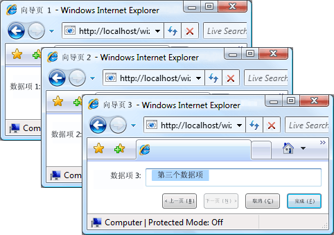
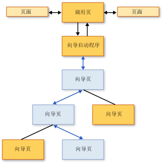

# 导航拓扑概述
此概述提供的简介中的导航拓扑[!INCLUDE[TLA2#tla_wpf](../../../../includes/tla2sharptla-wpf-md.md)]。 三个常见导航拓扑及示例将在随后讨论。  
  
> [!NOTE]
>  在阅读本主题之前, 应该熟悉的概念中的结构化导航[!INCLUDE[TLA2#tla_wpf](../../../../includes/tla2sharptla-wpf-md.md)]使用页函数。 有关这两个这些主题的详细信息，请参阅[结构化导航概述](../../../../docs/framework/wpf/app-development/structured-navigation-overview.md)。  
  
 本主题包含以下各节：  
  
-   [导航拓扑](#Navigation_Topologies)  
  
-   [结构化导航拓扑](#Structured_Navigation_Topologies)  
  
-   [在固定线性拓扑中导航](#Navigation_over_a_Fixed_Linear_Topology)  
  
-   [在固定分层拓扑中动态导航](#Dynamic_Navigation_over_a_Fixed_Hierarchical_Topology)  
  
-   [在动态生成的拓扑中导航](#Navigation_over_a_Dynamically_Generated_Topology)  
  
   
## 导航拓扑  
 在[!INCLUDE[TLA2#tla_wpf](../../../../includes/tla2sharptla-wpf-md.md)]，导航通常由页 (<xref:System.Windows.Controls.Page>) 替换为超链接 (<xref:System.Windows.Documents.Hyperlink>)，导航至其他页面时单击。 导航到的页由[!INCLUDE[TLA#tla_uri#plural](../../../../includes/tlasharptla-urisharpplural-md.md)](请参阅[WPF 中的包 Uri](../../../../docs/framework/wpf/app-development/pack-uris-in-wpf.md))。 请考虑以下简单示例，可以显示页，超链接和[!INCLUDE[TLA#tla_uri#plural](../../../../includes/tlasharptla-urisharpplural-md.md)]:  
  
 [!code-xaml[NavigationTopologiesOverviewSnippets#Page1](../../../../samples/snippets/csharp/VS_Snippets_Wpf/NavigationTopologiesOverviewSnippets/CS/Page1.xaml#page1)]  
  
 [!code-xaml[NavigationTopologiesOverviewSnippets#Page2](../../../../samples/snippets/csharp/VS_Snippets_Wpf/NavigationTopologiesOverviewSnippets/CS/Page2.xaml#page2)]  
  
 这些页面在进行排列*导航拓扑*由其结构如何页面之间导航。 此特定导航拓扑适用于简单的应用场景，尽管导航可以要求更复杂的拓扑（其中的一些只能在应用程序运行时定义）。  
  
 本主题介绍三个常见导航拓扑：*固定线性*，*固定分层*，和*动态生成*。 通过具有的示例演示了每个导航拓扑[!INCLUDE[TLA2#tla_ui](../../../../includes/tla2sharptla-ui-md.md)]显示如下图中所示：  
  
   
  
   
## 结构化导航拓扑  
 有两种广义类型的导航拓扑：  
  
-   **固定拓扑**：在编译时定义，在运行时不能更改。 按线性或层次顺序在固定序列的页面之间导航时，固定拓扑将很有用。  
  
-   **动态拓扑**：在运行时基于从用户、应用程序或系统收集的输入进行定义。 当页面可以按不同序列进行导航时，动态拓扑将很有用。  
  
 虽然使用页可以创建导航拓扑，但是这些示例使用页函数，因为它们提供附加支持，从而通过拓扑页简化对传递和返回数据的支持。  
  
   
## 在固定线性拓扑中导航  
 固定线性拓扑类似于向导的结构，即在固定序列中导航一个或多个向导页。 下图显示具有固定线性拓扑的向导的高级结构和流。  
  
   
  
 在固定线性拓扑中导航的典型行为包括以下内容：  
  
-   从调用页导航到启动程序页，启动程序页初始化向导并导航到第一个向导页。 启动程序页 ( [!INCLUDE[TLA2#tla_ui](../../../../includes/tla2sharptla-ui-md.md)]-较少<xref:System.Windows.Navigation.PageFunction%601>) 不是必需的因为调用页可以直接调用的第一向导页。 但是，使用启动程序页可以简化向导初始化，特别是初始化较复杂时。  
  
-   用户可以使用“后退”和“前进”按钮（或超链接）在不同的页面之间导航。  
  
-   用户可以使用日志在不同的页面之间导航。  
  
-   用户可以通过按下“取消”按钮从任何向导页取消向导。  
  
-   用户可以在最后一个向导页上通过按下“完成”按钮来接受向导。  
  
-   如果向导已取消，该向导会返回相应结果，但不返回任何数据。  
  
-   如果用户接受向导，该向导会返回相应结果并返回所收集的数据。  
  
-   向导完成（接受或取消）后，向导所包含的页便会从日志中删除。 这使得每个向导实例都保持独立，从而避免潜在的数据反常或状态异常。  
  
   
## 在固定分层拓扑中动态导航  
 在某些应用程序中，页允许导航到两个或更多其他页，如下图所示。  
  
   
  
 此结构称为固定分层拓扑，分层的遍历序列通常在运行时由应用程序或用户确定。 运行时，对于允许导航到两个或更多其他页的分层中的每个页面，会收集确定导航到的页所需的数据。 下图基于上图说明了其中一种可能的导航序列。  
  
   
  
 即使固定分层结构中的页导航序列在运行时确定，用户体验仍会与固定线性拓扑的用户体验相同：  
  
-   从调用页导航到启动程序页，启动程序页初始化向导并导航到第一个向导页。 启动程序页 ( [!INCLUDE[TLA2#tla_ui](../../../../includes/tla2sharptla-ui-md.md)]-较少<xref:System.Windows.Navigation.PageFunction%601>) 不是必需的因为调用页可以直接调用的第一向导页。 但是，使用启动程序页可以简化向导初始化，特别是初始化较复杂时。  
  
-   用户可以使用“后退”和“前进”按钮（或超链接）在不同的页面之间导航。  
  
-   用户可以使用日志在不同的页面之间导航。  
  
-   如果用户通过日志向后导航，他们可以更改导航序列。  
  
-   用户可以通过按下“取消”按钮从任何向导页取消向导。  
  
-   用户可以在最后一个向导页上通过按下“完成”按钮来接受向导。  
  
-   如果向导已取消，该向导会返回相应结果，但不返回任何数据。  
  
-   如果用户接受向导，该向导会返回相应结果并返回所收集的数据。  
  
-   向导完成（接受或取消）后，向导所包含的页便会从日志中删除。 这使得每个向导实例都保持独立，从而避免潜在的数据反常或状态异常。  
  
   
## 在动态生成的拓扑中导航  
 在某些应用程序中，两个或更多页的导航序列只能在运行时由用户、应用程序或外部数据确定。 下图说明了一组导航序列未定的页面。  
  
   
  
 下图说明了在运行时用户所选的导航序列。  
  
   
  
 该导航序列称为动态生成的拓扑。 对于用户而言，与其他导航拓扑一样，用户体验与以前拓扑的用户体验相同：  
  
-   从调用页导航到启动程序页，启动程序页初始化向导并导航到第一个向导页。 启动程序页 ( [!INCLUDE[TLA2#tla_ui](../../../../includes/tla2sharptla-ui-md.md)]-较少<xref:System.Windows.Navigation.PageFunction%601>) 不是必需的因为调用页可以直接调用的第一向导页。 但是，使用启动程序页可以简化向导初始化，特别是初始化较复杂时。  
  
-   用户可以使用“后退”和“前进”按钮（或超链接）在不同的页面之间导航。  
  
-   用户可以使用日志在不同的页面之间导航。  
  
-   用户可以通过按下“取消”按钮从任何向导页取消向导。  
  
-   用户可以在最后一个向导页上通过按下“完成”按钮来接受向导。  
  
-   如果向导已取消，该向导会返回相应结果，但不返回任何数据。  
  
-   如果用户接受向导，该向导会返回相应结果并返回所收集的数据。  
  
-   向导完成（接受或取消）后，向导所包含的页便会从日志中删除。 这使得每个向导实例都保持独立，从而避免潜在的数据反常或状态异常。  
  
## 另请参阅  
 <xref:System.Windows.Controls.Page>  
 <xref:System.Windows.Navigation.PageFunction%601>  
 <xref:System.Windows.Navigation.NavigationService>  
 [结构化导航概述](../../../../docs/framework/wpf/app-development/structured-navigation-overview.md)
