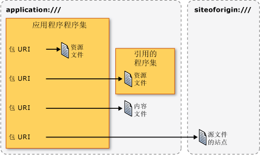

# WPF 中的 Pack URI
在 [!INCLUDE[TLA#tla_wpf](../../../../includes/tlasharptla-wpf-md.md)] 中，使用[!INCLUDE[TLA#tla_uri#plural](../../../../includes/tlasharptla-urisharpplural-md.md)] 标识和加载文件的方式有很多，包括：  
  
-   指定当应用程序第一次启动时显示的[!INCLUDE[TLA#tla_ui](../../../../includes/tlasharptla-ui-md.md)]。  
  
-   加载图像。  
  
-   导航到页  
  
-   加载不可执行的数据文件。  
  
 此外，可以使用 [!INCLUDE[TLA2#tla_uri#plural](../../../../includes/tla2sharptla-urisharpplural-md.md)] 标识和加载位于各种位置的文件，这些位置包括：  
  
-   当前程序集。  
  
-   所引用的程序集。  
  
-   相对于程序集的某个位置。  
  
-   应用程序的源站点。  
  
 为了提供从这些位置标识和加载上述类型的文件的一致机制，[!INCLUDE[TLA2#tla_wpf](../../../../includes/tla2sharptla-wpf-md.md)] 利用了 pack URI 方案的扩展性。  本主题将概述这一方案，介绍如何为各种方案构造 pack [!INCLUDE[TLA2#tla_uri#plural](../../../../includes/tla2sharptla-urisharpplural-md.md)]，讨论绝对和相对 [!INCLUDE[TLA2#tla_uri#plural](../../../../includes/tla2sharptla-urisharpplural-md.md)] 以及 [!INCLUDE[TLA2#tla_uri](../../../../includes/tla2sharptla-uri-md.md)] 解析，然后说明如何在标记和代码中使用 pack [!INCLUDE[TLA2#tla_uri#plural](../../../../includes/tla2sharptla-urisharpplural-md.md)]。  
  
   
  
<a name="The_Pack_URI_Scheme"></a>   
## Pack URI 方案  
 Pack [!INCLUDE[TLA2#tla_uri](../../../../includes/tla2sharptla-uri-md.md)] 方案由 [Open Packaging Conventions](http://go.microsoft.com/fwlink/?LinkID=71255)（开放式打包约定，OPC）规范使用，该规范描述用于组织和标识内容的模型。  此模型的关键元素是程序包和部件，其中，“程序包”是一个或多个逻辑“部件”的逻辑容器。  下图阐释了此概念。  
  
   
  
 为了标识部件，OPC 规范利用 RFC 2396（统一资源标识符 \(URI\)：一般语法）的扩展性来定义 pack [!INCLUDE[TLA2#tla_uri](../../../../includes/tla2sharptla-uri-md.md)] 方案。  
  
 [!INCLUDE[TLA2#tla_uri](../../../../includes/tla2sharptla-uri-md.md)] 所指定的方案由其前缀定义；http、ftp 和 file 是众所周知的示例。  Pack [!INCLUDE[TLA2#tla_uri](../../../../includes/tla2sharptla-uri-md.md)] 方案使用“pack”作为它的方案，并且包含两个组件：授权和路径。  以下是 pack [!INCLUDE[TLA2#tla_uri](../../../../includes/tla2sharptla-uri-md.md)] 的格式。  
  
 pack:\/\/*授权*\/*路径*  
  
 *授权* 指定包含部件的程序包的类型，而*路径* 则指定部件在程序包中的位置。  
  
 下图阐释了此概念：  
  
   
  
 程序包和部件之间的关系类似于应用程序和文件之间的关系，其中，应用程序（程序包）可以包含一个或多个文件（部件），包括：  
  
-   编译到本地程序集中的资源文件。  
  
-   编译到所引用的程序集中的资源文件。  
  
-   编译到进行引用的程序集中的资源文件。  
  
-   内容文件。  
  
-   源站点文件。  
  
 为了访问这些类型的文件，[!INCLUDE[TLA2#tla_wpf](../../../../includes/tla2sharptla-wpf-md.md)] 支持两种授权：application:\/\/\/ 和 siteoforigin:\/\/\/。  Application:\/\/\/ 授权标识在编译时已知的应用程序数据文件，包括资源文件和内容文件。  Siteoforigin:\/\/\/ 授权标识源站点文件。  下图显示了每种授权的范围。  
  
   
  
> [!NOTE]
>  Pack [!INCLUDE[TLA2#tla_uri](../../../../includes/tla2sharptla-uri-md.md)] 的授权组件是一个嵌入式 [!INCLUDE[TLA2#tla_uri](../../../../includes/tla2sharptla-uri-md.md)]，它指向程序包并且必须符合 RFC 2396。  另外，必须用字符“,”替换字符“\/”，并且必须对保留字符（如“%”和“?”）进行转义。  有关详细信息，请参见 OPC。  
  
 以下各节解释如何将这两种授权与用于标识资源、内容和源站点文件的相应路径结合起来，以便构造 pack [!INCLUDE[TLA2#tla_uri#plural](../../../../includes/tla2sharptla-urisharpplural-md.md)]。  
  
<a name="Resource_File_Pack_URIs___Local_Assembly"></a>   
## 资源文件 Pack URI  
 将资源文件配置为 [!INCLUDE[TLA2#tla_msbuild](../../../../includes/tla2sharptla-msbuild-md.md)] `Resource` 项并将其编译到程序集中。  [!INCLUDE[TLA2#tla_wpf](../../../../includes/tla2sharptla-wpf-md.md)] 支持构造可用于标识资源文件的 Pack [!INCLUDE[TLA2#tla_uri#plural](../../../../includes/tla2sharptla-urisharpplural-md.md)]，这些资源文件要么编译到本地程序集中，要么编译到从本地程序集引用的程序集中。  
  
<a name="Local_Assembly_Resource_File"></a>   
### 本地程序集资源文件  
 编译到本地程序集中的资源文件的 pack [!INCLUDE[TLA2#tla_uri](../../../../includes/tla2sharptla-uri-md.md)] 使用以下授权和路径：  
  
-   **授权**：application:\/\/\/。  
  
-   **路径**：资源文件的名称，包括它的相对于本地程序集项目文件夹根目录的路径。  
  
 下面的示例演示一个 [!INCLUDE[TLA2#tla_xaml](../../../../includes/tla2sharptla-xaml-md.md)] 资源文件的 pack [!INCLUDE[TLA2#tla_uri](../../../../includes/tla2sharptla-uri-md.md)]，该资源文件位于本地程序集的项目文件夹的根目录中。  
  
 `pack://application:,,,/ResourceFile.xaml`  
  
 下面的示例演示一个 [!INCLUDE[TLA2#tla_xaml](../../../../includes/tla2sharptla-xaml-md.md)] 资源文件的 pack [!INCLUDE[TLA2#tla_uri](../../../../includes/tla2sharptla-uri-md.md)]，该资源文件位于本地程序集的项目文件夹的子文件夹中。  
  
 `pack://application:,,,/Subfolder/ResourceFile.xaml`  
  
<a name="Resource_File_Pack_URIs___Referenced_Assembly"></a>   
### 所引用的程序集资源文件  
 编译到所引用的程序集中的资源文件的 pack [!INCLUDE[TLA2#tla_uri](../../../../includes/tla2sharptla-uri-md.md)] 使用以下授权和路径：  
  
-   **授权**：application:\/\/\/。  
  
-   **路径**：编译到所引用的程序集中的资源文件的名称。  路径必须符合以下格式：  
  
     *程序集短名称*\[*;版本*\]\[*;公钥*\];组件\/*路径*  
  
    -   **程序集短名称**：所引用的程序集的短名称。  
  
    -   **;版本** \[可选\]：所引用的包含资源文件的程序集的版本。  此部分在加载两个或多个具有相同短名称的所引用的程序集时使用。  
  
    -   **;公钥** \[可选\]：用于对所引用的程序集进行签名的公钥。  此部分在加载两个或多个具有相同短名称的所引用的程序集时使用。  
  
    -   **;组件**：指定所引用的程序集是从本地程序集引用的。  
  
    -   **\/路径**：资源文件的名称，包括它的相对于所引用程序集的项目文件夹根目录的路径。  
  
 下面的示例演示一个 [!INCLUDE[TLA2#tla_xaml](../../../../includes/tla2sharptla-xaml-md.md)] 资源文件的 pack [!INCLUDE[TLA2#tla_uri](../../../../includes/tla2sharptla-uri-md.md)]，该资源文件位于所引用程序集的项目文件夹的根目录中。  
  
 `pack://application:,,,/ReferencedAssembly;component/ResourceFile.xaml`  
  
 下面的示例演示一个 [!INCLUDE[TLA2#tla_xaml](../../../../includes/tla2sharptla-xaml-md.md)] 资源文件的 pack [!INCLUDE[TLA2#tla_uri](../../../../includes/tla2sharptla-uri-md.md)]，该资源文件位于所引用程序集的项目文件夹的子文件夹中。  
  
 `pack://application:,,,/ReferencedAssembly;component/Subfolder/ResourceFile.xaml`  
  
 下面的示例演示一个 [!INCLUDE[TLA2#tla_xaml](../../../../includes/tla2sharptla-xaml-md.md)] 资源文件的 pack [!INCLUDE[TLA2#tla_uri](../../../../includes/tla2sharptla-uri-md.md)]，该资源文件位于所引用的、特定于版本的程序集的项目文件夹的根文件夹中。  
  
 `pack://application:,,,/ReferencedAssembly;v1.0.0.1;component/ResourceFile.xaml`  
  
 请注意，所引用的程序集资源文件的 pack [!INCLUDE[TLA2#tla_uri](../../../../includes/tla2sharptla-uri-md.md)] 语法只能与 application:\/\/\/ 授权一起使用。  例如，[!INCLUDE[TLA2#tla_wpf](../../../../includes/tla2sharptla-wpf-md.md)] 中不支持下面的格式。  
  
 `pack://siteoforigin:,,,/SomeAssembly;component/ResourceFile.xaml`  
  
<a name="Content_File_Pack_URIs"></a>   
## 内容文件 Pack URI  
 内容文件的 pack [!INCLUDE[TLA2#tla_uri](../../../../includes/tla2sharptla-uri-md.md)] 使用以下授权和路径：  
  
-   **授权**：application:\/\/\/。  
  
-   **路径**：内容文件的名称，包括其相对于应用程序的主可执行程序集的文件系统位置的路径。  
  
 下面的示例演示一个 [!INCLUDE[TLA2#tla_xaml](../../../../includes/tla2sharptla-xaml-md.md)] 内容文件的 pack [!INCLUDE[TLA2#tla_uri](../../../../includes/tla2sharptla-uri-md.md)]，该内容文件与可执行程序集位于同一个文件夹中。  
  
 `pack://application:,,,/ContentFile.xaml`  
  
 下面的示例演示一个 [!INCLUDE[TLA2#tla_xaml](../../../../includes/tla2sharptla-xaml-md.md)] 内容文件的 pack [!INCLUDE[TLA2#tla_uri](../../../../includes/tla2sharptla-uri-md.md)]，该内容文件位于一个相对于应用程序的可执行程序集的子文件夹中。  
  
 `pack://application:,,,/Subfolder/ContentFile.xaml`  
  
> [!NOTE]
>  无法导航到 [!INCLUDE[TLA2#tla_html](../../../../includes/tla2sharptla-html-md.md)] 内容文件。  [!INCLUDE[TLA2#tla_uri](../../../../includes/tla2sharptla-uri-md.md)] 方案仅支持导航到位于源站点的 [!INCLUDE[TLA2#tla_html](../../../../includes/tla2sharptla-html-md.md)] 文件。  
  
<a name="The_siteoforigin_____Authority"></a>   
## 源站点 Pack URI  
 源站点文件的 pack [!INCLUDE[TLA2#tla_uri](../../../../includes/tla2sharptla-uri-md.md)] 使用以下授权和路径：  
  
-   **授权**：siteoforigin:\/\/\/。  
  
-   **路径**：源站点文件的名称，包括其相对于启动可执行程序集的位置的路径。  
  
 下面的示例演示一个 [!INCLUDE[TLA2#tla_xaml](../../../../includes/tla2sharptla-xaml-md.md)] 源站点文件的 pack [!INCLUDE[TLA2#tla_uri](../../../../includes/tla2sharptla-uri-md.md)]，该源站点文件存储在启动可执行程序集的位置。  
  
 `pack://siteoforigin:,,,/SiteOfOriginFile.xaml`  
  
 下面的示例演示一个 [!INCLUDE[TLA2#tla_xaml](../../../../includes/tla2sharptla-xaml-md.md)] 源站点文件的 pack [!INCLUDE[TLA2#tla_uri](../../../../includes/tla2sharptla-uri-md.md)]，该源站点文件存储在相对于启动应用程序的可执行程序集的位置的子文件夹中。  
  
 `pack://siteoforigin:,,,/Subfolder/SiteOfOriginFile.xaml`  
  
<a name="Page_Files"></a>   
## 页面文件  
 被配置为 [!INCLUDE[TLA2#tla_msbuild](../../../../includes/tla2sharptla-msbuild-md.md)] `Page` 项的 [!INCLUDE[TLA2#tla_xaml](../../../../includes/tla2sharptla-xaml-md.md)] 文件按照与资源文件相同的方式编译到程序集中。  因此，可以使用资源文件的 pack [!INCLUDE[TLA2#tla_uri#plural](../../../../includes/tla2sharptla-urisharpplural-md.md)] 来标识 [!INCLUDE[TLA2#tla_msbuild](../../../../includes/tla2sharptla-msbuild-md.md)] `Page` 项。  
  
 通常被配置为 [!INCLUDE[TLA2#tla_msbuild](../../../../includes/tla2sharptla-msbuild-md.md)] `Page` 项的 [!INCLUDE[TLA2#tla_xaml](../../../../includes/tla2sharptla-xaml-md.md)] 文件类型将下列元素之一作为它们的根元素：  
  
-   <xref:System.Windows.Window?displayProperty=fullName>  
  
-   <xref:System.Windows.Controls.Page?displayProperty=fullName>  
  
-   <xref:System.Windows.Navigation.PageFunction%601?displayProperty=fullName>  
  
-   <xref:System.Windows.ResourceDictionary?displayProperty=fullName>  
  
-   <xref:System.Windows.Documents.FlowDocument?displayProperty=fullName>  
  
-   <xref:System.Windows.Controls.UserControl?displayProperty=fullName>  
  
<a name="Absolute_vs_Relative_Pack_URIs"></a>   
## 绝对与相对 Pack URI  
 完全限定 pack [!INCLUDE[TLA2#tla_uri](../../../../includes/tla2sharptla-uri-md.md)] 包括方案、授权和路径，它被视为绝对 pack [!INCLUDE[TLA2#tla_uri](../../../../includes/tla2sharptla-uri-md.md)]。  作为一种针对开发人员的简化形式，[!INCLUDE[TLA2#tla_xaml](../../../../includes/tla2sharptla-xaml-md.md)] 元素通常允许您使用只包含路径的相对 pack [!INCLUDE[TLA2#tla_uri](../../../../includes/tla2sharptla-uri-md.md)] 来设置相应的特性。  
  
 例如，假设本地程序集中的某个资源文件具有以下绝对 pack [!INCLUDE[TLA2#tla_uri](../../../../includes/tla2sharptla-uri-md.md)]。  
  
 `pack://application:,,,/ResourceFile.xaml`  
  
 引用此资源文件的相对 pack [!INCLUDE[TLA2#tla_uri](../../../../includes/tla2sharptla-uri-md.md)] 如下所示。  
  
 `/ResourceFile.xaml`  
  
> [!NOTE]
>  因为源站点文件不与程序集相关联，所以只能使用绝对 pack [!INCLUDE[TLA2#tla_uri#plural](../../../../includes/tla2sharptla-urisharpplural-md.md)] 引用源站点文件。  
  
 默认情况下，将相对 pack [!INCLUDE[TLA2#tla_uri](../../../../includes/tla2sharptla-uri-md.md)] 视为相对于包含引用的标记或代码的位置。  但是，如果使用前导反斜杠，则将相对 pack [!INCLUDE[TLA2#tla_uri](../../../../includes/tla2sharptla-uri-md.md)] 引用视为相对于应用程序的根目录。  例如，假设有以下项目结构。  
  
 `App.xaml`  
  
 `Page2.xaml`  
  
 `\SubFolder`  
  
 `+ Page1.xaml`  
  
 `+ Page2.xaml`  
  
 如果 Page1.xaml 包含引用“*根目录*\\子文件夹\\Page2.xaml”的 [!INCLUDE[TLA2#tla_uri](../../../../includes/tla2sharptla-uri-md.md)]，则该引用可以使用下面的相对 pack [!INCLUDE[TLA2#tla_uri](../../../../includes/tla2sharptla-uri-md.md)]。  
  
 `Page2.xaml`  
  
 如果 Page1.xaml 包含引用“*根目录*\\Page2.xaml”的 [!INCLUDE[TLA2#tla_uri](../../../../includes/tla2sharptla-uri-md.md)]，则该引用可以使用下面的相对 pack [!INCLUDE[TLA2#tla_uri](../../../../includes/tla2sharptla-uri-md.md)]。  
  
 `/Page2.xaml`  
  
<a name="Pack_URI_Resolution"></a>   
## Pack URI 解析  
 Pack [!INCLUDE[TLA2#tla_uri#plural](../../../../includes/tla2sharptla-urisharpplural-md.md)] 的格式使得有可能让不同类型的文件的 pack [!INCLUDE[TLA2#tla_uri#plural](../../../../includes/tla2sharptla-urisharpplural-md.md)] 看起来相同。  例如，假设有以下绝对 pack [!INCLUDE[TLA2#tla_uri](../../../../includes/tla2sharptla-uri-md.md)]。  
  
 `pack://application:,,,/ResourceOrContentFile.xaml`  
  
 此绝对 pack [!INCLUDE[TLA2#tla_uri](../../../../includes/tla2sharptla-uri-md.md)] 可以引用本地程序集中的资源文件，也可以引用内容文件。  对于下面的相对 [!INCLUDE[TLA2#tla_uri](../../../../includes/tla2sharptla-uri-md.md)] 来讲也是如此。  
  
 `/ResourceOrContentFile.xaml`  
  
 为了确定 pack [!INCLUDE[TLA2#tla_uri](../../../../includes/tla2sharptla-uri-md.md)] 引用的文件的类型，[!INCLUDE[TLA2#tla_wpf](../../../../includes/tla2sharptla-wpf-md.md)] 使用下面的试探法来解析本地程序集中的资源文件以及内容文件的 [!INCLUDE[TLA2#tla_uri#plural](../../../../includes/tla2sharptla-urisharpplural-md.md)]：  
  
1.  探测与 pack [!INCLUDE[TLA2#tla_uri](../../../../includes/tla2sharptla-uri-md.md)] 匹配的 <xref:System.Windows.Resources.AssemblyAssociatedContentFileAttribute> 特性的程序集元数据。  
  
2.  如果找到 <xref:System.Windows.Resources.AssemblyAssociatedContentFileAttribute> 特性，则 pack [!INCLUDE[TLA2#tla_uri](../../../../includes/tla2sharptla-uri-md.md)] 的路径引用内容文件。  
  
3.  如果未找到 <xref:System.Windows.Resources.AssemblyAssociatedContentFileAttribute> 特性，则探测编译到本地程序集中的资源文件集。  
  
4.  如果找到与 pack [!INCLUDE[TLA2#tla_uri](../../../../includes/tla2sharptla-uri-md.md)] 的路径匹配的资源文件，则 pack [!INCLUDE[TLA2#tla_uri](../../../../includes/tla2sharptla-uri-md.md)] 的路径引用资源文件。  
  
5.  如果未找到合适的资源，则内部创建的 <xref:System.Uri> 无效。  
  
 [!INCLUDE[TLA2#tla_uri](../../../../includes/tla2sharptla-uri-md.md)] 解析不适用于引用以下文件的 [!INCLUDE[TLA2#tla_uri#plural](../../../../includes/tla2sharptla-urisharpplural-md.md)]：  
  
-   所引用的程序集中的内容文件：[!INCLUDE[TLA2#tla_wpf](../../../../includes/tla2sharptla-wpf-md.md)] 不支持这些文件类型。  
  
-   所引用的程序集中的嵌入式文件：标识这些文件的 [!INCLUDE[TLA2#tla_uri#plural](../../../../includes/tla2sharptla-urisharpplural-md.md)] 是唯一的，因为它们既包含所引用的程序集的名称，又包含 `;component` 后缀。  
  
-   源站点文件：标识这些文件的 [!INCLUDE[TLA2#tla_uri#plural](../../../../includes/tla2sharptla-urisharpplural-md.md)] 是唯一的，因为只有这些文件才能用包含 siteoforigin:\/\/\/ 授权的 pack [!INCLUDE[TLA2#tla_uri#plural](../../../../includes/tla2sharptla-urisharpplural-md.md)] 进行标识。  
  
 Pack [!INCLUDE[TLA2#tla_uri](../../../../includes/tla2sharptla-uri-md.md)] 解析所允许使用的一种简化形式是让代码在一定程度上独立于资源和内容文件的位置。  例如，如果本地程序集中有一个被重新配置为内容文件的资源文件，则该资源的 pack [!INCLUDE[TLA2#tla_uri](../../../../includes/tla2sharptla-uri-md.md)] 会保留原样，而使用该 pack [!INCLUDE[TLA2#tla_uri](../../../../includes/tla2sharptla-uri-md.md)] 的代码也是如此。  
  
<a name="Programming_with_Pack_URIs"></a>   
## 使用 Pack URI 编程  
 许多 [!INCLUDE[TLA2#tla_wpf](../../../../includes/tla2sharptla-wpf-md.md)] 类都实现了可以用 pack [!INCLUDE[TLA2#tla_uri#plural](../../../../includes/tla2sharptla-urisharpplural-md.md)] 设置的属性，包括：  
  
-   <xref:System.Windows.Application.StartupUri%2A?displayProperty=fullName>  
  
-   <xref:System.Windows.Controls.Frame.Source%2A?displayProperty=fullName>  
  
-   <xref:System.Windows.Navigation.NavigationWindow.Source%2A?displayProperty=fullName>  
  
-   <xref:System.Windows.Documents.Hyperlink.NavigateUri%2A?displayProperty=fullName>  
  
-   <xref:System.Windows.Window.Icon%2A?displayProperty=fullName>  
  
-   <xref:System.Windows.Controls.Image.Source%2A?displayProperty=fullName>  
  
 可以从标记和代码中设置这些属性。  本节演示这两种设置方式的基本构造，然后演示通用方案示例。  
  
<a name="Using_Pack_URIs_in_Markup"></a>   
### 在标记中使用 Pack URI  
 在标记中，使用 pack [!INCLUDE[TLA2#tla_uri](../../../../includes/tla2sharptla-uri-md.md)] 设置某个特性的元素，从而指定 pack [!INCLUDE[TLA2#tla_uri](../../../../includes/tla2sharptla-uri-md.md)]。  例如：  
  
 `<element attribute="pack://application:,,,/File.xaml" />`  
  
 表 1 阐释了可以在标记中指定的各种绝对 pack [!INCLUDE[TLA2#tla_uri#plural](../../../../includes/tla2sharptla-urisharpplural-md.md)]。  
  
 表 1：标记中的绝对 Pack URI  
  
|文件|绝对 pack [!INCLUDE[TLA2#tla_uri](../../../../includes/tla2sharptla-uri-md.md)]|  
|--------|--------------------------------------------------------------------------|  
|资源文件 — 本地程序集|`"pack://application:,,,/ResourceFile.xaml"`|  
|子文件夹中的资源文件 — 本地程序集|`"pack://application:,,,/Subfolder/ResourceFile.xaml"`|  
|资源文件 — 所引用的程序集|`"pack://application:,,,/ReferencedAssembly;component/ResourceFile.xaml"`|  
|所引用的程序集的子文件夹中的资源文件|`"pack://application:,,,/ReferencedAssembly;component/Subfolder/ResourceFile.xaml"`|  
|所引用的版本化程序集中的资源文件|`"pack://application:,,,/ReferencedAssembly;v1.0.0.0;component/ResourceFile.xaml"`|  
|内容文件|`"pack://application:,,,/ContentFile.xaml"`|  
|子文件夹中的内容文件|`"pack://application:,,,/Subfolder/ContentFile.xaml"`|  
|源站点文件|`"pack://siteoforigin:,,,/SOOFile.xaml"`|  
|子文件夹中的源站点文件|`"pack://siteoforigin:,,,/Subfolder/SOOFile.xaml"`|  
  
 表 2 阐释了可以在标记中指定的各种相对 pack [!INCLUDE[TLA2#tla_uri#plural](../../../../includes/tla2sharptla-urisharpplural-md.md)]。  
  
 表 2：标记中的相对 Pack URI  
  
|文件|相对 pack [!INCLUDE[TLA2#tla_uri](../../../../includes/tla2sharptla-uri-md.md)]|  
|--------|--------------------------------------------------------------------------|  
|本地程序集中的资源文件|`"/ResourceFile.xaml"`|  
|本地程序集的子文件夹中的资源文件|`"/Subfolder/ResourceFile.xaml"`|  
|所引用的程序集中的资源文件|`"/ReferencedAssembly;component/ResourceFile.xaml"`|  
|所引用的程序集的子文件夹中的资源文件|`"/ReferencedAssembly;component/Subfolder/ResourceFile.xaml"`|  
|内容文件|`"/ContentFile.xaml"`|  
|子文件夹中的内容文件|`"/Subfolder/ContentFile.xaml"`|  
  
<a name="Using_Pack_URIs_in_Code"></a>   
### 在代码中使用 Pack URI  
 在代码中，可以通过实例化 <xref:System.Uri> 类并将 pack [!INCLUDE[TLA2#tla_uri](../../../../includes/tla2sharptla-uri-md.md)] 作为参数传递给构造函数来指定 pack [!INCLUDE[TLA2#tla_uri](../../../../includes/tla2sharptla-uri-md.md)]。  下面的示例说明了这一点。  
  
```csharp  
Uri uri = new Uri("pack://application:,,,/File.xaml");  
```  
  
 默认情况下，<xref:System.Uri> 类将 pack [!INCLUDE[TLA2#tla_uri#plural](../../../../includes/tla2sharptla-urisharpplural-md.md)] 视为绝对 pack URI。  因此，在使用相对 pack [!INCLUDE[TLA2#tla_uri](../../../../includes/tla2sharptla-uri-md.md)] 创建 <xref:System.Uri> 类的实例时会引发异常。  
  
```csharp  
Uri uri = new Uri("/File.xaml");  
```  
  
 幸运的是，<xref:System.Uri> 类构造函数的 <xref:System.Uri.%23ctor%28System.String%2CSystem.UriKind%29> 重载可以接受一个类型为 <xref:System.UriKind> 的参数，使您可以指定 pack [!INCLUDE[TLA2#tla_uri](../../../../includes/tla2sharptla-uri-md.md)] 是绝对 URI 还是相对 URI。  
  
```csharp  
// Absolute URI (default)  
Uri absoluteUri = new Uri("pack://application:,,,/File.xaml", UriKind.Absolute);  
// Relative URI  
Uri relativeUri = new Uri("/File.xaml", UriKind.Relative);  
```  
  
 当您能够确定所提供的 pack [!INCLUDE[TLA2#tla_uri](../../../../includes/tla2sharptla-uri-md.md)] 是相对 pack URI 还是绝对 pack URI 的时候，应该只指定 <xref:System.UriKind> 或 <xref:System.UriKind>。  如果您不了解所使用的 pack [!INCLUDE[TLA2#tla_uri](../../../../includes/tla2sharptla-uri-md.md)] 的类型（例如，当用户在运行时输入 pack [!INCLUDE[TLA2#tla_uri](../../../../includes/tla2sharptla-uri-md.md)] 时），请改用 <xref:System.UriKind>。  
  
```csharp  
// Relative or Absolute URI provided by user via a text box  
TextBox userProvidedUriTextBox = new TextBox();  
Uri uri = new Uri(userProvidedUriTextBox.Text, UriKind.RelativeOrAbsolute);  
```  
  
 表 3 阐释了可以在代码中使用 <xref:System.Uri?displayProperty=fullName> 指定的各种绝对 pack [!INCLUDE[TLA2#tla_uri#plural](../../../../includes/tla2sharptla-urisharpplural-md.md)]。  
  
 表 3：代码中的绝对 Pack URI  
  
|文件|绝对 pack [!INCLUDE[TLA2#tla_uri](../../../../includes/tla2sharptla-uri-md.md)]|  
|--------|--------------------------------------------------------------------------|  
|资源文件 — 本地程序集|`Uri uri = new Uri("pack://application:,,,/ResourceFile.xaml", UriKind.Absolute);`|  
|子文件夹中的资源文件 — 本地程序集|`Uri uri = new Uri("pack://application:,,,/Subfolder/ResourceFile.xaml", UriKind.Absolute);`|  
|资源文件 — 所引用的程序集|`Uri uri = new Uri("pack://application:,,,/ReferencedAssembly;component/ResourceFile.xaml", UriKind.Absolute);`|  
|所引用的程序集的子文件夹中的资源文件|`Uri uri = new Uri("pack://application:,,,/ReferencedAssembly;component/Subfolder/ResourceFile.xaml", UriKind.Absolute);`|  
|所引用的版本化程序集中的资源文件|`Uri uri = new Uri("pack://application:,,,/ReferencedAssembly;v1.0.0.0;component/ResourceFile.xaml", UriKind.Absolute);`|  
|内容文件|`Uri uri = new Uri("pack://application:,,,/ContentFile.xaml", UriKind.Absolute);`|  
|子文件夹中的内容文件|`Uri uri = new Uri("pack://application:,,,/Subfolder/ContentFile.xaml", UriKind.Absolute);`|  
|源站点文件|`Uri uri = new Uri("pack://siteoforigin:,,,/SOOFile.xaml", UriKind.Absolute);`|  
|子文件夹中的源站点文件|`Uri uri = new Uri("pack://siteoforigin:,,,/Subfolder/SOOFile.xaml", UriKind.Absolute);`|  
  
 表 4 阐释了可以在代码中使用 <xref:System.Uri?displayProperty=fullName> 指定的各种相对 pack [!INCLUDE[TLA2#tla_uri#plural](../../../../includes/tla2sharptla-urisharpplural-md.md)]。  
  
 表 4：代码中的相对 Pack URI  
  
|文件|相对 pack [!INCLUDE[TLA2#tla_uri](../../../../includes/tla2sharptla-uri-md.md)]|  
|--------|--------------------------------------------------------------------------|  
|资源文件 — 本地程序集|`Uri uri = new Uri("/ResourceFile.xaml", UriKind.Relative);`|  
|子文件夹中的资源文件 — 本地程序集|`Uri uri = new Uri("/Subfolder/ResourceFile.xaml", UriKind.Relative);`|  
|资源文件 — 所引用的程序集|`Uri uri = new Uri("/ReferencedAssembly;component/ResourceFile.xaml", UriKind.Relative);`|  
|子文件夹中的资源文件 — 所引用的程序集|`Uri uri = new Uri("/ReferencedAssembly;component/Subfolder/ResourceFile.xaml", UriKind.Relative);`|  
|内容文件|`Uri uri = new Uri("/ContentFile.xaml", UriKind.Relative);`|  
|子文件夹中的内容文件|`Uri uri = new Uri("/Subfolder/ContentFile.xaml", UriKind.Relative);`|  
  
<a name="Common_Pack_URI_Scenarios"></a>   
### 常见 Pack URI 方案  
 前面几节讨论了如何构造 pack [!INCLUDE[TLA2#tla_uri#plural](../../../../includes/tla2sharptla-urisharpplural-md.md)] 以标识资源文件、内容文件和源站点文件。  在 [!INCLUDE[TLA2#tla_wpf](../../../../includes/tla2sharptla-wpf-md.md)] 中，可以通过各种方式使用这些构造，下面的几节将介绍几种常见用法。  
  
<a name="Specifying_the_UI_to_Show_when_an_Application_Starts"></a>   
#### 指定当应用程序启动时显示的 UI  
 <xref:System.Windows.Application.StartupUri%2A> 指定当 [!INCLUDE[TLA2#tla_wpf](../../../../includes/tla2sharptla-wpf-md.md)] 应用程序启动时显示的第一个 [!INCLUDE[TLA2#tla_ui](../../../../includes/tla2sharptla-ui-md.md)]。  对于独立应用程序，[!INCLUDE[TLA2#tla_ui](../../../../includes/tla2sharptla-ui-md.md)] 可以是一个窗口，如下面的示例所示。  
  
 [!code-xml[PackURIOverviewSnippets#StartupUriWindow](../../../../samples/snippets/csharp/VS_Snippets_Wpf/PackURIOverviewSnippets/CS/Copy of App.xaml#startupuriwindow)]  
  
 独立应用程序和 [!INCLUDE[TLA#tla_xbap#plural](../../../../includes/tlasharptla-xbapsharpplural-md.md)] 还可以将页面指定为初始 UI，如下面的示例所示。  
  
 [!code-xml[PackURIOverviewSnippets#StartupUriPage](../../../../samples/snippets/csharp/VS_Snippets_Wpf/PackURIOverviewSnippets/CS/App.xaml#startupuripage)]  
  
 如果应用程序是独立应用程序，并且使用 <xref:System.Windows.Application.StartupUri%2A> 指定了一个页面，则 [!INCLUDE[TLA2#tla_wpf](../../../../includes/tla2sharptla-wpf-md.md)] 会打开一个 <xref:System.Windows.Navigation.NavigationWindow> 以承载该页面。  对于 [!INCLUDE[TLA2#tla_xbap#plural](../../../../includes/tla2sharptla-xbapsharpplural-md.md)]，该页面在宿主浏览器中显示。  
  
<a name="Navigating_to_a_Page"></a>   
#### 导航到页面  
 下面的示例演示如何导航到页面。  
  
 [!code-xml[NavigationOverviewSnippets#HyperlinkXAML1](../../../../samples/snippets/csharp/VS_Snippets_Wpf/NavigationOverviewSnippets/CSharp/PageWithHyperlink.xaml#hyperlinkxaml1)]  
[!code-xml[NavigationOverviewSnippets#HyperlinkXAML2](../../../../samples/snippets/csharp/VS_Snippets_Wpf/NavigationOverviewSnippets/CSharp/PageWithHyperlink.xaml#hyperlinkxaml2)]  
[!code-xml[NavigationOverviewSnippets#HyperlinkXAML3](../../../../samples/snippets/csharp/VS_Snippets_Wpf/NavigationOverviewSnippets/CSharp/PageWithHyperlink.xaml#hyperlinkxaml3)]  
  
 有关在 [!INCLUDE[TLA2#tla_wpf](../../../../includes/tla2sharptla-wpf-md.md)] 中导航的各种方式的更多信息，请参见[导航概述](../../../../docs/framework/wpf/app-development/navigation-overview.md)。  
  
<a name="Specifying_a_Window_Icon"></a>   
#### 指定窗口图标  
 下面的示例演示如何使用 URI 指定窗口的图标。  
  
 [!code-xml[WindowIconSnippets#WindowIconSetXAML](../../../../samples/snippets/xaml/VS_Snippets_Wpf/WindowIconSnippets/XAML/MainWindow.xaml#windowiconsetxaml)]  
  
 有关更多信息，请参见 <xref:System.Windows.Window.Icon%2A>。  
  
<a name="Loading_Image__Audio__and_Video_Files"></a>   
#### 加载图像、音频和视频文件  
 [!INCLUDE[TLA2#tla_wpf](../../../../includes/tla2sharptla-wpf-md.md)] 使应用程序可以使用各种媒体类型，所有这些媒体类型都可以用 pack [!INCLUDE[TLA2#tla_uri#plural](../../../../includes/tla2sharptla-urisharpplural-md.md)] 标识和加载，如下面的示例所示。  
  
 [!code-xml[MediaPlayerVideoSample#VideoPackURIAtSOO](../../../../samples/snippets/csharp/VS_Snippets_Wpf/MediaPlayerVideoSample/CS/HomePage.xaml#videopackuriatsoo)]  
  
 [!code-xml[MediaPlayerAudioSample#AudioPackURIAtSOO](../../../../samples/snippets/csharp/VS_Snippets_Wpf/MediaPlayerAudioSample/CS/HomePage.xaml#audiopackuriatsoo)]  
  
 [!code-xml[ImageSample#ImagePackURIContent](../../../../samples/snippets/csharp/VS_Snippets_Wpf/ImageSample/CS/HomePage.xaml#imagepackuricontent)]  
  
 有关使用媒体内容的更多信息，请参见 [图形和多媒体](../../../../docs/framework/wpf/graphics-multimedia/index.md)。  
  
<a name="Loading_a_Resource_Dictionary_from_the_Site_of_Origin"></a>   
#### 从源站点加载资源字典  
 可以使用资源字典 \(<xref:System.Windows.ResourceDictionary>\) 来支持应用程序主题。  创建和管理主题的一种方式是将多个主题创建为位于应用程序源站点的资源字典。  这样，在添加和更新主题时将无需重新编译和重新部署应用程序。  可以使用 pack [!INCLUDE[TLA2#tla_uri#plural](../../../../includes/tla2sharptla-urisharpplural-md.md)] 来标识和加载这些资源字典，如下面的示例所示。  
  
 [!code-xml[ResourceDictionarySnippets#ResourceDictionaryPackURI](../../../../samples/snippets/csharp/VS_Snippets_Wpf/ResourceDictionarySnippets/CS/App.xaml#resourcedictionarypackuri)]  
  
 有关 [!INCLUDE[TLA2#tla_wpf](../../../../includes/tla2sharptla-wpf-md.md)] 中主题的概述，请参见[样式设置和模板化](../../../../docs/framework/wpf/controls/styling-and-templating.md)。  
  
## 请参阅  
 [WPF 应用程序资源、内容和数据文件](../../../../docs/framework/wpf/app-development/wpf-application-resource-content-and-data-files.md)