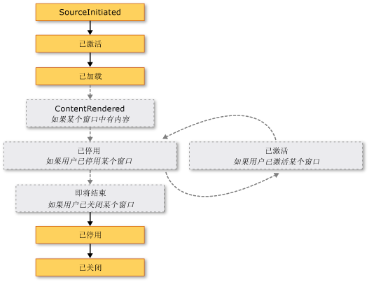
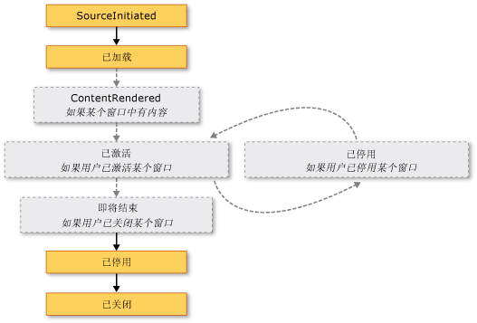

# <a name="wpf-windows-overview"></a>WPF Windows 概述
用户与通过 windows 的 Windows Presentation Foundation (WPF) 独立应用程序进行交互。 窗口的主要用途是托管使数据可视化并使用户能够与数据交互的内容。 独立[!INCLUDE[TLA2#tla_wpf](../../../../includes/tla2sharptla-wpf-md.md)]应用程序通过提供其自己的 windows<xref:System.Windows.Window>类。 本主题介绍<xref:System.Windows.Window>之前涵盖创建和管理 windows 独立应用程序中的基础知识。  
  
> [!NOTE]
>  浏览器承载[!INCLUDE[TLA2#tla_wpf](../../../../includes/tla2sharptla-wpf-md.md)]应用程序，包括[!INCLUDE[TLA#tla_xbap#plural](../../../../includes/tlasharptla-xbapsharpplural-md.md)]和松散[!INCLUDE[TLA#tla_xaml](../../../../includes/tlasharptla-xaml-md.md)]页，未提供它们自己的窗口。 相反，由提供的窗口中承载它们[!INCLUDE[TLA#tla_iegeneric](../../../../includes/tlasharptla-iegeneric-md.md)]。 请参阅[WPF XAML 浏览器应用程序概述](../../../../docs/framework/wpf/app-development/wpf-xaml-browser-applications-overview.md)。  
  
  
<a name="TheWindowClass"></a>   
## <a name="the-window-class"></a>窗口类  
 下图展示了窗口的构成部分。  
  
   
  
 窗口分为两个区域：非工作区和工作区。  
  
 *非工作区*的一个窗口由[!INCLUDE[TLA2#tla_wpf](../../../../includes/tla2sharptla-wpf-md.md)]和包括的组成部分窗口所共有的大多数窗口，其中包括：  
  
-   边框。  
  
-   标题栏。  
  
-   图标。  
  
-   “最小化”、“最大化”和“还原”按钮。  
  
-   “关闭”按钮。  
  
-   “系统”菜单，其中包含允许用户最小化、最大化、还原、移动和关闭窗口以及重设窗口大小的菜单项。  
  
 *客户端区域*窗口是窗口的非工作区的区域和开发人员用于添加特定于应用程序的内容，如菜单栏、 工具和控件。  
  
 在[!INCLUDE[TLA2#tla_wpf](../../../../includes/tla2sharptla-wpf-md.md)]，包装一个窗口<xref:System.Windows.Window>类，该类用于执行以下操作：  
  
-   显示窗口。  
  
-   配置窗口的大小、位置和外观。  
  
-   托管特定于应用程序的内容。  
  
-   管理窗口的生存期。  
  
<a name="DefiningAWindow"></a>   
## <a name="implementing-a-window"></a>实现窗口  
 典型的窗口的实现包含外观和行为，其中*外观*定义用户看到一个窗口的样子和*行为*定义窗口的作用与用户进行交互的方式使用它。 在[!INCLUDE[TLA2#tla_wpf](../../../../includes/tla2sharptla-wpf-md.md)]、 可以实现的外观和行为的窗口中使用代码或[!INCLUDE[TLA2#tla_xaml](../../../../includes/tla2sharptla-xaml-md.md)]标记。  
  
 一般情况下，但是，一个窗口的外观实现使用[!INCLUDE[TLA2#tla_xaml](../../../../includes/tla2sharptla-xaml-md.md)]标记，其行为实现和使用代码隐藏，如下面的示例中所示。  
  
 [!code-xaml[WindowsOverviewSnippets#MarkupAndCodeBehindWindowMARKUP](../../../../samples/snippets/csharp/VS_Snippets_Wpf/WindowsOverviewSnippets/CSharp/MarkupAndCodeBehindWindow.xaml#markupandcodebehindwindowmarkup)]  
  
 [!code-csharp[WindowsOverviewSnippets#MarkupAndCodeBehindWindowCODEBEHIND](../../../../samples/snippets/csharp/VS_Snippets_Wpf/WindowsOverviewSnippets/CSharp/MarkupAndCodeBehindWindow.xaml.cs#markupandcodebehindwindowcodebehind)]
 [!code-vb[WindowsOverviewSnippets#MarkupAndCodeBehindWindowCODEBEHIND](../../../../samples/snippets/visualbasic/VS_Snippets_Wpf/WindowsOverviewSnippets/VisualBasic/MarkupAndCodeBehindWindow.xaml.vb#markupandcodebehindwindowcodebehind)]  
  
 若要启用[!INCLUDE[TLA2#tla_xaml](../../../../includes/tla2sharptla-xaml-md.md)]标记文件和代码隐藏文件配合工作，需要以下项：  
  
-   在标记中，`Window`元素必须包含`x:Class`属性。 当生成应用程序，是否存在`x:Class`文件会导致在标记中[!INCLUDE[TLA#tla_msbuild](../../../../includes/tlasharptla-msbuild-md.md)]创建`partial`派生自的类<xref:System.Windows.Window>并具有指定名称`x:Class`属性。 这需要添加[!INCLUDE[TLA2#tla_xml](../../../../includes/tla2sharptla-xml-md.md)]命名空间声明[!INCLUDE[TLA2#tla_xaml](../../../../includes/tla2sharptla-xaml-md.md)]架构 ( `xmlns:x="http://schemas.microsoft.com/winfx/2006/xaml"` )。 生成`partial`类实现`InitializeComponent`方法，调用以注册事件，并设置在标记中实现的属性。  
  
-   代码隐藏文件中的类必须`partial`类具有相同名称指定的`x:Class`属性标记，且必须派生自<xref:System.Windows.Window>。 这样，要与之关联的代码隐藏文件`partial`时生成应用程序为标记文件生成的类 (请参阅[生成 WPF 应用程序](../../../../docs/framework/wpf/app-development/building-a-wpf-application-wpf.md))。  
  
-   代码隐藏文件中<xref:System.Windows.Window>类必须实现的构造函数的调用`InitializeComponent`方法。 `InitializeComponent` 实现通过标记文件的生成`partial`类注册事件和设置在标记中定义的属性。  
  
> [!NOTE]
>  添加新<xref:System.Windows.Window>到你的项目使用[!INCLUDE[TLA#tla_visualstu](../../../../includes/tlasharptla-visualstu-md.md)]、<xref:System.Windows.Window>使用标记和代码隐藏实现，并包括必需的配置，以便创建为标记和代码隐藏文件之间的关联此处所述。  
  
 进行此配置之后，你可以专注于定义中的窗口的外观[!INCLUDE[TLA2#tla_xaml](../../../../includes/tla2sharptla-xaml-md.md)]标记和代码隐藏文件中实现其行为。 下面的示例演示具有按钮，在中实现的窗口[!INCLUDE[TLA2#tla_xaml](../../../../includes/tla2sharptla-xaml-md.md)]标记，并为按钮的事件处理程序<xref:System.Windows.Controls.Primitives.ButtonBase.Click>代码隐藏文件中实现的事件。  
  
 [!code-xaml[WindowsOverviewWindowWithButtonSnippets#MarkupAndCodeBehindWindowMARKUP](../../../../samples/snippets/csharp/VS_Snippets_Wpf/WindowsOverviewWindowWithButtonSnippets/CSharp/MarkupAndCodeBehindWindow.xaml#markupandcodebehindwindowmarkup)]  
  
 [!code-csharp[WindowsOverviewWindowWithButtonSnippets#MarkupAndCodeBehindWindowCODEBEHIND](../../../../samples/snippets/csharp/VS_Snippets_Wpf/WindowsOverviewWindowWithButtonSnippets/CSharp/MarkupAndCodeBehindWindow.xaml.cs#markupandcodebehindwindowcodebehind)]
 [!code-vb[WindowsOverviewWindowWithButtonSnippets#MarkupAndCodeBehindWindowCODEBEHIND](../../../../samples/snippets/visualbasic/VS_Snippets_Wpf/WindowsOverviewWindowWithButtonSnippets/VisualBasic/MarkupAndCodeBehindWindow.xaml.vb#markupandcodebehindwindowcodebehind)]  
  
<a name="ConfiguringWindowForMSBuild"></a>   
## <a name="configuring-a-window-definition-for-msbuild"></a>为 MSBuild 配置窗口定义  
 如何实现你的窗口确定如何为配置[!INCLUDE[TLA2#tla_msbuild](../../../../includes/tla2sharptla-msbuild-md.md)]。 窗口定义同时使用[!INCLUDE[TLA2#tla_xaml](../../../../includes/tla2sharptla-xaml-md.md)]标记和代码隐藏：  
  
-   [!INCLUDE[TLA2#tla_xaml](../../../../includes/tla2sharptla-xaml-md.md)] 标记文件配置为[!INCLUDE[TLA2#tla_msbuild](../../../../includes/tla2sharptla-msbuild-md.md)]`Page`项。  
  
-   代码隐藏文件配置为[!INCLUDE[TLA2#tla_msbuild](../../../../includes/tla2sharptla-msbuild-md.md)]`Compile`项。  
  
 这如下所示[!INCLUDE[TLA2#tla_msbuild](../../../../includes/tla2sharptla-msbuild-md.md)]项目文件。  
  
```xml  
<Project ...  
                xmlns="http://schemas.microsoft.com/developer/msbuild/2003">  
    ...  
    <Page Include="MarkupAndCodeBehindWindow.xaml" />  
    <Compile Include=" MarkupAndCodeBehindWindow.xaml.cs" />  
    ...  
</Project>  
```  
  
 有关构建[!INCLUDE[TLA2#tla_wpf](../../../../includes/tla2sharptla-wpf-md.md)]应用程序，请参阅[生成 WPF 应用程序](../../../../docs/framework/wpf/app-development/building-a-wpf-application-wpf.md)。  
  
<a name="WindowLifetime"></a>   
## <a name="window-lifetime"></a>窗口生存期  
 与所有类一样，窗口也有生存期，开始于首次实例化窗口，在这之后将打开、激活、停用直至最终关闭窗口。  
  
  
<a name="Opening_a_Window"></a>   
### <a name="opening-a-window"></a>打开窗口  
 若要打开窗口，首先要创建窗口实例，下面的示例演示此操作。  
  
 [!code-xaml[WindowsOverviewStartupEventSnippets#AppMARKUP](../../../../samples/snippets/csharp/VS_Snippets_Wpf/WindowsOverviewStartupEventSnippets/CSharp/App.xaml#appmarkup)]  
  
 [!code-csharp[WindowsOverviewStartupEventSnippets#AppCODEBEHIND](../../../../samples/snippets/csharp/VS_Snippets_Wpf/WindowsOverviewStartupEventSnippets/CSharp/App.xaml.cs#appcodebehind)]  
  
 在此示例中，`MarkupAndCodeBehindWindow`实例化应用程序启动时，出现这种情况时<xref:System.Windows.Application.Startup>引发事件。  
  
 实例化一个窗口时，对它的引用自动添加到由管理的 windows 列表<xref:System.Windows.Application>对象 (请参阅<xref:System.Windows.Application.Windows%2A?displayProperty=nameWithType>)。 此外，要实例化的第一个窗口，默认情况下，将由<xref:System.Windows.Application>作为主应用程序窗口 (请参阅<xref:System.Windows.Application.MainWindow%2A?displayProperty=nameWithType>)。  
  
 通过调用最后打开此窗口<xref:System.Windows.Window.Show%2A>方法; 的结果显示在下图。  
  
   
  
 通过调用打开一个窗口<xref:System.Windows.Window.Show%2A>是无模式窗口中，这意味着应用程序会在允许用户激活同一个应用程序中的其他窗口的模式下运行。  
  
> [!NOTE]
>  <xref:System.Windows.Window.ShowDialog%2A> 调用以模式方式打开窗口，如对话框。 请参阅[对话框概述](../../../../docs/framework/wpf/app-development/dialog-boxes-overview.md)有关详细信息。  
  
 当<xref:System.Windows.Window.Show%2A>是调用，窗口执行初始化工作之前它显示的用于建立这样一来接收用户输入的基础结构。 初始化窗口时，<xref:System.Windows.Window.SourceInitialized>引发事件和显示的窗口。  
  
 作为快捷方式，<xref:System.Windows.Application.StartupUri%2A>可以设置为指定第一个应用程序启动时自动打开的窗口。  
  
 [!code-xaml[WindowsOverviewSnippets#ApplicationStartupUriMARKUP](../../../../samples/snippets/csharp/VS_Snippets_Wpf/WindowsOverviewSnippets/CSharp/App.xaml#applicationstartupurimarkup)]  
  
 当应用程序启动时，指定的值的窗口<xref:System.Windows.Application.StartupUri%2A>打开以无模式方式; 在内部，打开窗口时通过调用其<xref:System.Windows.Window.Show%2A>方法。  
  
<a name="Ownership"></a>   
#### <a name="window-ownership"></a>窗口所有权  
 通过打开一个窗口<xref:System.Windows.Window.Show%2A>方法不具有与窗口创建它的隐式关系; 用户可以与独立于另一个，这意味着两个窗口中可以执行以下任一窗口进行交互：  
  
-   覆盖另 (除非一窗口具有其<xref:System.Windows.Window.Topmost%2A>属性设置为`true`)。  
  
-   在不影响另一个窗口的情况下最小化、最大化和还原。  
  
 某些窗口要求与打开它们的窗口保持某种关系。 例如，[!INCLUDE[TLA#tla_ide](../../../../includes/tlasharptla-ide-md.md)]应用程序可能会打开属性窗口和工具窗口的典型行为是介绍创建它们的窗口。 此外，此类窗口应始终与创建它们的窗口一起关闭、最小化、最大化和还原。 可以通过使一个窗口建立这种关系*自己*另一个，并通过设置<xref:System.Windows.Window.Owner%2A>属性*拥有窗口*引用*所有者窗口*。 这在下面的示例中显示。  
  
 [!code-csharp[WindowOwnerOwnedWindowsSnippets#SetWindowOwnerCODE](../../../../samples/snippets/csharp/VS_Snippets_Wpf/WindowOwnerOwnedWindowsSnippets/CSharp/MainWindow.xaml.cs#setwindowownercode)]
 [!code-vb[WindowOwnerOwnedWindowsSnippets#SetWindowOwnerCODE](../../../../samples/snippets/visualbasic/VS_Snippets_Wpf/WindowOwnerOwnedWindowsSnippets/visualbasic/mainwindow.xaml.vb#setwindowownercode)]  
  
 建立所有权后：  
  
-   拥有的窗口可以通过检查的值引用其所有者窗口其<xref:System.Windows.Window.Owner%2A>属性。  
  
-   所有者窗口可以发现它通过检查的值所拥有的所有 windows 其<xref:System.Windows.Window.OwnedWindows%2A>属性。  
  
<a name="Preventing"></a>   
#### <a name="preventing-window-activation"></a>防止窗口激活  
 有一些的情形其中 windows 应不显示时激活，如 Internet messenger 样式应用程序的对话窗口或电子邮件应用程序的通知窗口。  
  
 如果你的应用程序具有一个窗口，在显示时，不应被激活，则可以设置其<xref:System.Windows.Window.ShowActivated%2A>属性`false`之前调用<xref:System.Windows.Window.Show%2A>第一次的方法。 结果是：  
  
-   不会激活窗口。  
  
-   窗口的<xref:System.Windows.Window.Activated>不会引发事件。  
  
-   当前激活的窗口保持激活状态。  
  
 但是，只要用户通过单击工作区或非工作区激活了窗口，窗口就会变为激活状态。 这种情况下：  
  
-   已激活窗口。  
  
-   窗口的<xref:System.Windows.Window.Activated>引发事件。  
  
-   停用之前激活的窗口。  
  
-   窗口的<xref:System.Windows.Window.Deactivated>和<xref:System.Windows.Window.Activated>按预期方式响应用户操作，随后会引发事件。  
  
<a name="Window_Activation"></a>   
### <a name="window-activation"></a>窗口激活  
 当首次打开一个窗口时，它将变为活动窗口 (除非它还会显示<xref:System.Windows.Window.ShowActivated%2A>设置为`false`)。 *活动窗口*是当前是否正在捕获用户输入，如键击和鼠标单击的窗口。 当一个窗口变为活动状态时，它会发出<xref:System.Windows.Window.Activated>事件。  
  
> [!NOTE]
>  当首次打开一个窗口时，<xref:System.Windows.FrameworkElement.Loaded>和<xref:System.Windows.Window.ContentRendered>之后才引发事件<xref:System.Windows.Window.Activated>引发事件。 这一点，窗口可以有效地考虑时打开<xref:System.Windows.Window.ContentRendered>引发。  
  
 某个窗口成为活动窗口后，用户可以在同一应用程序内激活其他窗口，或者激活其他应用程序。 当发生这种情况时，当前处于活动状态窗口变为停用，并且引发<xref:System.Windows.Window.Deactivated>事件。 同样，当用户选择当前已停用的窗口，窗口再次变得频繁和<xref:System.Windows.Window.Activated>引发。  
  
 若要处理的一个常见原因<xref:System.Windows.Window.Activated>和<xref:System.Windows.Window.Deactivated>是启用和禁用只能运行一个窗口处于活动状态时的功能。 例如，一些窗口显示需要用户持续输入或关注的交互式内容，这些内容包括游戏和视频播放器。 下面的示例是一个简化的视频播放器，演示了如何处理<xref:System.Windows.Window.Activated>和<xref:System.Windows.Window.Deactivated>来实现此行为。  
  
 [!code-xaml[WindowsOverviewSnippets#ActivationDeactivationMARKUP](../../../../samples/snippets/csharp/VS_Snippets_Wpf/WindowsOverviewSnippets/CSharp/CustomMediaPlayerWindow.xaml#activationdeactivationmarkup)]  
  
 [!code-csharp[WindowsOverviewSnippets#ActivationDeactivationCODEBEHIND](../../../../samples/snippets/csharp/VS_Snippets_Wpf/WindowsOverviewSnippets/CSharp/CustomMediaPlayerWindow.xaml.cs#activationdeactivationcodebehind)]
 [!code-vb[WindowsOverviewSnippets#ActivationDeactivationCODEBEHIND](../../../../samples/snippets/visualbasic/VS_Snippets_Wpf/WindowsOverviewSnippets/VisualBasic/CustomMediaPlayerWindow.xaml.vb#activationdeactivationcodebehind)]  
  
 停用某个窗口后，其他类型的应用程序可能仍会在后台运行代码。 例如，在用户使用其他应用程序时，邮件客户端可能会继续轮询邮件服务器。 类似的应用程序在主窗口停用时，通常将提供不同或其他的行为。 对于邮件程序，这可能意味着将新邮件项添加到收件箱和将通知图标添加到系统任务栏。 在邮件窗口未处于活动状态，可通过检查来确定时，才需要显示通知图标<xref:System.Windows.Window.IsActive%2A>属性。  
  
 如果后台任务完成后，一个窗口可能想要更紧急通知用户，通过调用<xref:System.Windows.Window.Activate%2A>方法。 如果在用户交互与另一个应用程序激活时<xref:System.Windows.Window.Activate%2A>窗口的任务栏按钮闪烁的调用。 如果用户与当前的应用程序交互，则调用<xref:System.Windows.Window.Activate%2A>将将该窗口调到前台。  
  
> [!NOTE]
>  你可以处理应用程序作用域激活使用<xref:System.Windows.Application.Activated?displayProperty=nameWithType>和<xref:System.Windows.Application.Deactivated?displayProperty=nameWithType>事件。  
  
<a name="Closing_a_Window"></a>   
### <a name="closing-a-window"></a>关闭窗口  
 窗口的生存期在用户关闭它时终止。 可以使用非工作区中的元素关闭窗口，这些元素包括：  
  
-   **关闭**项**系统**菜单。  
  
-   按 ALT+F4。  
  
-   按**关闭**按钮。  
  
 可以向工作区提供其他关闭窗口的机制，较为常见的机制包括：  
  
-   **退出**中项**文件**菜单通常用于主应用程序窗口。  
  
-   A**关闭**中项**文件**菜单上，通常出现在辅助应用程序窗口。  
  
-   A**取消**按钮，通常出现在一个模式对话框。  
  
-   A**关闭**按钮，通常出现在无模式对话框。  
  
 若要关闭窗口以响应其中一种自定义机制，你需要调用<xref:System.Windows.Window.Close%2A>方法。 下面的示例实现能够通过选择关闭窗口**退出**上**文件**菜单。  
  
 [!code-xaml[WindowsOverviewSnippets#WindowWithFileExitMARKUP](../../../../samples/snippets/csharp/VS_Snippets_Wpf/WindowsOverviewSnippets/CSharp/WindowWithFileExit.xaml#windowwithfileexitmarkup)]  
  
 [!code-csharp[WindowsOverviewSnippets#WindowWithFileExitCODEBEHIND](../../../../samples/snippets/csharp/VS_Snippets_Wpf/WindowsOverviewSnippets/CSharp/WindowWithFileExit.xaml.cs#windowwithfileexitcodebehind)]
 [!code-vb[WindowsOverviewSnippets#WindowWithFileExitCODEBEHIND](../../../../samples/snippets/visualbasic/VS_Snippets_Wpf/WindowsOverviewSnippets/VisualBasic/WindowWithFileExit.xaml.vb#windowwithfileexitcodebehind)]  
  
 当一个窗口关闭时，它会引发两个事件：<xref:System.Windows.Window.Closing>和<xref:System.Windows.Window.Closed>。  
  
 <xref:System.Windows.Window.Closing> 该窗口将关闭，并且它提供一种机制，闭包可以防止通过哪个窗口前引发。 阻止窗口关闭的一个常见原因是窗口内容包含修改的数据。 在此情况下，<xref:System.Windows.Window.Closing>可以处理事件以确定是否数据有问题，如果是这样，让用户继续关闭窗口而不保存数据还是取消关闭窗口。 下面的示例演示处理的重要方面<xref:System.Windows.Window.Closing>。  
  
 [!code-csharp[WindowClosingSnippets](../../../../samples/snippets/csharp/VS_Snippets_Wpf/WindowClosingSnippets/CSharp/DataWindow.xaml.cs)]
 [!code-vb[WindowClosingSnippets](../../../../samples/snippets/visualbasic/VS_Snippets_Wpf/WindowClosingSnippets/visualbasic/datawindow.xaml.vb)]  
 
  
 <xref:System.Windows.Window.Closing>事件处理程序传递<xref:System.ComponentModel.CancelEventArgs>，该类实现`Boolean`<xref:System.ComponentModel.CancelEventArgs.Cancel%2A>属性设置为`true`可以阻止不能关闭窗口。  
  
 如果<xref:System.Windows.Window.Closing>未被处理，或处理但在不取消，将关闭此窗口。 只需一个窗口真正关闭之前，<xref:System.Windows.Window.Closed>引发。 此时，无法阻止窗口关闭。  
  
> [!NOTE]
>  可以将应用程序配置为主要的应用程序窗口关闭时自动关闭 (请参阅<xref:System.Windows.Application.MainWindow%2A>) 或最后一个窗口关闭。 有关详细信息，请参阅<xref:System.Windows.Application.ShutdownMode%2A>。  
  
 尽管可以通过在非客户端和客户端区域中提供的机制显式关闭窗口，窗口可能还会隐式由于关闭应用程序的其他部分中的行为或[!INCLUDE[TLA#tla_mswin](../../../../includes/tlasharptla-mswin-md.md)]，其中包括：  
  
-   用户注销或关闭 Windows。  
  
-   窗口的所有者关闭 (请参阅<xref:System.Windows.Window.Owner%2A>)。  
  
-   关闭应用程序主窗口和<xref:System.Windows.Application.ShutdownMode%2A>是<xref:System.Windows.ShutdownMode.OnMainWindowClose>。  
  
-   调用 <xref:System.Windows.Application.Shutdown%2A>。  
  
> [!NOTE]
>  窗口在关闭后无法重新打开。  
  
<a name="Window_Lifetime_Events"></a>   
### <a name="window-lifetime-events"></a>窗口生存期事件  
 下图显示窗口生存期中的主体事件的顺序。  
  
   
  
 下图显示的生存期内的一个窗口，其中会显示为未激活的主体的事件的顺序 (<xref:System.Windows.Window.ShowActivated%2A>设置为`false`显示窗口之前)。  
  
   
  
<a name="WindowLocation"></a>   
## <a name="window-location"></a>窗口位置  
 当窗口打开时，它在相对于桌面的 x 和 y 维度中有一个位置。 可通过检查来确定此位置<xref:System.Windows.Window.Left%2A>和<xref:System.Windows.Window.Top%2A>属性，分别。 设置这些属性可以更改窗口的位置。  
  
 你还可以指定的初始位置<xref:System.Windows.Window>第一次出现时通过设置<xref:System.Windows.Window.WindowStartupLocation%2A>具有以下项之一属性<xref:System.Windows.WindowStartupLocation>枚举值：  
  
-   <xref:System.Windows.WindowStartupLocation.CenterOwner>（默认值）  
  
-   <xref:System.Windows.WindowStartupLocation.CenterScreen>  
  
-   <xref:System.Windows.WindowStartupLocation.Manual>  
  
 如果启动位置指定为<xref:System.Windows.WindowStartupLocation.Manual>，和<xref:System.Windows.Window.Left%2A>和<xref:System.Windows.Window.Top%2A>尚未设置属性，<xref:System.Windows.Window>将要求的位置的 Windows 中显示。  
  
<a name="Topmost_Windows_and_Z_Order"></a>   
### <a name="topmost-windows-and-z-order"></a>最顶层窗口和 Z 顺序  
 除了有 x 和 y 位置外，窗口还在 z 维度中有一个位置，该位置确定窗口相对于其他窗口的垂直位置。 它称为窗口的 z 顺序，并且有两种类型：正常 z 顺序和最顶层 z 顺序。 在窗口的位置*正常的 z 顺序*由或不是当前处于活动状态。 默认情况下，窗口位于正常 z 顺序中。 在窗口的位置*最顶层的 z 顺序*也由或不是当前处于活动状态。 此外，最顶层 z 顺序中的窗口始终位于正常 z 顺序中的窗口之上。 窗口位于最顶层的 z 顺序通过设置其<xref:System.Windows.Window.Topmost%2A>属性`true`。  
  
 [!code-xaml[WindowsOverviewSnippets#TopmostWindowMARKUP1](../../../../samples/snippets/csharp/VS_Snippets_Wpf/WindowsOverviewSnippets/CSharp/TopmostWindow.xaml#topmostwindowmarkup1)]  
  
 在每个 z 顺序中，当前的活动窗口显示在同一 z 顺序中所有其他窗口之上。  
  
<a name="WindowSize"></a>   
## <a name="window-size"></a>窗口大小  
 除了具有桌面位置，之外时，窗口具有由多个属性，包括各种的宽度和高度属性的大小和<xref:System.Windows.Window.SizeToContent%2A>。  
  
 <xref:System.Windows.FrameworkElement.MinWidth%2A><xref:System.Windows.FrameworkElement.Width%2A>，和<xref:System.Windows.FrameworkElement.MaxWidth%2A>用于管理的一个窗口可以在其生存期内，并且配置了，如以下示例所示的宽度范围。  
  
 [!code-xaml[WindowsOverviewSnippets#WidthWindowMARKUP1](../../../../samples/snippets/csharp/VS_Snippets_Wpf/WindowsOverviewSnippets/CSharp/WidthWindow.xaml#widthwindowmarkup1)]  
  
 窗口高度由<xref:System.Windows.FrameworkElement.MinHeight%2A>， <xref:System.Windows.FrameworkElement.Height%2A>，和<xref:System.Windows.FrameworkElement.MaxHeight%2A>，并在下面的示例所示配置。  
  
 [!code-xaml[WindowsOverviewSnippets#HeightWindowMARKUP1](../../../../samples/snippets/csharp/VS_Snippets_Wpf/WindowsOverviewSnippets/CSharp/HeightWindow.xaml#heightwindowmarkup1)]  
  
 由于各种宽度值和高度值各自指定了一个范围，所以大小可调整大小的窗口的宽度和高度可以是相应维度中指定范围内的任何值。 若要检测其当前的宽度和高度，检查<xref:System.Windows.FrameworkElement.ActualWidth%2A>和<xref:System.Windows.FrameworkElement.ActualHeight%2A>分别。  
  
 如果你想要的宽度和你的窗口的高度以适应窗口大小的大小的内容，则可以使用<xref:System.Windows.Window.SizeToContent%2A>属性，它具有以下值：  
  
-   <xref:System.Windows.SizeToContent.Manual>。 不起作用（默认值）。  
  
-   <xref:System.Windows.SizeToContent.Width>。 适应内容宽度，具有相同的效果与设置同时<xref:System.Windows.FrameworkElement.MinWidth%2A>和<xref:System.Windows.FrameworkElement.MaxWidth%2A>到内容的宽度。  
  
-   <xref:System.Windows.SizeToContent.Height>。 适应内容的高度，具有相同的效果与设置同时<xref:System.Windows.FrameworkElement.MinHeight%2A>和<xref:System.Windows.FrameworkElement.MaxHeight%2A>到内容的高度。  
  
-   <xref:System.Windows.SizeToContent.WidthAndHeight>。 适应内容宽度和高度，具有相同的效果与设置同时<xref:System.Windows.FrameworkElement.MinHeight%2A>和<xref:System.Windows.FrameworkElement.MaxHeight%2A>到的内容，并设置这两个高度<xref:System.Windows.FrameworkElement.MinWidth%2A>和<xref:System.Windows.FrameworkElement.MaxWidth%2A>到内容的宽度。  
  
 以下示例显示了一个窗口，它在第一次显示时即自动调整垂直方向和水平方向上的大小以适应内容。  
  
 [!code-xaml[WindowsOverviewSnippets#SizeToContentWindowMARKUP1](../../../../samples/snippets/csharp/VS_Snippets_Wpf/WindowsOverviewSnippets/CSharp/SizeToContentWindow.xaml#sizetocontentwindowmarkup1)]  
  
 下面的示例演示如何设置<xref:System.Windows.Window.SizeToContent%2A>代码中用于指定如何调整窗口大小以适应其内容的属性。
  
 [!code-csharp[HOWTOWindowManagementSnippets#SetWindowSizeToContentPropertyCODE](../../../../samples/snippets/csharp/VS_Snippets_Wpf/HOWTOWindowManagementSnippets/CSharp/MainWindow.xaml.cs#setwindowsizetocontentpropertycode)]
 [!code-vb[HOWTOWindowManagementSnippets#SetWindowSizeToContentPropertyCODE](../../../../samples/snippets/visualbasic/VS_Snippets_Wpf/HOWTOWindowManagementSnippets/visualbasic/mainwindow.xaml.vb#setwindowsizetocontentpropertycode)]  
  
<a name="OrderOfPrecedence"></a>   
## <a name="order-of-precedence-for-sizing-properties"></a>大小调整属性的优先级顺序  
 从根本上说，窗口的各种大小属性可以结合使用，以定义可调整大小的窗口的宽度和高度范围。 若要确保有效范围内会保留，<xref:System.Windows.Window>使用下面的优先级顺序的大小属性的值的计算结果。  
  
 **对于高度属性：**  
  
1.  <xref:System.Windows.FrameworkElement.MinHeight%2A?displayProperty=nameWithType> >  
  
2.  <xref:System.Windows.FrameworkElement.MaxHeight%2A?displayProperty=nameWithType> >  
  
3.  <xref:System.Windows.SizeToContent.Height?displayProperty=nameWithType>/<xref:System.Windows.SizeToContent.WidthAndHeight?displayProperty=nameWithType> >  
  
4.  <xref:System.Windows.FrameworkElement.Height%2A?displayProperty=nameWithType>  
  
 **对于宽度属性：**  
  
1.  <xref:System.Windows.FrameworkElement.MinWidth%2A?displayProperty=nameWithType> >  
  
2.  <xref:System.Windows.FrameworkElement.MaxWidth%2A?displayProperty=nameWithType> >  
  
3.  <xref:System.Windows.SizeToContent.Width?displayProperty=nameWithType>/<xref:System.Windows.SizeToContent.WidthAndHeight?displayProperty=nameWithType> >  
  
4.  <xref:System.Windows.FrameworkElement.Width%2A?displayProperty=nameWithType>  
  
 优先顺序还可以确定窗口的大小，它最大化时，管理与<xref:System.Windows.Window.WindowState%2A>属性。  
  
<a name="WindowState"></a>   
## <a name="window-state"></a>窗口状态  
 可调整大小的窗口在生存期中拥有三种状态：正常、最小化和最大化。 使用窗口*正常*状态是一个窗口的默认状态。 这种状态下的窗口允许用户使用重设大小手柄或边框移动窗口和重设其大小（前提是大小可以重设）。  
  
 与窗口*最小化*状态将折叠到其任务栏按钮如果<xref:System.Windows.Window.ShowInTaskbar%2A>设置为`true`; 否则为它折叠为它可以并且将本身重新定位到桌面的左下角的最小可能大小。 虽然不在任务栏显示的最小化窗口可以在桌面上四处拖动，但这两种类型的最小化窗口都不可以使用边框或重设大小手柄重设窗口大小。  
  
 使用窗口*最大化*状态扩展可以是，仅将一样大的最大大小为其<xref:System.Windows.FrameworkElement.MaxWidth%2A>， <xref:System.Windows.FrameworkElement.MaxHeight%2A>，和<xref:System.Windows.Window.SizeToContent%2A>属性指定。 与最小化窗口一样，最大化窗口无法使用重设大小手柄或通过拖动边框来重设大小。  
  
> [!NOTE]
>  值<xref:System.Windows.Window.Top%2A>， <xref:System.Windows.Window.Left%2A>， <xref:System.Windows.FrameworkElement.Width%2A>，和<xref:System.Windows.FrameworkElement.Height%2A>窗口的属性甚至当当前最大化或最小化窗口时，才始终表示的正常状态的值。  
  
 可以通过设置配置的窗口状态其<xref:System.Windows.Window.WindowState%2A>属性，它可以具有以下之一<xref:System.Windows.WindowState>枚举值：  
  
-   <xref:System.Windows.WindowState.Normal>（默认值）  
  
-   <xref:System.Windows.WindowState.Maximized>  
  
-   <xref:System.Windows.WindowState.Minimized>  
  
 以下示例显示如何创建在打开时最大化显示的窗口。  
  
 [!code-xaml[WindowsOverviewSnippets#WindowStateWindowMARKUP1](../../../../samples/snippets/csharp/VS_Snippets_Wpf/WindowsOverviewSnippets/CSharp/WindowStateWindow.xaml#windowstatewindowmarkup1)]  
  
 一般情况下，应设置<xref:System.Windows.Window.WindowState%2A>配置一个窗口的初始状态。 显示可调整大小的窗口后，用户可以按窗口标题栏上的“最小化”、“最大化”和“还原”按钮来更改窗口状态。  
  
<a name="WindowAppearance"></a>   
## <a name="window-appearance"></a>窗口外观  
 通过将特定于窗口的内容（例如按钮、标签和文本框）添加到窗口的工作区可以更改它的外观。 若要配置非工作区中，<xref:System.Windows.Window>提供多个属性，其中包括<xref:System.Windows.Window.Icon%2A>设置窗口的图标和<xref:System.Windows.Window.Title%2A>以设置窗口的标题。  
  
 还可以通过配置窗口的重设大小模式、窗口样式，以及窗口是否显示为桌面任务栏中的按钮，更改非工作区边框的外观和行为。  
  
  
<a name="Resize_Mode"></a>   
### <a name="resize-mode"></a>重设大小模式  
 具体取决于<xref:System.Windows.Window.WindowStyle%2A>属性，可以控制如何 （和如果） 用户可以调整窗口大小。 窗口样式的选择会影响是否用户可以调整窗口大小通过拖动鼠标，带有其边框是否**最小化**，**最大化**，和**调整大小**按钮显示在非工作区中，并且，如果它们会出现，是否启用它们。  
  
 你可以配置如何调整窗口大小通过设置其<xref:System.Windows.Window.ResizeMode%2A>属性，它可以是以下之一<xref:System.Windows.ResizeMode>枚举值：  
  
-   <xref:System.Windows.ResizeMode.NoResize>  
  
-   <xref:System.Windows.ResizeMode.CanMinimize>  
  
-   <xref:System.Windows.ResizeMode.CanResize>（默认值）  
  
-   <xref:System.Windows.ResizeMode.CanResizeWithGrip>  
  
 与<xref:System.Windows.Window.WindowStyle%2A>，窗口的大小调整模式不太可能在其生存期内，这意味着，你将很可能将其与更改[!INCLUDE[TLA2#tla_xaml](../../../../includes/tla2sharptla-xaml-md.md)]标记。  
  
 [!code-xaml[WindowsOverviewSnippets#ResizeModeWindowMARKUP1](../../../../samples/snippets/csharp/VS_Snippets_Wpf/WindowsOverviewSnippets/CSharp/ResizeModeWindow.xaml#resizemodewindowmarkup1)]  
  
 请注意，你可以检测是否最大化窗口、 最小化，或通过检查还原<xref:System.Windows.Window.WindowState%2A>属性。  
  
<a name="Window_Style"></a>   
### <a name="window-style"></a>窗口样式  
 从窗口非工作区公开的边框适用于大多数应用程序。 但是，有时候会需要不同类型的边框，或者根本不需要边框，具体取决于窗口类型。  
  
 若要控制何种类型的边框窗口获取，则将设置其<xref:System.Windows.Window.WindowStyle%2A>具有以下值之一属性<xref:System.Windows.WindowStyle>枚举：  
  
-   <xref:System.Windows.WindowStyle.None>  
  
-   <xref:System.Windows.WindowStyle.SingleBorderWindow>（默认值）  
  
-   <xref:System.Windows.WindowStyle.ThreeDBorderWindow>  
  
-   <xref:System.Windows.WindowStyle.ToolWindow>  
  
 下图显示了这些窗口样式的效果。  
  
   
  
 你可以设置<xref:System.Windows.Window.WindowStyle%2A>使用[!INCLUDE[TLA2#tla_xaml](../../../../includes/tla2sharptla-xaml-md.md)]标记或代码; 因为它是不太可能更改窗口的生命周期内，你将很可能将其配置使用[!INCLUDE[TLA2#tla_xaml](../../../../includes/tla2sharptla-xaml-md.md)]标记。  
  
 [!code-xaml[WindowsOverviewSnippets#WindowStyleWindowMARKUP1](../../../../samples/snippets/csharp/VS_Snippets_Wpf/WindowsOverviewSnippets/CSharp/WindowStyleWindow.xaml#windowstylewindowmarkup1)]  
  
#### <a name="non-rectangular-window-style"></a>非矩形窗口样式  
 还有一些情况下的边框样式，<xref:System.Windows.Window.WindowStyle%2A>允许你有不能满足需求。 例如，你可能想要创建非矩形边框的应用程序与创建[!INCLUDE[TLA#tla_wmp](../../../../includes/tlasharptla-wmp-md.md)]使用。  
  
 下图中显示的对话气泡框就是一个例子。  
  
   
  
 可以通过设置创建此类型的窗口<xref:System.Windows.Window.WindowStyle%2A>属性<xref:System.Windows.WindowStyle.None>，并通过使用特殊支持<xref:System.Windows.Window>对透明度。  
  
 [!code-xaml[WindowsOverviewSnippets#TransparentWindowMARKUP1](../../../../samples/snippets/csharp/VS_Snippets_Wpf/WindowsOverviewSnippets/CSharp/TransparentWindow.xaml#transparentwindowmarkup1)]  
  
 多个值组合起来可以指示窗口呈现完全透明的效果。 在这种状态下，无法使用窗口的非工作区修饰（“关闭”菜单，“最小化”、“最大化”和“还原”按钮等）。 因此，需要提供自己的修饰。  
  
<a name="Task_Bar_Presence"></a>   
### <a name="task-bar-presence"></a>任务栏显示  
 窗口的默认外观包括任务栏按钮，如下图中所示。  
  
   
  
 某些类型的 windows 不具有任务栏按钮，如消息框和对话框 (请参阅[对话框概述](../../../../docs/framework/wpf/app-development/dialog-boxes-overview.md))。 你可以控制是否通过设置显示窗口任务栏按钮<xref:System.Windows.Window.ShowInTaskbar%2A>属性 (`true`默认情况下)。  
  
 [!code-xaml[WindowsOverviewSnippets#ShowInTaskbarWindowMARKUP1](../../../../samples/snippets/csharp/VS_Snippets_Wpf/WindowsOverviewSnippets/CSharp/ShowInTaskbarWindow.xaml#showintaskbarwindowmarkup1)]  
  
<a name="SecurityConsiderations"></a>   
## <a name="security-considerations"></a>安全注意事项  
 <xref:System.Windows.Window> 需要`UnmanagedCode`要实例化的安全权限。 对于从本地计算机安装并启动的应用程序，此权限在授予应用程序的权限集中。  
  
 但是，这位于之外的向从 Internet 或本地 intranet 区域使用启动的应用程序授予的权限集[!INCLUDE[TLA#tla_clickonce](../../../../includes/tlasharptla-clickonce-md.md)]。 因此，用户将收到[!INCLUDE[TLA2#tla_clickonce](../../../../includes/tla2sharptla-clickonce-md.md)]安全警告并且将需要提升的权限集为完全信任的应用程序。  
  
 此外，[!INCLUDE[TLA2#tla_xbap#plural](../../../../includes/tla2sharptla-xbapsharpplural-md.md)]默认情况下无法显示窗口或对话框。 独立应用程序安全注意事项的讨论，请参阅[WPF 安全策略 — 平台安全性](../../../../docs/framework/wpf/wpf-security-strategy-platform-security.md)。  
  
<a name="Other_Types_of_Windows"></a>   
## <a name="other-types-of-windows"></a>其他类型的窗口  
 <xref:System.Windows.Navigation.NavigationWindow> 是一个窗口，旨在为承载可导航的内容。 有关详细信息，请参阅[导航概述](../../../../docs/framework/wpf/app-development/navigation-overview.md))。  
  
 对话框是通常用来收集用户信息以完成某项功能的窗口。 例如，当用户想要打开文件时，**打开文件**对话框中将通常显示应用程序以获取用户的文件名称。 有关详细信息，请参阅[对话框概述](../../../../docs/framework/wpf/app-development/dialog-boxes-overview.md)。  
  
## <a name="see-also"></a>请参阅  
 <xref:System.Windows.Window>  
 <xref:System.Windows.MessageBox>  
 <xref:System.Windows.Navigation.NavigationWindow>  
 <xref:System.Windows.Application>  
 [对话框概述](../../../../docs/framework/wpf/app-development/dialog-boxes-overview.md)  
 [生成 WPF 应用程序](../../../../docs/framework/wpf/app-development/building-a-wpf-application-wpf.md)
