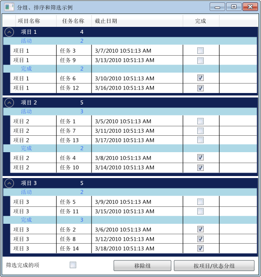

# 如何：在 DataGrid 控件中对数据进行分组、排序和筛选
通常很有用数据在<xref:System.Windows.Controls.DataGrid>通过分组、 排序和筛选的数据不同的方式。 若要进行分组、 排序和筛选数据中的<xref:System.Windows.Controls.DataGrid>，你将其绑定到<xref:System.Windows.Data.CollectionView>支持这些功能。 你可以然后使用中的数据<xref:System.Windows.Data.CollectionView>而不会影响基础数据源。 集合视图中的更改会反映在<xref:System.Windows.Controls.DataGrid>用户界面 (UI)。  
  
 <xref:System.Windows.Data.CollectionView>类提供了分组和排序的数据源，实现的功能<xref:System.Collections.IEnumerable>接口。 <xref:System.Windows.Data.CollectionViewSource>类使你能够设置的属性<xref:System.Windows.Data.CollectionView>从 XAML。  
  
 在此示例中，一套`Task`对象绑定到<xref:System.Windows.Data.CollectionViewSource>。 <xref:System.Windows.Data.CollectionViewSource>用作<xref:System.Windows.Controls.ItemsControl.ItemsSource%2A>为<xref:System.Windows.Controls.DataGrid>。 对执行分组、 排序和筛选<xref:System.Windows.Data.CollectionViewSource>，并显示在<xref:System.Windows.Controls.DataGrid>UI。  
  
   
DataGrid 中的分组的数据  
  
## CollectionViewSource 用作 ItemsSource  
 组、 排序和筛选器中的数据到<xref:System.Windows.Controls.DataGrid>控件，你将绑定<xref:System.Windows.Controls.DataGrid>到<xref:System.Windows.Data.CollectionView>支持这些功能。 在此示例中，<xref:System.Windows.Controls.DataGrid>绑定到<xref:System.Windows.Data.CollectionViewSource>，它提供有关这些函数<xref:System.Collections.Generic.List%601>的`Task`对象。  
  
#### 将 DataGrid 绑定到 CollectionViewSource  
  
1.  创建数据集合可实现<xref:System.Collections.IEnumerable>接口。  
  
     如果你使用<xref:System.Collections.Generic.List%601>若要创建你的集合，你应创建新的类，该类继承<xref:System.Collections.Generic.List%601>而不是实例化的实例<xref:System.Collections.Generic.List%601>。 这使你将数据绑定到 XAML 中的集合。  
  
    > [!NOTE]
    >  集合中的对象必须实现<xref:System.ComponentModel.INotifyPropertyChanged>已更改的接口和<xref:System.ComponentModel.IEditableObject>接口，以便<xref:System.Windows.Controls.DataGrid>正确响应属性更改和编辑。 有关详细信息，请参阅[实现属性更改通知](../../../../docs/framework/wpf/data/how-to-implement-property-change-notification.md)。  
  
     [!code-csharp[DataGrid_GroupSortFilter#101](../../../../samples/snippets/csharp/VS_Snippets_Wpf/DataGrid_GroupSortFilter/CS/MainWindow.xaml.cs#101)]
     [!code-vb[DataGrid_GroupSortFilter#101](../../../../samples/snippets/visualbasic/VS_Snippets_Wpf/DataGrid_GroupSortFilter/VB/MainWindow.xaml.vb#101)]  
  
2.  在 XAML 中，创建集合类的实例并设置[X:key 指令](../../../../docs/framework/xaml-services/x-key-directive.md)。  
  
3.  在 XAML 中，创建的实例<xref:System.Windows.Data.CollectionViewSource>类中，设置[X:key 指令](../../../../docs/framework/xaml-services/x-key-directive.md)，并设置你的集合类作为实例<xref:System.Windows.Data.CollectionViewSource.Source%2A>。  
  
     [!code-xaml[DataGrid_GroupSortFilter#201](../../../../samples/snippets/csharp/VS_Snippets_Wpf/DataGrid_GroupSortFilter/CS/WindowSnips1.xaml#201)]  
  
4.  创建的实例<xref:System.Windows.Controls.DataGrid>类，并将设置<xref:System.Windows.Controls.ItemsControl.ItemsSource%2A>属性<xref:System.Windows.Data.CollectionViewSource>。  
  
     [!code-xaml[DataGrid_GroupSortFilter#002](../../../../samples/snippets/csharp/VS_Snippets_Wpf/DataGrid_GroupSortFilter/CS/MainWindow.xaml#002)]  
  
5.  访问<xref:System.Windows.Data.CollectionViewSource>在代码中使用<xref:System.Windows.Data.CollectionViewSource.GetDefaultView%2A>方法要获取对引用<xref:System.Windows.Data.CollectionViewSource>。  
  
     [!code-csharp[DataGrid_GroupSortFilter#102](../../../../samples/snippets/csharp/VS_Snippets_Wpf/DataGrid_GroupSortFilter/CS/MainWindow.xaml.cs#102)]
     [!code-vb[DataGrid_GroupSortFilter#102](../../../../samples/snippets/visualbasic/VS_Snippets_Wpf/DataGrid_GroupSortFilter/VB/MainWindow.xaml.vb#102)]  
  
## DataGrid 中的分组项  
 若要指定项中的分组方式<xref:System.Windows.Controls.DataGrid>，你使用<xref:System.Windows.Data.PropertyGroupDescription>类型在源视图中的项进行分组。  
  
#### 对使用 XAML DataGrid 中的项进行分组  
  
1.  创建<xref:System.Windows.Data.PropertyGroupDescription>指定分组所依据的属性。 在 XAML 或代码中，你可以指定属性。  
  
    1.  在 XAML 中，设置<xref:System.Windows.Data.PropertyGroupDescription.PropertyName%2A>分组所依据的属性的名称。  
  
    2.  在代码中，将传递给构造函数要分组的属性的名称。  
  
2.  添加<xref:System.Windows.Data.PropertyGroupDescription>到<xref:System.Windows.Data.CollectionViewSource.GroupDescriptions%2A?displayProperty=nameWithType>集合。  
  
3.  添加的其他实例<xref:System.Windows.Data.PropertyGroupDescription>到<xref:System.Windows.Data.CollectionViewSource.GroupDescriptions%2A>要添加更多级别分组的集合。  
  
     [!code-xaml[DataGrid_GroupSortFilter#012](../../../../samples/snippets/csharp/VS_Snippets_Wpf/DataGrid_GroupSortFilter/CS/MainWindow.xaml#012)]  
  
     [!code-csharp[DataGrid_GroupSortFilter#112](../../../../samples/snippets/csharp/VS_Snippets_Wpf/DataGrid_GroupSortFilter/CS/MainWindow.xaml.cs#112)]
     [!code-vb[DataGrid_GroupSortFilter#112](../../../../samples/snippets/visualbasic/VS_Snippets_Wpf/DataGrid_GroupSortFilter/VB/MainWindow.xaml.vb#112)]  
  
4.  若要删除某个组，请删除<xref:System.Windows.Data.PropertyGroupDescription>从<xref:System.Windows.Data.CollectionViewSource.GroupDescriptions%2A>集合。  
  
5.  若要删除所有组，请调用<xref:System.Collections.ObjectModel.Collection%601.Clear%2A>方法<xref:System.Windows.Data.CollectionViewSource.GroupDescriptions%2A>集合。  
  
     [!code-csharp[DataGrid_GroupSortFilter#114](../../../../samples/snippets/csharp/VS_Snippets_Wpf/DataGrid_GroupSortFilter/CS/MainWindow.xaml.cs#114)]
     [!code-vb[DataGrid_GroupSortFilter#114](../../../../samples/snippets/visualbasic/VS_Snippets_Wpf/DataGrid_GroupSortFilter/VB/MainWindow.xaml.vb#114)]  
  
 项中的分组时<xref:System.Windows.Controls.DataGrid>，你可以定义<xref:System.Windows.Controls.GroupStyle>，它指定每个组的外观。 你将应用<xref:System.Windows.Controls.GroupStyle>通过将其添加到<xref:System.Windows.Controls.ItemsControl.GroupStyle%2A>DataGrid 的集合。 如果你有多个级别的分组，你可以将不同样式应用到每个分组级别。 在其中定义的顺序应用样式。 例如，如果你定义两种样式，第一个将应用于顶级行组。 第二种样式将应用于第二个级别的所有行组和下限。 <xref:System.Windows.FrameworkElement.DataContext%2A>的<xref:System.Windows.Controls.GroupStyle>是<xref:System.Windows.Data.CollectionViewGroup>组表示。  
  
#### 若要更改的行组标题的外观  
  
1.  创建<xref:System.Windows.Controls.GroupStyle>定义行组的外观。  
  
2.  Put<xref:System.Windows.Controls.GroupStyle>内`<DataGrid.GroupStyle>`标记。  
  
     [!code-xaml[DataGrid_GroupSortFilter#003](../../../../samples/snippets/csharp/VS_Snippets_Wpf/DataGrid_GroupSortFilter/CS/MainWindow.xaml#003)]  
  
## DataGrid 中的项进行排序  
 若要指定项中的排序方式<xref:System.Windows.Controls.DataGrid>，你使用<xref:System.ComponentModel.SortDescription>类型进行排序的源视图中的项。  
  
#### DataGrid 中的项进行排序  
  
1.  创建<xref:System.ComponentModel.SortDescription>，它指定要作为排序依据的属性。 在 XAML 或代码中，你可以指定属性。  
  
    1.  在 XAML 中，设置<xref:System.ComponentModel.SortDescription.PropertyName%2A>为要作为排序依据的属性的名称。  
  
    2.  在代码中，将名称传递给要作为排序依据的属性和<xref:System.ComponentModel.ListSortDirection>给构造函数。  
  
2.  添加<xref:System.ComponentModel.SortDescription>到<xref:System.Windows.Data.CollectionViewSource.SortDescriptions%2A?displayProperty=nameWithType>集合。  
  
3.  添加的其他实例<xref:System.ComponentModel.SortDescription>到<xref:System.Windows.Data.CollectionViewSource.SortDescriptions%2A>若要按其他属性的集合。  
  
     [!code-xaml[DataGrid_GroupSortFilter#011](../../../../samples/snippets/csharp/VS_Snippets_Wpf/DataGrid_GroupSortFilter/CS/MainWindow.xaml#011)]  
  
     [!code-csharp[DataGrid_GroupSortFilter#211](../../../../samples/snippets/csharp/VS_Snippets_Wpf/DataGrid_GroupSortFilter/CS/WindowSnips1.xaml.cs#211)]
     [!code-vb[DataGrid_GroupSortFilter#211](../../../../samples/snippets/visualbasic/VS_Snippets_Wpf/DataGrid_GroupSortFilter/VB/MainWindow.xaml.vb#211)]  
  
## 筛选数据网格中的项  
 中的筛选器项<xref:System.Windows.Controls.DataGrid>使用<xref:System.Windows.Data.CollectionViewSource>，提供的处理程序中的筛选逻辑<xref:System.Windows.Data.CollectionViewSource.Filter?displayProperty=nameWithType>事件。  
  
#### 若要筛选数据网格中的项  
  
1.  添加的处理程序<xref:System.Windows.Data.CollectionViewSource.Filter?displayProperty=nameWithType>事件。  
  
2.  在<xref:System.Windows.Data.CollectionViewSource.Filter>事件处理程序，定义筛选逻辑。  
  
     每次刷新该视图时，将应用筛选器。  
  
     [!code-xaml[DataGrid_GroupSortFilter#013](../../../../samples/snippets/csharp/VS_Snippets_Wpf/DataGrid_GroupSortFilter/CS/MainWindow.xaml#013)]  
  
     [!code-csharp[DataGrid_GroupSortFilter#113](../../../../samples/snippets/csharp/VS_Snippets_Wpf/DataGrid_GroupSortFilter/CS/MainWindow.xaml.cs#113)]
     [!code-vb[DataGrid_GroupSortFilter#113](../../../../samples/snippets/visualbasic/VS_Snippets_Wpf/DataGrid_GroupSortFilter/VB/MainWindow.xaml.vb#113)]  
  
 或者，你可以筛选中的项<xref:System.Windows.Controls.DataGrid>通过创建一个提供的筛选的逻辑和设置方法<xref:System.Windows.Data.CollectionView.Filter%2A?displayProperty=nameWithType>属性，将应用筛选器。 若要查看此方法的示例，请参阅[的视图中的筛选器数据](../../../../docs/framework/wpf/data/how-to-filter-data-in-a-view.md)。  
  
## 示例  
 下面的示例演示分组、 排序和筛选`Task`中的数据<xref:System.Windows.Data.CollectionViewSource>和显示经过分组、 排序，并筛选`Task`中的数据<xref:System.Windows.Controls.DataGrid>。 <xref:System.Windows.Data.CollectionViewSource>用作<xref:System.Windows.Controls.ItemsControl.ItemsSource%2A>为<xref:System.Windows.Controls.DataGrid>。 对执行分组、 排序和筛选<xref:System.Windows.Data.CollectionViewSource>，并显示在<xref:System.Windows.Controls.DataGrid>UI。  
  
 若要测试此示例中，你将需要调整 DGGroupSortFilterExample 名称以匹配你的项目名称。 如果你使用的 Visual Basic，你将需要更改的类名称<xref:System.Windows.Window>所示。  
  
 `<Window x:Class="MainWindow"`  
  
 [!code-xaml[DataGrid_GroupSortFilter#000](../../../../samples/snippets/csharp/VS_Snippets_Wpf/DataGrid_GroupSortFilter/CS/MainWindow.xaml#000)]  
  
 [!code-csharp[DataGrid_GroupSortFilter#100](../../../../samples/snippets/csharp/VS_Snippets_Wpf/DataGrid_GroupSortFilter/CS/MainWindow.xaml.cs#100)]
 [!code-vb[DataGrid_GroupSortFilter#100](../../../../samples/snippets/visualbasic/VS_Snippets_Wpf/DataGrid_GroupSortFilter/VB/MainWindow.xaml.vb#100)]  
  
## 编译代码  
  
-  
  
## 可靠编程  
  
## .NET Framework 安全性  
  
## 请参阅  
 [数据绑定概述](../../../../docs/framework/wpf/data/data-binding-overview.md)  
 [创建和绑定到 ObservableCollection](../../../../docs/framework/wpf/data/how-to-create-and-bind-to-an-observablecollection.md)  
 [在视图中筛选数据](../../../../docs/framework/wpf/data/how-to-filter-data-in-a-view.md)  
 [在视图中对数据进行排序](../../../../docs/framework/wpf/data/how-to-sort-data-in-a-view.md)  
 [在 XAML 中使用视图对数据进行排序和分组](../../../../docs/framework/wpf/data/how-to-sort-and-group-data-using-a-view-in-xaml.md)
